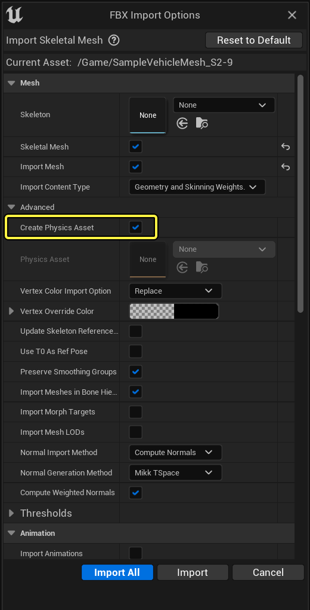
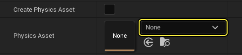
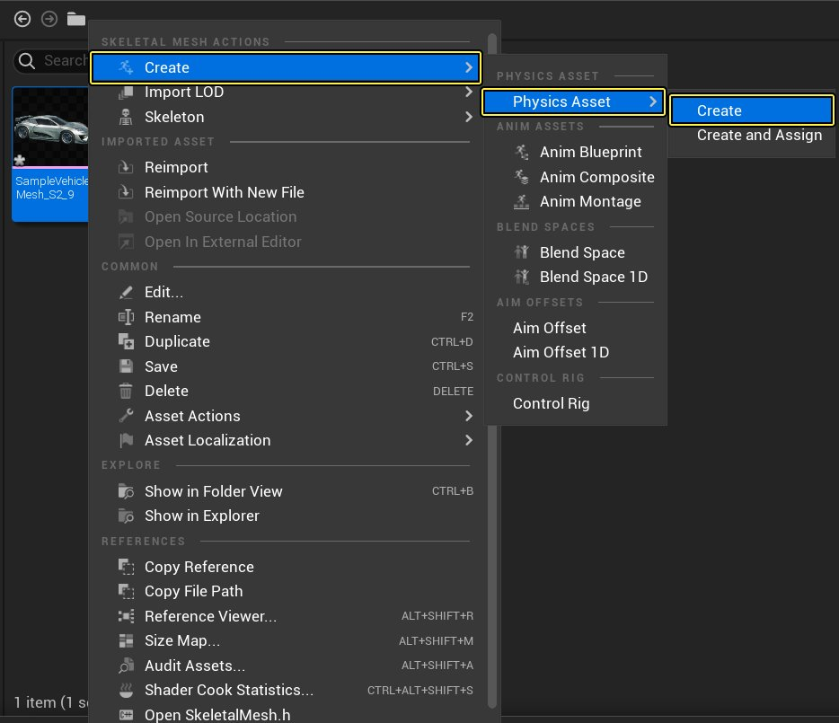
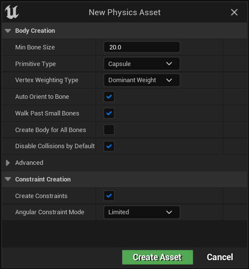

# 创建新的物理资产

> 路径：虚幻引擎5.7文档 / Gameplay系统 / 物理 / 物理资产编辑器 / 物理资产编辑器教程 / 创建新的物理资产

> 原始页面：https://dev.epicgames.com/documentation/unreal-engine/creating-a-new-physics-asset-in-unreal-engine

创建新 **物理资产（Physics Asset）** 的方法有两种：在导入时创建或使用 **内容侧滑菜单（Content Drawer）** 中的上下文菜单创建。以下是这两种方法的操作步骤和相应界面。

## 步骤

导入骨骼网格体时，将会有一个选项可以在导入时生成物理资产。导入的文件被处理后，将使用默认属性生成一个新的物理资产，可以使用 **物理资产编辑器（Physics Asset Editor）** 修改这些属性。

> [!NOTE]
> 若要选择使用现有物理资产，你可以禁用 **创建物理资产（Create Physics Asset）** 复选框，然后使用下拉菜单选择适当的物理资产。
>
> 

但如果你稍后需要为骨骼网格体创建物理资产，可以按照以下步骤操作：

1. 在

   内容侧滑菜单（Content Drawer）

   中找希望添加物理资产的骨骼网格体资产。
2. 右键点击该 **骨骼网格体**，打开 **上下文菜单**，选择 **创建（Create）-> 物理资产（Physics Asset）-> 创建（Create）**。

   
3. 根据自己的喜好调整属性。

   
4. 点击

   创建资产（Create Asset）

   。

## 结果

创建 **物理资产（Physics Asset）** 时，你会发现它与自己的创建基础 **骨骼网格体（Skeletal Mesh）** 位于相同的文件夹内。
