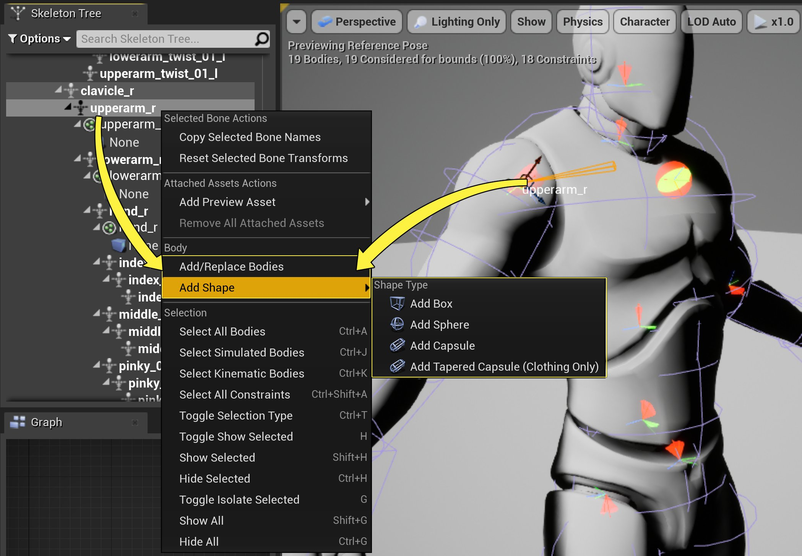
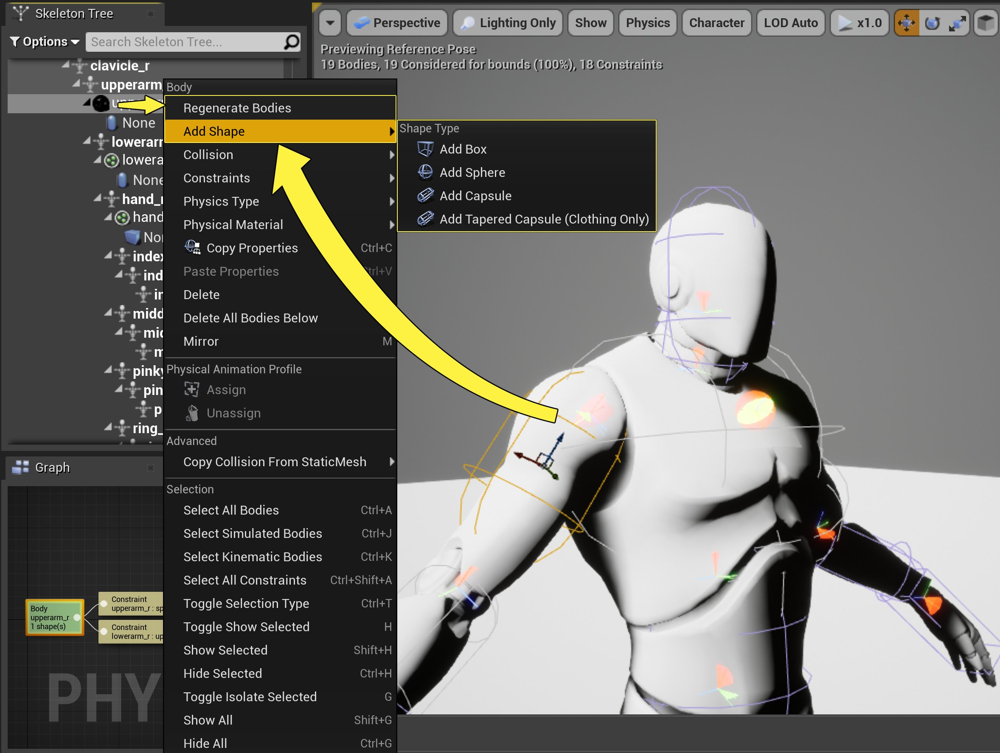

# 在物理资产编辑器中创建新的物理形体

> 路径：虚幻引擎5.7文档 / Gameplay系统 / 物理 / 物理资产编辑器 / 物理资产编辑器教程 / 在物理资产编辑器中创建新的物理形体

> 原始页面：https://dev.epicgames.com/documentation/unreal-engine/creating-a-new-physics-body-in-unreal-engine-by-using-the-physics-asset-editor

物理资产工具用于添加或替换物理资产中的 **物理形体（Physics Bodies）** 以及它们连接的骨骼上相关联的 **形状（Shapes）** (**盒体（Boxes）**、**球体（Spheres）**、**胶囊体（Capsules）**、**锥形胶囊体（Tapered Capsules）**等等)。

> [!TIP]
> 默认情况下，**物理编辑器骨骼树（Physics Editor Skeleton Tree）** 只显示物理形体。使用骨骼树的 **选项（Options）** 下拉菜单来显示 **骨骼（Bones）** 和 **图元（Primitives）**，这样会让添加和替换物理形体更加容易。

## 将物理形体添加至骨骼

1. 在 **骨骼树（Skeleton Tree）** 面板中右键点击一块 **骨骼（Bone）**，然后点击 **右键菜单（Context Menu）** 中的 **添加/替换形体（Add/Replace Body）**。

   - 你也可以右键点击

     视口（Viewport）

     中的

     骨骼（Bone）

     来打开这个菜单。
2. 一个新的物理形体会被添加到骨骼上，默认带有胶囊体形状。

   - 如果骨骼上已经有了一个物理形体，新的物理形体和胶囊体形状会将其替换。
3. 除此以外，当骨骼上没有物理形体时，可直接选择 **右键菜单（Context Menu）** 中 **添加形状（Add Shape）** 选项下的一个形状。这样会直接用选择的形状为骨骼添加物理形体。
4. 右键点击 **物理形体（Physics Body）** 然后选择 **重新生成形体（Regenerate Bodies）**，会创建一个新的默认胶囊体形状的物理形体并且替换每个选中的物理形体。

## 将形状添加至物理形体

要将形状添加至已有的物理形体，右键点击该形体，在 **右键菜单（Context Menu）** 的 **添加形状（Add Shape）** 下，选中要添加的形状。

- 一个物理形体可以带有多个形状，如果你不想要默认的胶囊体形状，可以将其删除。

## 最终结果

现在应该可以看到对应的形体和形状已经添加到选中的骨骼并且成为其子对象。
