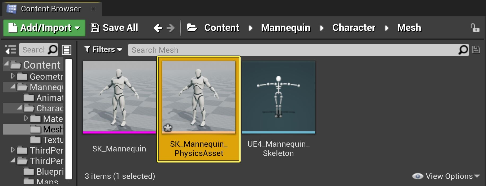
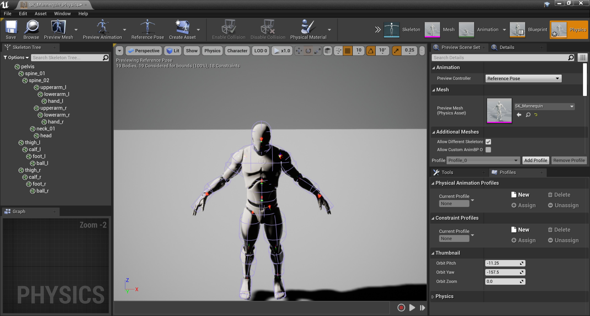
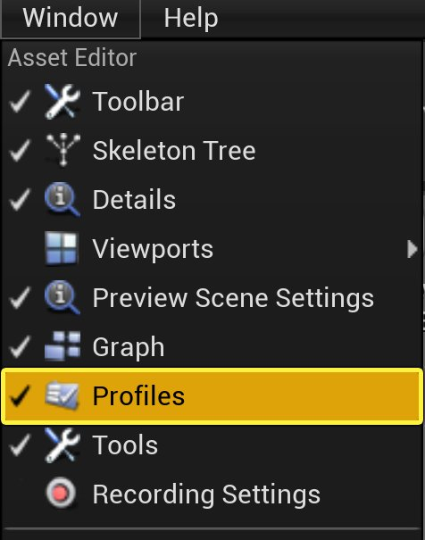
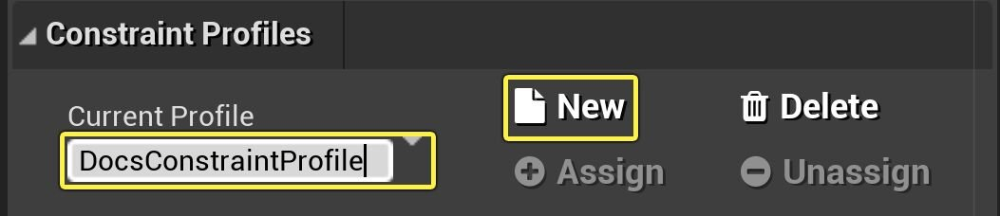
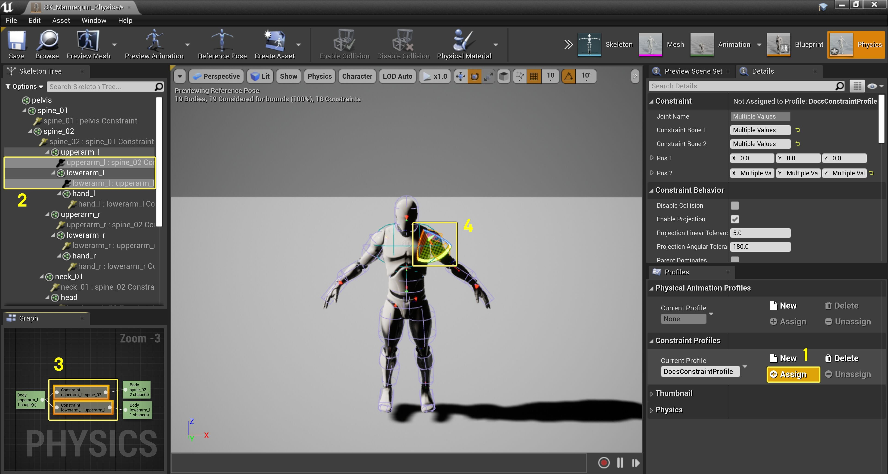
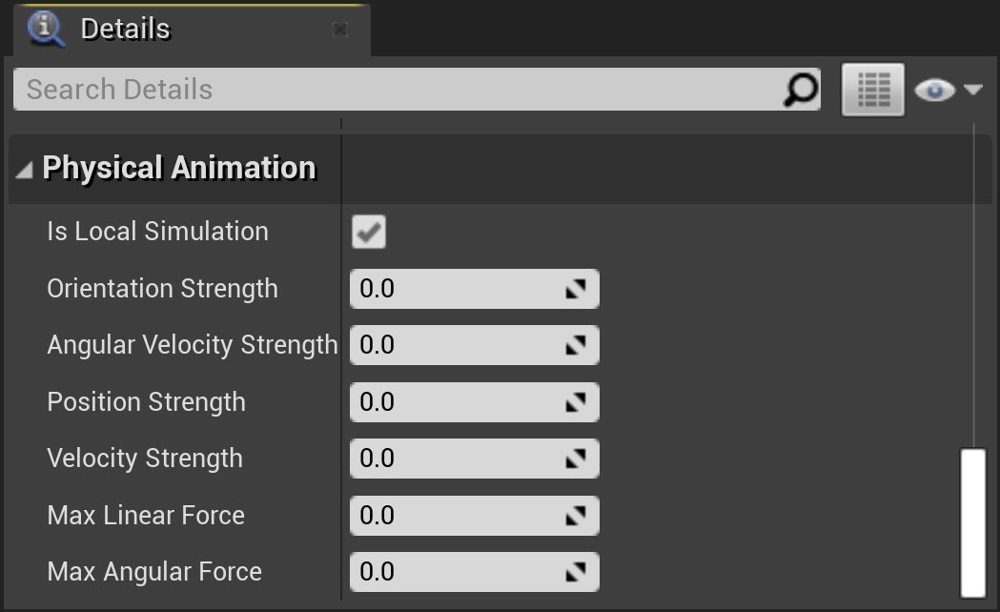
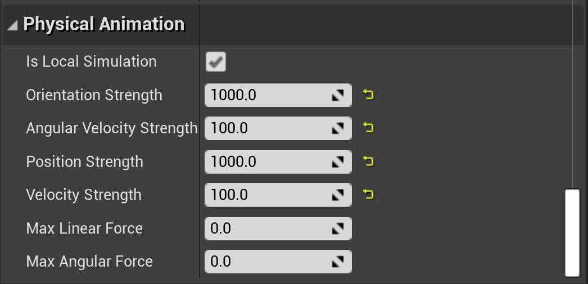

# 创建物理动画配置文件

> 路径：虚幻引擎5.7文档 / Gameplay系统 / 物理 / 物理资产编辑器 / 物理资产编辑器教程 / 创建物理动画配置文件

> 原始页面：https://dev.epicgames.com/documentation/unreal-engine/creating-a-physical-animation-profile-in-unreal-engine

本教程中，我们会讲解创建 **物理动画配置文件（Physical Animation Profile）** 以及向其添加 **物理形体（Physics Bodies）** 的基础知识。

## 步骤

1. 使用 **内容侧滑菜单（Content Drawer）** 为你的 **骨骼网格体** 找到或[创建](../creating-a-new-physics-asset/index.md) **物理资产**。

   

   > [!NOTE]
   > 如果选择新建 **物理资产**，则建立之后方可继续。
2. 双击该物理资产，以打开 **物理资产编辑器（Physics Asset Editor）**。

   
3. 在 **Windows** 菜单下，选择 **配置文件（Profiles）**；**配置文件（Profiles）** 窗口应显示为停靠的选项卡。

   
4. 使用 **物理动画配置文件（Physical Animation Profiles）** 条目上的 **新增（New）** 按钮添加 **配置文件（Profile）**，并设置名称（下图中命名为 `DocsProfile`）。

   
5. 在 **骨架树（Skeleton Tree）** 面板、**物理图表（Physics Graph）** 或 **视口（Viewport）** 中，选择要纳入新 **物理动画配置文件（Physical Animation Profile）** 的 **物理形体（Physics Body）**。

   > [!NOTE]
   > 要在骨架树（Skeleton Tree）面板中查看约束，在 **选项（Options）** 下拉菜单中选择 **显示约束（Show Constraints）**。
6. 按下 **配置文件（Profiles）** 面板中的 **分配（Assign）** 按钮。

   

   1 - 分配（Assign）按钮 2 - 在骨架树（Skeleton Tree）面板中选定的物理形体 3 - 在物理图表（Physics Graph）面板中选定的物理形体 4 - 在视口（Viewport）中选定的物理形体
7. 调整选定 **物理形体（Physics Bodies）** 的属性。

   

   > [!TIP]
   > 1000、100、1000、100、0、0是比较好的一组起始值
   >
   > 
8. 对要添加到 **物理动画配置文件（Physics Animation Profile）** 的所有 **物理形体（Physics Bodies）** 重复步骤5-7。

   > [!TIP]
   > 可以同时选择、分配和编辑多个物理形体的属性。想要让属性不同，单独编辑即可。
9. 使用 **物理资产编辑器（Physics Asset Editor）** 中的 **保存（Save）** 按钮保存 **物理资产（Physics Asset）**。

   

> [!NOTE]
> 要编辑现有的物理动画配置文件，在下拉菜单中选中，然后使用 **分配（Assign）** 添加新的物理形体，或使用 **取消分配（Unassign）** 移除现有物理形体。

## 结果

现在 **物理资产（Physics Asset）** 有了配置文件，可以从蓝图或C++调用，以更改 **物理形体（Physics Bodies）** 的 **物理动画（Physical Animation）** 属性。

## 其他资源
