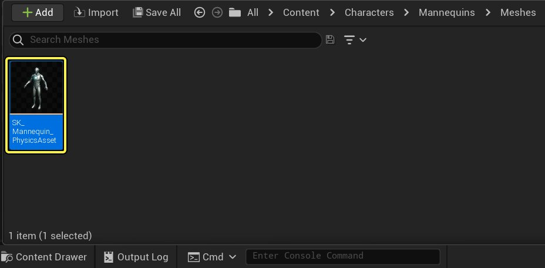
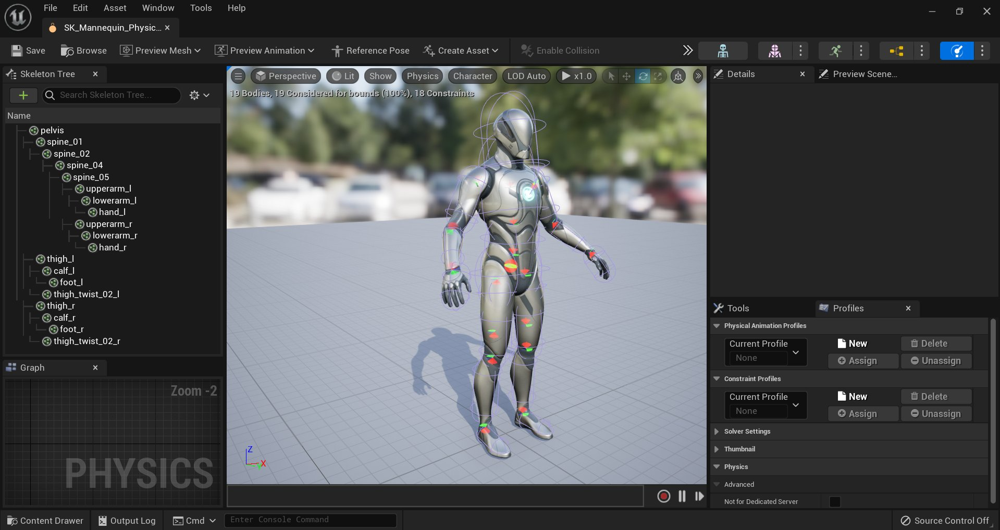

# 编辑物理资产

> 路径：虚幻引擎5.7文档 / Gameplay系统 / 物理 / 物理资产编辑器 / 物理资产编辑器教程 / 编辑物理资产

> 原始页面：https://dev.epicgames.com/documentation/unreal-engine/editing-a-physics-asset-in-unreal-engine

以下步骤说明如何在 **物理资产编辑器** 中打开 **物理资产** 进行编辑。

## 步骤

1. 在 **内容侧滑菜单（Content Drawer）** 中找到 **物理资产**。

   
2. **双击** 将其在物理资产编辑器中打开。

   

## 结果

物理资产成功打开，可以在物理资产编辑器中进一步编辑了。
