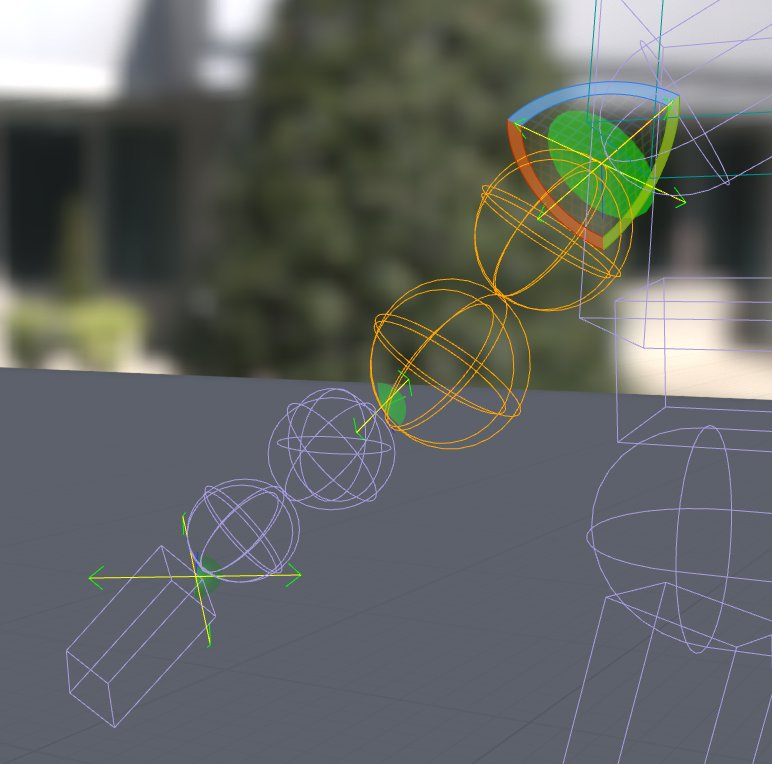

# 编辑物理资产的约束

> 路径：虚幻引擎5.7文档 / Gameplay系统 / 物理 / 物理资产编辑器 / 物理资产编辑器教程 / 编辑物理资产的约束

> 原始页面：https://dev.epicgames.com/documentation/unreal-engine/editing-physics-asset-constraints-in-unreal-engine

以下讲述几种常见方法和步骤，以及在 **物理资产编辑器（Physics Asset Editor）** 中对 **物理约束（Physics Constraint）** 进行的编辑。

## 编辑物理约束

> [!NOTE]
> 物理约束的使用收录在 [物理约束用户指南](../../../physics-constraints/constraints-user-guide/index.md) 中，其属性收录在 [物理约束参考](../../../physics-constraints/physics-constraint-reference/index.md) 中。该部分只讲述物理资产工具特定的工作流，或与普通相差较大的工作流。

1. 双击

   物理资产

   ，用

   物理资产编辑器

   打开它。
2. 在

   视口

   或

   骨架树

   面板中选中一个

   物理约束

   。
3. 使用

   平移

   和

   旋转

   工具对物理约束进行

   移动和旋转

   ，为物理约束形成的"关节"创建旋转点。
4. 在 **细节** 面板中编辑物理约束的属性。

   > [!TIP]
   > 使用"**1**"、"**2**"和"**3**"键可快速将 Swing1、Swing2 和 Twist 分别从 Limited 切换至 Locked。"**4**"键可用于循环， 将其中一个设为受限，另外两个设为锁定。
5. 请经常保存。

请参阅[物理约束参考](../../../physics-constraints/physics-constraint-reference/index.md)，了解物理约束属性在物理编辑器中的更多信息。

## 对齐物理约束

如使用的是物理约束的 **线性** 或 **角** 限制，将会看到它们的对齐。

通过平移和旋转物理约束能够对齐限制，获得需要的效果。在最基本的条件下，当物理约束被限制后，可看到一条黄线悬在绿色圆弧或圆锥结构中。此线将被"约束"在此圆弧或圆锥中。

如需了解物理约束及其属性的更多内容，请查阅[物理约束用户指南](../../../physics-constraints/constraints-user-guide/index.md)。

## 复制物理约束

在任一模式中，一个约束的属性可被复制到另外的约束：

1. 选择

   需要复制数据的

   物理约束

   。
2. 按下 Ctrl + C

   。
3. 选择

   需要应用数据的

   物理约束

   。
4. 按下 Ctrl + V

   。

## 删除物理约束

> [!NOTE]
> 重建物理约束并非易事，删除之前请留意。

1. 双击

   物理资产（Physics Asset）

   ，用物理资产编辑器打开它。
2. 在

   视口

   或

   骨架树

   面板中选择要删除的

   物理约束

   。
3. 按下

   Delete

   键。

## 重建物理约束

> [!NOTE]
> 重建物理约束并非易事，删除之前请留意。

物理约束只能在生成的物理形体之上创建，且只能向上生成。如果从肩部移除物理约束，则必须移除上臂物理形体（将移除肘部物理约束），然后重建上臂物理形体。这会创建肩部物理约束，但不会创建肘部物理约束，因此必须沿手臂往下继续此操作。
