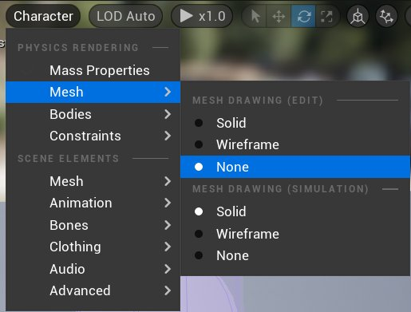
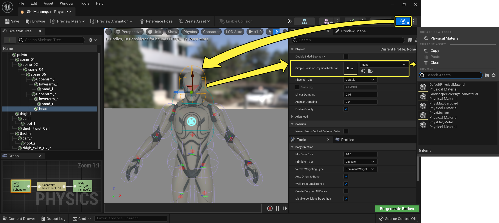

# 编辑物理资产的物理对象

> 路径：虚幻引擎5.7文档 / Gameplay系统 / 物理 / 物理资产编辑器 / 物理资产编辑器教程 / 编辑物理资产的物理对象

> 原始页面：https://dev.epicgames.com/documentation/unreal-engine/editing-the-physics-asset-of-a-physics-body-in-unreal-engine

下文介绍了有关在 **物理资产工具（Physics Asset Editor）** 中对 **物理对象（Physics Bodies）** 进行的编辑的几种常见方法。

> [!NOTE]
> 如果你看不清你要编辑的物理对象，在 **视口（Viewport）** 中，选择 **角色（Character） > 网格体（Mesh） > 线框/无（Wireframe/None）**，调整 **骨架网格体（Skeletal Mesh）** 的可见程度。
>
> 

## 编辑物理对象

1. 双击

   物理资产（Physics Asset）

   ，打开物理资产编辑器。
2. 在

   视口（Viewport）

   或

   骨架树（Skeleton Tree）

   面板中选中一个物理对象。
3. 使用 **选择**、 **平移**、**旋转** 和 **缩放** 工具对物理对象进行 **平移、旋转和缩放**，使其与 **骨架网格体骨骼** 相匹配。

   
4. 在

   细节

   面板中编辑物理对象的属性。
5. 使用工具栏中的 **启用碰撞（Enable Collision）** 和 **禁用碰撞（Disable Collision）** 工具，可以编辑当前物理对象和物理资产中其他物理对象之间的碰撞效果。所有可以与当前所选物理对象碰撞的对象都会以蓝色显示，否则以灰色显示。

   
6. 假如多个物理对象需要以一个整体运作，例如组成手腕的所有扭转关节，请使用

   焊接

   工具，避免出现不理想的物理模拟效果。焊接后的物理对象会议黄色显示。
7. 记得经常保存。

可在[物理对象参考](../../../physics-bodies/physics-bodies-reference/index.md)中查阅物理资产编辑器属性的更多内容。

## 复制物理对象

在任一模式中，一个物理对象的属性可被复制到另外的物理对象：

1. 选择需要复制数据的

   物理对象

   。
2. 按下 Ctrl + C

   。
3. 选择需要应用数据的

   物理对象

   。
4. 按下 Ctrl + V

   。

此操作不会覆盖物理对象的形状。

## 删除物理对象

1. 双击

   物理资产（Physics Asset）

   ，打开物理资产编辑器。
2. 在

   视口（Viewport）

   或

   骨架树（Skeleton Tree）

   面板中选中一个需要删除的

   物理对象

   。
3. 按下

   Delete

   键。

## 物理材质

物理资产中的每个物理对象均可指定 **物理材质**。将物理材质应用到单个物理对象的步骤：

1. 双击

   物理资产（Physics Asset）

   ，打开物理资产编辑器。
2. 在

   视口（Viewport）

   或

   骨架树（Skeleton Tree）

   面板中选中一个

   物理对象

   。
3. 在

   细节

   面板中找到

   简单碰撞物理材质（Simple Collision Physical Material）

   属性并指定一个

   物理材质（Physical Material）

   。

