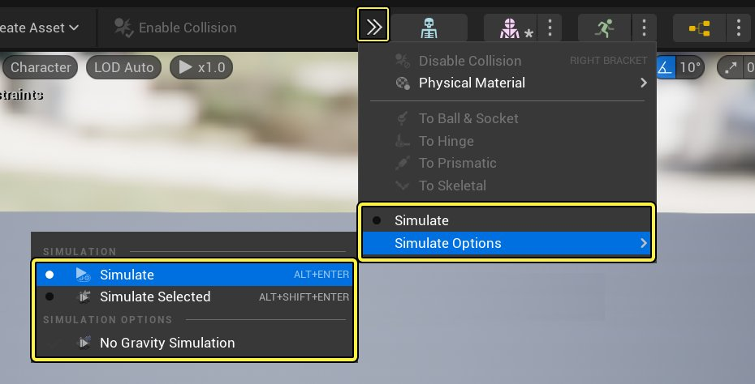
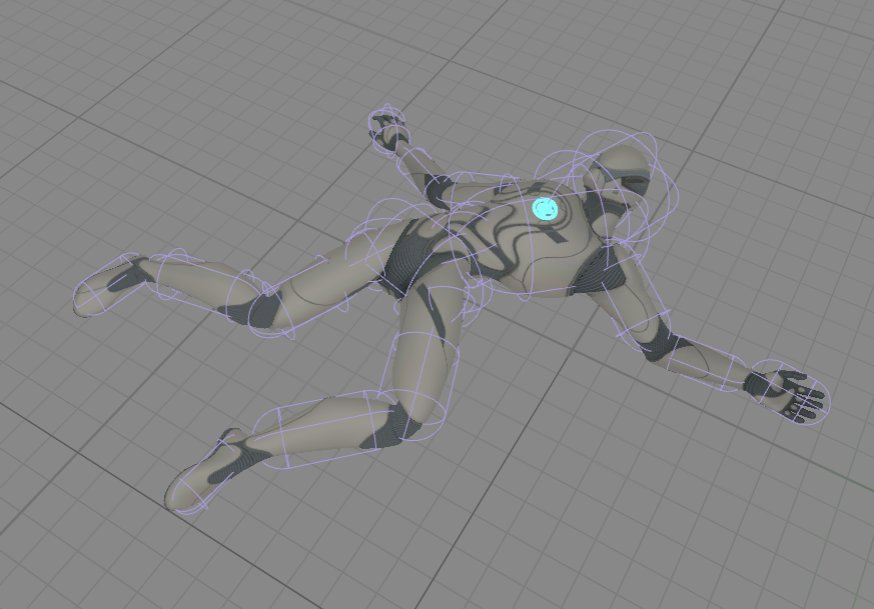

# 测试物理资产

> 路径：虚幻引擎5.7文档 / Gameplay系统 / 物理 / 物理资产编辑器 / 物理资产编辑器教程 / 测试物理资产

> 原始页面：https://dev.epicgames.com/documentation/unreal-engine/testing-physics-assets-in-unreal-engine

本页面将介绍在 **物理资产工具** 中对 **物理资产** 进行测试的基础知识。

## 测试

从工具栏 **箭头图标** 下方的下拉菜单中选择 **模拟（Simulation）** 即可测试物理资产。

- 启用 **无重力（No Gravity）** 选项后，整个物理资产均进入模拟状态，但未打开重力，所以你可以在零重力环境中采用ctrl+点击的方法轻戳 **物理形体**。这对于发现相互穿透的物理形体或已经超出其限制的 **有限的物理约束** 非常有用。
- 切换 **选定的模拟（Selected Simulation）** 可模拟关节链。此选项仅会模拟你选定的物理形体（可以选择多个）和那些来自选定物理形体层级的物理形体。例如，如果你选择肩膀，整个手臂都会被模拟。
