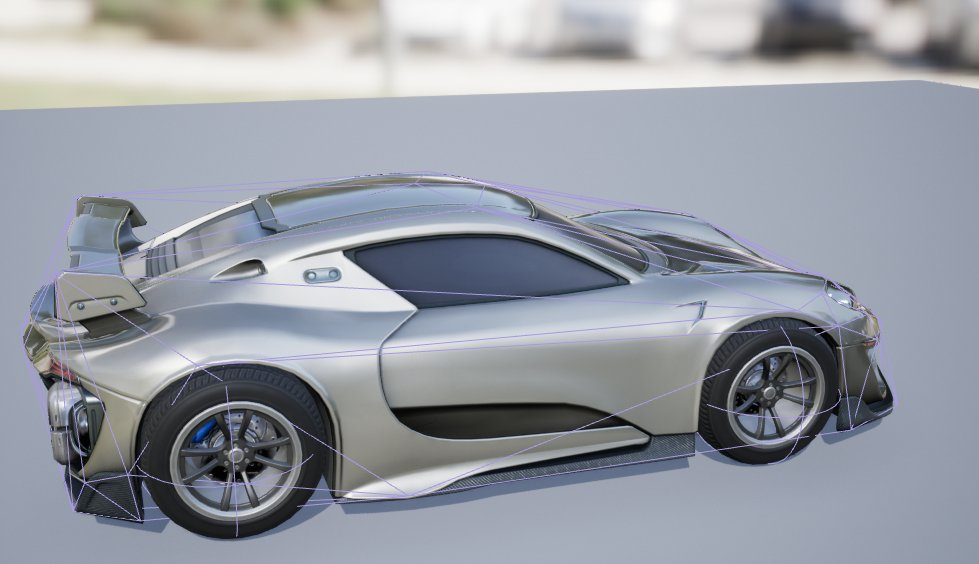
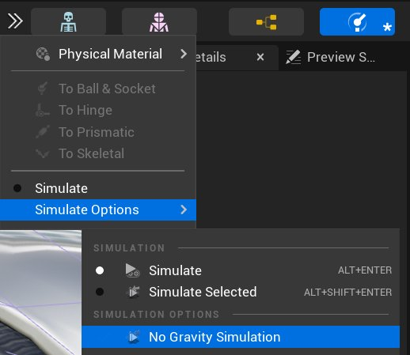

# 排解常见物理资源错误

> 路径：虚幻引擎5.7文档 / Gameplay系统 / 物理 / 物理资产编辑器 / 物理资产编辑器教程 / 排解常见物理资源错误

> 原始页面：https://dev.epicgames.com/documentation/unreal-engine/troubleshooting-common-physics-asset-errors-in-unreal-engine

物理模拟时虽然有许多方面无法掌控，但以下两个问题完全能够得到解决：**爆炸**（设为相互碰撞的物理形体之间发生相互穿插） 和 **抖动**（ **物理形体** 因轻微运动而拒绝进入休眠状态）。 以下是纠正这些问题的步骤。

## 爆炸

发生此问题的原因是两个物理形体相互穿插，而物理系统会施加极大的力度将两者分开。 如果 **物理约束** 仍将两个对立的物理形体绑在一起，物理系统将继续施加力量将其分开，形成十分古怪而极端的运动。

修复的方法通常为禁用两个对立物理形体之间的碰撞，或修改它们的位置和/或比例，使其不发生相互穿插。 此外，结合的物理形体将视作一体，无视相互穿插。

## 跳动

如果你的 **物理资产（Physics Asset）** 已基本"倒塌"但仍在地面上摇晃和抽动，但并没有剧烈地四处弹跳， 可调整一些数值使其停止并进入睡眠。

在执行操作之前尝试 **无重力** 状态模拟，这将显示是否有物理约束出现偏离， 并尝试在物理资源落地之前进行修复。

通常，所有物理资源的物理形体上的少量线性和角阻尼便完全可以使资源停止抖动。然而，使用较大的线性阻尼值将导致物理形体在世界场景中的运动变慢，甚至会导致重力运动变慢。 因为阻尼自身并不是"拉拽"。它更像是经过粘性物质的运动。

如仍然出现抖动，可能是因为存在一些非常小的物理形体，查看 **[分步](../../../physics-sub-stepping/index.md)** 文档， 了解物理模拟计算的这种方案。

请参阅 [约束参考](../../../physics-constraints/physics-constraint-reference/index.md)，了解物理约束属性的更多内容。
