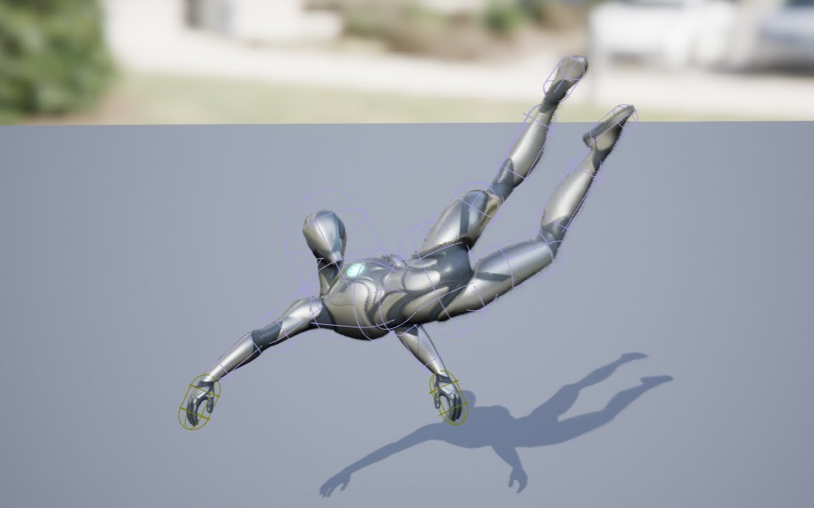
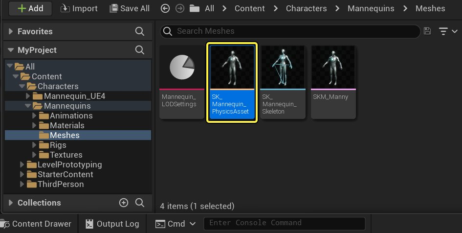
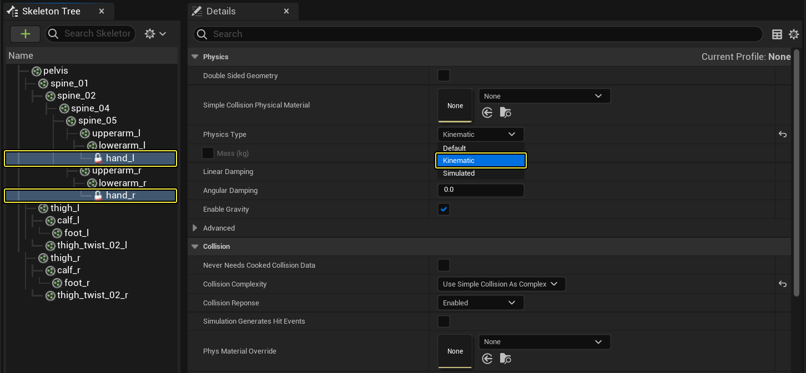
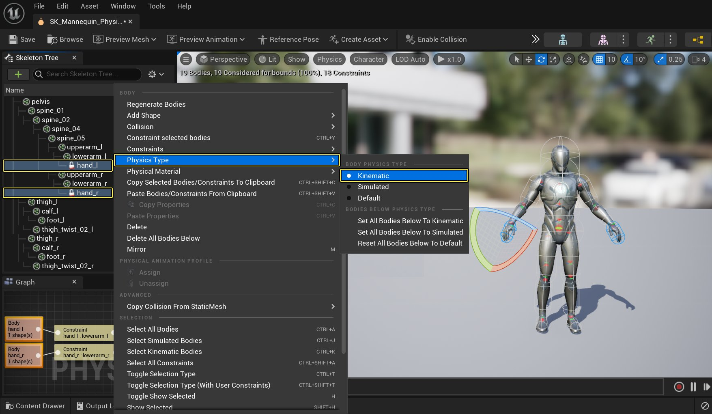
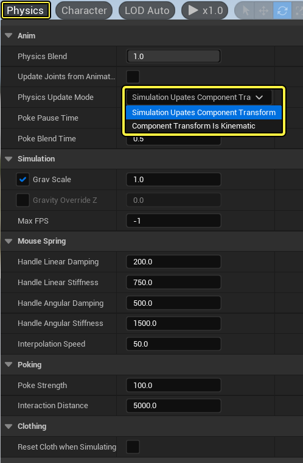
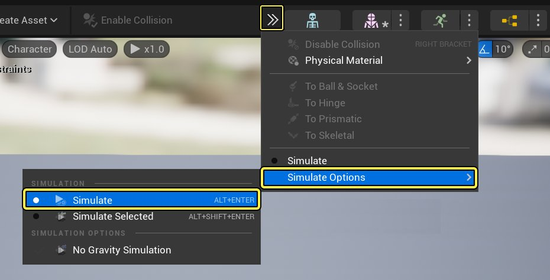
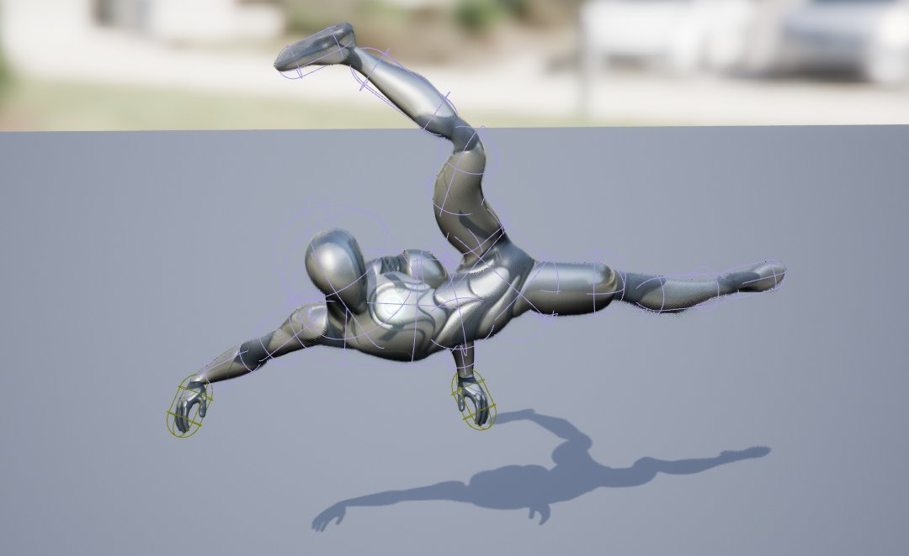
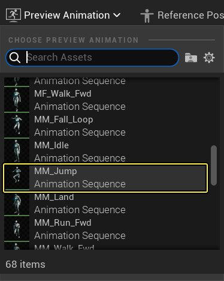

# 结合模拟父项使用运动学形体

> 路径：虚幻引擎5.7文档 / Gameplay系统 / 物理 / 物理资产编辑器 / 物理资产编辑器教程 / 结合模拟父项使用运动学形体

> 原始页面：https://dev.epicgames.com/documentation/unreal-engine/using-kinematic-bodies-with-simulated-parents-in-unreal-engine

[物理资产编辑器](../../index.md) 提供了多种对物理形体进行模拟的方式，运动学物理形体结合模拟父项也是其中之一。 这使用户能够对由动画数据驱动的子形体进行定义，而这些形体的父项则由物理模拟数据所驱动。 这种技术十分实用于这类情况：设置角色吊在边缘或沿边缘攀行，对滚落的岩石或其他废墟作出反应，生成基于物理的反应动作。

在此指南中，我们使用带模拟父项的运动学形体生成角色悬吊在边缘的效果，而身体的其他部分则由物理进行模拟。

## 步骤

> [!NOTE]
> 在此指南中，我们使用的是启用了 **Starter Content** 的 **Blueprint Third Person 模板** 项目。

1. 在项目的 **Content/Mannequin/Character/Mesh** 文件夹中，打开 **SK_Mannequin_PhysicsAsset**。

   
2. 在 **骨架树（Skeleton Tree）** 窗口中，按住 **Ctrl** 并同时选中 **hand_l** 和 **hand_r** 刚体，然后在 **细节（Details）** 面板中，将 **物理类型（Physics Type）** 改为 **运动学（Kinematic）**。

   

   通过将这些骨骼设为 Kinematic 后，它们将不再模拟物理，而是跟随动画数据。

   另一种方法是 **右键点击** 层级列表中的骨骼，并在右键菜单中展开 **Physics Type**，然后将 将 **物理类型（Physics Type）** 改为 **运动学（Kinematic）**。

   

   此选项可用于设置当前骨骼下子形体的 **Physics Type** 属性。
3. 点击视口中的空白位置取消选择所有骨骼，然后在 **Details** 面板中将 **Physics Update Mode** 改为 **Component Transform is Kinematic**。

   

   此选项决定根形体的模拟是更新组件变形，或是动态学。
4. 在工具栏中，打开 **箭头图标（arrow icon）** 的下拉菜单，然后选择 **模拟（Simulate）**。

   

   视口中的角色将呈蜷曲状，体现出用手臂悬吊的动作。

   
5. 点击工具栏中的 **Animation** 选项图标，然后选择 **ThirdPersonJump_Loop** 动画。

   

   角色双手将跟随 ThirdPersonJump_Loop 运动中包含的动画数据来移动（因为它们已被设为运动学）。

   > 图片已省略：The hands will follow the animation data contained within the ThirdPersonJumpLoop motion
6. 在主编辑器窗口中将 **SK_Mannequin_PhysicsAsset** 拖入关卡，然后在 **Details** 面板中将 **Physics Transform Update Mode** 设为 **Component Transform is Kinematic**。

   > 图片已省略：Set Physics Transform Update Mode to Component Transform is Kinematic
7. 选择 **SkeletalMeshComponent**，然后将 **Animation Mode** 改为 **Use Animation Asset**、**Anim to Play** 改为 **ThirdPersonJump_Loop**。

   > 图片已省略：Change Animation Mode to Use Animation Asset and Anim to Play to ThirdPersonJumpLoop
8. 在工具栏中点击 **Play** 按钮即可在编辑器中进行游戏。

## 最终结果

以下视频中可以看到，我们在墙边缘放置了一个角色，操纵另一个角色撞向悬吊的角色时它会对物理形成响应，而双手则较为固定。

上方视频中使用的动画效果并不理想，以下视频中我们将相同的概念应用到了角色悬吊和攀行墙沿的动画上。

手臂和头部设为 Kinematic（金色框表示），而其他身体部位仍为模拟。

> 图片已省略：The arms and head are set to Kinematic while the rest is being simulated
