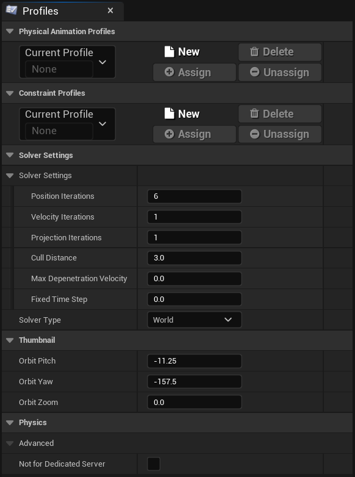
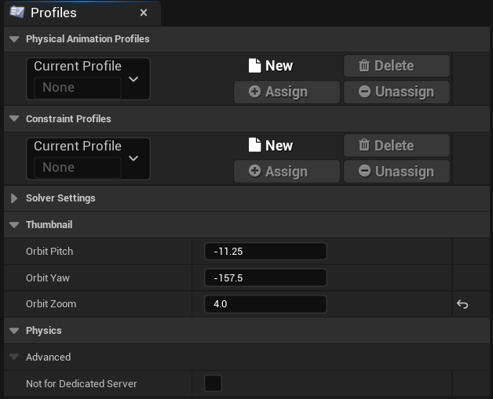
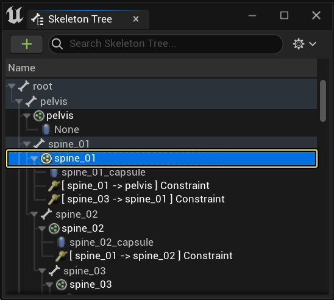
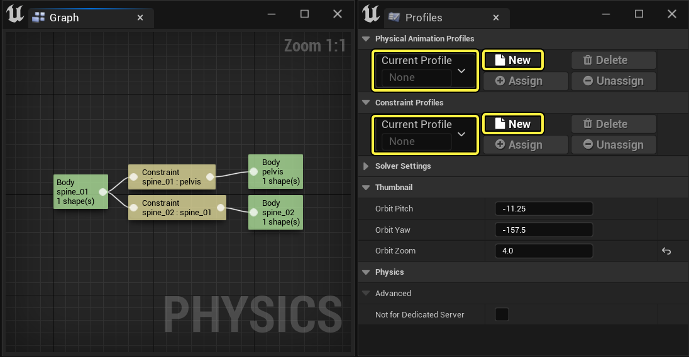
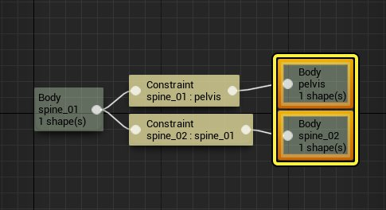
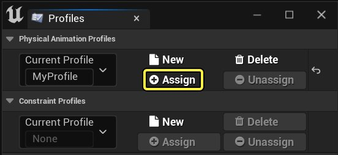
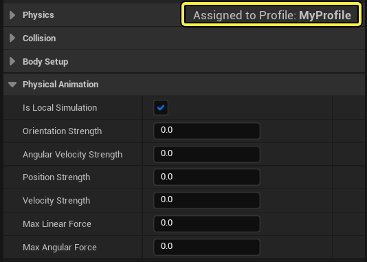
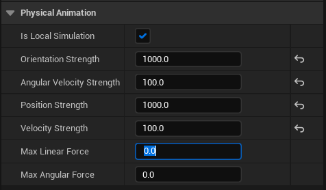

# 为形体和约束使用配置文件

> 路径：虚幻引擎5.7文档 / Gameplay系统 / 物理 / 物理资产编辑器 / 物理资产编辑器教程 / 为形体和约束使用配置文件

> 原始页面：https://dev.epicgames.com/documentation/unreal-engine/using-profiles-for-bodies-and-constraints-in-unreal-engine

你可以使用[物理资源编辑器](../../physics-asset-editor-interface/index.md)创建自己的[配置文件](../../physics-asset-editor-interface/physics-asset-editor-in-unreal-engine---tools-a-3b3e9bbb/index.md)，通过该配置文件将物理动画设置指定给[形体](../../../physics-bodies/index.md)，将约束设置指定给[约束](../../../physics-constraints/physics-constraint-reference/index.md)。

阅读以下部分，了解如何创建、指定、取消指定、删除配置文件：

## 创建和指定配置文件

要创建和指定配置文件，请按照下列步骤操作：

1. 在 **骨架树（Skeleton Tree）** 中，选择 **物理形体（Physics body）** 或 **物理约束（Physics constraint）**。

   
2. 在 **配置文件（Profiles）** 选项卡中，单击要创建的配置文件类型旁的 **新建（New）** 按键；配置文件类型有 **物理动画（Physical Animation）** 和 **约束（Constraint）**。然后在 **当前配置文件（Current Profile）** 下的文本框中，为配置文件命名，以便稍后引用。

   

   > [!NOTE]
   > 创建配置文件时，它们的初值设定为"empty"，表示使用默认设置。
3. 使用 **图表（Graph）** 或 **骨架树（Skeleton Tree）** 选择要指定给配置文件的形体或约束。

   

   所选形体的图表。

   然后在 **配置文件（Profiles）** 选项卡中，将 **当前配置文件（Current Profile）** 设置为要使用的配置文件，并单击 **指定（Assign）**。所选节点将从阴影变为填充色。

   

   颜色变化表示它们已经指定给该配置文件，而其他显示为（阴影）的形体节点则没有。

   
4. 在所选形体的 **细节（Details）** 面板中，将显示当前指定的配置文件，你可以调整要创建的配置文件类型的属性。

   

   物理动画配置文件已经指定给该所选形体。

   > [!TIP]
   > 如果是物理动画配置文件，合适的值可以是 1000, 100, 1000, 100, 0, 0
   >
   > 

## 取消指定配置文件

要对形体或约束 **取消指定（Unassign）** 配置文件，请按照下列步骤操作：

1. 从要编辑的 **骨架树** 中选择 **物理形体（Physics Body）** 或 **物理约束（Physics Constraint）**。

   > 图片已省略：选择一个物理实体或约束
2. 在 **配置文件（Profiles）** 选项卡中，将 **当前配置文件（Current Profile）** 设置为要编辑的配置文件。如果需要，使用 **下拉菜单** 选择指定的配置文件。

   > 图片已省略：选择配置文件

   在 **图表（Graph）** 中，指定给所选配置文件的节点将显示为填充色，而不再是阴影。

   > 图片已省略：节点与配置文件相关联
3. 选择了要取消与配置文件关联的节点后，然后单击 **配置文件（Profiles）** 选项卡中的 **取消指定（Unassign）** 按钮。

   > 图片已省略：配置面板中的取消指定按钮

   执行此操作后，所选节点将显示为阴影，而不是显示当前所选配置文件的填充颜色。

   > 图片已省略：灰色节点不再与配置关联

## 删除配置文件

要 **删除** 配置文件，请按照下列步骤操作：

1. 在 **配置文件（Profiles）** 选项卡中，使用 **下拉菜单** 将 **当前配置文件（Current Profile）** 选为要删除的配置文件。

   > 图片已省略：选择配置文件

   下拉列表的底部列出了所有已创建的配置文件。
2. 单击 **删除（Delete）** 按钮将其从可用配置文件列表中删除。

   > 图片已省略：删除配置文件

## 其他资源
