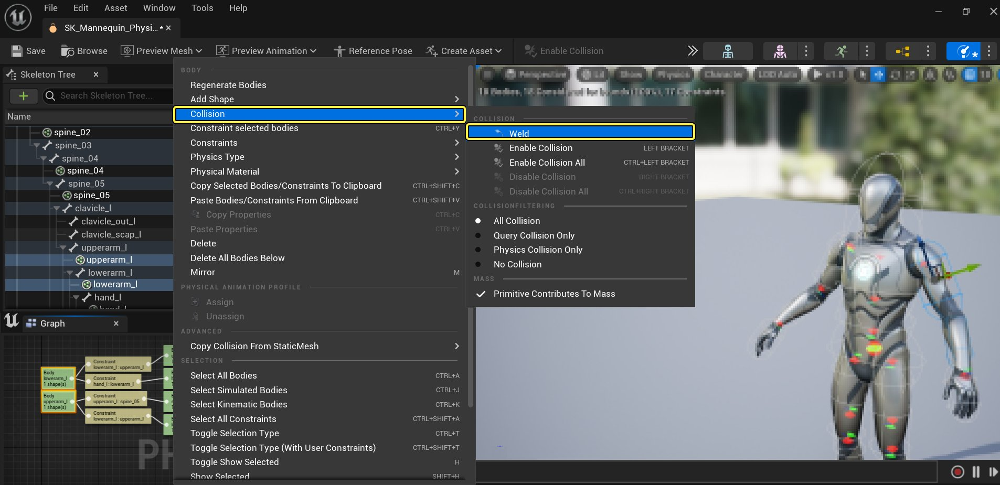

# 在物理资产编辑器中焊接物理实体

> 路径：虚幻引擎5.7文档 / Gameplay系统 / 物理 / 物理资产编辑器 / 物理资产编辑器教程 / 在物理资产编辑器中焊接物理实体

> 原始页面：https://dev.epicgames.com/documentation/unreal-engine/welding-physics-bodies-in-unreal-engine-by-using-the-physics-asset-editor

本文介绍了如何在 **物理资产编辑器（Physics Asset Editor）** 中把两个或多个 **物理形体** **焊接**在一起。

### 焊接

将多个物理形体焊接后，它们就会以一个整体进行交互，并把它们关联的骨架网格体连接点锁定在一起。焊接物理形体的步骤如下：

1. 使用

   Ctrl + 鼠标左键

   选中

   2 个或多个物理形体。
2. 右键点击物理形体，打开

   上下文菜单（Context menu）

   ，然后在

   碰撞（Collision）

   下选择

   焊接（Weld）

   选项。

与当前选中物理形体相结合的物理形体将显示为黄色。
