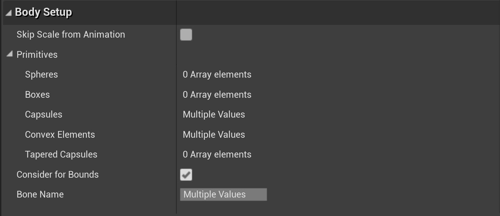
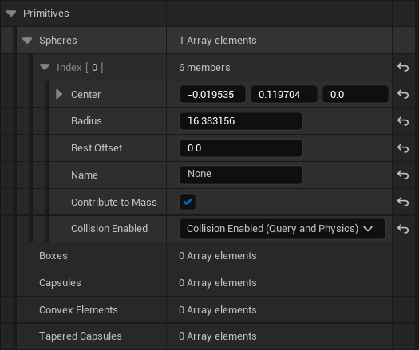
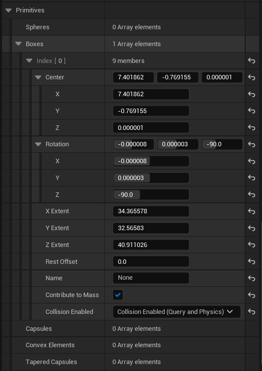
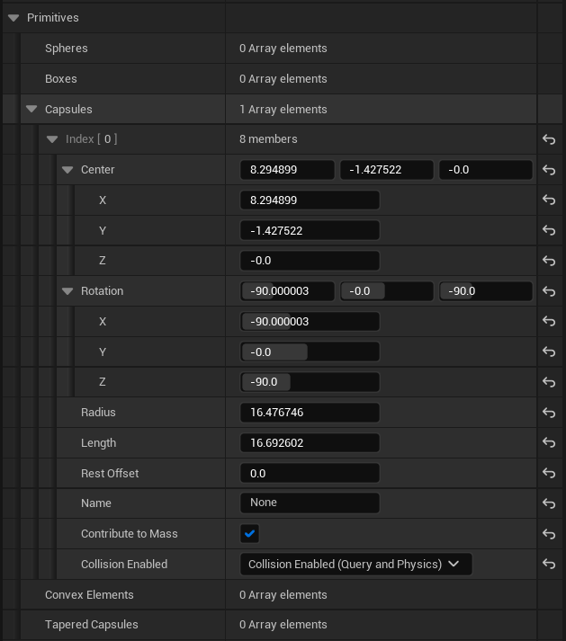

# 物理形体参考

> 路径：虚幻引擎5.7文档 / Gameplay系统 / 物理 / 物理对象 / 物理形体参考

> 原始页面：https://dev.epicgames.com/documentation/unreal-engine/physics-bodies-reference-for-unreal-engine

本文介绍了"物理和碰撞"分类中各个属性的用法。如需了解"碰撞响应（Collision Respons）"或"碰撞预设（Collision Preset）"的使用方法，请参阅：[碰撞响应参考](../../collision/collision-response-reference/index.md)。

## 属性

以下是"物理形体（形体实例）"的属性介绍，按大类区分。

## 物理

| 属性 | 说明 |
| --- | --- |
| **双面几何体（Double Sided Geometry）** | 如果启用，物理三角网格体在执行场景查询时将使用双面。这对于需要追踪以便在两个面上工作的平面和单面网格体非常有用。 |
| **简单碰撞物理材质（Simple Collision Physical Material）** | 在此形体上进行简单碰撞时使用的物理材质。对密度、摩擦力等信息进行编码。 |
| **物理类型（Physics Type）** | 模拟：物体将使用物理模拟。 运动学：物体将不会受到物理影响，但可以与以物理方式模拟的形体进行交互。 默认值：物体将从OwnerComponent的行为进行继承。 |
| **质量（以KG为单位）（Mass in KG）** | 形体的质量，以KG为单位。 |
| **线性阻尼（Linear Damping）** | 为减弱线性移动而附加的"拖拽"力 |
| **角阻尼（Angular Damping）** | 为减弱角运动而附加的"拖拽"力 |
| **启用重力（Enable Gravity）** | 物体是否受到重力作用 |

### 高级

| 属性 | 说明 |
| --- | --- |
| **初始状态为苏醒（Start Awake）** | 物体的初始状态为苏醒，或为休眠 |
| **质量中心偏移（Center Of Mass Offset）** | 用户为此物体质量中心指定的距离计算位置的偏移 |
| **质量缩放（Mass Scale）** | 质量的逐实例缩放 |
| **最大角速度（Max Angular Velocity）** | 实例的最大角速度 |
| **休眠集（Sleep Family）** | 将此形体设置为休眠时考虑使用的值集。普通、警觉、自定义 |
| **惯性张量缩放（Inertia Tensor Scale）** | 根据每个实例来缩放惯性（值越大表示越难旋转） |
| **可行走斜面覆盖（Walkable Slope Override）** | 此形体的自定义可行走斜面设置。请参阅 **[可行走斜面](../../walkable-slope/index.md)** 文档了解使用信息。 |
| **可行走斜面行为（Walkable Slope Behavior）** | 此表面的行为（是否影响可行走斜面）。 |
| **可行走斜面角度（Walkable Slope Angle）** | .覆盖可行走斜面，应用可行走斜面行为的规则。 |
| **自定义休眠阈值乘数（Custom Sleep Threshold Multiplier）** | 如果休眠集设置为 **自定义（Custom）**，则用此数量乘以自然睡眠阈值。数越大，形体休眠速度越快。 |
| **稳定性阈值乘数（Stabilization Threshold Multiplier）** | 如果启用了物理稳定性，则表示此形体的稳定性系数。数越大，稳定性将越激进，但存在以较低速度流失扩散性的风险。值为0将禁用此形体的稳定性。 |
| **缩放更改时更新质量（Update Mass when Scale Changes）** | 如为true，缩放发生变化时其将更新质量。 |
| **生成苏醒事件（Generate Wake Events）** | 确定当此物体被物理模拟设置为唤醒或进入休眠时，是否应该触发"苏醒/休眠"事件。 |

## 碰撞

| 属性 | 说明 |
| --- | --- |
| **始终不需要已烘焙的碰撞数据（Never Needs Cooked Collision Data）** | 为了实现Chaos，可使用此属性对某些网格体排除CreatePhysicsMesh。 除非确认有某个网格体实例需要CreatePhysicsMesh，否则最好不要让长期网格体调用CreatePhysicsMesh。 |
| **碰撞复杂度（Collision Complexity）** | 碰撞追踪行为——默认情况下将区分简单（凸包）和复杂（按多边形）。 |
| **碰撞响应（Collision Responses）** | 请参阅[碰撞响应参考](../../collision/collision-response-reference/index.md)文档以了解更多信息。 |
| **模拟生成命中事件（Simulation Generates Hit Events）** | 当此物体在物理模拟中发生碰撞时是否发射"命中"事件。 |
| **物理材质覆盖（Phys Material Override）** | 允许覆盖用于此形体上简单碰撞的PhysicalMaterial。 |

### 高级

| 属性 | 说明 |
| --- | --- |
| **使用CCD（Use CCD）** | 如为true，连续碰撞检测（CCD）将用于此组件 |
| **忽略分析碰撞（Ignore Analytic Collisions）** | 如果设置为"真"，则忽略分析碰撞并将物体处理为通用隐式表面。 |
| **平滑边缘碰撞（Smooth Edge Collisions）** | 删除不必要的边缘碰撞，从而在由多个Actor/组件组成的表面上平滑滑动。 |

## 形体设置

| 属性 | 说明 |
| --- | --- |
| **跳过来自动画的缩放（Skip Scale from Animation）** | 如果设置为"真"，则忽略来自动画的缩放变化。这对于细微的缩放动画非常有用，例如在呼吸时，物理碰撞应该保持不变。 |
| **图元（Primitives）** | 此物体的简化碰撞表示。 |
| **球体（Spheres）** | 球体元素 |
| **盒体（Boxes）** | 盒体元素 |
| **胶囊体（Capsules）** | 长菱形元素 |
| **凸包元素（Convex Elements）** | 凸包元素 |
| **锥形胶囊体（Tapered Capsules）** | 锥形胶囊体元素 |
| **考虑边界（Consider for Bounds）** | 确定是否应该为PhysicsAsset（以及SkeletalMeshComponent）的边界框考虑此BodySetup。在更新边界时，每帧处理的BodySetup越少，越可以提升速度。 |
| **骨骼名称（Bone Name）** | 在PhysicsAsset情况中使用。将此形体与骨骼网格体中的骨骼关联。 |

如需了解每个图元类型的细节属性，请参见下文。

## 图元类型

#### 球体

| 属性 | 说明 |
| --- | --- |
| **中心（Center）** | 球体的起点位置。 |
| **半径（Radius）** | 球体的半径。 |
| **剩余偏移（Rest Offset）** | 在生成接触点时使用的偏移。这样你可以按照半径R来平滑明氏总和（Minkowski sum）。对于让物体在不规则表面上的平滑运动很有用。 |
| **名称（Name）** | 此形状的用户定义名称。 |
| **提升质量（Contribute to Mass）** | 控制此形状是否应该提升它所属的形体的总质量。这可以让你创建不会影响物体质量属性的额外碰撞体积。 |
| **启用碰撞（Collision Enabled）** | 逐个设置图元的碰撞过滤。允许你在模拟中开关单个图元，并在不更改过滤细节的情况下查询碰撞。 |

#### 盒体

| 属性 | 说明 |
| --- | --- |
| **中心（Center）** | 盒体的起点位置。 |
| **旋转（Rotation）** | 盒体的旋转，以围绕每个轴的度数表示。 |
| **X范围（X Extent）** | 盒体沿着X轴的范围。 |
| **Y范围（Y Extent）** | 盒体沿着Y轴的范围。 |
| **Z范围（Z Extent）** | 盒体沿着Z轴的范围。 |
| **剩余偏移（Rest Offset）** | 在生成接触点时使用的偏移。这样你可以按照半径R来平滑明氏总和（Minkowski sum）。对于让物体在不规则表面上的平滑运动很有用。 |
| **名称（Name）** | 此形状的用户定义名称。 |
| **提升质量（Contribute to Mass）** | 控制此形状是否应该提升它所属的形体的总质量。这可以让你创建不会影响物体质量属性的额外碰撞体积。 |
| **启用碰撞（Collision Enabled）** | 逐个设置图元的碰撞过滤。允许你在模拟中开关单个图元，并在不更改过滤细节的情况下查询碰撞。 |

#### 胶囊体

| 属性 | 说明 |
| --- | --- |
| **中心（Center）** | 胶囊体的起点位置。 |
| **旋转（Rotation）** | 胶囊体的旋转，以围绕每个轴的度数表示。 |
| 半径 | 胶囊体的半径 |
| 长度 | 线段的长度。将半径添加到两端，获知总长度。 |
| **剩余偏移（Rest Offset）** | 在生成接触点时使用的偏移。这样你可以按照半径R来平滑明氏总和（Minkowski sum）。对于让物体在不规则表面上的平滑运动很有用。 |
| **名称（Name）** | 此形状的用户定义名称。 |
| **提升质量（Contribute to Mass）** | 控制此形状是否应该提升它所属的形体的总质量。这可以让你创建不会影响物体质量属性的额外碰撞体积。 |
| **启用碰撞（Collision Enabled）** | 逐个设置图元的碰撞过滤。允许你在模拟中开关单个图元，并在不更改过滤细节的情况下查询碰撞。 |

#### 凸包元素

> 图片已省略：Body setup details for convex element primitives

| 属性 | 说明 |
| --- | --- |
| **剩余偏移（Rest Offset）** | 在生成接触点时使用的偏移。这样你可以按照半径R来平滑明氏总和（Minkowski sum）。对于让物体在不规则表面上的平滑运动很有用。 |
| **名称（Name）** | 此形状的用户定义名称。 |
| **提升质量（Contribute to Mass）** | 控制此形状是否应该提升它所属的形体的总质量。这可以让你创建不会影响物体质量属性的额外碰撞体积。 |
| **启用碰撞（Collision Enabled）** | 逐个设置图元的碰撞过滤。允许你在模拟中开关单个图元，并在不更改过滤细节的情况下查询碰撞。 |

#### 锥形胶囊体

> 图片已省略：Body setup details for tapered capsule primitives

| 属性 | 说明 |  |
| --- | --- | --- |
| **中心（Center）** | 胶囊体的起点位置。 |  |
| **旋转（Rotation）** | 胶囊体的旋转，以围绕每个轴的度数表示。 |  |
| **半径0（Radius 0）** | 胶囊体起点的半径 |  |
| **半径1（Radius 1）** | 胶囊体末端的半径 |  |
| **长度（Length）** | 线段的长度。添加半径0和半径1，获知总长度。 |  |
| **剩余偏移（Rest Offset）** | 在生成接触点时使用的偏移。这样你可以按照半径R来平滑明氏总和（Minkowski sum）。对于让物体在不规则表面上的平滑运动很有用。 |  |
| **名称（Name）** | 此形状的用户定义名称。 |  |
| **提升质量（Contribute to Mass）** | 控制此形状是否应该提升它所属的形体的总质量。这可以让你创建不会影响物体质量属性的额外碰撞体积。 |  |
| **启用碰撞（Collision Enabled）** | 逐个设置图元的碰撞过滤。允许你在模拟中开关单个图元，并在不更改过滤细节的情况下查询碰撞。 |  |
