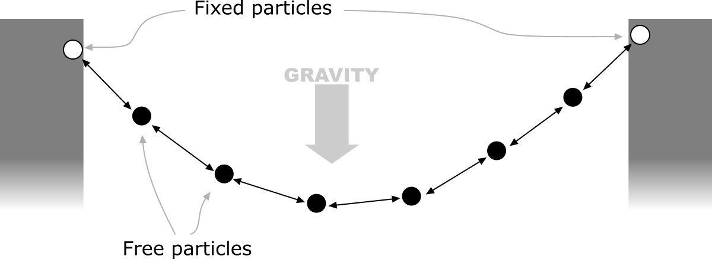
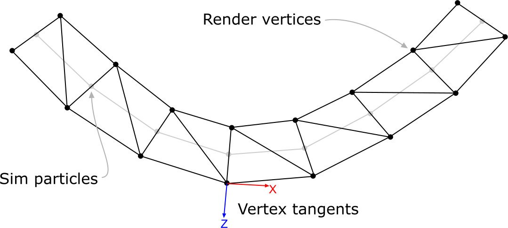
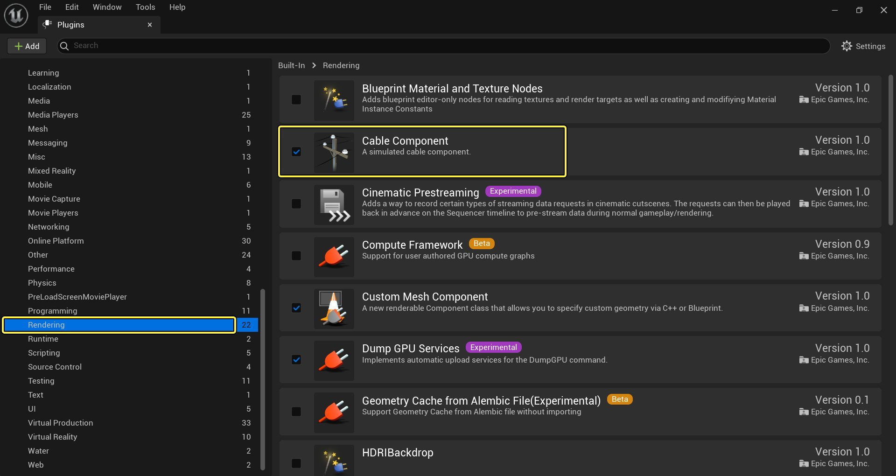
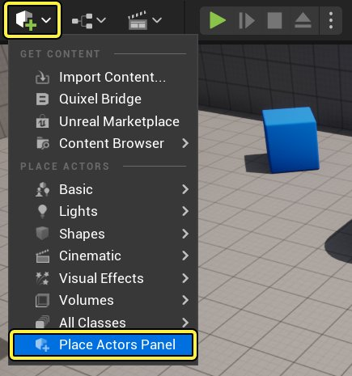
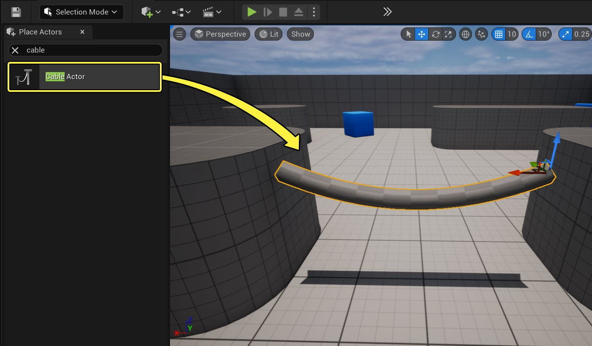
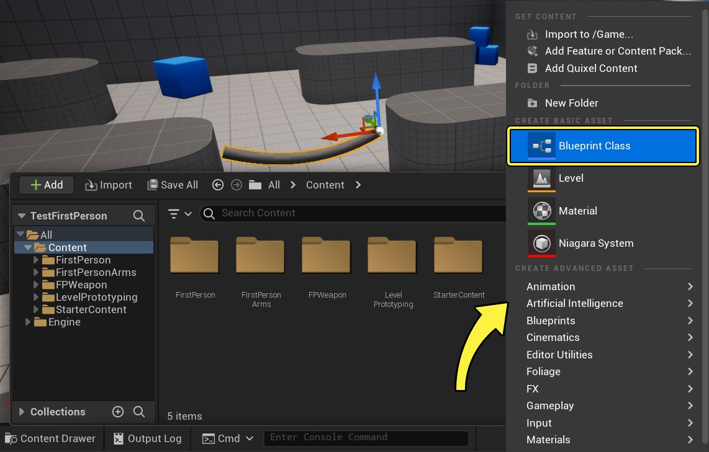
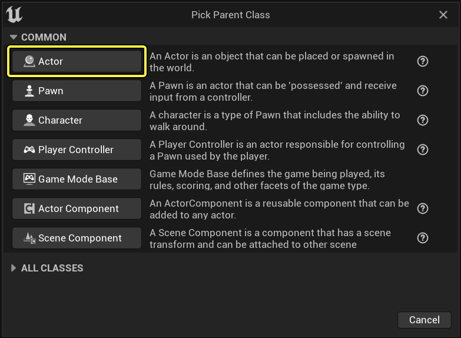
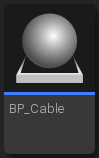

# 缆绳组件

> 路径：虚幻引擎5.7文档 / Gameplay系统 / 物理 / 物理组件 / 缆绳组件

> 原始页面：https://dev.epicgames.com/documentation/unreal-engine/cable-components-in-unreal-engine

假如能以较低的开销添加来回晃荡的缆绳、绳索或链条，仿佛被风吹动一般，那么虚幻引擎的项目会更加栩栩如生。 本文将介绍如何使用 **缆绳组件（Cable Component）** 插件创建、设置和控制缆绳的外观、响应方式，甚至是让它和关卡中的对象发生碰撞。

## 模拟和渲染

在模拟缆绳的实际效果时，我们用到了游戏开发中的一项经典技巧——**韦尔莱积分算法（Verlet Integration）**。 这种算法的理念是用一系列粒子来表示缆绳，且粒子之间有 **距离约束**。 两端的粒子 **固定不动**，只跟随它的绑定对象移动。 中间的粒子则 **自由移动**，随重力下垂。 在每一步（积分）中，每个粒子的速度和位置都会更新，并相应移动以满足约束。 缆绳的 **刚性** 由我们（每步）强制执行约束时采用的迭代次数决定。

点击图片查看大图。

生成完粒子锁链后，我们需要对它进行渲染。 渲染缆绳时，将创建一个名为 **FCableSceneProxy** 的类来表示缆绳的渲染效果。 粒子的两端的位置（在主线程上的TickComponent中执行）会通过 **SendRenderDynamicData_Concurrent** 函数传递给此代理。 接下来，更新会在渲染线程锁定，之后将更新索引和顶点缓存，进而生成一个 **管状** 网格体。 管状网格体上的每个顶点都要计算一个位置、一个纹理UV和三个切线基础（Tangent Basis）向量。 执行此操作时，**X轴** 与缆绳的方向相同，**Z轴** 垂直缆绳表面（相当于法线），而 **Y轴** 则与 **X轴** 和 **Z轴** 垂直。 这些属性对组件公开，让用户可以控制面的数量、管状的半径，以及UV沿缆绳进行平铺的次数。

点击图片查看大图。

## 启用插件

缆绳组件插件会默认启用。 如未启用，可在主工具栏中选择 **编辑（Edit）** > **插件（Plugins）**。 然后从插件列表中选择 **渲染（Rendering）**，勾选 **缆绳组件（Cable Component）** 的 **已启用（Enabled）** 复选框。

点击图片查看大图。

## 使用缆绳组件

在以下部分，我们将说明为项目关卡添加缆绳的两种不同方法。

### 用放置Actor面板添加缆绳组件

如需使用放置Actor面板添加缆绳组件，请执行以下操作：

1. 在 **主工具栏（Main Toolbar）** 中单击 **创建（Create）** 并选择 **放置Actor（Place Actors）** 面板。

   
2. 在搜索框中，输入`Cable`。 然后将 **缆绳Actor（Cable Actor）** 拖入关卡中。

   

   点击图片查看大图。
3. 现在便可放置、旋转和缩放缆绳Actor，使其满足关卡的需求。

### 在蓝图中使用缆绳组件

如需在蓝图中使用缆绳组件，请创建一个新的蓝图类。

1. 在 **内容抽屉（Content Drawer）/内容浏览器（Content Browser）** 中 **右键单击** 并选择 **蓝图类（Blueprint Class）**。

   
2. 选择 **Actor** 作为新蓝图的父类。

   
3. 将蓝图命名为 **BP_Cable**。 然后双击该蓝图，在 **蓝图编辑器（Blueprint Editor）** 中将其打开。

   
4. 在 **组件（Components）** 选项卡中单击 **添加（Add）** 按钮。 在列表中，找到并选择 **缆绳（Cable）** 组件

   > 图片已省略：Adding Cable component to the Blueprint
5. 添加完缆绳组件后，在组件列表中将其选中，以便通过 **细节（Details）** 面板调整其属性。 将其他设置保留为默认值，在关闭编辑器之前，请务必 **编译（Compile）** 并 **保存（Save）** 蓝图。

   > [!NOTE]
   > 要使缆绳的任意一头下垂，请通过细节面板禁用 **附加头端（Attach Start）** 或 **附加末端（Attach End）** 选项。 也可以根据效果所需，在游戏运行时切换该选项。

   > 图片已省略：Disabling Attach Start and Attach End
6. 在内容抽屉中找到 **BP_Cable**，然后将其拖入关卡。 根据需要对其进行移动和旋转。

   > 图片已省略：Dragging Cable Blueprint into the level

## 在缆绳末端附加对象

你可以在缆绳的任意一端附加对象，使其随缆绳摇荡。 要实现此目的，请执行以下操作：

1. 在Actor面板中，将一个 **立方体Actor（Cube Actor）** 拖入关卡中。 将其放在之前添加的 **BP_Cable** 旁边。

   > 图片已省略：Dragging the Cube Actor into the Level
2. 务必将该立方体的 **移动性（Mobility）** 设置为 **可移动（Movable）**。

   > 图片已省略：undefined

   点击图片查看大图。
3. 在 **世界大纲视图** 中，找到需要附加到缆绳Actor末端的立方体， 然后将其拖至缆绳Actor的上方。 完成此操作后，以下对话框窗口将打开。 Drag the cube over the cable actor
4. 选择 **缆绳末端（Cable End）**，即可在视口中看到该立方体附着到缆绳的末端。

   > 图片已省略：Before

   > 图片已省略：After

   Before

   After
5. 在关卡视口中选中缆绳Actor。 然后在 **细节（Details）** 面板的 **缆绳（Cable）** 部分中，禁用 **附加末端（Attach End）** 选项。 Disabling the Attach End option

   > [!NOTE]
   > **附加头端（Attach Start）** 和 **附加末端（Attach End）** 选项并非将缆绳附加到Actor的唯一方法。 也可指定一个用作附着点的插槽。
6. 禁用 **附加末端（Attach End）** 后，缆绳就能在视口中自由摇荡。

   > [!NOTE]
   > 可在运行时动态启用或禁用 **附加头端（Attach Start）** 和 **附加末端（Attach End）** 选项，制造出一些有趣的效果。

## 碰撞和刚性

> [!WARNING]
> 启用碰撞（Collision）和刚性（Stiffness）将大幅增加缆绳Actor的开销。 建议仅在以下情况下启用：缆绳需要和世界中的对象碰撞，或需要一些刚性以实现更好的效果。 如无此类需求，最好禁用这些选项以降低开销。

缆绳组件有一个选项可让缆绳与世界发生碰撞，并控制缆绳的刚度。 要启用此功能，请执行以下步骤：

1. 在蓝图编辑器中，转到缆绳组件的细节面板。 找到 **缆绳（Cable）** 部分，展开其 **高级（Advanced）** 选项。

   > 图片已省略：undefined

   点击图片查看大图。
2. 启用 **启用刚性（Enable Stiffness）** 和 **启用碰撞（Enable Collision）** 选项。

   > 图片已省略：Enabling Stiffness and Collision
3. 现在，当缆绳Actor和对象相遇时，应该会发生碰撞效果。

## 缆绳组件属性参考

本小节包含缆绳组件每个属性的参考信息：

#### 缆绳

> 图片已省略：Properties in the Cable Section

| 属性名称 | 描述 |
| --- | --- |
| **附加头端（Attach Start）** | 将头端固定到某处还是不固定。 如为false，组件变换只用于缆绳头端的初始位置。 |
| **附加末端（Attach End）** | 将末端固定到某处（使用AttachEndTo和EndLocation）还是不固定。 如为false，AttachEndTo和EndLocation只用于缆绳末端的初始位置。 |
| **将末端附加到（Attach End To）** | 定义缆绳末端位置的Actor或组件。 |
| **组件名称（Component Name）** | 将缆绳附加到的组件属性的名称。 |
| **将末端附加到的插槽名称（Attach End To Socket Name）** | 要附加到的AttachEndTo组件上的插槽名称。 |
| **末端位置（End Location）** | 缆绳的末端位置，指定后则相对于AttachEndTo（或AttachEndToSocketName）。 否则将相对于缆绳组件。 |
| **缆绳长度（Cable Length）** | 缆绳的静止长度。 |
| **分段数量（Num Segments）** | 缆绳拥有的分段数量。 |
| **解算器迭代（Solver Iterations）** | 解算器迭代的数量，用于控制缆绳的刚度。 |
| **分步时间（Substep Time）** | 控制缆绳的模拟分步时间。 |
| **使用分步（Use Substepping）** | 如为false，会先等待 **Substep Time** 过去再进行更新，但只使用所有累积的模拟时间运行一次缆绳模拟。 |
| **启用刚度（Enable Stiffness）** | 为缆绳添加刚度约束。 |
| **启用碰撞（Enable Collision）** | 在每个分步为每个缆绳粒子执行扫描，避免与世界发生碰撞。 使用组件上的碰撞预置决定碰撞的对象。 这会大幅增加缆绳模拟的开销。 此功能目前为试验性功能。 |
| **碰撞摩擦力（Collision Friction）** | 如果启用了 **碰撞（Collision）**，此选项将控制接触到缆绳时应用的滑动摩擦力。 |

### 缆绳力

> 图片已省略：Properties in the Cable Forces Section

| 属性名称 | 描述 |
| --- | --- |
| **缆绳力（Cable Forces）** | 应用到缆绳中所有粒子的力向量（世界空间）。 |
| **缆绳重力比例（Cable Gravity Scale）** | 应用到影响此缆绳的世界重力的缩放比例。 |

### 缆绳渲染

> 图片已省略：Properties in the Cable Forces Section

| 属性名称 | 描述 |
| --- | --- |
| **缆绳宽度（Cable Width）** | 缆绳几何体的宽度。 |
| **面数（Num Sides）** | 缆绳几何体的面数。 |
| **重复平铺材质（Tile Material）** | 沿缆绳长度方向重复材质的次数。 |
