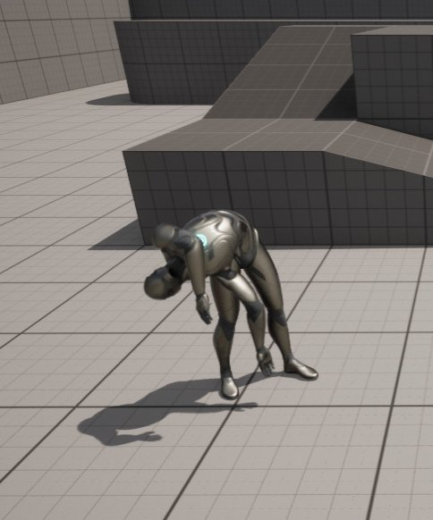
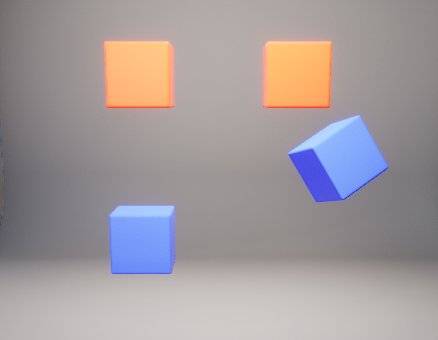
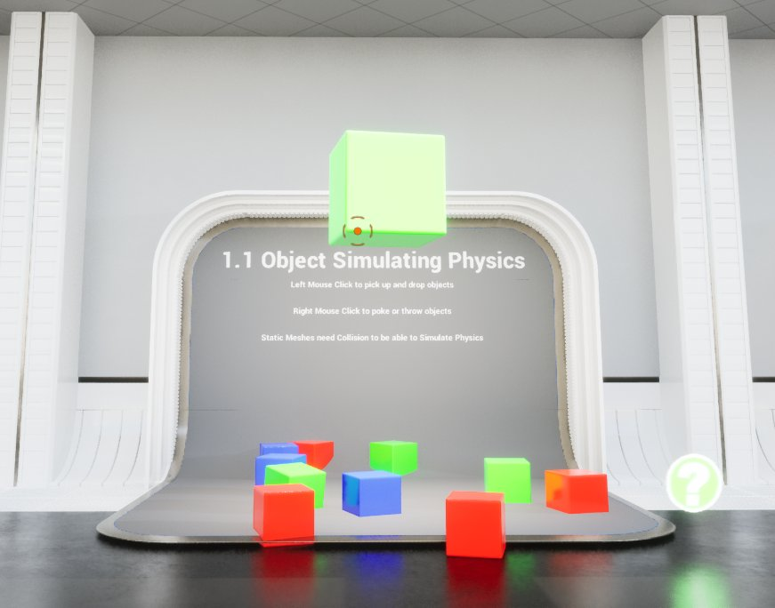
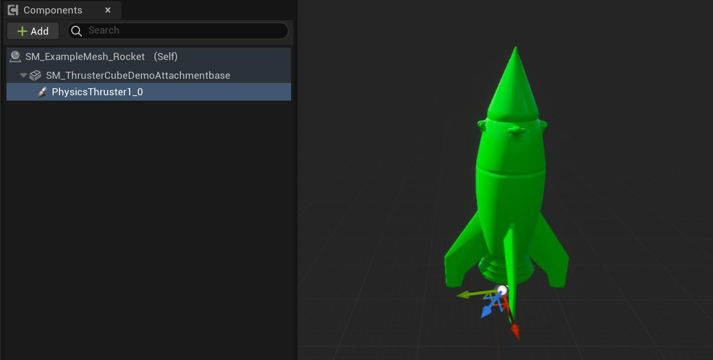
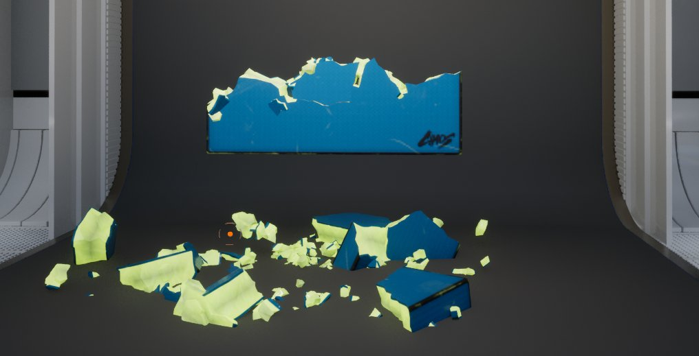

# 物理组件

> 路径：虚幻引擎5.7文档 / Gameplay系统 / 物理 / 物理组件

> 原始页面：https://dev.epicgames.com/documentation/unreal-engine/physics-components-in-unreal-engine

这些物理组件用于影响那些在你的场景中以不同方式应用物理效果的任意对象。

## 物理动画组件

**物理动画组件（Physical Animation Component）** 在 **骨骼网格体（Skeletal Mesh）** 动画顶部应用 **物理模拟** 。通过使用该组件，你可以在播放动画的同时将真实的物理模拟应用到骨骼网格体中的特定骨骼组。

## 物理约束组件

**物理约束组件（PhysicsConstraintComponent）** 是一种能连接两个刚性物体的接合点。你可以借助该组件的各类参数来创建不同类型的接合点。

借助 **PhysicsConstraintComponent** 和两个 **StaticMeshComponents** ，你可以创建悬摆型对象，如秋千、重沙袋或标牌。它们可以对世界中的物理作用做出响应，让玩家与之互动（请参见 **[约束蓝图](../physics-constraints/physics-constraint-component-user-guide/index.md)** 了解基于 **Blueprints** 的相关示例）。

## 物理抓柄组件

**物理抓柄组件（PhysicsHandleComponent）** 用于"抓取"和移动物理对象，同时允许抓取对象继续使用物理效果。案例包括"重力枪"——你可以拾取和掉落物理对象（参见[**物理内容示例**](../index.md) 了解详细信息）。

## 物理推进器组件

**物理推进器组件（PhysicsThrusterComponent）** 可以沿着 X 轴的负方向施加特定作用力。推力组件属于连续作用力，而且能通过脚本来自动激活、一般激活或取消激活。

推力组件的用途包括火箭（见下图）。它将持续施加作用力，将火箭向上推（因为推力部分位于火箭下方）。你可以用 **阻挡体积（Blocking Volumes）** ，限制受推力影响的组件的动作。

## 径向力组件

**径向力组件（RadialForceComponent）** 用于发出径向力或脉冲来影响物理对象或可摧毁对象。与 **PhysicsThrusterComponent** 不同，这类组件只施加"发射后不管"类型的作用力，而且并不持续。

你可以使用这类组件来推动被摧毁对象（如爆炸物）的碎片。使用 **RadialForceComponent** 指定作用力和方向，当对象被摧毁时，你可以像下面的图示那样，沿着特定方向将碎片向外"推"（参见 [**可破坏物内容示例**](../../../samples-and-tutorials/content-examples-sample-project/index.md) 了解详细信息）。

