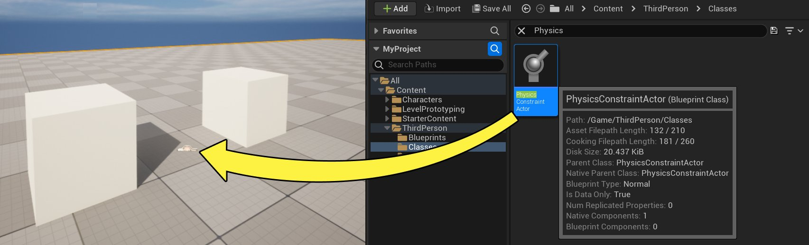
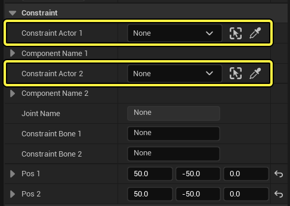
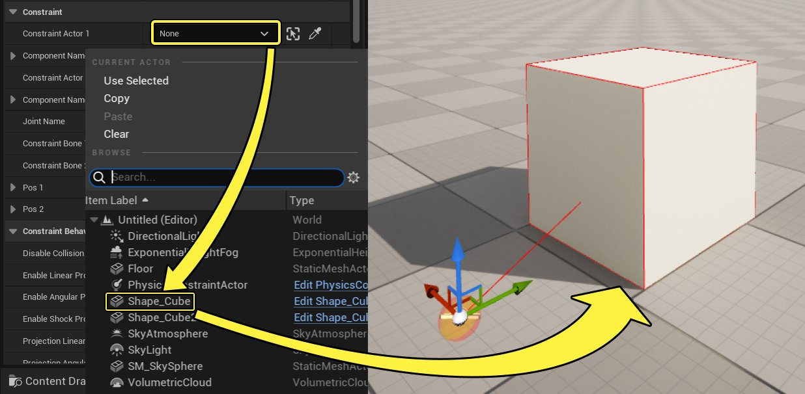
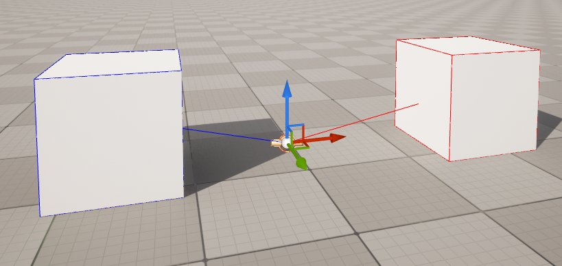
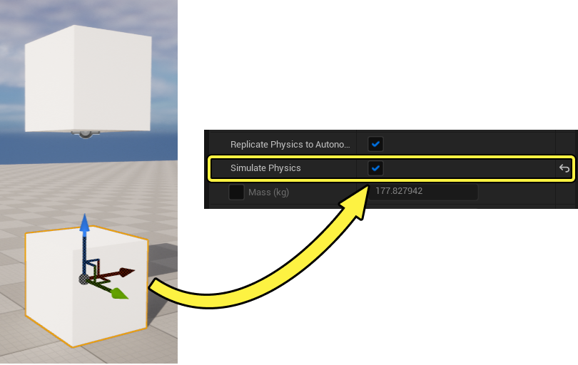
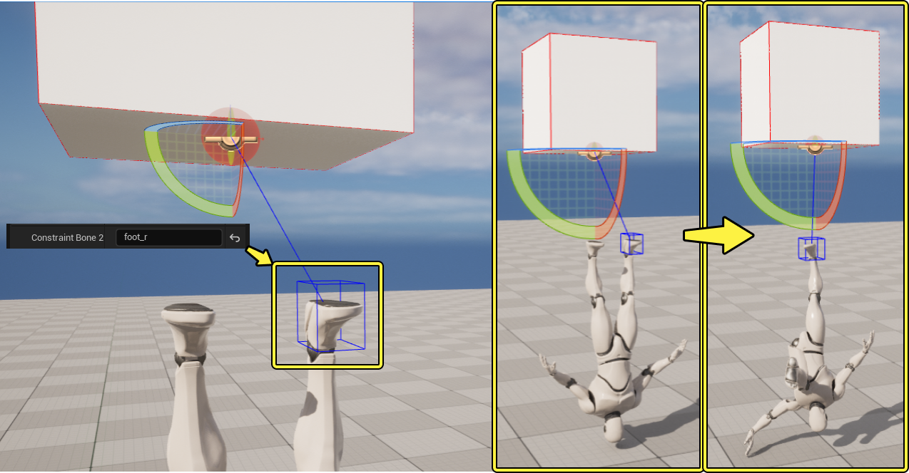
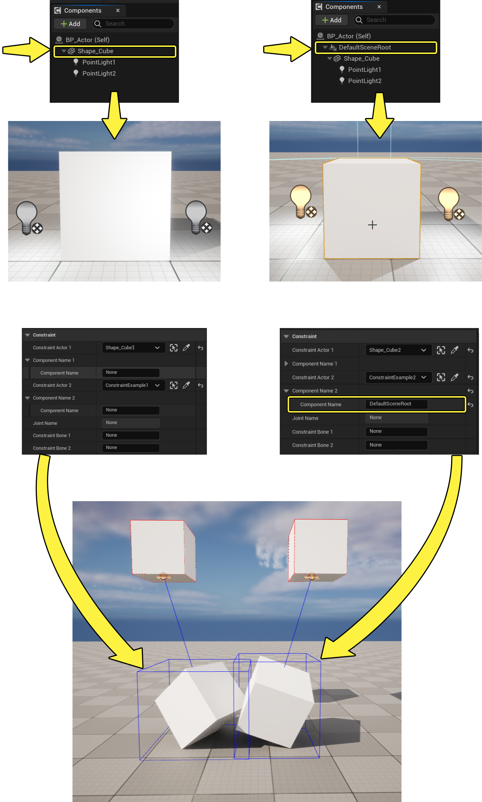

# 关于约束的用户指南

> 路径：虚幻引擎5.7文档 / Gameplay系统 / 物理 / 物理约束 / 关于约束的用户指南

> 原始页面：https://dev.epicgames.com/documentation/unreal-engine/constraints-user-guide-in-unreal-engine

利用 **物理约束 Actor** 可创建摇曳的枝形吊灯、水车，或将物理形体限制在一个总体区域内。该文档讲述了物理约束 Actor 的用法。

根本而言，约束是一种连接点。利用它可将两个 Actors 连接起来（假定一个物理模拟），并应用限制和力度。虚幻引擎拥有一个数据驱动且灵活度高的约束系统，设计师改变此系统中的一些选项即可创建出许多不同类型的连接点。引擎拥有一些默认连接点类型（球窝式、铰链式、棱柱式），区别只存在于它们的设置中。可任选一种连接点开始，自行进行调整试验。

## 物理约束 Actor

1. 在 **放置Actor（Place Actors）** 面板的 **所有类（All Classes）** 选项卡中可找到物理约束 Actor。 The Physics Constraint Actor can be found in the All Classes tab of the Place Actors panel
2. 在此处可将其放置关卡中，方法和其他 Actor 相同 - 点击并拖入视口。

   
3. 将其置于关卡中后，打开 **Details** 窗格中的 **Constraint** 类目即可设置两个 Actors 要约束的对象。

   
4. 使用下拉菜单搜索希望选择的 Actor，或使用"滴管"图标从视口中选择一个 Actor。

   
5. 为 **约束 Actor 2** **重复** 步骤 4。

   
6. 将物理约束 Actor 和受约束的 Actor 放置到所需位置。

   在此例中，3 个 Actors（2 个方块和物理约束）被同时选中，然后旋转 90 度，使红色约束方块位于蓝色约束方块之上。此操作将旋转物理约束，使其角摇摆运动位于正确的轴上。
7. 在其中至少一个约束 Actor 上 **启用物理**。

   
8. 为物理约束 Actor 进行必要设置。

   此示例中只对以下属性进行了变更：

   - Angular Swing 1Motion

     和

     Angular Swing 2Motion

     设为

     ACM_Limited

     。
   - Swing 1Limit Angle

     和

     Swing 2Limit Angle

     设为 25 度。
   - 禁用

     Swing Limit Soft

     。

   Angular Limits Physics Constraint Angular

   想了解物理约束上所有属性的影响吗？请查阅 [Constraints Reference](../physics-constraint-reference/index.md) 中的详细内容。
9. 在 **Play in Editor** 或 **Simulate in Editor** 中测试物理约束。

   你需要找到在受约束 Actors 上应用力度的方法，具体取决于它们的排列方式，并非所有项目模板均有执行此操作的方法。可使用 **RadialForceActor**。和物理约束 Actor 一样，你可在 **All Classes** 选项卡中找到它，并以相同方式放置。 A RadialForceActor can be found in the All Classes tab

   对此文档中使用的方块而言，数值为 50000 的力度足以将其推动。缩小 RadialForceActor 的半径，使其适配画面尺寸。

### 骨架网格体注意事项

如对骨架网格体施加约束，需要为相应属性设置一个 **约束骨骼（Constraint Bone）** 名。在此例中骨骼即为骨架网格体物理资源中的一个物理形体。对其进行指定的原因是物理形体将根据其相关的 *蒙皮骨骼（Skinned Bone）* 进行命名，而物理资源不需要为每个 *蒙皮骨骼* 提供物理形体。

### Actor中的组件

如需对 Actor 中的一个特定组件进行约束，先在相关属性中为组件命名。如 Actor 的 root 为可被约束的类型，则其将成为被约束的默认组件。如果为被约束的 Actor 1 或 2 提供一个有效组件名，则该组件将成为物理约束的目标。如该组件为骨架网格体，则必须在相应属性中设置一个骨骼名。

_就功能而言，这两个 Actors 和物理约束的效果相同；然而在右图的蓝图中，Root 的子项被设为 Point Lights，将产生完全不同的效果。一个角色以物理胶囊体为 root，骨架网格体也是如此，两者皆可成为物理约束的目标。为物理约束附着的组件命名后，组件周围将出现包围体。如未出现包围体，检查组件命名，确认其可被物理约束所约束。

在你提供了一个可以绑定物理约束的组件名称后，该组件周围会出现一个边界体积。如果没有出现，检查组件名称，确保它可以由物理约束进行约束。
