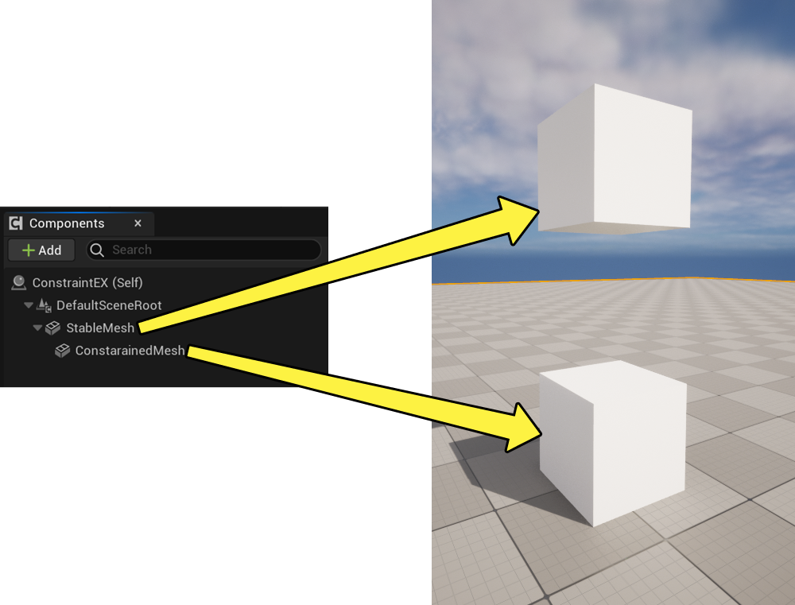
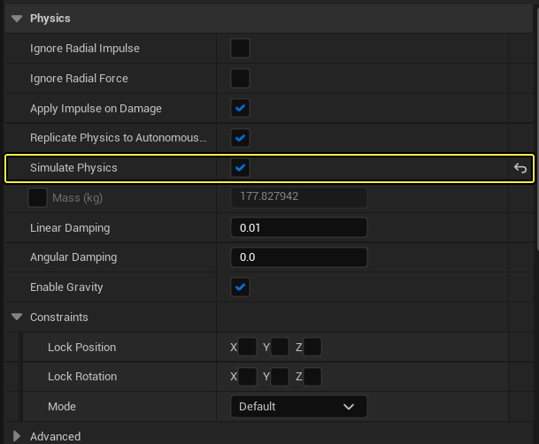
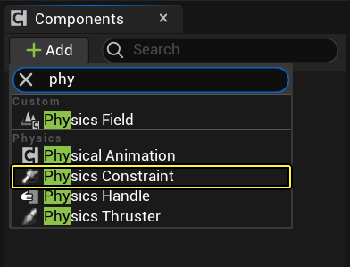
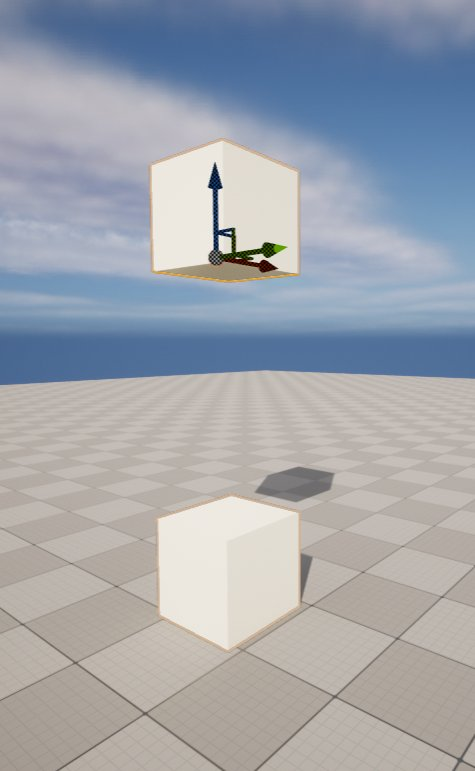
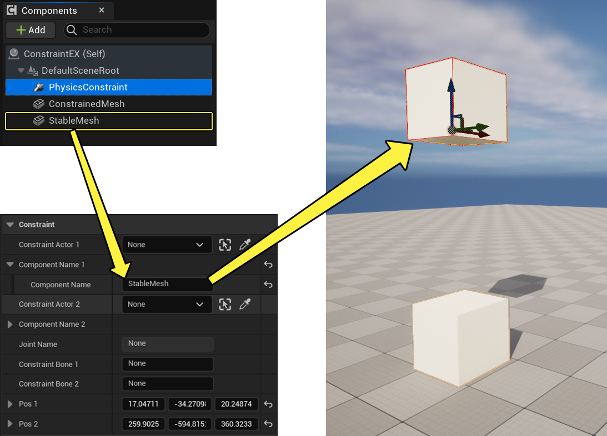
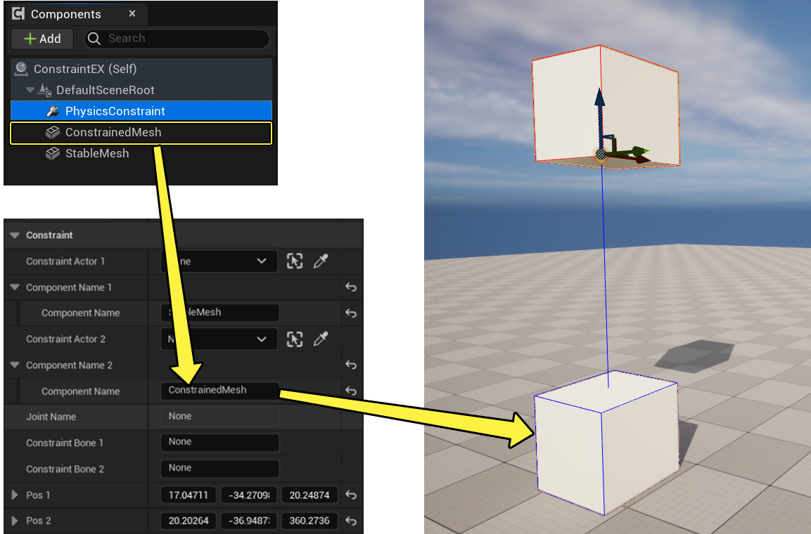
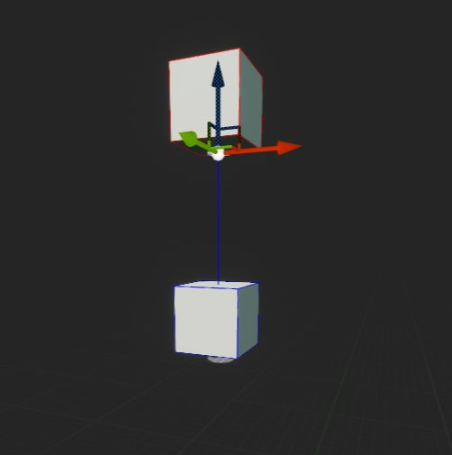

# 物理约束组件的用户指南

> 路径：虚幻引擎5.7文档 / Gameplay系统 / 物理 / 物理约束 / 物理约束组件的用户指南

> 原始页面：https://dev.epicgames.com/documentation/unreal-engine/physics-constraint-component-user-guide-in-unreal-engine

## 概述

物理约束组件（Physics Constraint Components）的使用方法和 **[物理约束 Actors](../constraints-user-guide/index.md)** 相同，不同之处是其在蓝图中使用，可在 C++ 中进行创建。物理约束组件结合了蓝图的灵活和 C++ 的强大，你可利用它对项目中的任意物理形体设置约束。

该文档讲述物理约束组件在蓝图中的基础创建。

> [!NOTE]
> 理解该文档的前提是用户对 **蓝图** 和 **蓝图编辑器** 已有所了解。

## 用法

1. 创建用于约束的组件。便于展示，此例中使用两个引用静态网格体 `Shape_Cube` 的 **StaticMesh** 组件。

   

   你需要放置需要进行约束的组件。该指南中使用的是图中的这两个方块。
2. 为两个静态网格体组件中较低的组件启用 **模拟物理（Simulate Physics）**

   
3. 点击 **添加组件（Add Component）**，找到 **物理约束（Physics Constraint）**。

   
4. 将物理约束组件放置在约束连接点上。

   
5. 你必须在物理约束组件的 **细节** 面板中，手动输入需要约束的静态网格体组件的名称。在 **Component Name 1** 的 **Component Name** 属性中输入需要约束的组件名。

   
6. 在 **Component Name 2** 的 **Component Name** 属性中输入需要约束的组件名。

   
7. 选择物理约束组件，将其位置移到StableMesh组件的底部。这将把锚点设置在立方体的底部。

   

   > [!NOTE]
   > 想了解物理约束组件上所有属性的影响吗？请查阅 **[%making-interactive-experiences/Physics/physics-constraints/ConstraintsReference:title%](../physics-constraint-reference/index.md)** 中的详细内容。
8. 如有必要，旋转物理约束组件，定义线和角的限度。

   
9. 将 **蓝图 Actor** 放置在关卡中的所需位置。

   > 图片已省略：Place the Blueprint Actor in a level and position it where you need it
10. 选择 **蓝图Actor**，进入 **细节** 面板。选择层级结构中的 **ConstrainedMesh** 组件，按照图片移动它。在这个示例中，**位置** 设置为 **X=-300**、**Z=100**。这将使约束网格在你按下**模拟**后摆动。

    > 图片已省略：Select Blueprint Actor and go to the Details panel
11. 使用 **Simulate in Editor** 或 **Play in Editor** 进行测试。
