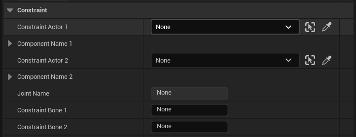
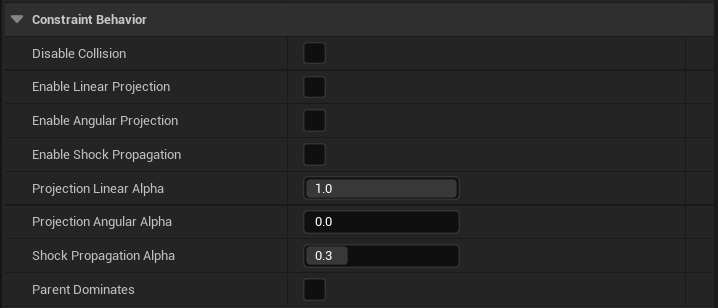
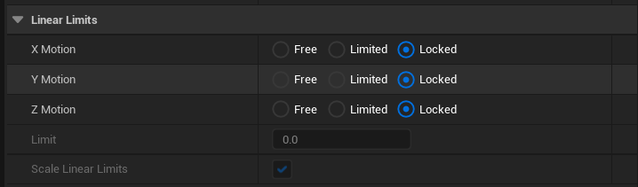
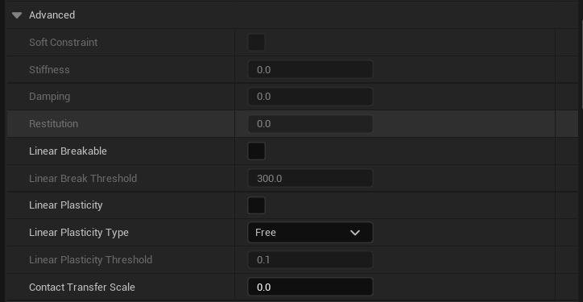
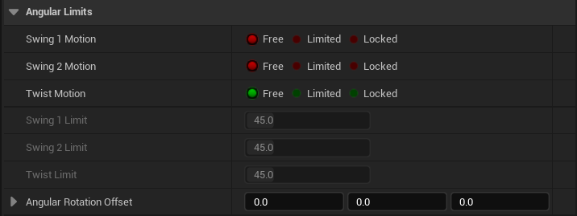
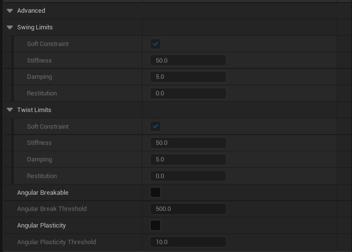
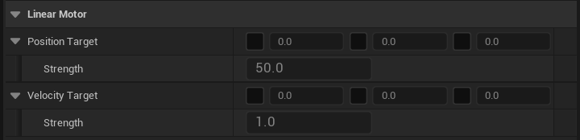

# 物理约束参考

> 路径：虚幻引擎5.7文档 / Gameplay系统 / 物理 / 物理约束 / 物理约束参考

> 原始页面：https://dev.epicgames.com/documentation/unreal-engine/physics-constraint-reference-in-unreal-engine

本参考页面列出了物理约束的属性列表，其按主要类别划分。

## 约束

| 属性 | 描述 |
| --- | --- |
| **Constraint Actor 1** | 将 **物理约束** 放入关卡编辑器后，必须指定要约束的 **Actor** 。这是2个 **Actor** 中的第一个。 |
| **Component Name 1** | 要约束的首个目标组件。使用 **Actor** 仅约束特定组件而不约束 **Actor** 根时，可指定该组件。 |
| **Constraint Actor 2** | 将 **物理约束** 放入关卡编辑器后，必须指定要约束的 **Actor** 。这是2个 **Actor** 中的第二个。 |
| **Component Name 2** | 要约束的第二个目标组件。使用 **Actor** 仅约束特定组件而非 **Actor** 根时，可指定该组件。 |
| **Joint Name** | 在 **物理资源工具** 中进行约束时，此为最初约束的骨骼命名。 |
| **Constraint Bone 1** | 在 **物理资源工具** 中进行约束时，此为要约束的首个关节命名。 |
| **Constraint Bone 2** | 在 **物理资源工具** 中进行约束时，此为要约束的第二个关节命名。 |

## 约束行为

| 属性 | 描述 |
| --- | --- |
| **禁用碰撞** | 此操作将禁用约束的组件间的碰撞。 |
| **启用线性投射（Enable Linear Projection）** | 线性投射是一种解算后的修正，子形体会使用半物理纠正平移来解决剩余的误差。使用时如果迭代数较少，会让链看起来比较僵硬。投射只有在链条没有与其它物体互动的时候才有效。 |
| **启用角投射（Enable Angular Projection）** | 角投射是一种解算后的修正，子形体会使用半物理纠正旋转来解决剩余的误差。使用时如果迭代数较少，会让链看起来比较僵硬。投射只有在链条没有与其它物体互动的时候才有效。 |
| **启用冲击传播（Enable Shock Propagation）** | 冲击传播会在位置和速度解算阶段的最后一个迭代增加父级形体的质量。这样可以让关节链变僵硬，但是可能会向链条中加入能量。可以将该选项用于世界限制和布娃娃物理。 |
| **线性投射Alpha（Projection Linear Alpha）** | 应用的线性投射的量，0意味着不投射，1意味着完全投射。 |
| **角投射Alpha（Projection Angular Alpha）** | 应用的角投射的量，0意味着不投射，1意味着完全投射。 |
| **冲击传播Alpha（Shock Propagation Alpha）** | 应用的冲击传播的量，0意味着不传播，1意味着完全传播。 |
| **父项主导** | 设置后，约束中的父形体将不会被子项的运动所影响。 |

## 线性限度

| 属性 | 描述 |
| --- | --- |
| **XMotion** | 表明沿X轴应用线性约束。 **自由（Free）**：沿该轴无约束。 **受限（Limited）**：沿该轴有受限自由。使用 **线性限度尺寸（Linear Limit Size）** 属性为所有轴定义此限制。 **锁定（Locked）**：沿该轴受完全约束。 |
| **YMotion** | 表明沿Y轴应用线性约束。 **自由（Free）**：沿该轴无约束。 **受限（Limited）**：沿该轴有受限自由。使用 **线性限度尺寸（Linear Limit Size）** 属性为所有轴定义此限制。 **锁定（Locked）**：沿该轴受完全约束。 |
| **ZMotion** | 表明沿Z轴应用线性约束。 **自由（Free）**：沿该轴无约束。 **受限（Limited）**：沿该轴有受限自由。使用 **线性限度尺寸（Linear Limit Size）** 属性为所有轴定义此限制。 **锁定（Locked）**：沿该轴受完全约束。 |
| **限度** | 两个关节参考帧之间所允许的距离。 |
| **缩放线性限度** | 若为true，线性限制缩放使用拥有组件的3D缩放绝对最小值。 |

### 高级

| 属性 | 描述 |
| --- | --- |
| **软约束** | 是否要使用软约束（弹簧）。 |
| **刚度** | 软约束的刚度。仅在软约束开启时使用。 |
| **阻尼** | 软约束的阻尼。 |
| **恢复** | 控制违反约束时反弹的量。 |
| **可打破性线性** | 是否可用线性力打破关节。 |
| **线性打破阈值** | 打破距离约束所需的力。 |
| **线性塑性（Linear Plasticity）** | 是否能够从线性变形重置弹簧静态长度。 |
| **线性塑性类型（Linear Plasticity Type）** | 线性塑性是否有运作模式。 |
| **线性塑性阈值（Linear Plasticity Threshold）** | 重置线性驱动位置目标所需要的从重心偏移的距离百分比阈值。该数值可以大于1。 |
| **接触转移大小（Contact Transfer Scale）** | 来自关节子级的父级撞击转移。最大范围为0.0。 |

## 角限度

| 属性 | 描述 |
| --- | --- |
| **Swing 1Motion** | 表明是否使用摇摆1限度。 **自由（Free）**：绕该轴无约束 **受限（Limited）**：绕该轴有受限自由。由相应命名的限制属性单独控制各个角运动的限度： **摇摆1Limit角度（Swing 1Limit Angle）** **摇摆2Limit角度（Swing 2Limit Angle）** **扭转限角（Twist Limit Angle）** **锁定（Locked）**：绕该轴受完全约束。 |
| **Swing 2Motion** | 表明是否使用Swing2限度。 **自由（Free）**：绕该轴无约束 **受限（Limited）**：绕该轴有受限自由。由相应命名的限制属性单独控制各个角运动的限度： **摇摆1Limit角度（Swing 1Limit Angle）** **摇摆2Limit角度（Swing 2Limit Angle）** **扭转限角（Twist Limit Angle）** **锁定（Locked）**：绕该轴受完全约束。 |
| **扭转运动** | 表明是否使用扭转限度。 **自由（Free）**：绕该轴无约束 **受限（Limited）**：绕该轴有受限自由。由相应命名的限制属性单独控制各个角运动的限度： **摇摆1Limit角度（Swing 1Limit Angle）** **摇摆2Limit角度（Swing 2Limit Angle）** **扭转限角（Twist Limit Angle）** **锁定（Locked）**：绕该轴受完全约束。 |
| **Swing1 1Limit Angle** | 沿 **XY** 平面移动的角度。 |
| **扭转限角** | 沿 **XZ** 平面移动的角度。 |
| **Swing 2Limit Angle** | 沿X轴的Roll对称角度。 |

### 高级

| 属性 | 描述 |
| --- | --- |
| **摇摆限度** |  |
| **软约束** | 是否要使用软约束（弹簧）。 |
| **刚度** | 软约束的刚度。仅在软约束开启时使用。 |
| **阻尼** | 软约束的阻尼。 |
| **恢复** | 控制违反约束时反弹的量。 |
| **扭转限度** |  |
| **软约束** | 是否要使用软约束（弹簧）。 |
| **刚度** | 软约束的刚度。仅在软约束开启时使用。 |
| **阻尼** | 软约束的阻尼。 |
| **恢复** | 控制违反约束时反弹的量。 |
| **可打破性角度** | 是否可用角力打破关节。 |
| **角度打破阈值** | 打破关节所需扭矩。 |
| **角塑性（Angular Placticity）** | 是否能够从角移动重置旋转。 |
| **角塑性阈值（Angular Placticity Threshold）** | 重置目标角度所需要的从目标角度偏移的度数阈值。 |

## 线型马达

| 属性 | 描述 |
| --- | --- |
| **位置目标** | 在一个或多个轴上启用位置线性马达，将本地位置设为理想位置。 |
| **强度** | 抵达理想位置所应用的力度。 |
| **速度目标** | 在一个或多个轴上启用速度线性马达，设置理想速度。 |
| **强度** | 抵达理想位置所应用的速度。 |

### 高级

| 属性 | 描述 |
| --- | --- |
| **最强力量** | 驱动的力量限度。 |

## 角马达

> 图片已省略：角马达属性

| 属性 | 描述 |
| --- | --- |
| **角驱动模式** | 该角马达是否使用SLERP（球面线性插值），或分解成为摇摆马达和扭转马达（椎体与roll约束）。锁定角约束后SLERP无法正常工作。 **SLERP**：将马达设为SLERP（球面线性插值）模式。所将角约束的轴锁定，SLERP模式无法正常工作。 **扭转与摇摆**：将马达设为 **扭转与摇摆** （椎体和roll约束）模式。 |
| **目标朝向** | 相对于形体参考帧的目标prosemtatopm。 |
| **驱动** | 基于角驱动模式设置，可启动或禁用该模式的不同马达。 |
| **强度** | 抵达目标朝向所应用的力度。 |
| **目标速度** | 相对于形体参考帧的目标角速度。 |
| **驱动** | 基于角驱动模式设置，可启动或禁用该模式的不同马达。 |
| **强度** | 抵达目标速度所应用的力度。 |

### 高级

> 图片已省略：高级限制马达物理

| 属性 | 描述 |
| --- | --- |
| **最大力** | 驱动力的限制。 |
