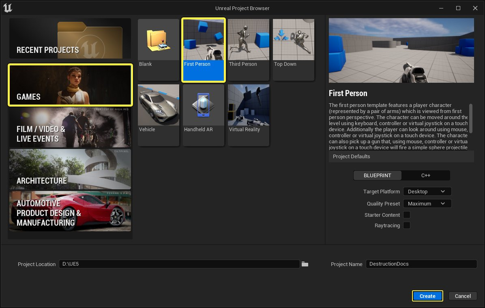
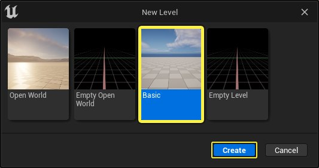
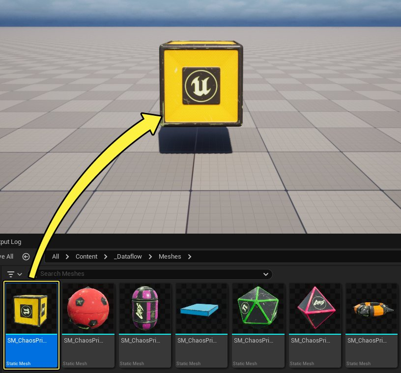
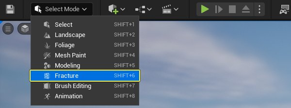
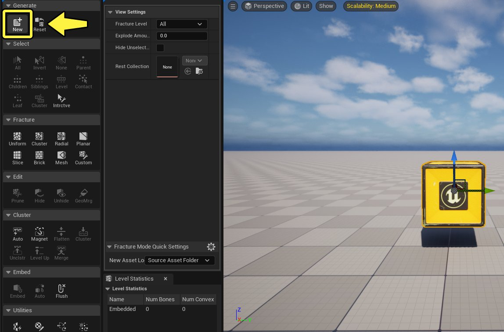
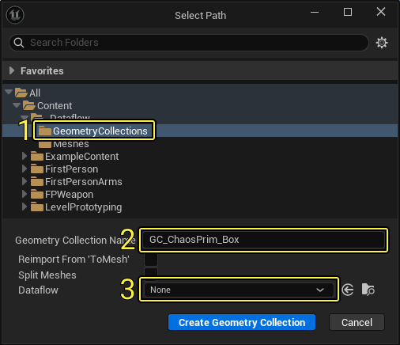
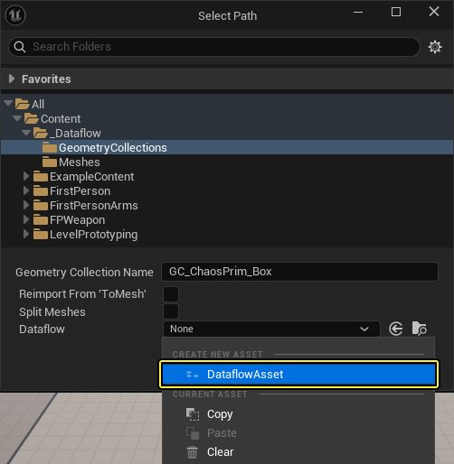
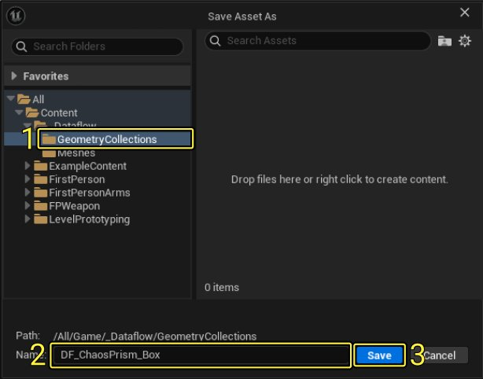

# 破坏系统数据流快速入门

> 路径：虚幻引擎5.7文档 / Gameplay系统 / 物理 / 物理工具 / 数据流图表 / 破坏系统数据流快速入门

> 原始页面：https://dev.epicgames.com/documentation/unreal-engine/dataflow-for-destruction-quickstart

本篇快速入门指南将指导你如何使用虚幻引擎的[数据流图表系统](../dataflow-overview/index.md)破坏静态网格体并将其销毁，而不是使用编辑器破裂（Fracture）模式的传统工作流程。

阅读本指南前，请先阅读[破坏系统快速入门](../../../chaos-destruction/destruction-quick-start/index.md)文档，了解如何用传统的工作流程破坏静态网格体。本指南遵循的步骤与之相同，但使用的是数据流，而非破裂模式。

## 1 - 必要设置

1. 新建项目并选择 **游戏（Games）** 类别和 **第一人称（First Person）** 模板。输入你的项目名称，点击 **创建（Create）** 。

   

   点击查看大图。
2. 在编辑器中，点击 **文件（File）> 新关卡（New Level）** 。选择 **基础（Basic）** 模板并点击 **创建（Create）** 。保存关卡。

   

### 阶段成果

在此分段中，你创建了新项目，并进行了设置，因此你可以添加一个静态网格体，并可按照本指南的下一分段使其破裂。

## 2 - 创建几何体集合

在本分段中，你将利用静态网格体Actor创建几何体集合。

1. 将静态网格体添加到关卡中，以用于创建破裂的网格体。在此示例中，我将使用Fab中提供的[内容示例](https://www.fab.com/listings/0281d63e-71f7-4e07-a344-5fa721ac4d35)项目中包含的 **Chaos图元盒体** 。

   

   点击查看大图。
2. 点击 **模式（Mode）** 下拉菜单，然后选择 **破裂（Fracture）** 。

   
3. 转至 **生成（Generate）** 分段并点击 **新建（New）** ，创建新的 **几何体集合（Geometry Collection）** 。

   

   点击查看大图。
4. 此时将打开

   选择路径（Select Path）

   窗口。

   - (1) 选择用于保存几何体集合的

     目录位置

     。
   - (2) 输入资产的

     名称

     。
   - (3) 点击

     数据流（Dataflow）

     下拉菜单。

   
5. 点击 **创建新资产（Create New Asset）** 下的 **DataFlowAsset** 。

   

   - (1) 选择用于保存资产的目录位置。
   - (2) 输入资产名称。
   - (3) 点击保存（Save）。

   
6. 点击 **创建几何体集合（Create Geometry Collection）** 以创建 **几何体集合（Geometry Collection）** 和一个 **数据流（Dataflow）** 资产。

   > 图片已省略：点击创建几何体集合

   > 图片已省略：创建了几何体集合和数据流资产
7. 点击

   选择模式（Selection Mode）> 选择（Selection）

   返回编辑器的

   选择（Selection）

   模式。 *在

   内容浏览器（Content Browser）

   中双击打开

   几何体集合（Geometry Collection）

   。

   - 几何体集合（Geometry Collection）

     窗口将显示

     数据流图表（Dataflow Graph）

     面板，你可以在其中输入数据流节点，使几何体集合破裂。

   > 图片已省略：点击选择模式 - 选择

   > 图片已省略：undefined

   点击查看大图。

### 阶段成果

在本分段中，你学习了如何利用与集合相关联的数据流资产创建几何体集合。

在下一分段中，你将学习如何通过创建数据流节点图表使几何体集合破裂。

## 3 - 使几何体集合破裂

1. 右键点击

   数据流（Dataflow）

   图表，搜索并选择

   Static Mesh To Collection

   。

   - 选择节点后，转到

     资产细节（Asset Details）

     面板并向下滚动到

     资产（Asset）

     分段。
   - 点击

     静态网格体（Static Mesh）

     下拉菜单，并选择要转化为几何体集合的静态网格体。

   > 图片已省略：右键点击数据流图表，搜索并选择Static Mesh To Collection。选择静态网格体资产
2. 从 **Static Mesh to Collection** 节点拖出 **集合（Collection）** 引脚，然后搜索并选择 **Bounding Box** 。

   > 图片已省略：添加Bounding Box节点
3. 从

   Bounding Box

   节点拖出

   边界盒体（Bounding Box）

   引脚，然后搜索并选择

   Uniform Scatter Points

   。

   - 转到

     散布（Scatter）

     分段并为

     最小（Min）

     和

     最大点数（Max Number of Points）

     输入

     10

     。

   > 图片已省略：添加Uniform Scatter Points节点
4. 从

   Static Mesh to Collection

   节点拖出

   集合（Collection）

   引脚，然后搜索并选择

   Voronoi Fracture

   。

   - 将

     Uniform Scatter Points

     节点的

     点（Points）

     引脚连接到

     Voronoi Fracture

     节点的

     点（Points）

     引脚。

   > 图片已省略：搜索并选择Voronoi Fracture
5. 从

   Bounding Box

   节点拖出

   边界盒体（Bounding Box）

   引脚，然后搜索并选择

   Uniform Scatter Points

   。

   - 转到

     散布（Scatter）

     分段并为

     最小（Min）

     和

     最大点数（Max Number of Points）

     输入

     25

     。
   - 输入一个

     随机种子（Random Seed）

     数字。

   > 图片已省略：添加Uniform Scatter Points节点
6. 从

   Voronoi Fracture

   节点拖出

   集合（Collection）

   引脚，然后搜索并选择

   Voronoi Fracture

   。

   - 将

     Uniform Scatter Point

     节点的

     点（Points）

     引脚连接到

     Voronoi Fracture

     节点的

     点（Points）

     引脚。

   > 图片已省略：搜索并选择Voronoi Fracture
7. 从 **Voronoi Fracture** 节点拖出 **集合（Collection）** 引脚，然后搜索并选择 **Auto Cluster** 。 将 **Voronoi Fracture** 节点的 **变换选择（Transform Selection）** 引脚连接到 **Auto Cluster** 节点的 **变换选择（Transform Selection）** 引脚。

   > 图片已省略：添加Auto Cluster节点
8. 从

   Auto Cluster

   节点拖出

   集合（Collection）

   引脚，然后搜索并选择

   Geometry Collection Terminal

   。

   - 将

     Static Mesh

     节点的

     材质实例（Material Instance）

     引脚和

     实例化网格体（Instanced Meshes）

     引脚连接至

     Geometry Collection Terminal

     节点的

     材质实例（Material Instances）

     引脚和

     实例化网格体（Instanced Meshes）

     引脚。

   > 图片已省略：添加Geometry Collection Terminal节点

   > 图片已省略：undefined

   点击查看大图。
9. 转到

   伤害（Damage）

   分段并展开

   伤害阈值（Damage Threshold）

   数组。

   - 将

     5000

     、

     500

     和

     50

     输入到

     伤害量（Damage Amounts）

     。

   > 图片已省略：将5000、500和50输入到伤害量
10. 从

    Content Browser

    拖出

    几何体集合（Geometry Collection）

    到关卡中，并将其移动到地面之上。

    - 点击

      播放模式（Play Mode）

      选项按钮，并选择

      模拟（Simulate）

      或

      所选视口（Selected Viewport）

      查看结果。

    > 图片已省略：点击模拟
11. 下方为几何体集合触地时的破裂效果展示。

    > 动图已省略：几何体集合触地时破裂

### 阶段成果

在此分段中，你学习了如何通过创建数据流节点图表使几何体集合破裂。

在下一分段中，你将学习如何射击几何体集合来销毁它。

## 4 - 射击以销毁几何体集合

在本分段中，你将使用模板随附的 **第一人称步枪（First Person Rifle）** 蓝图，射击并销毁你创建的几何体集合。

你将修改发射物蓝图，以对几何体集合施加外部张力并触发破裂。

1. 在 **内容浏览器（Content Browser）** 中，转至 **第一人称（FirstPerson）> 蓝图（Blueprints）** 并将 **BP_Pickup_Rifle** 拖入关卡。在游戏过程中，你可以拾取步枪并使用鼠标左键射击。

   > 图片已省略：将BP_Pickup_Rifle拖入关卡
2. 在同一个文件夹中，双击打开 **BP_FirstPersonProjectile** 。在 **事件图表（Event Graph）** 中，选择除Event Hit外的所有节点并将它们 **删除** 。

   > 图片已省略：打开BP_FirstPersonProjectile蓝图并删除Event Hit外的所有节点
3. 从 **Event Hit** 节点拖出 **其他组件（Other Comp）** 引脚，然后搜索并选择 **Cast to Geometry Collection Component** 。

   > 图片已省略：添加Cast to Geometry Collection Component节点
4. 从 **Geometry Collection Component** 节点拖出 **作为几何体集合机组件（As Geometry Collection Component）** 引脚，然后搜索并选择 **Apply External Strain** 。

   > 图片已省略：添加Apply External Strain节点
5. 从

   Event Hit

   节点拖出

   Hit

   引脚，然后搜索并选择

   Break Hit

   。

   - 将

     Break Hit Result

     节点的

     位置（Location）

     引脚和

     命中项目（Hit Item）

     引脚连接至

     Apply External Strain

     节点的

     位置（Location）

     引脚和

     项目索引（Item Index）

     引脚。
   - 将

     半径（Radius）

     设为

     100

     ，将

     传播深度（Propagation Depth）

     和

     传播系数（Propagation Factor）

     设为

     1

     ，并将

     张力（Strain）

     设为

     50000

     。

   > 图片已省略：拆分命中结果并将位置和命中项目连接到Apply External Strain节点
6. 从

   Apply External Strain

   节点拖出，然后搜索并选择

   Apply Linear Velocity

   。

   - 将

     Break Hit Result

     节点的

     命中项目（Hit Item）

     引脚连接至

     Apply Linear Velocity

     节点的

     项目索引（Item Index）

     引脚。

   > 图片已省略：添加Apply Linear Velocity节点
7. 右键点击

   事件图表（Event Graph）

   然后搜索并选择

   Get Actor Forward Vector

   。

   - 从

     Get Actor Forward Vector

     节点拖出

     返回值（Return Value）

     引脚，然后搜索并选择

     Multiply

     。
   - 将

     Multiply

     节点连接到

     Apply Linear Velocity

     节点的

     线性速度（Linear Velocity）

     引脚。

   > 图片已省略：添加Get Actor Forward Vector节点和Multiply节点
8. 创建 **浮点（Float）** 变量，然后将其命名为 **Linear Velocity** 。将它的 **默认值** 设置为 **500** 。

   > 图片已省略：创建浮点变量，命名为Linear Velocity并设值为500
9. 将

   Linear Velocity

   变量连接到

   Multiply

   节点。

   - 编译（Compile）

     并

     保存（Save）

     。

   > 图片已省略：undefined

   点击查看大图。
10. 按下 **播放（Play）** 按钮，移动至步枪旁以拾取它。使用鼠标左键朝几何体集合中射击发射物并销毁它

    > 动图已省略：发射物在命中几何体集合时施加外部张力，并使其破裂

### 阶段成果

在本分段中，你学习了如何在发射物命中几何体集合时向其施加外部张力。

## 5 - 修改数据流图表

### 使另一个静态几何体破裂

你可以快速变更数据流使用的静态几何体，以查看其他网格体以相同方式破碎时的效果。

选择 **Static Mesh to Collection** 节点并更改 **资产（Asset）** 分段的 **静态网格体（Static Mesh）** 。

### 更改点模式

你可以将"Uniform Scatter Points"节点替换为其他模式，从而更改破裂节点使用的散布点模式。

### 更改破裂模式

你还可以替换数据流图表中使用的破裂节点，从而尝试不同的破裂模式。

### 阶段成果

在此分段中，你学习了如何通过更改数据流图表中的静态网格体、点模式或破裂模式来快速修改破裂的几何体集合。

## 5 - 自行尝试！

你已经学会了如何使用数据流生成和销毁几何体集合，请尝试使用不同的节点和参数，看看结果会如何变化。
