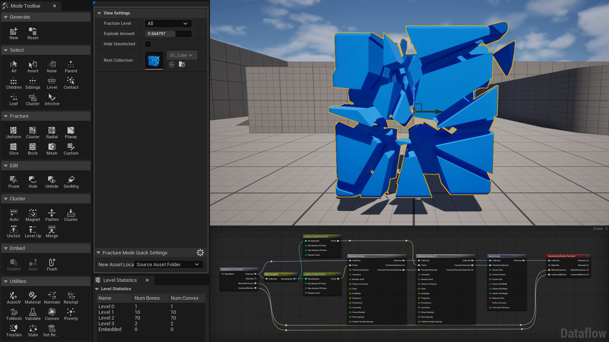

# 数据流概览

> 路径：虚幻引擎5.7文档 / Gameplay系统 / 物理 / 物理工具 / 数据流图表 / 数据流概览

> 原始页面：https://dev.epicgames.com/documentation/unreal-engine/dataflow-overview

## 介绍

**数据流图表（Dataflow Graph）** 系统是虚幻引擎编辑器内的一套 **基于节点的程序化资产生成环境** 。

数据流作为资产被存放在 **内容浏览器** 中，包含一个节点图表，该节点图表被求值后会生成特定的资产。

数据流以 **基于依赖性的节点图表** 的形式实现，更改节点会触发其下游从属项的重新求值。图表中的节点都能够接收一个或多个输入、处理数据并产出一个或多个输出，然后将其传递给下一个从属节点。

## 系统优势

创建数据流是为了在引擎中创建某些资产类型时 **优化迭代时间** 而生的。同一数据流图表可 **被多个资产使用** ，而且图表本身可根据源资产提供的输入而产出不同的结果。

数据流是一套 **通用系统** ，可适配各种物理资产类型，如 **Chaos布料** 、 **Chaos血肉** 和 **几何集合破裂** 等。

数据流也 **被设计为可由C++开发者扩展** 。开发者可以根据具体需求进一步调整系统。

## 虚幻引擎中数据流和传统工作流程

数据流图表系统与传统工作流程的差异如下：

**传统工作流程** ：

- 通常为破坏性的工作流程

  ：在创建资产时，一旦更改便永久生效，无法轻易撤消。这会增加迭代时间并限制可探索性。
- 手动的工作流程

  ：开发者必须手动进行同样的流程来生产同一类型的不同资产。

**数据流工作流程** ：

- 程序化、非破坏性的工作流程

  ：数据流节点可以在图表内进行修改，并立即反映结果。如果需要，你可以撤回或跳过图表中的所有步骤。
- 自动化的工作流程

  ：开发者可以自动化工作流程来自动处理数以千计的资产。
- 模块化的工作流程

  ：可将相同的数据流图表用于多个资产，各资产提供不同的输入并生成不同的结果。
- 灵活的工作流程

  ：开发者可以轻松连接和断开不同的节点以应用不同的效果，并立即看到结果。

## 可扩展且经过实战检验

数据流图表系统在设计之初就 **考虑了可扩展性** 。开发者可以 **使用C++创建自定义数据流节点** 来扩展系统。数据流还可完全自动化创建特定类型的资产，例如布料模拟和几何体集合破裂。

数据流为《Lego Fortnite》而设计，并在其中接受了考验。系统已在生产环境中进行了测试，并将在虚幻引擎的未来版本中继续得到优化。
