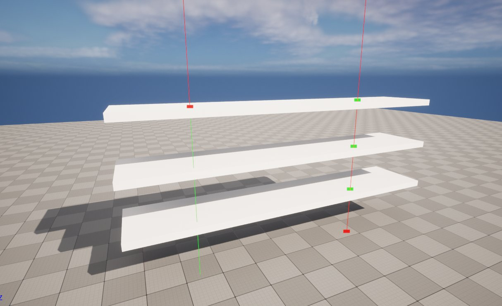
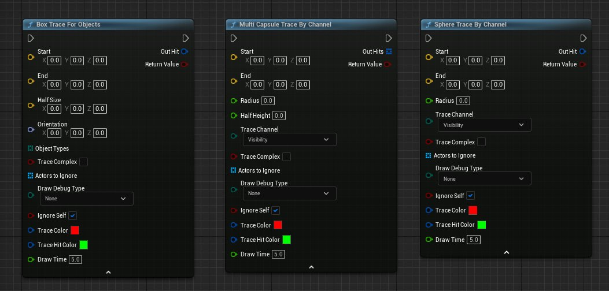
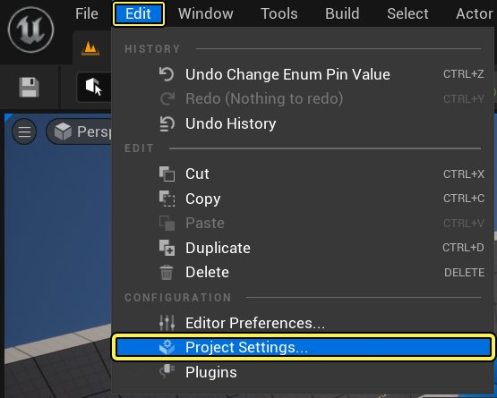
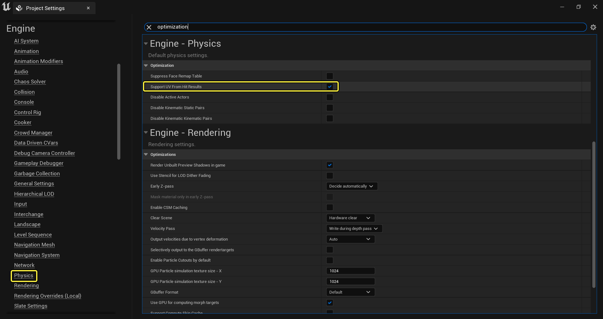

# 追踪概述

> 路径：虚幻引擎5.7文档 / Gameplay系统 / 物理 / 使用射线进行命中判定 / 追踪概述

> 原始页面：https://dev.epicgames.com/documentation/unreal-engine/traces-in-unreal-engine---overview

**追踪** 提供了一种在关卡中获取有关线段上存在内容的反馈的方法。使用方法是提供两个端点（一个开始位置和一个结束位置），物理系统将"追踪"两个点之间的线段，报告它命中的任何Actor（带碰撞）。本质上，追踪和其他软件包中的 **光线投射** 或 **光线追踪** 相同。

无论你是需要知晓一个 **Actor** 是否能"看见"另一个Actor，确定特定多边形的法线，模拟高速武器，还是需要知晓 **Actor** 是否已进入一个空间，都可以使用追踪这种可靠而计算开销低的解决方案。本文档介绍虚幻引擎5（UE5）中追踪的基本功能集。

## 按信道或对象类型追踪

因为追踪使用物理系统，你可以定义需要进行追踪的对象类别。可在两个大类中进行选择：信道和对象类型。信道用于可视性和摄像机等事物，且几乎只和追踪相关。对象类型是场景中带碰撞的Actor物理类型，如Pawn、载具、可破坏物Actor等等。

可根据需要添加更多信道和对象类型。有关具体操作的更多信息，请参阅 [为项目添加自定义物体类型](../../collision/collision-tutorials/add-a-custom-object-type-to-your-project/index.md)。

## 返回单个或多个命中

追踪时，你可以选择返回与条件匹配且被追踪命中的第一个项，也可返回与条件匹配且被追踪命中的所有项。

需要特别注意 **按信道多重追踪（Multi Trace by Channel）** 和 **按对象多重追踪（Multi Trace For Objects）** 的区别。使用 **按信道多重追踪（Muli Trace by Channel）** 时，追踪将返回包含第一个 **阻挡（Block）** 在内的所有 **重叠（Overlaps）**。想象射击的子弹穿过高高的草丛，然后击中墙壁。

**按对象多重追踪（Multi Trace For Objects）** 将返回与追踪查找的对象类型匹配的所有对象，假定组件设置为返回追踪查询。因此它很适合于计算追踪开始和结束之间的对象数量。

### 命中结果（Hit Result）

追踪命中某个对象时，它将返回 **命中结果（Hit Result）** 结构体。此结构体在蓝图和C++中都可用，其结构如下：

| 列 1 | 列 2 | 列 3 |
| --- | --- | --- |
| Hit Result Struct Blueprint | **成员** **定义** **阻挡命中（Blocking Hit）** 命中是否为阻挡命中。使用 **按信道多重追踪（Multi Tracing by Channel）** 时使用该成员，因为它具有使追踪重叠但不停止追踪的能力。 **首次重叠（Initial Overlap）** 此重叠是否为一系列结果中的首次重叠。 **时间（Time）** 这是沿追踪方向的命中"时间"，范围介于[0.0到1.0]之间。如未命中，将返回1.0。 **距离（Distance）** 从TraceStart到世界空间中Location的距离。如果初始存在重叠，这个值就是0。 **位置（Location）** 基于追踪形状进行修改的命中的全局空间位置。 **命中点（Impact Point）** 命中的绝对位置。不包含追踪的形状，只包含命中的点。 **法线（Normal）** 追踪的方向。 **命中法线（Impact Normal）** 命中表面的法线。 **物理材质（Phys Mat）** 命中表面的 **物理材质**。 **命中Actor（Hit Actor）** 命中 **Actor**。 **命中组件（Hit Component）** 命中的特定 **组件**。 **命中的骨骼名称（Hit Bone Name）** 如果追踪 **骨架网格体**，此为命中的骨骼的名称。 **骨骼名称（Bone Name）** 命中的骨骼的名称。仅当命中骨骼网格体时有效。 **命中项（Hit Item）** 特定于Primitive的数据，记录Primitive中的哪个项被命中。 **元素索引（Element Index）** 如果与某个拥有多个部件的图元碰撞，被击中的部件的索引。 **表面索引（Face Index）** 如果与三角网格图或地形碰撞，此为命中的表面的索引。 **追踪起始（Trace Start）** 此为追踪的起始位置。 **追踪结束（Trace End）** 此为追踪的结束位置。 |  |
| **成员** |  | **定义** |
| **阻挡命中（Blocking Hit）** |  | 命中是否为阻挡命中。使用 **按信道多重追踪（Multi Tracing by Channel）** 时使用该成员，因为它具有使追踪重叠但不停止追踪的能力。 |
| **首次重叠（Initial Overlap）** |  | 此重叠是否为一系列结果中的首次重叠。 |
| **时间（Time）** |  | 这是沿追踪方向的命中"时间"，范围介于[0.0到1.0]之间。如未命中，将返回1.0。 |
| **距离（Distance）** |  | 从TraceStart到世界空间中Location的距离。如果初始存在重叠，这个值就是0。 |
| **位置（Location）** |  | 基于追踪形状进行修改的命中的全局空间位置。 |
| **命中点（Impact Point）** |  | 命中的绝对位置。不包含追踪的形状，只包含命中的点。 |
| **法线（Normal）** |  | 追踪的方向。 |
| **命中法线（Impact Normal）** |  | 命中表面的法线。 |
| **物理材质（Phys Mat）** |  | 命中表面的 **物理材质**。 |
| **命中Actor（Hit Actor）** |  | 命中 **Actor**。 |
| **命中组件（Hit Component）** |  | 命中的特定 **组件**。 |
| **命中的骨骼名称（Hit Bone Name）** |  | 如果追踪 **骨架网格体**，此为命中的骨骼的名称。 |
| **骨骼名称（Bone Name）** |  | 命中的骨骼的名称。仅当命中骨骼网格体时有效。 |
| **命中项（Hit Item）** |  | 特定于Primitive的数据，记录Primitive中的哪个项被命中。 |
| **元素索引（Element Index）** |  | 如果与某个拥有多个部件的图元碰撞，被击中的部件的索引。 |
| **表面索引（Face Index）** |  | 如果与三角网格图或地形碰撞，此为命中的表面的索引。 |
| **追踪起始（Trace Start）** |  | 此为追踪的起始位置。 |
| **追踪结束（Trace End）** |  | 此为追踪的结束位置。 |

## 使用形状追踪

当线迹追踪无法满足需求时，你可以使用形状追踪来获取想要的结果。例如，你为敌方创建了"视锥"，而且你希望检测进入视锥的玩家。线迹追踪可能无法满足需求，因为玩家可以通过躲在线迹追踪的下面来躲避检测。

在这种情况下，你可以使用盒体追踪、胶囊体追踪或球体追踪。

形状追踪的工作原理与线迹追踪相似，你以起始点和结束点为范围搜索并检查碰撞，但是形状追踪具有附加的检查层，因为你在光线投射中将形状用作体积（各种各样）。你可以将形状追踪用作单次追踪或多次追踪，每种追踪的设置方式都与线迹追踪相同，但是你需要提供与你使用的形状的大小（或方向）相关的额外细节。

## 从追踪获取UV坐标

如果使用Trace Complex，追踪可以返回它命中的Actor的UV坐标。从4.14版起，此功能仅在 **静态网格体组件**、**程序式网格体组件** 和 **BSP** 上有效。它 **无法** 在 **骨架网格体组件** 上正常工作，因为你追踪的是 **物理资源**，而物理资源不具备UV坐标（即使你选择Trace Complex）。

> [!NOTE]
> 使用此功能将增大CPU内存使用率，因为虚幻引擎需要在主内存中保留顶点位置和UV坐标的额外副本。

### 启用来自追踪的UV坐标

要启用此功能，请按照下列步骤操作：

1. 从 **"编辑（Edit）"菜单** 中访问 **项目设置（Project Settings）**。

   
2. 在 **项目设置（Project Settings）** 的 **"物理（Physics）"部分** 中启用 **支持来自命中结果的UV（Support UV From Hit Results）** 功能。

   
3. 重启编辑器。

   > [!NOTE]
   > 重启编辑器之前可以使用此功能查看蓝图 **查找碰撞UV（Find Collision UV）** 节点，但是当你查看时，此节点仅返回 [0.0, 0.0]。 要让此节点返回正确的UV数据，你必须重启编辑器。

## 其他功能

追踪还拥有一些小功能，可用于限制其返回的内容，这简化了调试它们的过程。它们能够追踪 **复杂碰撞（Complex Collision）**（如果静态网格体或程序式网格体启用了它）。如果从 **Actor** 调用它们，可以通过让 **Actor** 追踪自身来告知它们忽略所有连接的组件。最后，它们拥有以红色或绿色线条代表追踪的选项，较大的框则代表命中。
