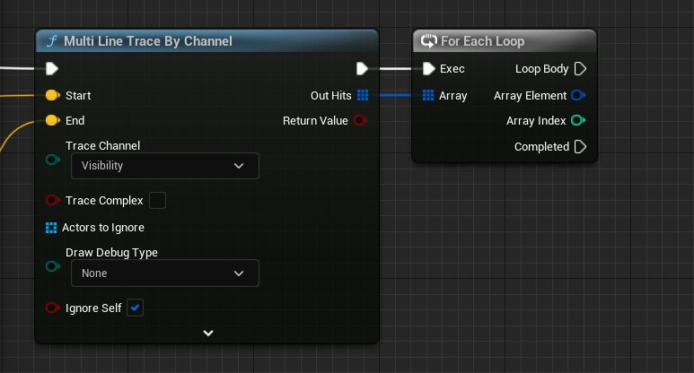
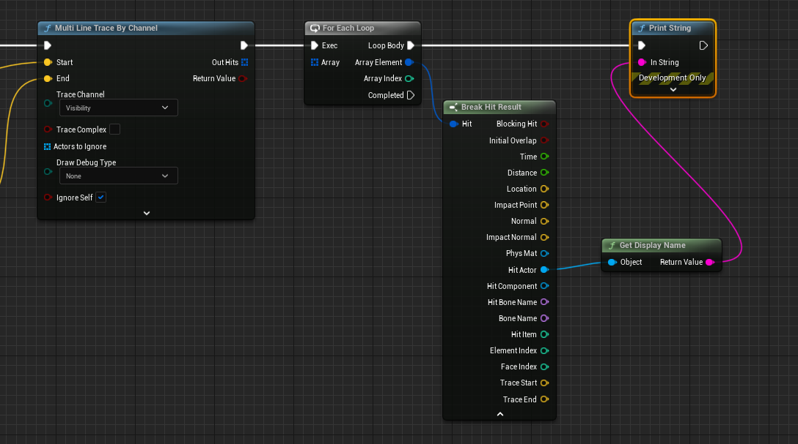
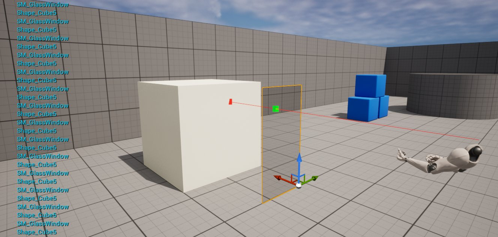

# 使用 Multi Line Trace (Raycast) by Channel

> 路径：虚幻引擎5.7文档 / Gameplay系统 / 物理 / 使用射线进行命中判定 / 追踪指南 / 使用 Multi Line Trace (Raycast) by Channel

> 原始页面：https://dev.epicgames.com/documentation/unreal-engine/using-a-multi-line-trace-raycast-by-channel-in-unreal-engine

**Multi Line Trace By Channel** 将沿给定线条执行碰撞追踪，并返回所有遭遇的命中，直到并包含首次阻挡命中，只返回对特定追踪通道响应的对象。这就意味着追踪的开始和结束之间有多个带碰撞的 **Actor** 或 **组件** 与特定的追踪通道发生 **重叠**，而您将接收到所有的 Actor 和组件。但是，如果首次命中 **阻挡** 了特定的追踪通道，则只会接收到这一个内容。如希望无视追踪通道的重叠或阻挡接受所有内容，则需要使用 [Multi Line Trace By Object](../using-a-multi-line-trace-raycast-by-object/index.md)节点。以下是设置 **Multi Line Trace By Channel** 的步骤。

### 步骤

1. 按照用于[Line Trace By Channel](../using-a-single-line-trace-raycast-by-channel/index.md) 范例的步骤设置追踪。
2. 用 **Multi Line Trace By Channel** 节点替代 **Line Trace By Channel** 节点。
3. 从 **Out Hits** 引脚连出引线并添加一个 **ForEachLoop** 节点。

   

   因为命中了多个 Actor，我们将对每个 Actor 进行一些操作（此例中是将 Actor 显示到屏幕上）。
4. 从 **Array Element** 连出引线并添加一个 **Break Hit Result**；然后从 **Hit Actor** 连出引线，添加一个 **Get Display Name (Object)** 并连接到 **Print String**。

   

   Click image for a full view.

   > [!NOTE]
   > 每个被阵列命中的 Actor 将被输出到字符串。

## 结果

此处的物理 Actor 前有一扇玻璃窗。

玻璃窗是 **可破坏网格体**，我们已对它的 **Trace Response** 进行设置， 碰撞设置中的 **Visibility** 设为 **Overlap**；而物理 Actor（立方体）的 **Visibility** 则设为 **Block**。这样的设置可用于射穿物体（将其摧毁）并击中敌人的情形。
