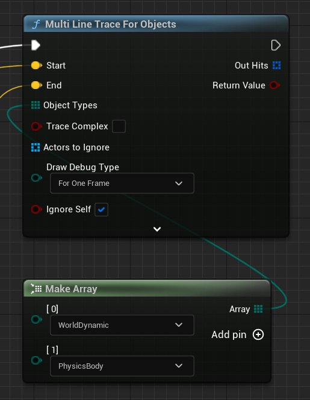
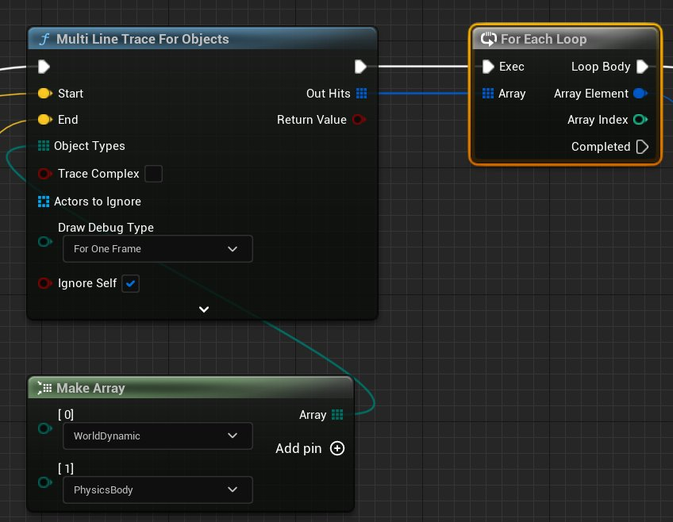
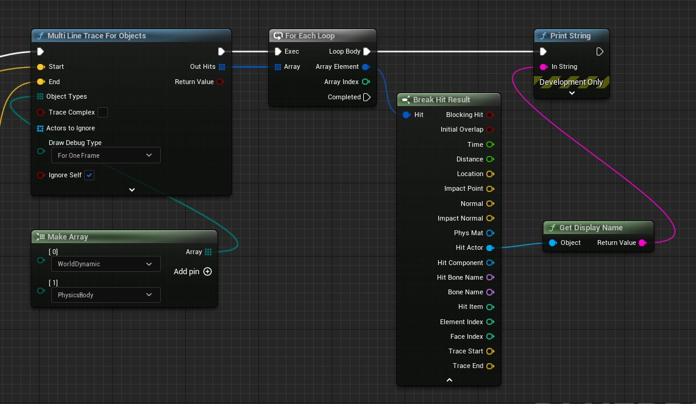
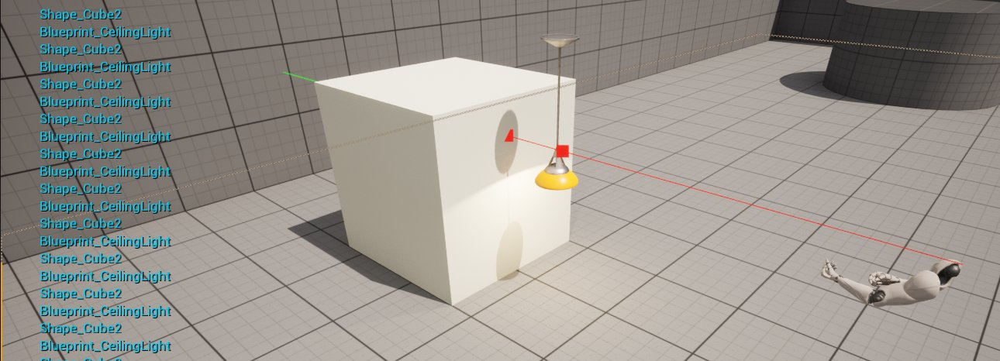

# 使用 Multi Line Trace (Raycast) by Object

> 路径：虚幻引擎5.7文档 / Gameplay系统 / 物理 / 使用射线进行命中判定 / 追踪指南 / 使用 Multi Line Trace (Raycast) by Object

> 原始页面：https://dev.epicgames.com/documentation/unreal-engine/using-a-multi-line-trace-raycast-by-object-in-unreal-engine

**MultiLineTraceForObjects** 将沿给定的线执行碰撞追踪并返回所有遭遇的命中，只返回与特定物体类型相匹配的物体。以下是设置 **MultiLineTraceForObjects** 的步骤。

## 步骤

1. 按照用于 [LineTraceByChannel](../using-a-single-line-trace-raycast-by-channel/index.md) 范例的步骤设置追踪。
2. 用 **MultiLineTraceForObjects** 节点替代 **LineTraceByChannel** 节点。
3. 从 **Object Types** 引脚连出引线并添加一个 **Make Array** 节点，然后使用下拉菜单将物体添加到阵列。

   

   我们在此将 **WorldDynamic** 和 **PhysicsBody** 指定为物体类型。可使用 **Add pin** 按钮添加更多物体类型到阵列。
4. 从追踪节点的 **Out Hits** 引脚连出引线并添加一个 **ForEachLoop** 节点。

   

   这使我们能够对追踪命中的每个 Actor 执行操作。
5. 从 **Array Element** 连出引线并添加一个 **Break Hit Result**。然后从 **Hit Actor** 连出引线，添加一个 **To String (Object)** 并连接到 **Print String**。

   

   点击查看大图。

   > [!NOTE]
   > 每个被阵列命中的 Actor 将被输出到屏幕。

## 结果

此处，物理 Actor（物体类型为物理形体）前方有一个悬挂的吊灯（物体类型为世界动态）。

**Multi Line Trace by Object** 与 **Multi Line Trace by Channel** 不同，不会在其命中的首个物体上停止，因此追踪将穿过吊灯到达立方体。
