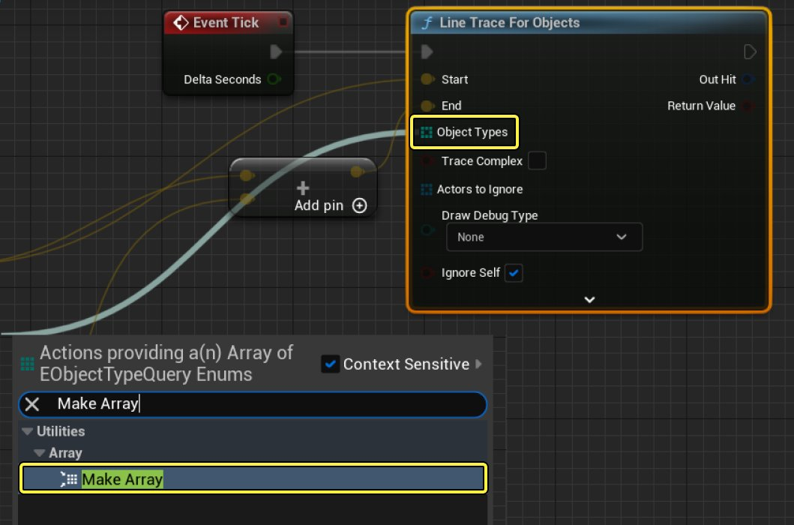
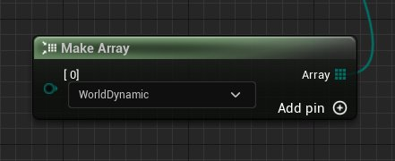
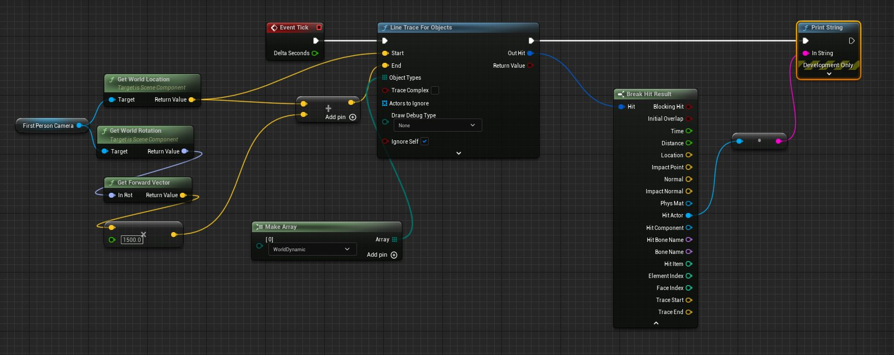
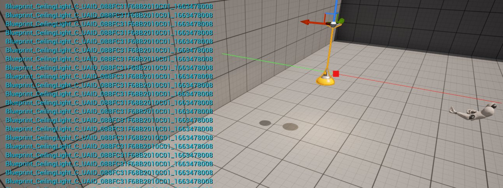

# 使用 Single Line Trace (Raycast) by Object

> 路径：虚幻引擎5.7文档 / Gameplay系统 / 物理 / 使用射线进行命中判定 / 追踪指南 / 使用 Single Line Trace (Raycast) by Object

> 原始页面：https://dev.epicgames.com/documentation/unreal-engine/using-a-single-line-trace-raycast-by-object-in-unreal-engine

**LineTraceForObjects** 将沿给定的线执行碰撞追踪并返回追踪命中的首个物体（须与特定物体类型匹配）。执行以下步骤设置 **LineTraceForObjects** 追踪：

## 步骤

1. 按照用于 [LineTraceByChannel](../using-a-single-line-trace-raycast-by-channel/index.md) 范例的步骤设置追踪。
2. 用 **Line Trace For Objects** 节点替代 **Line Trace By Channel** 节点。
3. 从 **Object Types** 引脚连出引线并添加 **Make Array** 节点。

   
4. 在 **Make Array** 节点上，通过下拉菜单指定需要追踪的 **物体类型**。

   

   > [!NOTE]
   > 此处我们追踪的物体类型是 **WorldDyanmic**。可点击 **Add Pin** 按钮添加更多类型。
5. 可以设置 **LineTraceByChannel** 的相同方式设置其余的追踪。

   

   点击查看大图。

## 结果

我们已在关卡中添加一个 **WorldDynamic** 物体。

现在只有添加的 Actor 返回为命中，因此立方体（由于为物理 Actor）不会返回命中。
