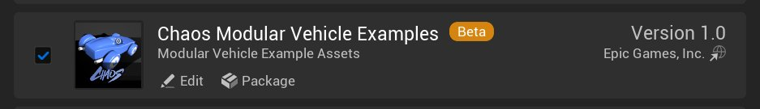
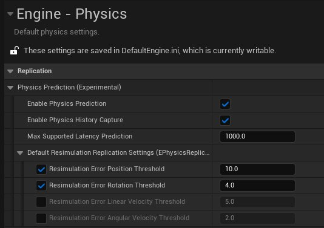
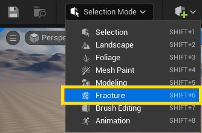
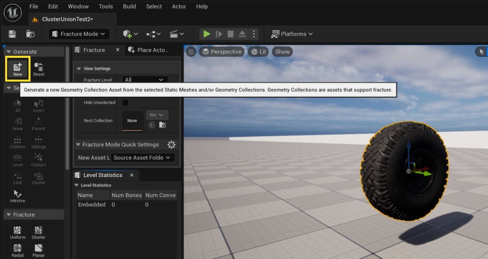
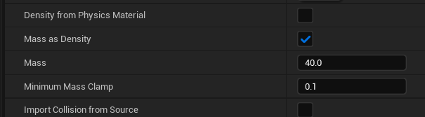
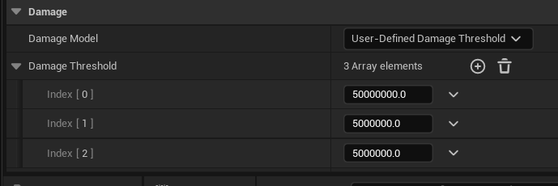
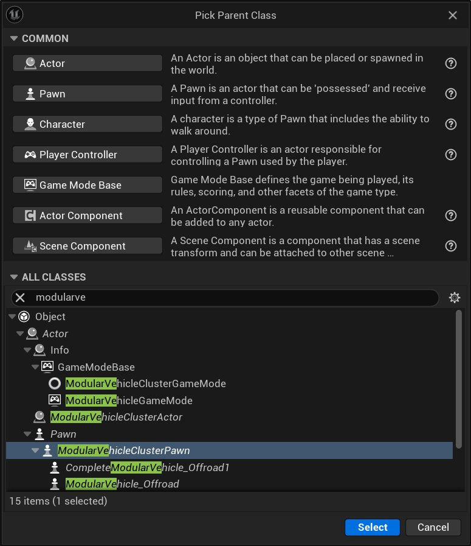

# Chaos Modular Vehicles Quickstart

> 路径：虚幻引擎5.7文档 / Gameplay系统 / 物理 / 载具 / Chaos模块化载具 / Chaos Modular Vehicles Quickstart

> 原始页面：https://dev.epicgames.com/documentation/unreal-engine/chaos-modular-vehicles-quickstart

本指南说明如何设置模块化载具，使其可在 Chaos Physics Solver 中进行模拟。

组成模块化载具的独立资产如下：

- Geometry Collection 资产（用于载具部件，由 Static Mesh 生成）
- 一个载具 Blueprint

## 启用 Chaos Modular Vehicle 插件

点击 **Edit** > **插件** 并搜索“chaos modular vehicle”。确认项目已启用 Chaos Modular Vehicle 插件。

它与 Chaos Vehicle Plugin 是完全独立的插件，不需要同时启用二者。

## （可选）启用 Chaos Modular Vehicle Examples 插件

点击 **Edit** > **插件** 并搜索“chaos modular vehicle examples”。确认项目已启用 Chaos Modular Vehicle Examples 插件。

## 启用网络设置

在项目设置中的 **Engine** > **Physics**下点击 **Enable Physics Prediction** 和 **Enable Physics History Capture**。这会启用服务端权威、客户端预测和回滚重模拟行为，从而获得更好的联网表现。载具的操控会像本地控制一样，没有输入延迟感。

## 创建 Geometry Collection 资产

模块化载具当前使用 Geometry Collection 资产表示载具部件，这与物理破坏使用的是同一种资产。可以使用破坏工具从 static mesh 生成 geometry collection。

按以下步骤使用 fracture 工具，将每个独立载具部件从 static mesh 转换为 Geometry Collection：

1. 将 static mesh 拖入关卡，并将编辑器切换到 **Fracture Mode** ，该选项位于 Main Toolbar。

   
2. 选中 static mesh 资产后，点击 **Generate** > **New**.

   
3. 在

   Select Path

   窗口中选择新资产的保存位置并为资产命名。
4. 点击

   Generate Geometry Collection

   .
5. 在 **Details** 中为 **Geometry Collection** 资产设置每个部件的质量，以及部件脱落难易程度对应的 damage threshold。

   

   

对其它所有载具部件重复这些步骤。至少需要两个资产：一个载具底盘资产和一个车轮资产。

## 创建 Cluster Union Vehicle Pawn 蓝图

1. 在

   Content Browser

   下点击

   Add（+）

   >

   Blueprint Class

   .
2. 在

   Pick Parent Class

   窗口中，在

   All Classes

   下搜索“ModularVehicle”并选择

   ModularVehicleClusterPawn（模块化载具集群 Pawn）

   .
3. 点击

   Select

   .

新资产会出现在 Content Browser 中。为其设置一个易识别的名称，方便之后查找，例如“BP_ChaosFrontWheel”。

## 在 Blueprint 中构建载具结构

创建 Modular Vehicle Blueprint 后，在 Blueprint Editor 中打开它，并开始添加 Geometry Collection Component。Cluster Union Vehicle Pawn 已经分配了一些默认组件：负责模块化载具模拟的 Vehicle 模拟组件，以及 Network Physics Component。

1. 将每个 Geometry Collection 资产拖入 **Components** 面板中的 **Cluster Union Vehicle Component**.

   > 图片已省略：The Components panel
2. 使用 **Viewport** 调整载具部件的位置，使它们彼此处于正确的相对位置。为了更准确，最好在 **Details** 面板中为 Geometry Collection component 输入精确位置。车轮尤其需要精确，因为如果车轮不是完全对称，模拟出的载具可能无法直线行驶。约定为 X 向前、Y 向右、Z 向上。

   > 图片已省略：The Details panel for a Geometry Collection component
3. 在 **Details** 面板中，在 **Chaos Physics** > **Clustering**下启用 **Force Update Active Transforms**。如果不这样做，从载具上脱落的部件在静止后会继续跟随主 Actor 移动。这是因为对象不移动时会停止更新 transform 的优化。通常当 geometry collection 拥有自己的 Actor 时这没有问题，但这里这些部件挂接在同一个移动 Actor 下。

> [!NOTE]
> 如果整辆载具使用同一个车轮模型，可能需要翻转载具一侧的车轮，使外观正确。这需要在 Z 旋转轴上增加 180 度旋转。翻转轴向后，在下一步为这些部件设置关联 simulation component 时也需要做相应调整。

## 向 Geometry Collection 添加 模拟组件

Simulation component 会为 geometry collection 添加模拟行为。例如，如果希望某个 geometry collection 像车轮一样工作，需要添加 Wheel component。

在 Blueprint Editor 中点击 **Add（+）** 并搜索“sim”，获取所有可用 simulation 选项列表。

> 图片已省略：A list of simulation options

Simulation component 的层级非常重要。Simulation component 应作为对应 geometry collection 的子级。例如，VehicleSimWheel Component 必须添加在 Geometry Collection 车轮模型之下。模拟会使用该 component 的 transform 来确定力的施加位置，并在部件断裂脱落时关闭该部件的模拟。Simulation component 本身的父子关系也很重要；engine、clutch、transmission 的父子关系表示模块之间的扭矩流向。

按以下步骤向 geometry collection 添加 simulation component：

1. 在每个表示车轮的 geometry collection component 下添加 VehicleSimSuspension component。
2. 在每个 VehicleSimSuspension component 下添加 VehicleSimWheel component。
3. 在载具底盘 geometry collection component 下添加 VehicleSimEngine component。
4. 在 VehicleSimEngine 下添加 VehicleSimClutch component。
5. 在 VehicleSimClutch 下添加 VehicleSimTransmission component。

完成后的设置应类似下图。

> 图片已省略：The finished setup

根据载具需要，在 details panel 中调整所有 simulation 参数。按住 **Ctrl** 选择多个 component，即可同时修改多个车轮 component 的参数。之后在 details panel 中做出的任何更改都会应用到所有已选 component。

> 图片已省略：Multiple components selected

如果为了外观正确而在编辑器中旋转了某个 wheel component（绕 Z 轴旋转 180 度），除非勾选 **Reverse Direction** 属性，否则该车轮会反向模拟。

> 图片已省略：The Reverse Direction property

## 定义载具输入

1. 为每个控制项创建 input action。

   > 图片已省略：Input actions for Brake, Handbrake, Reverse, Steering, and Throttle
2. 对于 Steering input action，建议添加 Dead Zone modifier，否则直线行驶时方向可能发生漂移。

   > 图片已省略：A Dead Zone modifier
3. 在

   Content Browser

   下点击

   Add（+）

   >

   Input

   >

   Input Mapping Context

   .
4. 打开 input mapping context，并按下图所示将控制项映射到各个 input action。

   > 图片已省略：The mappings for Throttle, Steering, and Brake

   > 图片已省略：The mappings for Brake, Handbrake, and Reverse
5. 在载具资产中，input 由名称和类型定义。这些名称需要与模块化载具代码中实现的名称匹配。核心模块使用以下 input：

   | 模块 | Input 名称 |
   | --- | --- |
   | Engine | Throttle（油门） |
   | Clutch（离合器） | Clutch（离合器） |
   | Thruster（推进器） | Throttle（油门） |
   | Transmission（变速箱） | ChangeUp、ChangeDown |
   | Wheels（车轮） | Steering、Brake、Handbrake |
   | Aerofoil（翼面） | Roll、Pitch、Yaw |
6. 在 **Vehicle Simulation** component 上，如果 Vehicle Input 部分尚不存在五个数组成员，则添加它们，并在右侧的 **Details** 面板中填写。

   > 图片已省略：Five array members in the Vehicle Input section.
7. 在载具 Blueprint 中，按下图所示将 EnhancedInputAction event 连接到载具。

   > 图片已省略：The vehicle Blueprint

## （可选）设置 Camera 和 Spring Arm

可以设置一个跟随载具的摄像机。

1. 打开载具 Blueprint。
2. 在

   Components

   窗口中点击

   Add（+）

   >

   Camera

   .
3. 使用 **Viewport** 在 Blueprint Editor 中调整摄像机位置。下图中，摄像机位于载具后方，略微抬高，并向下倾斜朝向载具。

   > 图片已省略：The camera positioned behind the vehicle
4. 选中

   Camera

   component 后，确认

   Use Pawn Control Rotation

   已禁用。这样可确保摄像机锁定到自身视图方向，而不是 Player Controller 的视图方向。

## 从模块化设置驱动 Skeletal Mesh

1. 在

   Content Browser

   中右键点击并选择

   Animation

   >

   Animation Blueprint

   .
2. 点击要使用的 skeleton。
3. 在

   Parent Class

   标签页中点击

   ModularVehicleAnimationInstance（模块化载具动画实例）

   .
4. 点击

   Create

   .
5. 在

   Content Browser

   ，然后为 animation blueprint 命名。
6. 打开 animation blueprint，并创建 **Modular Vehicle Controller** 节点，然后按下图所示连接。

   > 图片已省略：The connected Modular Vehicle Controller
7. 将载具 skeletal mesh 添加到载具 Blueprint。
8. 在 skeletal mesh component 上，确保 animation mode 设置为

   Use Animation Blueprint

   ，并将

   Animation Class

   设置为刚创建的 animation blueprint。
9. 在每个模块化载具 simulation component（wheels 和 suspension）中输入 **Bone Name** ，指定 skeletal mesh 中要动画化的骨骼。

   > 图片已省略：The Bone Name property

## 创建 ModularVehicleGameMode Blueprint

如果希望游戏开始时生成载具而不是角色，需要创建一个载具 game mode，并在 world settings 中指定它。

1. 在

   Content Browser

   下点击

   Add（+）

   >

   Blueprint Class

   .
2. 在

   Pick Parent Class

   窗口中点击

   Game Mode Base

   .
3. 在

   Content Browser

   ，双击在

   Blueprint Editor

   .
4. 在

   Details

   面板中的

   Classes

   下，将

   Default Pawn Class

   设置为载具 Blueprint。
5. 点击

   Save

   然后关闭窗口。
6. 在

   Main Toolbar

   窗口中点击

   Settings

   >

   World Settings
7. 在

   World Settings

   面板中，在

   Game Mode

   下，将

   GameMode Override

   设置为 Game Mode Blueprint。

## 模块概览

### Simulation Module 概览

| 模块 | 力 | 使用的控制输入 | Animation |
| --- | --- | --- | --- |
| Wheel（车轮） | 纵向和横向抓地力可以是驱动的，也可以是非驱动的。 | 使用 **Steering** input（如果启用了转向）、 **Brake** input，以及 **Handbrake** input。普通载具通常只在前轮启用转向，但也可以按需要混合配置。对于后轮转向，可以通过设置负的最大转向角来反转转向输入方向。 | Wheel 会使用 **Steering** input angle 自动转向。车轮旋转也会自动动画化。 |
| Suspension（悬架） | 悬挂力通常沿 Z 轴。系统使用 ray trace 查找地面，并将命中点和悬架长度提供给 suspension constraint。 | N/A | 车轮沿悬架方向的行程会自动动画化。 |
| Engine | 为车轮提供扭矩。可在此定义 torque curve。 | 使用 **Throttle（油门）** input。 | N/A |
| Transmission（变速箱） | 连接到 engine 或 clutch module。gear 和 gear ratio 在此定义。 | 使用 **ChangeUp** input 和 **ChangeDown** input。 | N/A |
| Clutch（离合器） | 连接在 engine 与 transmission module 之间。 | 使用 **Clutch（离合器）** input。 | N/A |
| Thruster（推进器） | 推进力。 | 使用 **Throttle（油门）** 和 **Steering** input。 | 使用 **Throttle（油门）** input 缩放力，并可使用 **Steering** input 转向 |
| Aerofoil（翼面） | 使用真实行为生成升力和阻力。可用于通过机翼、升降舵和方向舵创建完整飞行模型。 | 使用 **Roll**, **Pitch**或 **Yaw** input，取决于它被定义为副翼、升降舵还是方向舵。 | 部件会根据控制面类型旋转。动画可相对实际模拟值禁用、反向或放大。 |

#### 示例载具

以下是可用 simulation module 创建的载具示例：

- 传统汽车：Engine、Clutch、Transmission、Wheel、Suspension
- 无动力小车：Wheel、Suspension
- 简单街机载具：Thruster、Wheel、Suspension
- 飞机：Thruster、Aerofoil、Wheel、Suspension
- 气垫船：Suspension、Thruster、Aerofoil。（没有车轮的 suspension 类似气垫船围裙，aerofoil 可作为方向舵使用。）

### 模块设置参数

下表说明各个 simulation module 的设置参数。

#### Wheel 设置参数

| 名称 | 说明 |
| --- | --- |
| Radius | 车轮半径，单位为 cm。如果设置错误，车轮看起来会悬在地面上方或嵌入地面。 |
| Width | 当前未使用。 |
| Inertia | 车轮加速或减速旋转的快慢。 |
| FrictionMultiplier | 乘以地面材质摩擦力，以降低或提高抓地力。1.0 为中性值。 |
| CorneringStiffness | 车轮转弯时产生的横向力大小。 |
| SlipAngleLimit | 轮胎开始失去抓地力的角度，单位为度。 |
| Max Brake Torque | 制动输入达到最大值 1.0 时使用的最大制动扭矩。 |
| Handbrake Enabled | 启用后，车轮会响应 **Handbrake** input。 |
| Handbrake Torque | 制动输入达到最大值 1.0 时使用的最大手刹扭矩。 |
| Steering Enabled | 启用后，车轮会响应 **Steering** input。 |
| Max Steering Angle | 最大转向锁角，单位为度。负值会使车轮向相反方向转向。可用于实现四轮转向，例如前轮使用正值，后轮使用负值。 |
| ABS Enabled | 启用后，无论 Max Brake Torque 多高，车轮在重刹时都不会抱死打滑。 |
| Traction Control Enabled | 启用后，无论 Max Brake Torque 多高，车轮在加速时都不会打滑或空转。 |
| LateralSlipGraph | 转弯刚度曲线。尚未暴露给 component。 |
| LateralSlipGraphMultiplier | 用于便捷缩放 LateralSlipGraph 输出。尚未暴露给 component。 |
| Max Rotational Velocity | 限制车轮最大旋转速度。尚未暴露给 component。 |
| Axis | 定义力作用在模型的 X 轴还是 Y 轴。如果原始 GC component 经过旋转摆放，此项很重要。 |
| Reverse Direction | 如果力的施加方向错误，可用此项反转力方向。如果原始 GC component 经过旋转摆放，此项很重要。 |

#### Suspension 设置参数

| 名称 | 说明 |
| --- | --- |
| Axis | 悬架行程方向。 |
| Offset | 偏移悬架力的作用位置。 |
| Max Raise | 悬架相对初始位置向上压缩的距离，单位为 cm。 |
| Max Drop | 悬架相对初始位置向下伸展的距离，单位为 cm。 |
| Spring Rate | 标准弹簧刚度。 |
| Spring Preload | 悬架激活时施加的恒定力。它允许使用较低的 spring rate，同时仍能支撑载具质量。 |
| Spring Damping | 阻止载具围绕中性位置振荡。damping 越高，载具振荡越少。 |

#### Engine 设置参数

| 名称 | 说明 |
| --- | --- |
| Max Torque | 最大 Torque 值。 |
| Torque Curve | 归一化 torque curve，用于定义 torque 与 RPM 的关系。 |
| Max RPM | engine 可达到的最大 RPM（每分钟转数）。 |
| Idle RPM | 载具静止且未踩下 throttle 时的怠速 RPM。 |
| Engine Braking Effect | 松开 throttle 时，engine 对载具产生的减速效果大小。 |
| Engine Inertia | engine 提升转速的快慢。 |
| EnableBoostCapability | 启用后，engine 可以激活 boost。 |
| BoostMultiplier | boost 激活时 engine torque 的倍率。 |

#### Transmission 设置参数

| 名称 | 说明 |
| --- | --- |
| Transmission Type | gear 是手动设置还是自动设置。默认为 automatic。 |
| Final Drive Ratio | 乘以所选 gear ratio，得到最终 gear torque 倍增效果。车辆规格中通常会与常规 gear ratio 一起给出。 |
| Forward Gear Ratios | 1 到 n 档的齿比。 |
| Reverse Gear Ratios | -1 到 -n 倒档的齿比。 |
| 升档 RPM（Change Up RPM） | automatic transmission mode 下升档时的 engine RPM。 |
| 降档 RPM（Change Down RPM） | automatic transmission mode 下降档时的 engine RPM。 |
| Gear Change Time | 每次升档或降档所需时间。 |
| Transmission Efficiency | 定义 transmission system 摩擦损耗的一种方式。未暴露给 component。 |
| Auto-Reverse | 启用后，载具速度接近零时会倒车，而不是继续制动。 |

#### Clutch 设置参数

| 名称 | 说明 |
| --- | --- |
| Clutch Strength | clutch 使两根轴速度匹配时的突兀程度。 |

#### Thruster 设置参数

| 名称 | 说明 |
| --- | --- |
| Force Axis | 力作用所沿的轴。 |
| Steering Axis | 启用 steering 时，thruster 围绕其旋转的轴。 |
| Force Offset | 偏移力的施加位置。 |
| Max Thrust Force | 最大推力。 |
| Steering Enabled | 启用后，可以控制 thruster 的方向。 |
| Max Steering Angle | thruster 可转动的最大角度。 |
| Steering Force Effect | 乘以力的 steering 分量，使前向 thrust 可与 steering 分开调校。预期值为 0 到 1，其中 0 不应用 steering effect，1 应用完整 steering effect。 |
| Boost Multiplier | boost input 激活时 thrust force 增加的倍率。尚未使用。 |
| Max Speed | 应达到的最大速度。尚未使用。 |

#### Aerofoil 设置参数

| 名称 | 说明 |
| --- | --- |
| Force Axis | lift force 施加所沿的轴。 |
| Offset | 偏移力的施加位置。 |
| 控制旋转轴（Control Rotation Axis） | control surface 围绕其旋转的轴。 |
| Surface Area | aerofoil 的表面积。不需要真实，也不需要与可视模型匹配。值越大，获得的 lift 越多。 |
| Camber | aerofoil 形状。值越大，获得的 lift 越多。 |
| Max Control Angle | control surface 可转动的角度，单位为度。 |
| Stall Angle | aerofoil 的 stall angle，单位为度。 |
| Type | 指定这是 Wing、Elevator 还是 Rudder。它定义哪个 control input 会移动 control surface：Wing 使用 Roll input，Elevator 使用 Pitch input，Rudder 使用 Yaw input。 |
| Lift Multiplier | 用于单独修正 aerofoil 计算出的 lift 分量，与 drag 分量分开。默认值为 1.0。 |
| Drag Multiplier | 用于单独修正 aerofoil 计算出的 drag 分量，与 lift 分量分开。默认值为 1.0。 |
| Animation Magnitude Multiplier | 更改部件视觉旋转量，使其可独立于 control angle 调整。该部件会动画到 control angle 乘以此值后的角度。 |
