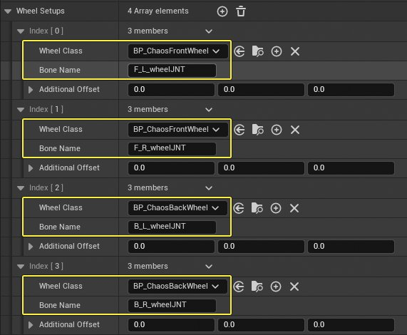
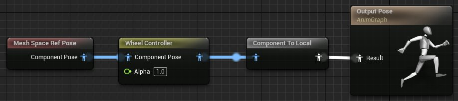
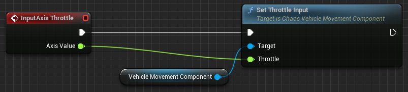

# 如何将PhysX载具转换为Chaos

> 路径：虚幻引擎5.7文档 / Gameplay系统 / 物理 / 载具 / Chaos载具 / 如何将PhysX载具转换为Chaos

> 原始页面：https://dev.epicgames.com/documentation/unreal-engine/how-to-convert-physx-vehicles-to-chaos-in-unreal-engine

如[Chaos载具设置](https://dev.epicgames.com/documentation/404)指南中所述，构成载具的资产是骨骼网格体、物理资产、动画和载具蓝图以及一个或多个车轮蓝图。

本文将详细介绍如何将基于PhysX（旧版）的载具转换为Chaos载具。

## 设置

### 资产配置

目前，与资产配置有关的工作流程保持不变，PhysX和Chaos载具之间的物理碰撞、摄像机和载具功能按钮设置不会更改。

### 动画蓝图

除了使用WheelController节点代替WheelHandler节点之外，动画蓝图相同。

### 类布局

在大多数情况下，类的布局相似，只是类的名称有所不同。

| PhysX组件 | Chaos组件 |
| --- | --- |
| VehicleWheel | ChaosVehicleWheel |
| VehicleMovement | ChaosWheeledVehicleComponent |
| VehicleAnimInstance | VehicleAnimationInstance |
| WheelHandler | WheelController |
| WheeledVehicle | WheeledVehiclePawn |

## 转换步骤

1. 根据 **ChaosVehicleWheel** 类创建前后轮蓝图类。
2. 复制PhysX载具车轮的设置细节；要复制的重要细节包括车轮半径、悬架最大上升/下降值、转向角以及车轮是否带有引擎、制动器或手刹。

   > [!NOTE]
   > 我们建议先转换前轮，设置其值，然后创建副本并将其重命名为后轮。这样，你只需要设置与前轮不同的值即可，而无需再次重复所有车轮设置。因为在大多数情况下，车轮和悬架的设置前后均相同。
3. 将 **ChaosWheeledVehicleComponent** 组件添加到载具Pawn。
4. 添加与PhysX载具组件中相同数量的车轮。

   1. 从PhysX骨骼网格体复制骨骼名称。
   2. 将车轮的类别设置为之前创建的匹配车轮。

   

   车轮类分配示例
5. 根据需要设置其他属性，包括质量和引擎扭矩。
6. 创建扭矩曲线（Torque Curve）并将其指定给引擎扭矩。
7. 打开动画蓝图，点击 **文件（File）** > **重新设置蓝图父类（Reparent Blueprint）**，然后点击 **VehicleAnimationInstance**。

   > [!NOTE]
   > 这会将PhysX **VehicleAnimInstance** 转换为Chaos等效项。
8. 通过删除WheelHandler animation节点并将其替换为 **WheelController** 节点来编辑载具动画蓝图。

   

   用WheelController替换WheelHandler之后的动画图表。

   > [!NOTE]
   > 蓝图中存在的所有其他设置都可以保持原样。
9. 确认物理资产符合预期。例如，底盘应具有碰撞模型，车轮可能会有简单的碰撞；但是，车轮应禁用碰撞。
10. 在任何引用PhysX **WheeledVehicleMovementComponent4W** 引用的蓝图代码中，删除PhysX运动组件引用，并使用 **ChaosWheeledVehicleMovement** 引用重新创建蓝图。

    

    完成这些转换步骤后，你的载具就应该在使用Chaos物理解算器了。
