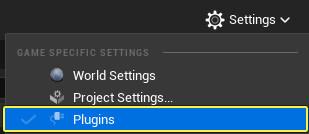
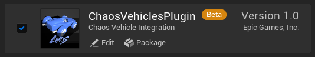
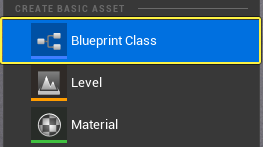
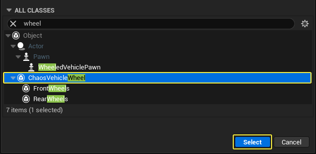
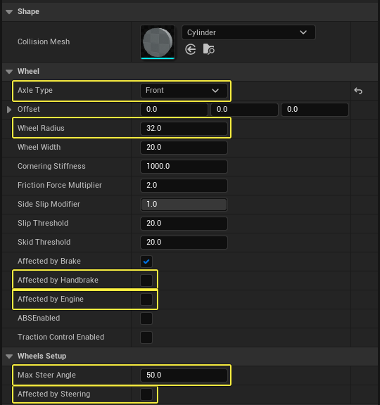
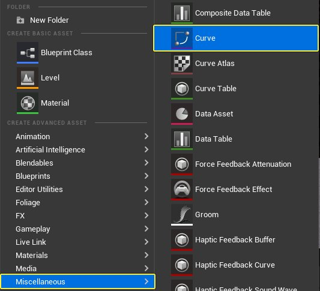
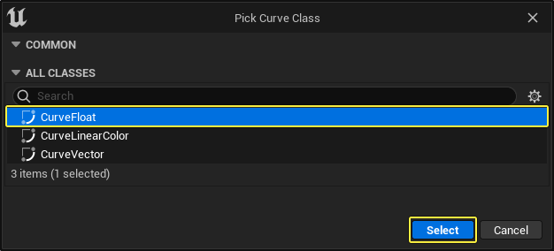
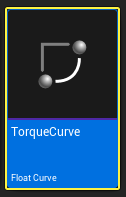

# 如何设置载具

> 路径：虚幻引擎5.7文档 / Gameplay系统 / 物理 / 载具 / Chaos载具 / 如何设置载具

> 原始页面：https://dev.epicgames.com/documentation/unreal-engine/how-to-set-up-vehicles-in-unreal-engine

载具分别由以下几种资产构成。

- 一个骨骼网格体
- 一个物理资产
- 一个动画蓝图
- 一个载具蓝图
- 一个或多个车轮蓝图
- 一个浮点类型的曲线资产，用来描述引擎扭矩

无论是创建汽车还是摩托车，都需要用到这些资产和步骤。本文将引导你完成载具的具体设置。

1. 启用Chaos载具插件。
2. 创建并编辑Chaos车轮蓝图。
3. 为引擎扭矩创建一个曲线资产。
4. 导入一个载具模型。
5. 创建并编辑物理资产。
6. 使用车轮控制器（Wheel Controller）节点创建动画蓝图。
7. 创建载具蓝图。
8. 设置载具控制输入。
9. 设置载具游戏模式。

## 启用Chaos载具插件

在创建Chaos载具之前，你需要先启用Chaos插件。

1. 点击 **设置（Settings）> 插件（Plugins）** ，打开 **插件菜单（Plugins Menu）** 。

   
2. 点击 **物理（Physics）** 类别，并启用 **ChaosVehiclesPlugin** 。

   

> [!NOTE]
> - 启用插件后重启虚幻编辑器。
> - 此插件无法在启用PhysX的情况下使用。

## 创建并编辑Chaos车轮蓝图

车轮蓝图用于配置载具的车轮 / 悬架 / 刹车。

在大多数情况下，载具至少需要两种车轮。一种车轮（或轮轴）受方向盘/引擎/手刹的影响，另一种不受影响。此外，载具还可以有不同大小的前后轮，并且可以单独设置它们的半径、质量、宽度、手刹效果、悬架和许多其他属性，以便获得你想要的载具操控效果。

载具的车轮数量没有限制。多个载具可以共享相同的车轮蓝图，但仅限车轮尺寸和悬架限制相同时才有效。

### 创建车轮蓝图

1. 在 **内容浏览器（Content Browser）** 中，右键点击并在 **创建基本资产（Create Basic Asset）** 分段中，选择 **蓝图类（Blueprint Class）** 。

   
2. 在 **选取父类（Pick Parent Class）** 窗口中，在 **所有类（All Classes）** 中搜索"车轮（wheel）"，然后选择 **ChaosVehicleWheel** 。点击 **选择（Select）** ，创建资产。

   
3. 新建的资产将出现在 **内容浏览器（Content Browser）** 中。确保其命名易于识别，方便以后查找（例如'BP_ChaosFrontWheel'）。
4. （**可选步骤**）重复这些步骤，以便创建出 **前** 轮和 **后** 轮。试着把前后轮分别理解成一种轮轴类型。

### 编辑车轮蓝图

在蓝图编辑器（Blueprint Editor）中，双击打开 **内容浏览器（Content Browser）** 中的资产，其中有编辑车轮的选项。

首先，每个车轮需要更改五个属性，其余属性是否更改取决于载具在测试中的表现（并应在后续进行调整）。

| 属性 | 说明 |
| --- | --- |
| **轮轴类型（Axel Type）** | 定义车轮是在载具的前部还是后部。 |
| **车轮半径（Wheel Radius）** | 该选项需要与车轮模型的尺寸一致（单位：厘米）。 |
| **受手刹控制（Affected by Handbrake）** | 为后轮启用此功能。 |
| **受引擎控制（Affected by Engine）** | 如果是后轮驱动（RWD）载具，为后轮启用此功能。如果是前轮驱动（FWD）载具，为前轮启用此功能。在全轮驱动（AWD）载具的全部车轮上启用此功能。 |
| **受方向盘影响（Affected by Steering）** | 在前轮启用此功能。假如前侧有多组轮胎（例如，卡车驾驶室可能有四轮转向），请在第二排车轮上启用此选项，并调整其转向角。另外，也可以将方向盘的负转向角赋值给后轮，来实现全轮转向。 |
| **最大转向角（Max Steer Angle）** | 通常，此选项为正值（以度为单位）。但是，对于全轮驱动（AWD）载具，后轮在反向转向时，允许为负值。 |

Chaos车轮蓝图的类默认值示例。

在越野车示例中，将前轮和后轮蓝图的 **车轮半径（Wheel Radius）** 设置为 **58** 。

## 为引擎扭矩创建曲线资产

扭矩曲线用于描述给定每分钟转速（RPM）下，引擎的扭矩输出量。图中的X轴表示引擎每分钟转数（RPM），范围为0到引擎最大RPM。Y轴代表引擎扭矩输出，单位为牛顿米（NM）。典型的扭矩曲线是倒U形，扭矩在转速范围的中间附近达到峰值，并在两侧逐渐减弱。

要创建扭矩曲线，请按照以下步骤操作：

1. 在 **内容浏览器（Content Browser）** 中，右键点击并选择 **杂项（Miscellaneous）>曲线（Curve）**。选择 **曲线浮点（Curve Float）** 类型，并点击 **选择（Select）** 按钮，创建资产。

   

   
2. 将资产命名为 **TorqueCurve**。

   
3. 在 **内容浏览器（Content Browser）** 中，双击 **TorqueCurve** ，在 **曲线编辑器（Curve Editor）** 中打开它。添加点，创建你要的曲线形状。

   > 图片已省略：undefined

## 导入载具网格体

本指南使用来自 **载具游戏（Vehicle Game）** 示例项目的 **越野载具网格体** 。在 **Epic Games启动程序（Epic Games Launcher）** 中，点击 **学习（Learn）选项卡** ，找到该项目。

> 图片已省略：undefined

### 载具物理编辑器

将载具网格体导入项目后，请按照以下步骤在 **物理资产编辑器（Physics Asset Editor）** 中查看网格体。

1. 在 **内容浏览器（Content Browser）** 中，双击打开 **载具骨骼网格体（vehicle Skeletal Mesh）** 。

   > 图片已省略：打开载具骨骼网格体
2. 点击 **物理（Physics）** 选项卡，打开 **物理资产编辑器（Physics Asset Editor）** 。

   > 图片已省略：点击物理选项卡

   > 图片已省略：undefined

## 创建并编辑物理资产

### 创建物理资产

如果你的骨骼网格体没有关联的物理资产，则你可以按照以下步骤创建物理资产：

1. 在 **内容浏览器（Content Browser）** 中，右键点击骨骼网格体资产，并选择 **创建（Create）>物理资产（Physics Asset）>创建并指定（Create and Assign）** 。

   > 图片已省略：创建新物理资产
2. 点击 **图元类型（Primitive Type）** 下拉菜单，并选择 **单个凸包外壳（Single Convex Hull）** 。点击 **创建资产（Create Asset）** ，创建新物理资产。

   > 图片已省略：选择单个凸包外壳

   这将为每个骨骼生成具有默认碰撞形状的物理资产。初始碰撞设置很可能并不理想，因为它将使用相同的图元类型来表示物理资产中的所有骨骼。
3. 在 **内容浏览器（Content Browser）** 中，双击 **物理资产** ，在 **物理资产编辑器（Physics Asset Editor）** 中打开它。

   > 图片已省略：打开新物理资产

   > 图片已省略：打开新物理资产
4. 在 **物理资产编辑器（Physics Asset Editor）** 中，你可以调整每个骨骼上使用的碰撞图元，以便更好地适配载具网格体。

## 编辑物理资产

1. 在 **骨架树（Skeleton Tree）** 窗口中，点击 **齿轮图标** ，并选择 **显示图元（Show Primitives）** 。

   > 图片已省略：选择显示图元
2. 选择骨架树（Skeleton Tree）窗口内的全部车轮骨骼。

   > 图片已省略：选择全部车轮骨骼
3. 前往 **工具（Tools）** 窗口，并在 **形体创建（Body Creation）** 分段下，点击 **图元类型（Primitive Type）** 下拉菜单并选择 **球体（Sphere）** 。点击 **重新生成形体（Re-generate Bodies）** 。

   > 图片已省略：选择球体图元类型

   > 图片已省略：选择球体图元类型
4. 你现在可以看到每个车轮上的球体图元。

   > 图片已省略：带凸包外壳的车轮

   > 图片已省略：带球体的车轮

   带凸包外壳的车轮

   带球体的车轮
5. 选择 **骨架树（Skeleton Tree）** 窗口内的 **悬架（suspension）** 骨骼。右键点击并选择 **碰撞（Collision）>无碰撞（No Collision）**，以便消除载具悬架的碰撞。

   > 图片已省略：Select the Sphere primitive type

   > 图片已省略：Select the Sphere primitive type

## 用Wheel Controller节点创建动画蓝图

动画蓝图用于控制载具的专用骨骼网格体动画，例如旋转轮胎、悬架、手刹和方向盘动画。为了减轻创建这些动画类型的工作量，你可以使用 **Wheel Controller节点** 来驱动动画。

### Wheel Controller Node

动画蓝图用于获取和控制载具的动画时，**Wheel Controller** 节点将使得控制载具的所有动画变得相当容易，几乎不需要额外的设置。

> 图片已省略：Wheel Controller node

节点可获取必要的车轮信息（例如"旋转速度有多快？"或"它是否受到手刹影响？"或"此车轮的悬架设置如何？"），并将查询结果转译为车轮关联的骨骼上的动画。

### 创建动画蓝图

1. 在 **内容浏览器（Content Browser）** 中，右键点击并选择 **动画（Animation）>动画蓝图（Animation Blueprint）** 。

   > 图片已省略：Select Animation Blueprint
2. 在 **创建动画蓝图（Create Animation Blueprint）** 窗口中，选择 **VehicleAnimationInstance** 父类，并从列表中选择载具 **骨架（Skeleton）** 。点击 **创建（Create）** 创建新的动画蓝图资产。

   > 图片已省略：Select the vehicle animation instance parent class and your vehicle skeleton from the list
3. 在 **内容浏览器（Content Browser）** 中，双击打开 **动画蓝图（animation Blueprint）** 。
4. 在 **动画图表（Anim Graph）** 中右键点击，然后搜索并选择 **Mesh Space Ref Pose**。

   > 图片已省略：Select the Mesh Space Ref Pose node
5. 在 **动画图表（Anim Graph）** 中右键点击，然后搜索并选择 **Wheel Controller for WheeledVehicle** 。将 **Mesh Space Ref Pose** 节点连接到 **Wheel Controller** 节点。

   > 图片已省略：Select the Wheel Controller for WheeledVehicle node

   > 图片已省略：Connect the Mesh Space Ref Pose node to the Wheel Controller node
6. 在 **动画图表（Anim Graph）** 中右键点击，然后搜索选择 **Component To Local**。将 **Wheel Controller** 节点连接到 **Component To Local** 节点。将 **Component To Local** 节点连接到 **Output Pose** 节点。

   > 图片已省略：Select Component To Local node

   > 图片已省略：Connect the Wheel Controller node to the Component To Local node. Connect the Component To Local node to the Output Pose node
7. （**可选步骤**）如果你有额外的框架或其他悬架需求（如来自 **载具游戏（Vehicle Game）** 的示例越野车），你将需要 **动画图表（Animation Graph）** 中的额外节点来处理影响这些多边形的关节。例如，在越野车中，额外的关节用于控制轴与车轮的连接。这些由 **Look At** 节点驱动，当给定轮关节时，这些节点将由 **Wheel Controller** 节点驱动。 **Look At** 节点将确保悬架保持连接到车轮，如以下示例所示。

   > 图片已省略：undefined

越野车使用以下Look At节点组合：

| 骨骼 | Look At |
| --- | --- |
| F_L_Suspension | F_L_wheelJNT |
| F_R_Suspension | F_R_wheelJNT |
| B_L_Suspension | B_L_wheelJNT |
| B_R_Suspension | B_R_wheelJNT |
| B_L_wheelJNT | B_L_Suspension |
| B_R_wheelJNT | B_R_Suspension |

## 创建载具蓝图

在此小节中，你将创建一个载具蓝图，此载具蓝图将使用前面小节中创建的所有资产。

1. 在 **内容浏览器（Content Browser）** 中，右键点击并从 **创建基本资产（Create Basic Asset）** 类别中选择 **蓝图类（Blueprint Class）**。

   > 图片已省略：Create a new Blueprint class
2. 在 **选择父类（Pick Parent Class）** 窗口中，展开 **全部类（All Classes）** 分段，搜索并选择 **WheeledVehiclePawn**。点击 **选择（Select）**，创建新蓝图资产。

   > 图片已省略：Create a new Blueprint class
3. 在 **内容浏览器（Content Browser）** 中，双击打开 **载具蓝图（Vehicle Blueprint）**。

   > 图片已省略：Open the new Vehicle Blueprint
4. 在 **组件（Components）** 窗口中，点击 **网格体（Mesh）**，骨骼网格体组件（Skeletal Mesh Component）。前往 **细节（Details）** 面板，并在 **网格体（Mesh）** 分段下，点击 **骨骼网格体（Skeletal Mesh）** 下拉菜单。选择你载具的 **骨骼网格体** 资产。

   > 图片已省略：Select the Mesh

   > 图片已省略：Select your vehicle's skeletal mesh
5. 在 **细节（Details）** 面板中，向下滚动到 **动画（Animation）** 分段，然后点击 **动画类（Anim Class）** 下拉菜单。选择你载具的 **动画蓝图（Animation Blueprint）** 。

   > 图片已省略：Select your vehicle's Animation Blueprint
6. 在 **细节（Details）** 面板中，滚动到 **物理（Physics）** 分段，并启用 **模拟物理（Simulate Physics）** 复选框。

   > 图片已省略：Enable the Simulate Physics checkbox
7. 在 **组件（Components）** 窗口中，点击 **添加组件（Add Component）** ，然后搜索并选择 **弹簧臂（Spring Arm）** 。

   > 图片已省略：Add a Spring Arm
8. 选中 **弹簧臂（Spring Arm）** 组件后，点击 **添加组件（Add Component）** ，然后搜索并选择 **摄像机（Camera）** 。

   > 图片已省略：Add a Camera
9. 在 **视口（Viewport）** 中，选择 **摄像机（Camera）** 并将其放到所需位置。

   > 图片已省略：Position the Camera to your liking
10. 选择 **摄像机（Camera）** 组件，并前往 **细节（Details）** 面板。滚动到 **摄像机设置（Camera Settings）** 分段，并确认已禁用 **使用Pawn控制旋转（Use Pawn Control Rotation）** 。

    > 图片已省略：Verify that Use Pawn Control Rotation is disabled

    这样可以确保摄像机锁定在摄像机的视图方向，而非玩家控制器的视图方向。
11. 在 **组件（Components）** 窗口中，选择 **载具移动组件（Vehicle Movement Component）** 。

    > 图片已省略：Select the Vehicle Movement Component
12. 前往 **细节（Details）** 面板，然后滚动到 **载具设置（Vehicle Setup）** 分段。展开 **车轮设置（Wheel Setups）** 旁边的箭头，并为每个车轮设置如下内容：

    - 将

      车轮类（Wheel Class）

      设置为你创建的车轮蓝图。
    - 将

      骨骼名称（Bone Name）

      设置为应由车轮控制的关节名称。

    > 图片已省略：Wheel Setups

    你分配车轮的顺序与它是前轮还是后轮无关，仅 **骨骼名称（Bone Name）** 和 **车轮类（Wheel Class）** 有影响。出于组织结构目的，我们建议每个新载具的车轮保持相同的顺序（例如：前左、前右、后左、后右）。当你通过车轮索引（车轮设置（Wheel Setup）数组中的索引）访问车轮数据时，保持标准会有所帮助。

    如果载具需要四个以上的车轮，请点击 **车轮设置（Wheel Setups）** 属性旁边的 **+** 图标添加更多车轮，或根据需要删除车轮。
13. 在 **组件（Components）** 窗口中，选择 **载具移动组件（Vehicle Movement Component）** ，并前往 **细节（Details）** 面板。向下滚动到 **机械设置（Mechanical Setup）** 分段，并展开 **引擎设置（Engine Setup）** 类别。展开 **扭矩曲线（Torque Curve）** 类别，并将 **扭矩曲线资产（Torque Curve Asset）** 添加到 **外部曲线（External Curve）** 下拉列表中。

    > 图片已省略：Wheel Setups

## 设置载具控制输入

1. 点击 **设置（Settings） > 项目设置（Project Settings）**，打开 **项目设置（Project Settings）** 窗口。

   > 图片已省略：打开项目设置
2. 前往 **输入（Input）** 类别，并设置转向、油门、刹车和手刹的控制输入。下图显示了载具游戏中越野车的输入。

   > 图片已省略：Input Settings
3. 在 **内容浏览器（Content Browser）** 中，双击打开 **载具蓝图（Vehicle Blueprint）**。

   - 将 **载具移动组件（Vehicle Movement Component）** 拖到 **事件图表（Event Graph）**，创建节点。
   - 从 **载具移动组件（Vehicle Movement Component）** 节点拖动，然后搜索并选择 **设置油门输入（Set Throttle Input）**。

   > 图片已省略：Input Settings
4. 右键单击 **事件图表（Event Graph）** ，然后搜索并选择 **油门（Throttle）** ，添加你的油门（Throttle）输入事件。

   > 图片已省略：Add Throttle
5. 将 **输入轴油门（InputAxis Throttle）** 节点连接到 **设置油门输入（Set Throttle Input）** 节点。将 **轴值（Axis Value）** 引脚从 **输入轴油门（InputAxis Throttle）** 节点连接到 **设置油门输入（Set Throttle Input)** 节点的 **油门（Throttle）** 引脚。

   > 图片已省略：Connect the InputAxis Throttle node to the Set Throttle Input node
6. 按照上述步骤，添加 **设置刹车输入（Set Brake Input）** 和 **设置转向输入（Set Steering Input）** 的节点，并将它们与相应的输入事件连接。

   > 图片已省略：Add the nodes for Set Brake Input and Set Steering Input
7. 按照上述步骤，为 **设置俯仰输入（Set Pitch Input）** 、**设置滚动输入（Set Roll Input）** 和 **设置偏转输入（Set Yaw Input）** 添加节点，并将它们与相应的输入事件连接。

   > 图片已省略：Add the nodes for Set Brake Input and Set Steering Input
8. 按照上述步骤，为 **设置加速输入（Set Change Up Input）** 和 **设置减速输入（Set Change Down Input）** 添加节点，并将它们与相应的输入事件连接。

   - 启用 **设置加速输入（Set Change Up Input）** 节点上的 **新换快档（New Gear Up）** 复选框。
   - 启用 **设置减速输入（Set Change Down Input）** 节点上的 **新换慢挡（New Gear Down）** 复选框。

   > 图片已省略：Add the nodes for Set Brake Input and Set Steering Input
9. 按照上述步骤，为 **设置手刹输入（Set Handbrake Input）** 添加两次节点，并将每个节点连接到 **InputAction Handbrake** 节点的 **按下（Pressed）** 和 **释放（Released）** 引脚。在连接到 **按下（Pressed）** 引脚的 **Set Handbrake Input** 节点上启用 **新手刹（New Handbrake）** 复选框。

   > 图片已省略：Add the nodes for Set Brake Input and Set Steering Input

## 载具游戏模式设置

1. 在 **内容浏览器（Content Browser）** 中，右键点击并从 **创建基本资产（Create Basic Asset）** 类别中选择 **蓝图类（Blueprint Class）** 。

   > 图片已省略：Create a new Blueprint class
2. 在 **选取父类（Pick Parent Class）** 窗口中，选择 **游戏模式基础（Game Mode Base）** ，创建游戏模式蓝图。

   > 图片已省略：Select Game Mode Base
3. 在 **内容浏览器（Content Browser）** 中，双击打开新的 **游戏模式蓝图（Game Mode Blueprint）** 。

   > 图片已省略：Double-click the new Game Mode Blueprint to open it
4. 前往 **细节（Details）** 面板，然后滚动到 **类（Classes）** 分段。点击 **默认Pawn类（Default Pawn Class）** 下拉菜单，并选择你的 **载具蓝图（Vehicle Blueprint）** 。

   > 图片已省略：Double-click the new Game Mode Blueprint to open it
5. 点击 **编译（Compile）** 和 **保存（Save）** ，然后关闭窗口。
6. 在主视口（Main Viewport）窗口中，点击 **窗口（Window）>世界设置（World Settings）** ，打开 **世界设置（World Settings）** 面板。

   - 前往 **世界设置（World Settings）** 面板，并向下滚动到 **游戏模式（Game Mode）** 分段。
   - 点击 **GameMode覆盖（GameMode Override）** 下拉菜单，并选择你的游戏模式蓝图。

   > 图片已省略：Open the World Settings panel

   > 图片已省略：点击GameMode覆盖下拉菜单并选择你的游戏模式蓝图
7. 按 **运行（Play）** 测试你的载具。

如果你要将现有的PhysX载具转换为Chaos，请按照 [PhysX到Chaos载具转换](https://dev.epicgames.com/documentation/404)指南操作。
