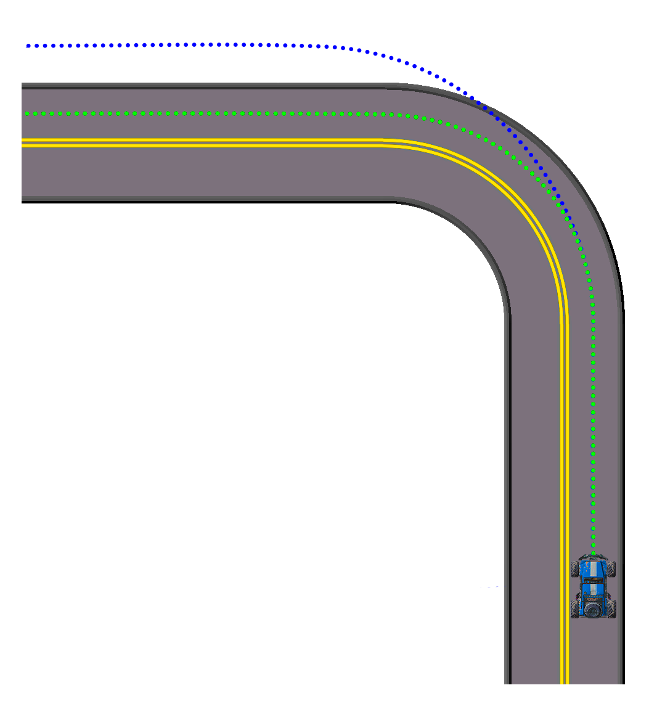
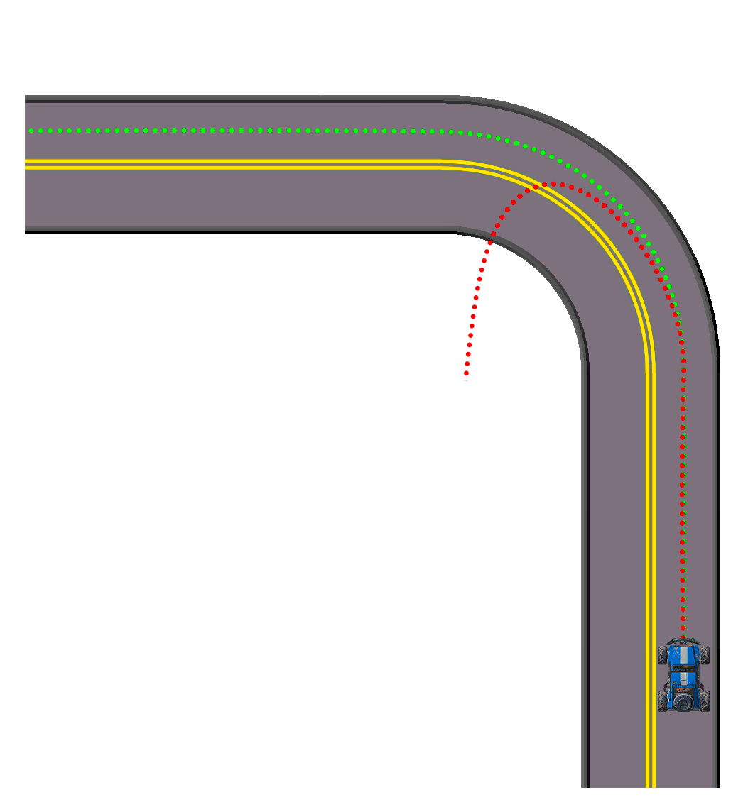
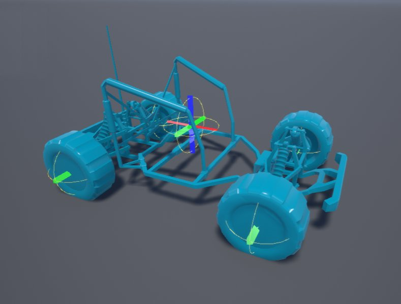
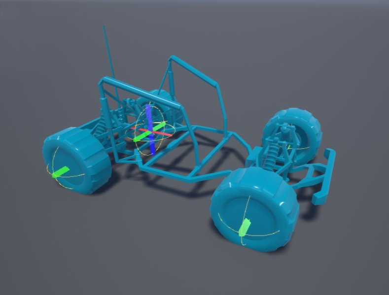

# 载具质量重心

> 路径：虚幻引擎5.7文档 / Gameplay系统 / 物理 / 载具 / Chaos载具 / 载具质量重心

> 原始页面：https://dev.epicgames.com/documentation/unreal-engine/vehicle-center-of-mass-in-unreal-engine

载具的重量分布对载具操控十分重要，因为它能影响载具的各种特性，例如操纵、加速和牵引。不同的载具类型根据用途的不同重量分布也不相同。在游戏开发中，这些特性还可以定义游戏的风格：街机风格的竞速游戏、模拟游戏，或者两者结合的游戏。通过改变 **质量重心（Center of Mass）**，你可以改变载具的重量分布。

在游戏中，质量重心主要用于载具，但也可用于封装不规则形状的大型物理形体。 在[物理资源](../../../physics-asset-editor/index.md)中，通常会使用一个大型物理形体来定义载具（或大型物体）的大部分质量。 该物理形体的中心将生成质量重心，这可能会使载具的操纵显得很奇怪， 因此你可以调整质量重心以找到载具质量的合适位置。

## 转向不足与过度转向

根据质量重心的位置，你可以把它移位成主要为前重，使载具倾向于 **转向不足**（拐弯时转向不足），或者主要为后重，使载具倾向于 **过度转向**（转向比预期更急剧）。 在大多数情况下，较为理想的是为质量重心找到中性平衡，这样可以更容易地操控载具。

Understeering

Oversteering

此外，在考虑质量重心的放置位置时，值得注意的是，这个选择会影响载具在空中的操纵。在此例中，质量重心已降低并靠近汽车尾部。它的重心低至地面并且可以快速达到高速，因此下尾部质量重心有助于稳定载具，尤其是载具跳跃时！

| 列 1 | 列 2 |
| --- | --- |
|  |  |
| 质量重心：X:0, Y:0, Z:0 | 质量重心：X:-25, Y:0, Z:-10 |

## 调试质量重心

为了在关卡编辑器中调试与物理对象关联的质量属性和惯性张量，可启用`显示`标志，只需转至 **显示（Show）** > **高级（Advanced）** > **质量属性（Mass Properties）**。

Center of Mass: X: 0, Y: 0, Z: 0

Center of Mass: X: -25, Y: 0, Z: -10

每个轴的粗细表示沿该轴的惯性矩大小。
