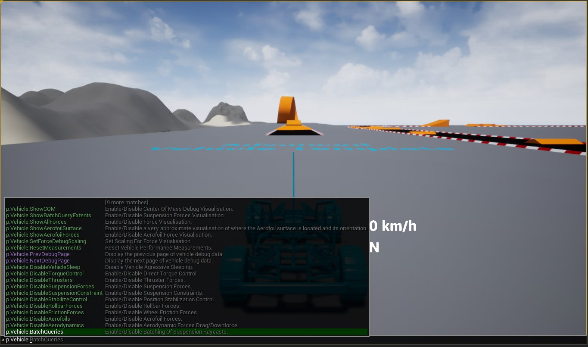
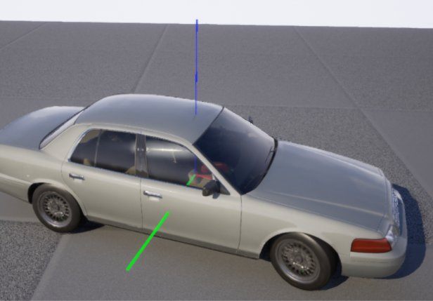
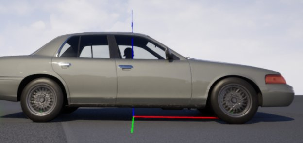

# 载具调试命令

> 路径：虚幻引擎5.7文档 / Gameplay系统 / 物理 / 载具 / Chaos载具 / 载具调试命令

> 原始页面：https://dev.epicgames.com/documentation/unreal-engine/vehicle-debug-commands-in-unreal-engine

**Chaos载具（Chaos Vehicles）** 随附了多种调试命令，可以让你查看载具模拟期间发生的事情。所有特定于载具的命令均以 `p.vehicle` 开头。这些命令通过在后面添加 `1` 进行启用，通过在后面添加 `0` 进行禁用。这些命令或者启用或禁用载具物理外形，或者在场景中渲染调试行。

很多调试渲染命令都是从物理线程进行调用的，需要首先用 `p.chaos.debugdraw.enabled 1` 命令启用，然后才能在场景中进行可视化。

p.Vehicle调试命令显示在编辑器命令控制台中

## 通用命令

通用命令适用于所有载具类型，包括可视化力和位置以及禁用特性和力。

### 可视化力和位置

| 命令 | 说明 |
| --- | --- |
| `p.Vehicle.ShowCOM` | 启用或禁用质心可视化。 |
| `p.Vehicle.ShowModelOrigin` | 启用或禁用原点可视化。 |
| `p.Vehicle.ShowAerofoilForces` | 启用或禁用原点可视化。 |
| `p.Vehicle.ShowAerofoilSurface` | 启用或禁用表面可视化。 |
| `p.Vehicle.ShowAllForces` | 启用或禁用力可视化。 |
| `p.Vehicle.SetForceDebugScaling` | 设置力可视化的刻度。如果力太大或线太长，则使用更小的值调低所渲染的线的刻度。 |

### 禁用特性和力

这些命令将关闭特定力，从而与其他力分隔开。这有助于区分在载具移动过程中产生特定行为的系统。

| 命令 | 说明 |
| --- | --- |
| `p.Vehicle.DisableSuspensionForces` | 禁用悬挂系统力与其他力的分隔。 |
| `p.Vehicle.DisableFrictionForces` | 禁用车轮摩擦力与其他力的分隔。 |
| `p.Vehicle.DisableRollbarForces` | 禁用悬挂系统辊棒力与其他力的分隔。 |
| `p.Vehicle.DisableTorqueControl` | 禁用直接扭矩控制。 |
| `p.Vehicle.DisableStabilizeControl` | 禁用位置稳定控制。 |
| `p.Vehicle.DisableAerodynamics` | 禁用气动力拖动力/下压力。 |
| `p.Vehicle.DisableAerofoils` | 禁用翼面力。 |
| `p.Vehicle.DisableThrusters` | 禁用推进力。 |

## 轮式载具命令

| 命令 | 说明 |
| --- | --- |
| `p.Vehicle.ShowWheelCollisionNormal` | 显示击中位置和车轮光线投射所击中的表面的法线。 |
| `p.Vehicle.ShowSuspensionRaycasts` | 显示悬挂系统的光线投射长度。颜色可以用来表示光线是击中了某些物体（绿色），还是未击中（红色）。 |
| `p.Vehicle.ShowSuspensionLimits` | 启用或禁用悬挂系统限制可视化。 |
| `p.Vehicle.ShowWheelForces` | 启用或禁用车轮力可视化。 |
| `p.Vehicle.ShowSuspensionForces` | 启用或禁用悬挂系统力可视化。 |
| `p.Vehicle.ShowRaycastComponent` | 显示车轮所接触（从光线投射命中位置）的组件的名称。 |
| `p.Vehicle.ShowRaycastMaterial` | 显示车轮所接触（从光线投射命中位置）的物理材质的名称。 |

## 载具命令重载

| 命令 | 说明 |
| --- | --- |
| `p.Vehicle.ControlInputWakeTolerance` | 设置控制点输入用于唤醒载具（如果载具处于休眠状态）的阈值。默认值为0.02。 |
| `p.Vehicle.TraceTypeOverride` | 全局重载光线追踪类型。值1使用简单碰撞，而值2则使用复杂碰撞。 |
| `p.Vehicle.SetMaxMPH` | 设置最高速度重载，单位为"英里/小时"，可以影响所有载具。有助于调试问题，可以与节流重载功能搭配使用。 |
| `p.Vehicle.ThrottleOverride` | 全局重载节流控制输入（范围为0到1）。此功能有助于立即测试很多载具在开动之后的表现。 |
| `p.Vehicle.SteeringOverride` | 全局重载转向值（范围为-1到1）。此功能有助于立即测试很多载具在开动之后的表现，因为可以将其设置为在某种地貌上开动多少圈。 |
| `p.Vehicle.BatchQueries` | 成批启用或禁用悬挂系统的光线投射。 |
| `p.Vehicle.EnableMultithreading` | 启用或禁用所有载具的并行更新。如果怀疑发生线程崩溃，则可以将载具管理器从并行更新模式切换到序列更新模式。此功能一次模拟一个载具。 |

## 载具统计命令

| 命令 | 说明 |
| --- | --- |
| `stat ChaosVehicle` | 显示载具模拟不同部件的计时。 |
| `stat ChaosVehicleManager` | 显示用于模拟场景中所有载具的计时。此外还可以显示计数器，以显示载具数量，以及当前唤醒或休眠的载具的比例。 |

## 使用质心

质心的位置对载具处理具有重要影响。质心位置高将导致载具在转角处出现更多的翻滚，或者在加速和刹车时下降更多的高度。

前移质心将使将导致转向反应变慢，因为传动轴距离后轮更远，而距离前轮更近。这意味着后轮上的水平力对载具的角旋转比前轮具有更大的影响。

在调试载具行为时，可视化质心的位置是最有用的工具之一。骨骼网格体上定义的 **质心偏移（Center Of Mass Offset）** 可以按照根据碰撞模型计算出的最初位置来移动质心位置。质心可视化命令 `p.Vehicle.ShowCOM 1` 显示质心在应用任何偏移后的当前位置。

