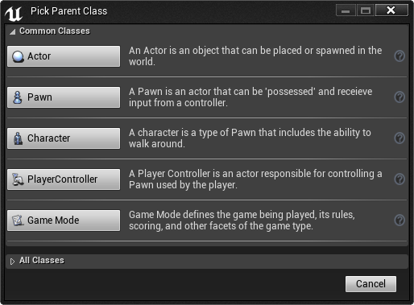

# 设置游戏模式

> 路径：虚幻引擎5.7文档 / Gameplay教程 / 设置游戏模式

> 原始页面：https://dev.epicgames.com/documentation/unreal-engine/setting-up-a-game-mode-in-unreal-engine

**GameMode**将定义游戏的规则。 规则可以包括玩家加入游戏的方式、游戏暂停和关卡过渡以及任何游戏特定的行为，如获胜条件。 每个关卡都设置了 GameMode，而且 GameMode 可在多个关卡中重复使用。

## 实现指南

This guide covers how to create a GameMode Blueprint and set default values for it, how to assign a Default GameMode for your game, and how to override the Default GameMode through the World Settings and GameMode Override option.

### Creating a Game Mode Blueprint

The steps below will guide you in creating and setting up defaults for a **Game Mode** Blueprint.

> [!NOTE]
> For this example, we are using the **Blueprint Third Person Template**; however you can use any project you wish.

1. In the **Content Browser**, click the **Add New** button.
2. Select **Blueprint Class** from the **Create Basic Asset** section of the dropdown menu.

   > [!NOTE]
   > You can create several different [types of Blueprint Assets](https://dev.epicgames.com/documentation/assets/programming-and-scripting/blueprints-visual-scripting/UserGuide/Types) from the **Blueprints** option under **Create Advanced Asset**.
3. Choose a **Parent Class** for your Blueprint Asset. See [Parent Classes](../../blueprints-visual-scripting/specialized-blueprint-visual-scripting-node-groups/types-of-blueprints/blueprint-class-assets/index.md) for more information.

   

In the **Pick Parent Class** window, select the **Game Mode Base** Class. This is the parent class for all Game Modes.

### Editing the Game Mode Defaults

1. **Double-click** on the Blueprint to open it, click the **Class Defaults** button to open the Blueprint Defaults in the **Details** panel.
2. Under the **Game Mode** are several options that you can set as the game's default settings (default character, HUD, etc.).

   Here we are assigning the Character Blueprint called ThirdPersonCharacter as the Default Pawn Class for players to use in the game.

   > [!NOTE]
   > The **Game Mode** Blueprint points to existing Blueprints of the Character, HUD, PlayerController, Spectator, and Game State Classes. You will need to create these separately then specify them for use in the Game Mode Blueprint in order to actually use them in your game.

### Assigning a Default Game Mode

In the previous section, we created a Game Mode Blueprint. Once you have a Game Mode Blueprint, you can assign it as the Default Game Mode to use in your game. The steps below will guide you through assigning the Default Game Mode through the Project Settings option.

1. From the Main Editor Window, click the **Edit** button from the Menu Bar, then select **Project Settings**.
2. In the **Project Settings** window, click the **Maps & Modes** option.
3. In **Maps & Modes** under **Default Modes**, click the **Default GameMode** drop-down box and assign the **GameMode** you wish to use.

   This will assign the **GameMode** you select as the **Default Game Mode** whenever the project is loaded.
4. If you click the arrow next to **Selected GameMode**, you will see the current settings used by the assigned **GameMode**.

   Here we can see that **ThirdPersonCharacter** is being used as the **Default Pawn Class**.

### Overriding the Default Game Mode

When you have a Default Game Mode assigned, you can overwrite it on a per level basis through the World Settings menu under the GameMode Override section. The steps below will show you how to override the default Game Mode.

1. From the Main Editor Window, click the **World Settings** button from the Main Toolbar.
2. This will open the **World Settings** option which will appear in the bottom right window where the **Details** tab is located.
3. Inside the **World Settings**, under **Game Mode**, you can click the **GameMode Override** drop-down box to change the **GameMode** used.
