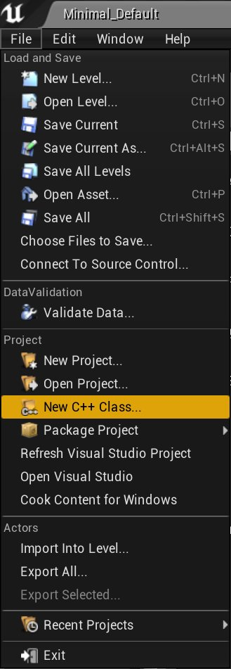
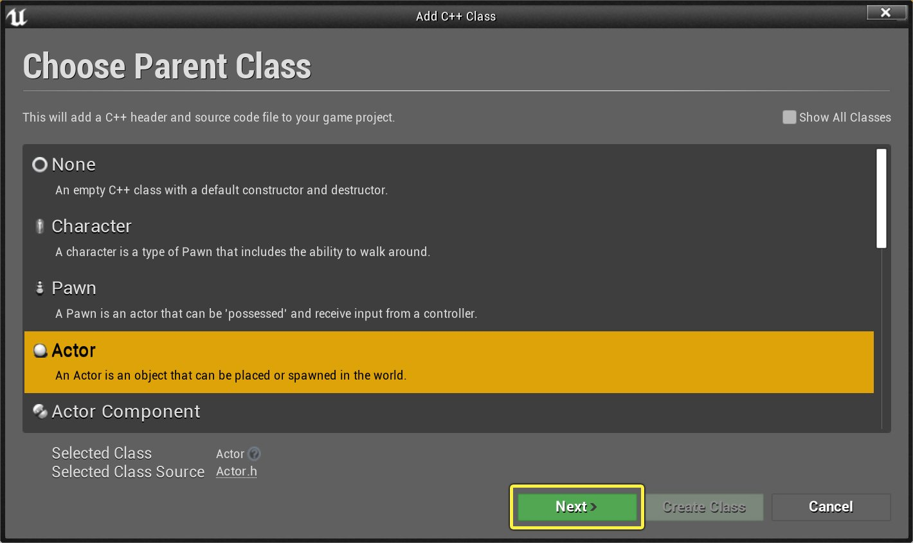
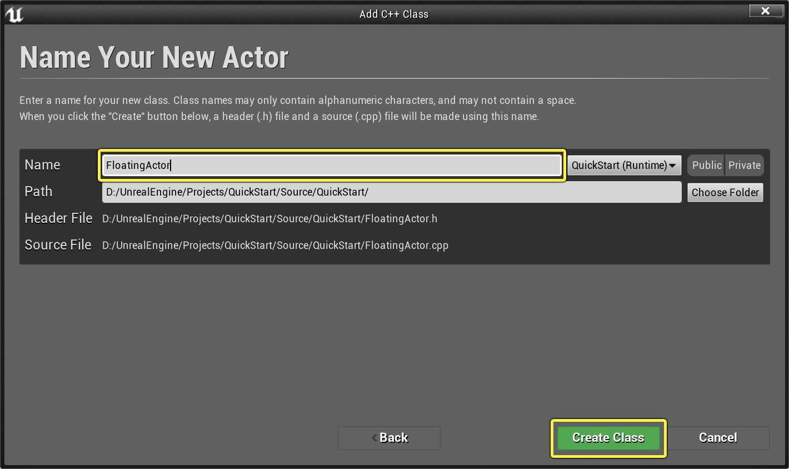
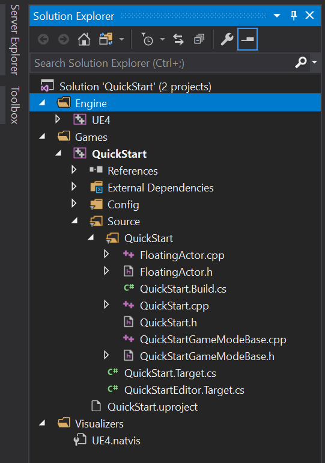
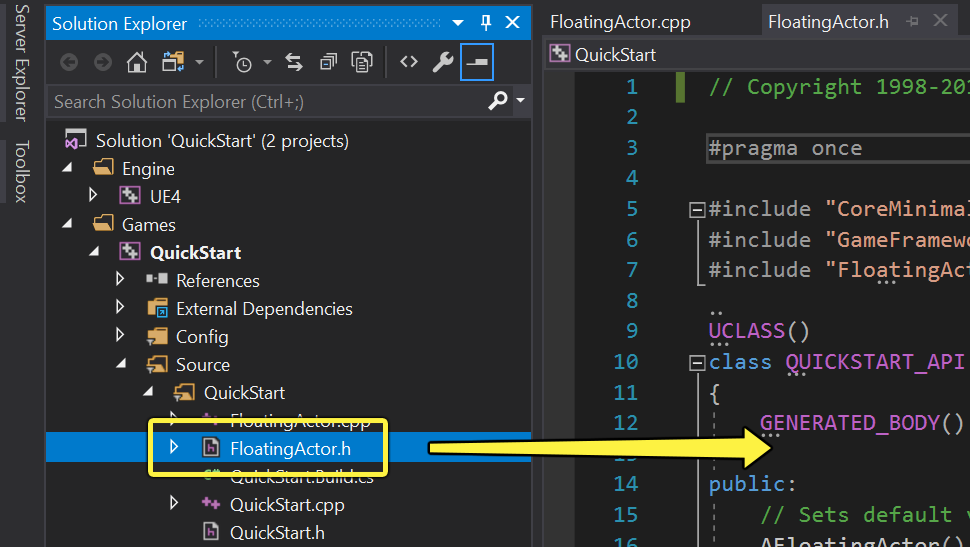
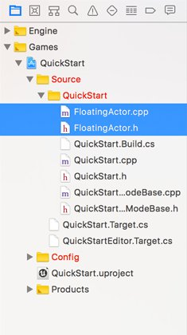

# 编程快速入门

> 路径：虚幻引擎5.7文档 / Gameplay教程 / C++编程教程 / 编程快速入门

> 原始页面：https://dev.epicgames.com/documentation/unreal-engine/unreal-engine-cpp-quick-start

选择操作系统：

Windows

macOS

Linux

在本快速入门指南中，你将学到如何在虚幻引擎中设置C++项目及在Visual Studio中编写首个C++ gameplay类。学完本教程后将了解如何进行下列操作：

- 创建新的C++项目
- 用C++创建新的Actor类
- 在开发环境中编辑该C++类，添加可视化展示和功能
- 编译项目
- 在虚幻编辑器中测试新Actor

本指南假定已将Visual Studio设为编程环境。如未设置，请参见[为虚幻引擎设置Visual Studio](https://dev.epicgames.com/documentation/404)了解Visual Studio安装和设置说明，以便将其用于虚幻引擎编程。我们还假定你在开始学习本指南前对使用 **虚幻编辑器** 有一定了解，但为方便起见，我们将逐一介绍从编辑器创建和管理C++类的所有必要步骤。本指南的最终产物将是一个在半空中轻盈地漂浮并不断旋转的立方体，让你在学习使用开发环境进行编程时拥有一个用来测试的简单对象。

本指南假定已将XCode设为编程环境。我们还假定你在开始学习本指南前对使用 **虚幻编辑器** 有一定了解，但为方便起见，我们将逐一介绍从编辑器创建和管理C++类的所有必要步骤。本指南的最终产物将是一个在半空中轻盈地漂浮并不断旋转的立方体，让你在学习使用开发环境进行编程时拥有一个用来测试的简单对象。

## 1. 必要设置

启动 **虚幻编辑器**。在 **项目浏览器** 窗口弹出后，点击 **游戏** 分类并选择 **空白** 模板。确保已启用了 **C++** 和 **初学者内容包**，选择项目的 **保存位置（Save Location）** 和 **名称**，然后点击 **创建项目（Create Project）**。在本示例中，我们将项目命名为QuickStart。

此操作将自动创建简单的空白项目，在解决方案中只有基本C++代码，而且其会自动在虚幻编辑器及Visual Studio中打开。欲了解管理和创建项目的更多信息，请参见[项目浏览器](../../../understanding-the-basics/working-with-projects-and-templates/creating-a-new-project/index.md)页面。

此操作将自动创建简单的空白项目，在解决方案中只有基本C++代码，而且其会自动在虚幻编辑器及XCode中打开。欲了解管理和创建项目的更多信息，请参见[项目浏览器](../../../understanding-the-basics/working-with-projects-and-templates/creating-a-new-project/index.md)页面。

> [!TIP]
> 任何蓝图项目均可转换为C++项目。如要对蓝图项目添加C++，请按下一节的说明创建新的C++类，编辑器将设置代码环境。 另外请注意，使用C++项目并不会妨碍使用蓝图。C++项目不过是使用C++代替蓝图来设置项目的基本类。

## 2. 创建新C++类

1. 在 **虚幻编辑器** 中，点击 **文件（File）** 下拉菜单，然后选择 **新建C++类...（New C++ Class...）** 命令。

   

   点击查看大图。
2. 此时将显示 **选择父类（Choose Parent Class）** 菜单。可以选择要扩展的现有类，将其功能添加到自己的类。选择 **Actor**，因为其是可在场景中放置的最基本对象类型，然后点击 **下一步（Next）**。

   

   点击查看大图。
3. 在 **为新Actor命名（Name Your New Actor）** 菜单中，将Actor命名为 **FloatingActor**，然后点击 **创建类（Create Class）**。

   

   点击查看大图。

   在内容浏览器中选中新类后，虚幻引擎将会自动编译并重新加载它，编程环境也将随 `FloatingActor.cpp` 自动打开。

## 3. 编辑C++类

现在我们已创建C++类，将切换到Visual Studio并编辑代码。

1. 在 **Visual Studio** 中，找到默认情况下显示在窗口左侧的 **解决方案浏览器**，然后用其找到 `FloatingActor.h`。在项目中，它将位于 **Games> QuickStart > Source > QuickStart** 下。

   
2. 双击 `FloatingActor.h` 打开它，并在文本编辑器中将它放到前台。

   

   此为 *标头* 文件。可以将它视作C++类的目录之类的东西。 要开始编译任何新功能，必须首先声明在此文件中使用的所有新 **变量** 或 **函数**。
3. 在 **AFloatingActor()** 的声明下面添加下列代码：

   ```
            UPROPERTY(VisibleAnywhere)         UStaticMeshComponent* VisualMesh;		
   ```

   这里声明的是 **StaticMeshComponent**，它将担当对象的视觉表示。请注意，它使用 **UProperty** 宏，这使它在虚幻编辑器中可见。 欲了解UProperty及其说明符的更多信息，请参见[属性](https://dev.epicgames.com/documentation/unreal-engine/unreal-engine-uproperties)页面。
4. 现在打开 `FloatingActor.cpp`，在 **AFloatingActor::AFloatingActor()** 中将下列代码添加到右大括号前：

   ```
            VisualMesh = CreateDefaultSubobject<UStaticMeshComponent>(TEXT("Mesh"));         VisualMesh->SetupAttachment(RootComponent);		         static ConstructorHelpers::FObjectFinder<UStaticMesh> CubeVisualAsset(TEXT("/Game/StarterContent/Shapes/Shape_Cube.Shape_Cube"));		         if (CubeVisualAsset.Succeeded())         {             VisualMesh->SetStaticMesh(CubeVisualAsset.Object);             VisualMesh->SetRelativeLocation(FVector(0.0f, 0.0f, 0.0f));         }		
   ```

   此函数是 *构造函数*，它在类首次创建时告诉该类如何初始化自身。我们添加的代码将会在VisualMesh引用中填充新的StaticMeshComponent、 将它附加到Actor，并将它设为 **初学者内容包** 资源中的立方体模型。欲了解在代码中附加组件的更多信息，请参见[创建和附加组件](../quick-start-guide-to-components-and-collision-i-18905f7e/index.md)的指南。
5. 在 **AFloatingActor::Tick(float DeltaTime)** 中将下列代码添加到右大括号前：

   ```
            FVector NewLocation = GetActorLocation();         FRotator NewRotation = GetActorRotation();         float RunningTime = GetGameTimeSinceCreation();         float DeltaHeight = (FMath::Sin(RunningTime + DeltaTime) - FMath::Sin(RunningTime));         NewLocation.Z += DeltaHeight * 20.0f;       //Scale our height by a factor of 20         float DeltaRotation = DeltaTime * 20.0f;	//Rotate by 20 degrees per second         NewRotation.Yaw += DeltaRotation;         SetActorLocationAndRotation(NewLocation, NewRotation);		
   ```

   我们在 **Tick** 函数中添加要实时执行的代码。在此例中，它将使立方体在上下浮动的同时旋转。 欲了解对Actor进行Tick的更多信息，请参见[Actor更新](../../../gameplay-systems/gameplay-framework/actors/actor-ticking/index.md)。

现在我们已创建C++类，将切换到XCode并编辑代码。

1. 在 **XCode** 中，找到默认情况下显示在窗口左侧的 **项目导航器**，然后用其找到 `FloatingActor.h`。在项目中，它将位于 **Games> QuickStart > Source > QuickStart** 下。

   
2. 双击 `FloatingActor.h` 将其打开，并在文本编辑器中将它放到前台。此为 *标头* 文件。可以将它视作C++类的目录。 要开始编译任何新功能，必须首先声明在此文件中使用的所有新 **变量** 或 **函数**。
3. 在 **AFloatingActor()** 的声明下面添加下列代码：

   ```
            UPROPERTY(VisibleAnywhere)         UStaticMeshComponent* VisualMesh;		
   ```

   这里声明的是 **StaticMeshComponent**，它将担当对象的视觉表示。请注意，它使用 **UProperty** 宏，这使它在虚幻编辑器中可见。 欲了解UProperty及其说明符的更多信息，请参见[属性](https://dev.epicgames.com/documentation/unreal-engine/unreal-engine-uproperties)页面。
4. 现在打开 `FloatingActor.cpp`，在 **AFloatingActor::AFloatingActor()** 中将下列代码添加到右大括号前：

   ```
            VisualMesh = CreateDefaultSubobject<UStaticMeshComponent>(TEXT("Mesh"));         VisualMesh->SetupAttachment(RootComponent);		         static ConstructorHelpers::FObjectFinder<UStaticMesh> CubeVisualAsset(TEXT("/Game/StarterContent/Shapes/Shape_Cube.Shape_Cube"));		         if (CubeVisualAsset.Succeeded())         {             VisualMesh->SetStaticMesh(CubeVisualAsset.Object);             VisualMesh->SetRelativeLocation(FVector(0.0f, 0.0f, 0.0f));         }		
   ```

   此函数是 *构造函数*，它在类首次创建时告诉该类如何初始化自身。我们添加的代码将会在VisualMesh引用中填充新的StaticMeshComponent、 将它附加到Actor，并将它设为 **初学者内容包** 资源中的立方体模型。欲了解在代码中附加组件的更多信息，请参见[创建和附加组件](../quick-start-guide-to-components-and-collision-i-18905f7e/index.md)的指南。
5. 在 **AFloatingActor::Tick(float DeltaTime)** 中将下列代码添加到右大括号前：

   ```
            FVector NewLocation = GetActorLocation();         FRotator NewRotation = GetActorRotation();         float RunningTime = GetGameTimeSinceCreation();         float DeltaHeight = (FMath::Sin(RunningTime + DeltaTime) - FMath::Sin(RunningTime));         NewLocation.Z += DeltaHeight * 20.0f;       //Scale our height by a factor of 20         float DeltaRotation = DeltaTime * 20.0f;	//Rotate by 20 degrees per second         NewRotation.Yaw += DeltaRotation;         SetActorLocationAndRotation(NewLocation, NewRotation);		
   ```

   我们在 **Tick** 函数中添加要实时执行的代码。在此例中，它将使立方体在上下浮动的同时旋转。 欲了解对Actor进行Tick的更多信息，请参见[Actor更新](../../../gameplay-systems/gameplay-framework/actors/actor-ticking/index.md)。

## 4. 编译和测试C++代码

1. **保存** 在 `FloatingActor.h` 以及 `FloatingActor.cpp` 中的工作成果。然后在 **解决方案浏览器** 中右键点击项目，点击快捷菜单中的 **编译（Build）** 命令，然后等待项目完成编译。

   应会在窗口底部的 **输出** 日志中看到一条显示"已成功（Succeeded）"的消息。

   或者，可以回到 **虚幻编辑器**，点击屏幕顶部工具栏中的 **编译（Compile）** 按钮。

> [!NOTE]
> 一定要在尝试编译前保存工作，否则在代码中做的更改将不会生效。

1. 在 **虚幻编辑器** 中，转到 **内容浏览器**，展开 **C++类（C++ Classes）**，然后找到 **FloatingActor**。它将位于与项目同名的文件夹中，在范例中是QuickStart。
2. 点击 **FloatingActor** 并将它拖进 **透视视口** 来创建FloatingActor的实例。它将在 **世界大纲视图** 中作为"FloatingActor1"处于被选中状态，它的属性将显示在 **细节（Details）** 面板中。

   欲了解在视口中导航和在世界场景中放置Actor的信息，请参见[关卡设计器快速入门](https://dev.epicgames.com/documentation/unreal-engine/level-designer-quick-start-in-unreal-engine)。
3. 在 **FloatingActor1** 的 **细节（Details）** 面板中，将Actor的 **位置（Location）**设置为（-180、0、180）。此操作会将其放置在默认场景中桌子的正上方。

   或者也可使用移动小工具手动将其移到该处。
4. 按屏幕顶部的 **在编辑器中运行（Play In Editor）** 按钮。

1. **保存** 在 `FloatingActor.h` 及 `FloatingActor.cpp` 中的工作成果。然后点击屏幕顶部的 **产品（Product）** 下拉菜单，选择 **编译（Build）** 命令，等待项目完成编译。

   应会在窗口底部的 **输出** 日志中看到一条显示"成功（Succeeded）"的消息。或者，可以回到 **虚幻编辑器**，点击屏幕顶部工具栏中的 **编译（Compile）** 按钮。

> [!NOTE]
> 一定要在尝试编译前保存工作，否则在代码中做的更改将不会生效。

1. 在 **虚幻编辑器** 中，转到 **内容浏览器**，展开 **C++类（C++ Classes）**，然后找到 **FloatingActor**。它将位于与项目同名的文件夹中，在范例中是QuickStart。
2. 点击 **FloatingActor** 并将它拖进 **透视视口** 来创建FloatingActor的实例。它将在 **世界大纲视图** 中作为"FloatingActor1"处于被选中状态，它的属性将显示在 **细节（Details）** 面板中。

   欲了解在视口中导航和在世界场景中放置Actor的信息，请参见[关卡设计器快速入门](https://dev.epicgames.com/documentation/unreal-engine/level-designer-quick-start-in-unreal-engine)。
3. 在 **FloatingActor1** 的 **细节（Details）** 面板中，将Actor的 **位置（Location）**设置为（-180、0、180）。此操作会将其放置在默认场景中桌子的正上方。

   或者也可使用移动小工具手动将其移到该处。
4. 按屏幕顶部的 **在编辑器中运行（Play In Editor）** 按钮。

## 5. 最终结果

此时应看到立方体在桌子上方轻盈地上下漂浮，同时缓慢旋转。

祝贺你！你已经完全用C++创建了首个Actor类。虽然它只能表示非常简单的对象，这也只是C++源代码所能实现的最简单功能， 但你目前已经了解了创建、编辑和编译游戏C++代码的所有基础知识。现在可以迎接更复杂的gameplay编程挑战啦，建议你进行以下操作。

## 6. 自己动手操作！

了解如何构建简单的C++ Actor之后，请尝试提高它的可配置性。例如添加变量来控制它的行为：

在 **FloatingActor.h** 中：

```
	...	public:		UPROPERTY(EditAnywhere, BlueprintReadWrite, Category="FloatingActor")		float FloatSpeed = 20.0f; 		UPROPERTY(EditAnywhere, BlueprintReadWrite, Category="FloatingActor")		float RotationSpeed = 20.0f;	... 
```

在 **FloatingActor.cpp** 中：

```
	...	NewLocation.Z += DeltaHeight * FloatSpeed;			//按FloatSpeed调整高度	float DeltaRotation = DeltaTime * RotationSpeed;	//每秒旋转等于RotationSpeed的角度	... 
```

通过在标头文件中添加这些变量，并替换在.cpp中用于缩放DeltaHeight和DeltaRotation的浮点值，可在选择Actor时在 **细节（Details）** 面板中编辑浮动和旋转速度。

可以尝试使用位置、旋转和比例向Tick函数添加其他类型的行为。

也可尝试在C++中附加其他类型的组件来创建更复杂的对象。请参见[创建和附加组件](../quick-start-guide-to-components-and-collision-i-18905f7e/index.md)指南来了解可使用的不同类型组件的范例， 并尝试添加粒子系统组件来为你的浮动对象增添一点光辉。

最后，如在 **内容浏览器** 中右键点击自己的Actor类，将看到在C++或蓝图中扩展它的选项，可以用来创建它的新变体。

可以建立FloatingActor的一整个库，其中每个都代表选择的不同网格体或参数。

## 范例代码

**FloatingActor.h**

```
	// 版权所有 1998-2019 Epic Games, Inc。保留所有权利。 	#pragma once 	#include "CoreMinimal.h"	#include "GameFramework/Actor.h"	#include "FloatingActor.generated.h" 	UCLASS()	class QUICKSTART_API AFloatingActor : public AActor	{		GENERATED_BODY() 	public:		// 设置此Actor属性的默认值		AFloatingActor(); 		UPROPERTY(VisibleAnywhere)		UStaticMeshComponent* VisualMesh; 	protected:		// 游戏开始时或生成时调用		virtual void BeginPlay() override; 	public:		// 逐帧调用		virtual void Tick(float DeltaTime) override; 	}; 
```

**FloatingActor.cpp**

```
	// 版权所有 1998-2019 Epic Games, Inc。保留所有权利。 	#include "FloatingActor.h" 	// 设置默认值	AFloatingActor::AFloatingActor()	{		// 将此Actor设为逐帧调用Tick()。如无需此功能，可关闭以提高性能。		PrimaryActorTick.bCanEverTick = true; 		VisualMesh = CreateDefaultSubobject<UStaticMeshComponent>(TEXT("Mesh"));		VisualMesh->SetupAttachment(RootComponent); 		static ConstructorHelpers::FObjectFinder<UStaticMesh> CubeVisualAsset(TEXT("/Game/StarterContent/Shapes/Shape_Cube.Shape_Cube")); 		if (CubeVisualAsset.Succeeded())		{			VisualMesh->SetStaticMesh(CubeVisualAsset.Object);			VisualMesh->SetRelativeLocation(FVector(0.0f, 0.0f, 0.0f));		}	} 	// 游戏开始时或生成时调用	void AFloatingActor::BeginPlay()	{		Super::BeginPlay(); 	} 	// 逐帧调用	void AFloatingActor::Tick(float DeltaTime)	{		Super::Tick(DeltaTime); 		FVector NewLocation = GetActorLocation();		FRotator NewRotation = GetActorRotation();		float RunningTime = GetGameTimeSinceCreation();		float DeltaHeight = (FMath::Sin(RunningTime + DeltaTime) - FMath::Sin(RunningTime));		NewLocation.Z += DeltaHeight * 20.0f;       //Scale our height by a factor of 20		float DeltaRotation = DeltaTime * 20.0f;	//Rotate by 20 degrees per second		NewRotation.Yaw += DeltaRotation;		SetActorLocationAndRotation(NewLocation, NewRotation);	}
```
