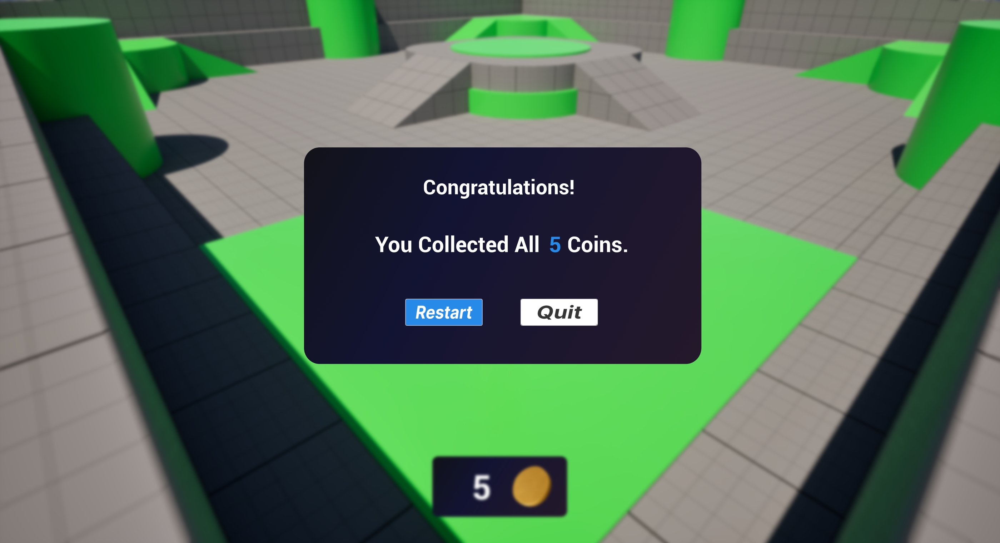

# 初识虚幻引擎

> 路径：虚幻引擎5.7文档 / 入门指南 / 初识虚幻引擎

> 原始页面：https://dev.epicgames.com/documentation/unreal-engine/first-hour-in-unreal-engine

欢迎来到《初识虚幻引擎》！

在这个系列教程中，我们将讲解使用虚幻引擎构建小型游戏的基础知识，从安装首个引擎版本到学习如何打包项目以便与他人分享。

课程概述

接下来的一小时你将学习以下内容：

- 通过Epic Games启动程序安装虚幻引擎
- 使用项目模板创建首个项目
- 关卡视口中的导航操作
- 创建第一个关卡
- 使用玩家蓝图进行开发
- 通过增强型输入操作映射构建手电筒功能
- 运用蓝图创建可收集物品
- 使用虚幻动态图形创建抬头显示（HUD）/用户界面（UI）
- 制作游戏结束画面与暂停菜单
- 打包项目以供分享

在本系列教程中，你将构建一个包含手电筒与收集物的小型3D平台跳跃游戏，这样可以为你开发更大型地游戏奠定良好的基础。

## 技术要求

本系列教程要求使用虚幻引擎5.3或更高版本。

### 项目文件

平台跳跃游戏UI项目文件

完整的示例项目文件

### 目录

- [模块1：安装UE并创建第一个项目](module-1-install-ue-and-create-your-first-project/index.md) - 学习安装虚幻引擎、创建项目以及导航视口，为后续开发做好准备。
- [模块2：使用增强输入创建手电筒](module-2-create-a-flashlight-with-enhanced-input/index.md) - 使用玩家蓝图和增强型输入为玩家创建手电筒。
- [模块3：使用蓝图创建硬币拾取物](module-3-create-a-coin-pickup-with-modeling-too-f339a5c4/index.md) - 借助编辑器内的建模工具、材质编辑器与蓝图系统，创建可供玩家收集的金币道具。
- [模块4：使用虚幻动态图形构建HUD](module-4-build-a-hud-with-unreal-motion-graphics/index.md) - 通过虚幻动态图形与蓝图编程，创建包含控件元素的HUD。
- [模块5：创建游戏结束界面](module-5-create-the-game-over-screen/index.md) - 运用控件系统与自定义美术素材，创建当所有金币收集完成后显示的游戏结束画面。
- [模块6：打包项目](module-6-package-your-project/index.md) - 构建并打包已完成的项目，以便与亲友分享你的游戏。
