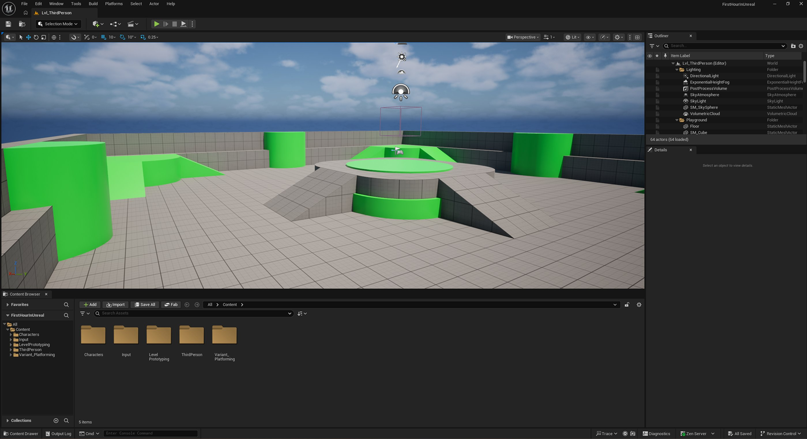

# 模块1：安装UE并创建第一个项目

> 路径：虚幻引擎5.7文档 / 入门指南 / 初识虚幻引擎 / 模块1：安装UE并创建第一个项目

> 原始页面：https://dev.epicgames.com/documentation/unreal-engine/module-1-install-ue-and-create-your-first-project

安装虚幻引擎，创建项目，并导航视口，为后续开发做好准备。

模块1总结

在模块1中，我们将演示如何使用Epic Games启动程序安装虚幻引擎。 安装完成后，我们将引导你使用3D平台游戏模板创建你的第一个项目，并学习如何浏览界面。 你还将学习如何创建关卡并将其保存，为将来的开发做准备。

使用平台游戏变体的全新第三人称游戏。

### 安装虚幻引擎

通过Epic Games启动程序安装虚幻引擎

### 创建项目

创建第一个项目

### 视口导航

视口导航

### 保存和管理关卡

保存和管理关卡
