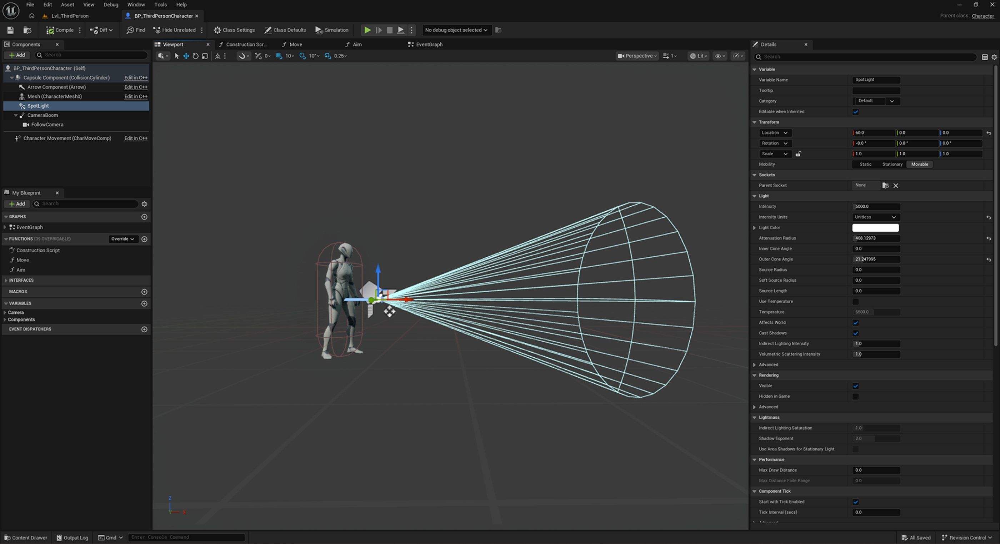

# 模块2：使用增强输入创建手电筒

> 路径：虚幻引擎5.7文档 / 入门指南 / 初识虚幻引擎 / 模块2：使用增强输入创建手电筒

> 原始页面：https://dev.epicgames.com/documentation/unreal-engine/module-2-create-a-flashlight-with-enhanced-input

使用玩家蓝图和增强型输入为玩家创建手电筒。

模块2概述

在模块2中，我们将了解如何使用玩家蓝图通过Spotlight组件和增强输入系统添加手电筒。

制作手电筒

### 玩家蓝图简介

玩家蓝图简介

### 在虚幻引擎中添加组件

为玩家蓝图添加组件

### 增强输入介绍

增强输入操作介绍

### 设置手电筒触发器

使用增强型输入操作映射设置手电筒开关切换
