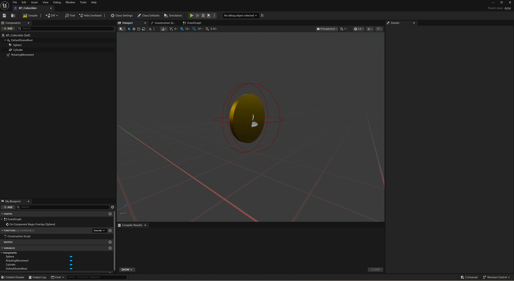

# 模块3：使用蓝图创建硬币拾取物

> 路径：虚幻引擎5.7文档 / 入门指南 / 初识虚幻引擎 / 模块3：使用蓝图创建硬币拾取物

> 原始页面：https://dev.epicgames.com/documentation/unreal-engine/module-3-create-a-coin-pickup-with-modeling-tools-and-blueprints

借助编辑器内的建模工具、材质编辑器与蓝图系统，创建可供玩家收集的金币道具。

模块3概述

在模块3中，我们将开始创建玩家可以在关卡中收集的金币拾取物。 你将学习如何使用引擎内的变换工具和材质编辑器为拾取道具创建视觉元素。 你还将添加一个屏幕上的金币计数器，以记录收集的金币数量，以及在收集所有金币时的游戏结束状态。

构建金币拾取物

### 创建金币

创建金币拾取的视觉效果

### 添加金币材质

创建金色材质并将其添加到金币网格体

### 构建金币计数器

在玩家蓝图中设置金币计数器

### 创建金币计数器

创建金币计数器功能

### 创建结束状态画面

创建最终状态
