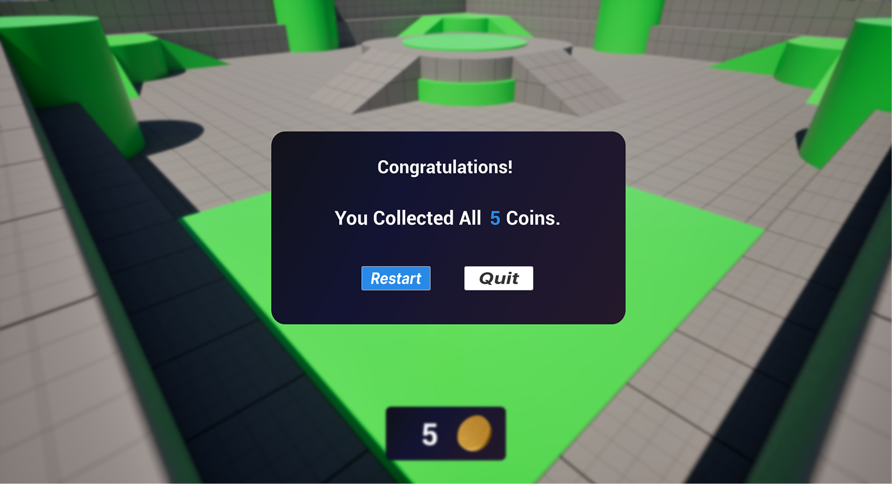

# 模块5：创建游戏结束界面

> 路径：虚幻引擎5.7文档 / 入门指南 / 初识虚幻引擎 / 模块5：创建游戏结束界面

> 原始页面：https://dev.epicgames.com/documentation/unreal-engine/module-5-create-the-game-over-screen

使用蓝图控件和自定义美术素材创建在收集完所有金币后显示的游戏结束画面。

模块5概述

在模块5中，我们将展示如何使用UMG创建游戏结束画面。 参考平台游戏项目文件中提供的最终作品，并学习如何创建自定义重启和退出按钮。

游戏结束画面

### 项目文件

平台跳跃游戏项目文件

### 创建游戏结束视觉效果

导入自定义美术素材并创建游戏结束控件

### 设计游戏结束画面

创建自定义按钮并显示“游戏结束”画面

### 创建游戏结束功能

创建用于重置或退出游戏的自定义按钮功能
