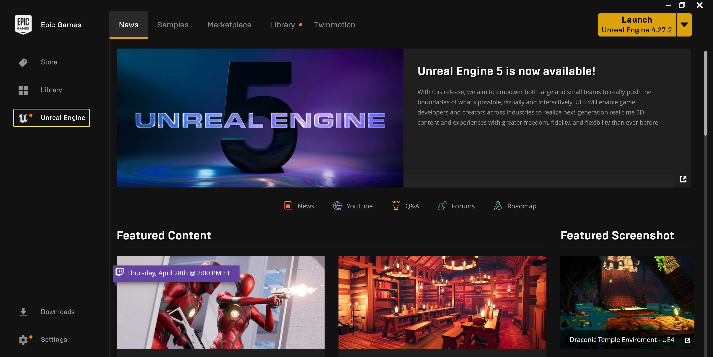
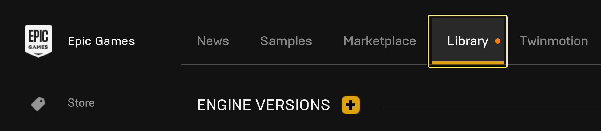
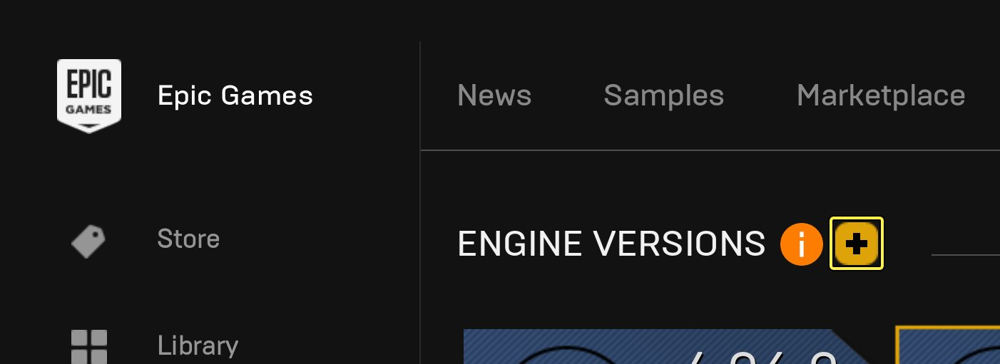
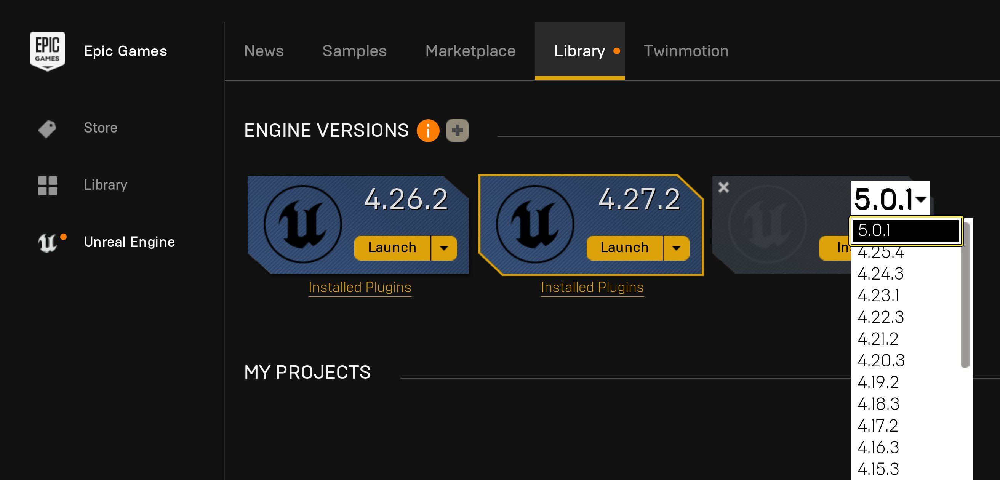
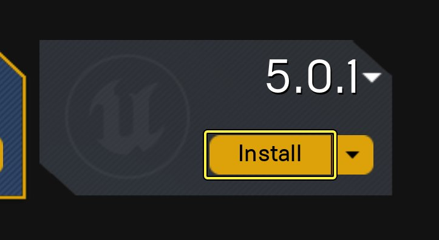
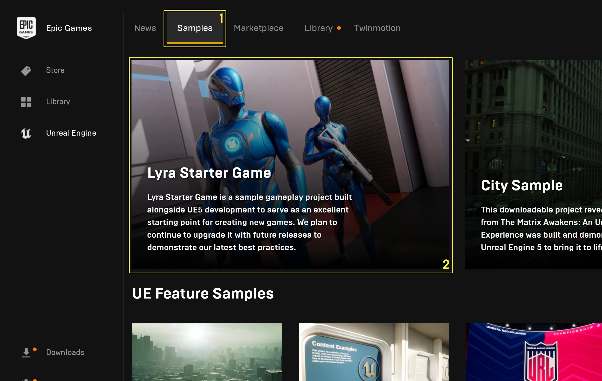
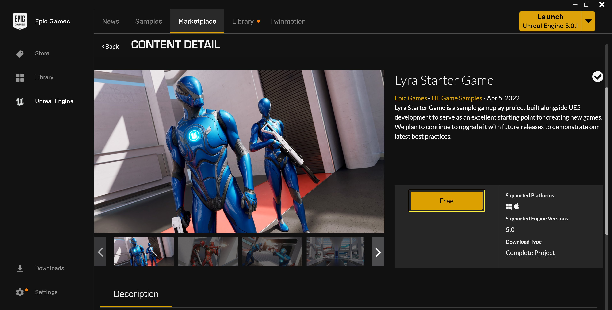
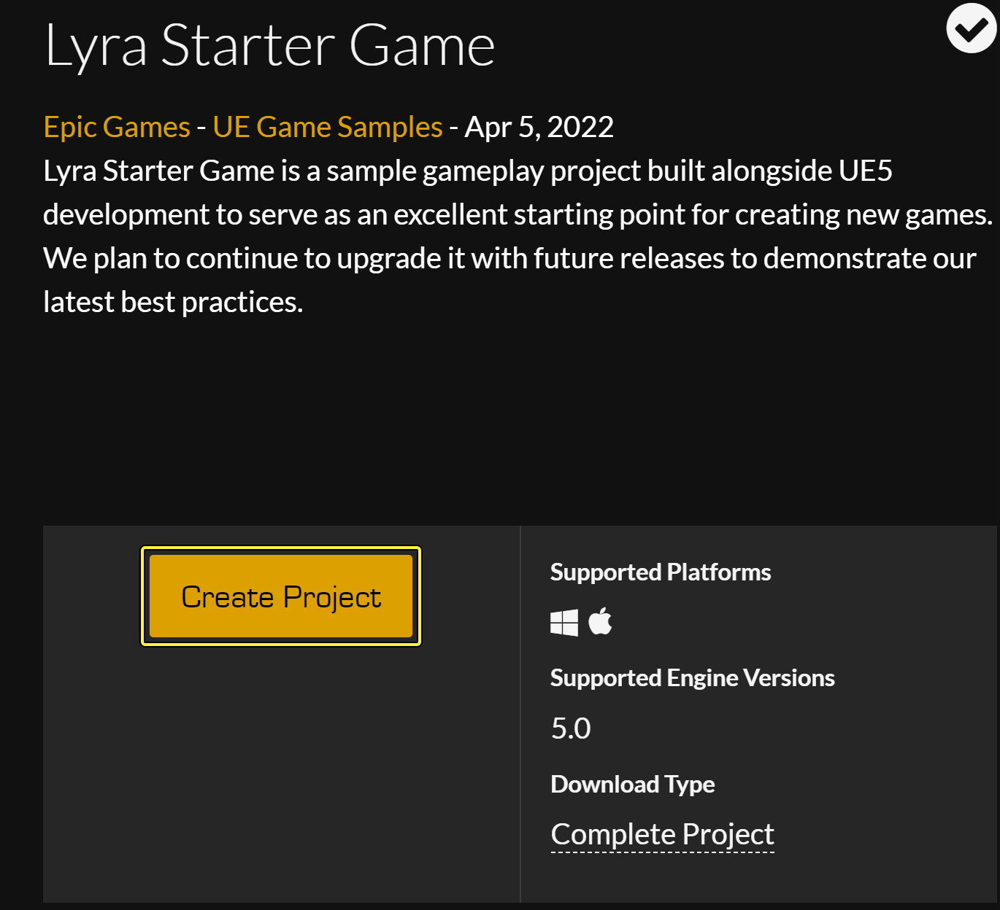

# 学院环境安装

> 路径：虚幻引擎5.7文档 / 入门指南 / 安装虚幻引擎 / 学院环境安装

> 原始页面：https://dev.epicgames.com/documentation/unreal-engine/academic-installation-of-unreal-engine

随着 **虚幻引擎（UE）** 在各大高校师生中的不断普及，经常有用户问我们该如何在学校计算机上分发UE，同时避免公开用于访问引擎的学术账号。如果你打算在学院环境中安装UE，那么本文将介绍如何借助部署自动化（deployment automation）来在学院环境中批量安装UE。

## 安装UE和内容

通常情况下，学校需要在许多台计算机上安装UE，例如在计算机实验室或教学室的计算机上。目前，我们没有为UE提供静默式（或一步式）安装程序，这意味着安装程序至少需要在学院环境中的计算机上手动运行一次。不过，相比将安装了程序的计算机镜像，或者在教室的其他计算机上手动运行安装程序，我们采用了部分的自动化部署过程。

请在学院环境执行以下步骤来安装UE：

### 使用启动程序

> [!NOTE]
> 如果你的学校网络使用了代理服务器，最好使用[GitHub上的UE](https://www.unrealengine.com/en-US/ue4-on-github)版本，因为启动程序将无法透过（代理）服务器运行。但是，如果你更偏向于透过代理服务器通过启动程序使用虚幻引擎，请与你的IT部门联系，让他们打开7777或7778端口。但是，请记住，打开这些端口并不能始终保证启动程序可以透过代理服务器打开或更新。

1. 使用以下链接下载最新安装程序：

   - [PC - MSI](https://launcher-public-service-prod06.ol.epicgames.com/launcher/api/installer/download/EpicGamesLauncherInstaller.msi)
   - [macOS - DMG](https://launcher-public-service-prod06.ol.epicgames.com/launcher/api/installer/download/EpicGamesLauncher.dmg)
2. 在想要生成映像的计算机上[运行安装程序](https://dev.epicgames.com/documentation/404)。
3. 在安装程序完成例行操作后，启动程序会自动运行，使你能够使用你的Epic Games账号密码登录。
4. 要下载并安装最新版本的UE，先选择 **虚幻引擎** 侧边栏选项。

   

   点击查看大图。

   1. 然后选择顶部的 **库（Library）**。

      
   2. 现在，选择 **引擎版本（+）（Engine Versions (+)）** 图标。

      
   3. 打开下拉列表，选择要下载的引擎版本。就本文而言，请选择 **5.0.1** 版本。

      
   4. 最后，点击 **安装（Install）** 按钮，按照安装程序的提示将虚幻引擎5.0.1安装到你的计算机上。

      
5. 一些教师在课程中会使用我们的学习示例，让我们假设某位教授游戏设计的讲师想用我们的Lyra初学者游戏示例作为教学工具。要下载Lyra，他们需要选择 **示例（Samples）** 选项卡 (1)，然后点击[Lyra Starter Game](../../../samples-and-tutorials/sample-game-projects/lyra-sample-game/index.md) (2)。

   

   点击查看大图。

   1. 在Lyra Starter Game的 **内容细节（Content Detail）** 菜单中，先点击 **免费（Free）** 来获取内容。EULA窗口会出现。

      

      点击查看大图。

      > [!NOTE]
      > 在下载学习示例之前，请参阅 **内容详情（Content Detail）** 菜单中的 **支持的平台（Supported Platforms）** 和 **支持的引擎版本（Supported Engine Version）** 部分，我们在部署新版本时将更新这些部分。
   2. 接受EULA，然后按钮会变为 **创建项目（Create Project）**，点击它开始设置项目。

      
   3. 点击 **创建（Create）** 按钮之前，先设置 **项目的名称** 和 **安装目录**，如果需要的话，设置 **引擎版本**。

      > 图片已省略：The Lyra Starter Game install location
   4. 当Lyra Starter Game安装完成后，你会在 **库（Library）> 我的项目（My Projects）** 菜单中看到它。也可以在保管库（Vault）中创建新项目。

      > 图片已省略：The Lyra Starter Game project showing in My Projects
6. 如果你在 **库（Library）> 我的项目（My Projects）** 菜单中发现有任何自动创建的项目，请删除它们。

   > [!WARNING]
   > 如果你不将启动程序自动创建的项目删除，可能会给在共享计算机（Share-machine）上使用相同项目的用户带来问题。这也包括之前示例中创建的Lyra Starter Game，你仍然能在保管库中找到它。
7. 删除所有自动创建的项目后，你可以将该计算机的设置镜像到班级中的其他计算机上。或者，你可以保存该计算机映像，以便将其分发到实验室的其他计算机上。

### 通过GitHub安装

请（按序）访问以下页面，了解如何从GitHub下载、安装和更新UE：

1. [访问GitHub上的虚幻引擎4](https://www.unrealengine.com/en-US/ue4-on-github)
2. [下载虚幻引擎源代码](../downloading-source-code/index.md)
3. [合并Epic的最新更新内容](../downloading-source-code/building-unreal-engine-from-source/index.md)

## 执行更新

安装完UE后，你就可以在学院环境中使用引擎和免费内容了。不过，别忘了适时更新引擎，因为每当发布新版UE或者发布了引擎内容时，你可以通过复制相关文件来更新镜像或将新的内容分发到安装计算机，你可以使用脚本自动执行这些操作。

阅读以下几个章节，了解如何在学院环境中更新UE和引擎内容：

### 使用启动程序

1. 在中央计算机上打开启动程序并导航到 **库（Library）** 菜单。
2. 选择 **引擎版本（+）（Engine Versions (+)）** 图标。
3. 在启动程序下载最新版本的UE之后，你可以更新镜像。

> [!TIP]
> 如果你不希望使用启动程序执行更新，请阅读以下部分，了解如何将UE的更新内容复制到实验室的计算机上。

### 复制UE和内容

1. 请将以下目录从主计算机复制到你想要更新的各台计算机上：

   - (Local Directory)\Epic Games\Launcher\VaultCache
   - `[Local Directory]\Epic Games\(Engine Version)`

     > [!NOTE]
     > - 一些情况下，启动程序可能位于
     >
     >   C:\Program Files (x86)
     >
     >   文件夹里。
     > - 如果你想复制某个特定版本，例如5.0版本，你可以复制
     >
     >   C:\Program Files (x86)\Epic Games\(此处是引擎版本)
     >
     >   ，或者，你可以使用通配符(
     >
     >   *
     >
     >   )来自动复制所有引擎版本，类似于
     >
     >   C:\Program Files (x86)\Epic Games\*
     >
     >   。
2. 在需要进行更新的所有计算机上创建以下目录：`[本地驱动器号]\ProgramData\Epic\EpicGamesLauncher\Data\Manifests`。
3. 假设你最近下载了该引擎，请将最近下载的 `.item` 文件从 `[本地硬盘盘符]\ProgramData\Epic\EpicGamesLauncher\Data\Manifests` 复制到计算机的本地Manifest目录（上一步）。

   > [!NOTE]
   > 例如，item文件可能类似于 `~\Manifests\6CB2FA12345680D212345678B525AE86.item`。
4. 要验证你是否复制了最近下载的item文件，请在文本编辑器中打开item文件并搜索 `"AppName"`。

完成这些步骤之后，启动程序将在用户运行启动程序时自动检测更新。对于新引擎版本和从虚幻商城下载的内容来说，都是如此。

> [!TIP]
> 如果你想要禁止启动程序自动检测更新，请阅读以下部分。

## 禁用自动更新

默认情况下，启动程序会在其启动过程中自动检查更新。为了避免启动程序因更新而占用课堂时间，请执行以下步骤：

1. 右键单击 **EpicGamesLauncher - 快捷方式（Shortcut）**，打开启动程序的右键菜单。
2. 选择 **属性（Properties）** 以打开文件的 **属性（Properties）** 窗口。
3. 在 **快捷方式（Shortcut）** 选项卡中找到 **目标：（Target:）** 属性，并在目标行的结尾处添加-noselfupdate命令。

> [!TIP]
> 下课后，请不要忘记重新启用启动程序的更新功能。

## 适用于学生的最佳实践

有些情况可能会影响你的学生访问UE（或下载内容）。例如，你的学校可能会出于安全（或教学资源）等原因定期清理计算机，这可能会影响学生的学习进度。为了帮助这些学生，我们收集了一些最佳实践，以便课堂中的学生应对一些因为使用UE而遇到的常见问题。

### 在网络中断期间

在网络中断期间，学生可以在登录时选择 **以离线模式继续（Continue in Offline Mode）** 选项来运行启动程序。

> 图片已省略：undefined

点击查看大图。

在以离线模式登录之后，学生可以访问UE、他们的项目，以及之前下载的内容。

### 为内存清理做准备

如果你的学校会定期清理计算机（或驱动器）的内存，将学生的计算机返回到它们的基础映像，则学生必须将他们的工作保存在一个不会被清理（或清除）的目录中。

1. 例如，假设一名学生从库（Library）选项卡中的保管库创建了一个新的Lyra Starter Game项目。

   > 图片已省略：保管库中的Lyra Starter Game
2. 在创建新项目时，学生应该指定一个文件夹（或网络目录，例如沙盒驱动器）使其不会因为计算机的重新映像而被删除。

   > 图片已省略：将Lyra Starter Game安装到沙盒驱动器，使其不会因为计算机的重新映像而被删除。

> [!NOTE]
> 只要学校政策允许，学生一般都会使用启动程序下载额外内容，但是，如果下载的内容没有保存在镜像驱动器中，则很有可能在重新映像期间被清理。
