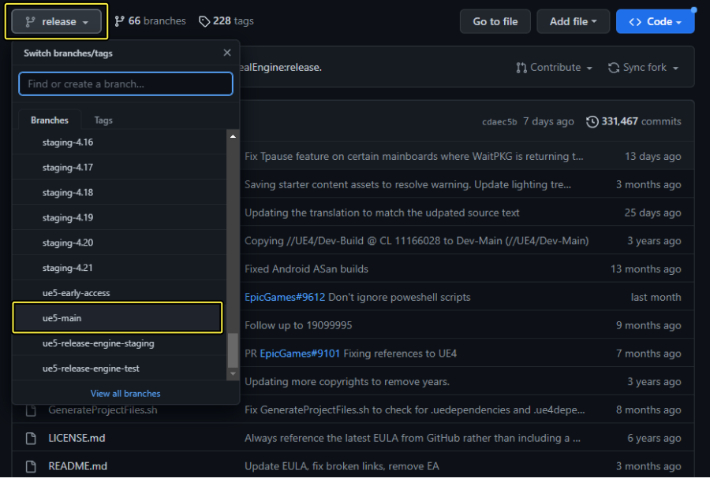
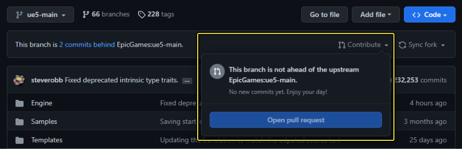
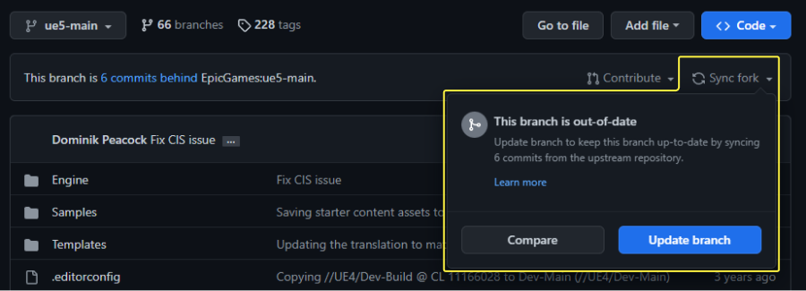
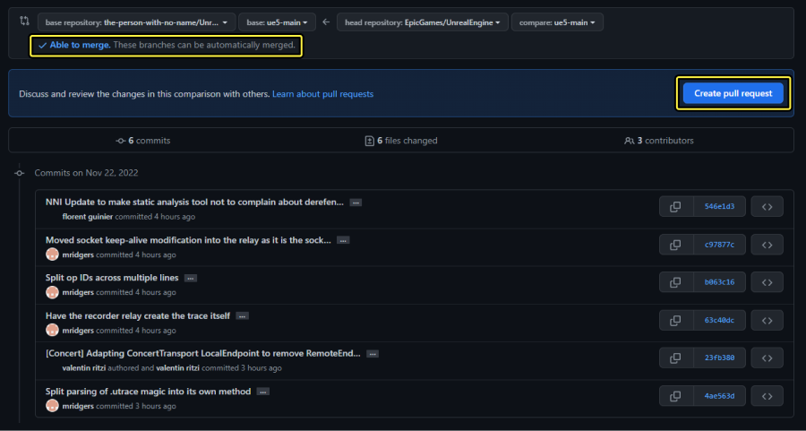
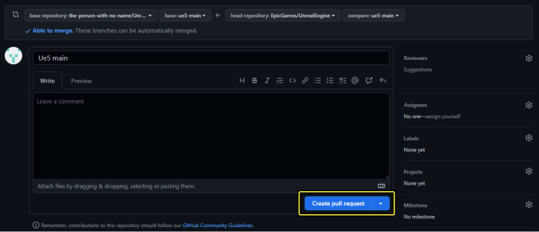
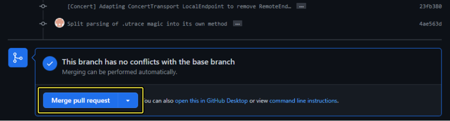
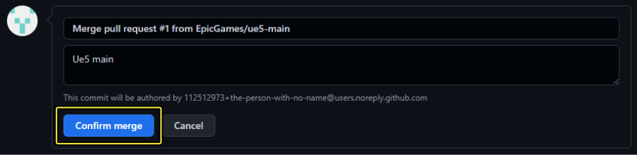

# 合并Epic的最新更新内容

> 路径：虚幻引擎5.7文档 / 入门指南 / 安装虚幻引擎 / 从GitHub下载虚幻引擎源代码 / 合并Epic的最新更新内容

> 原始页面：https://dev.epicgames.com/documentation/unreal-engine/updating-to-the-latest-changes-from-epic-in-unreal-engine

通过源代码工作的最大好处之一是，你始终可以获得我们团队为虚幻引擎添加的最新改进和新功能。当我们修改源代码并发布新的官方版本时，我们会不断更新[虚幻引擎GitHub仓库](https://github.com/EpicGames)的各个分支。你可以定期获得这些更改：也许是每当我们发布新的官方版本时获取，也许是每个月获取，或者甚至是每天获取。

本页面介绍两种不同的方法，你可以使用它们来更新你的分叉的一个分支，使其与虚幻引擎的主仓库中的最新更改保持一致。

## 使用上游远程

在这种方法中，你将Epic Games虚幻引擎的原始仓库作为新的远程仓库添加到你的分叉的本地副本中。它通常被称为 *上游（Upstream）* 远程。你将更改从上游远程拉取出并放入你的本地分支。然后，你可以将这些更改推回到GitHub上你自己的分叉（通常称为 *原始* 远程）。

尽管这种方法初看之下比下文选项2中介绍的GitHub拉取请求稍显复杂，但是我们推荐使用这种方法。它有以下几个优点：

- 一旦设置了上游远程，只要继续使用你的分叉的同一本地克隆，就永远不需要重新设置它。这使得你可以快速、轻松地根据你的项目需要频繁地获取新的更改。
- 每次使用GitHub拉取请求更新你的分叉时，都会在你的分支中创建一个新的提交，并在你的项目的历史记录中创建一个新的拉取请求。这通常没有副作用，但最好避免这些不必要的条目。

下面的说明介绍了如何使用Git命令行工具添加新的远程并获取更改。如果使用可视化Git客户端，操作步骤应该大致相同。详情请参阅你的工具的文档。

> [!NOTE]
> 如果使用[GitHub Desktop](https://desktop.github.com/)，当你复制你的分叉时，将自动为你创建上游远程。你只需要将来自上游分支的更改合并到你的本地分支中，然后将这些更改推送到原始仓库。

### 设置上游远程

1. 请将你的分叉克隆到你的计算机上（假如你还没这样操作的话）。
2. 打开命令提示符，导航到包含你的仓库的文件夹。
3. 将Epic Game的基础仓库添加为一个新远程，名为"upstream"。

   ```
           > git remote add upstream https://github.com/EpicGames/UnrealEngine		
   ```

如需将来自上游远程的更改合并到你的分叉中，请执行以下操作：

1. 检出要更新的分支。例如：

   ```
           > git checkout ue5-main		
   ```
2. 将更改从上游远程拉取出并放入你的本地分支。

   ```
           > git fetch upstream        > git merge upstream/ue5-main		
   ```
3. 将更改推到你的原始远程。

   ```
           > git push origin ue5-main
   ```

## 使用GitHub拉取请求

1. 在Web浏览器中，前往你的仓库在[GitHub](http://www.github.com/)上的主页。其格式通常为 `https://github.com/<USERNAME>/UnrealEngine` ，其中 `<USERNAME>` 是你的GitHub用户名。
2. 从 **分支（Branch）** 菜单选择你想更新的分支。Epic Games虚幻引擎GitHub页面 `README.md` 包含有关可用分支的信息。

   
3. 通常，只要你没有在你的叉取中更改此分支，GitHub就会告知你，Epic Games仓库已经包含来自你的仓库的所有提交内容。

   
4. 选择 **同步叉取（Sync Fork）** 后，系统会向你告知，Epic Games仓库中存在且尚未同步到你的叉取的所有更改。要检查更改，请点击 **比较（Compare）** 。

   

   > [!TIP]
   > 如果你知道你的叉取中没有更改，并且你不想查看可用于从Epic Games仓库同步的更改，而只想更新到所有最新更改，请点击 *更新分支（Update Branch）** 。
5. 选择 **比较（Compare）** 后，GitHub会显示在Epic Games仓库中存在但在你的叉取中缺失的提交内容。如果不存在有冲突的更改，分支就能够自动合并。 要开始合并更改的过程，请点击 **创建拉取请求（Create Pull Request）** 。

   
6. 输入简短说明，指示你的拉取请求要更新哪个分支。完成后，点击 **创建拉取请求（Create Pull Request）** 。

   
7. GitHub会显示此拉取请求中包含的更改。在更改列表底部，点击 **合并拉取请求（Merge Pull Request）** 。

   
8. 点击 **确认合并（Confirm Merge）** 。

   

合并完成后，你的叉取的分支在GitHub上将为最新状态。现在你可以使用Git命令行或你所选的视觉工具，检出分支并将最新更改拉取到你的本地计算机。
