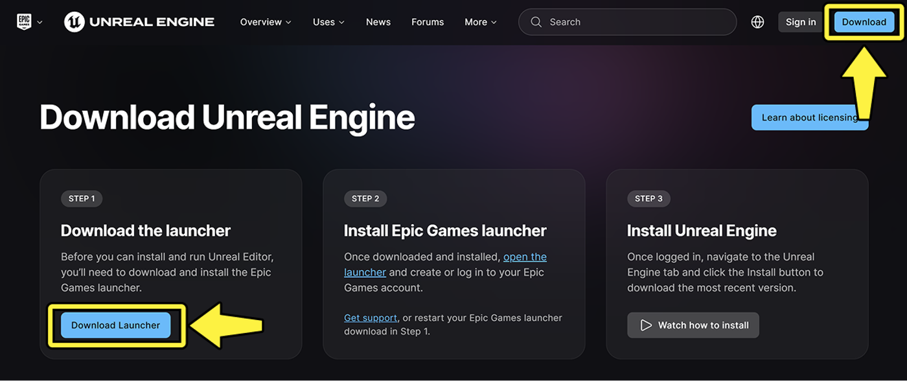
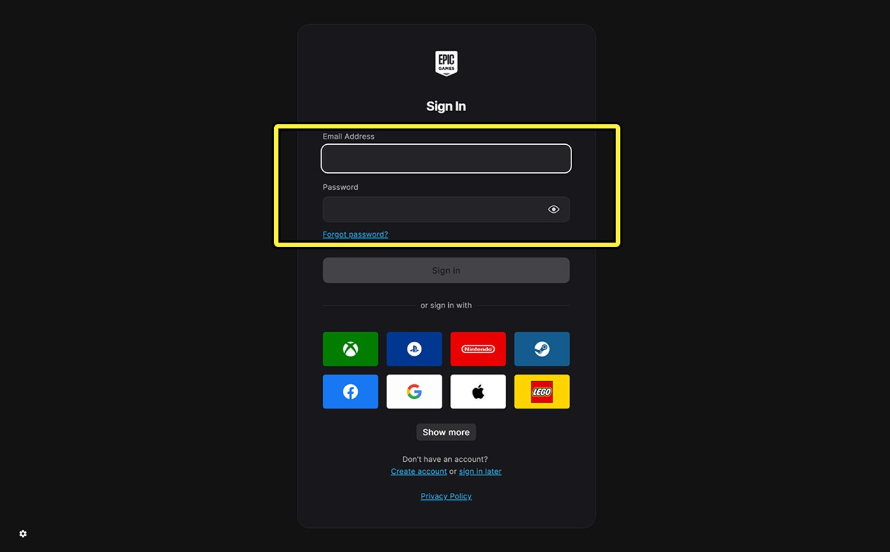
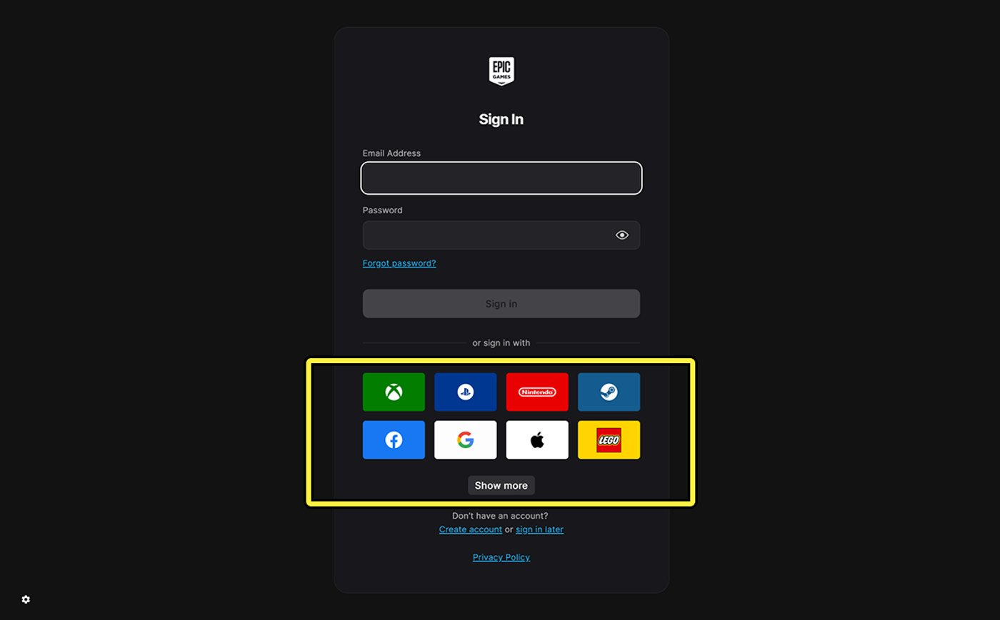
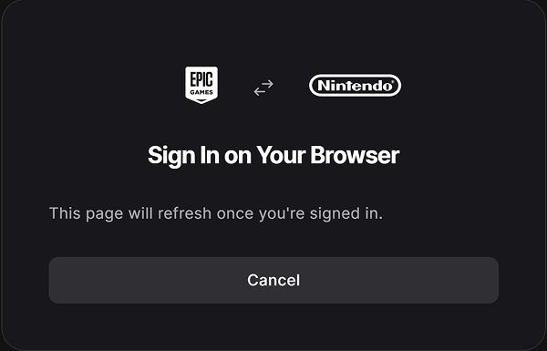
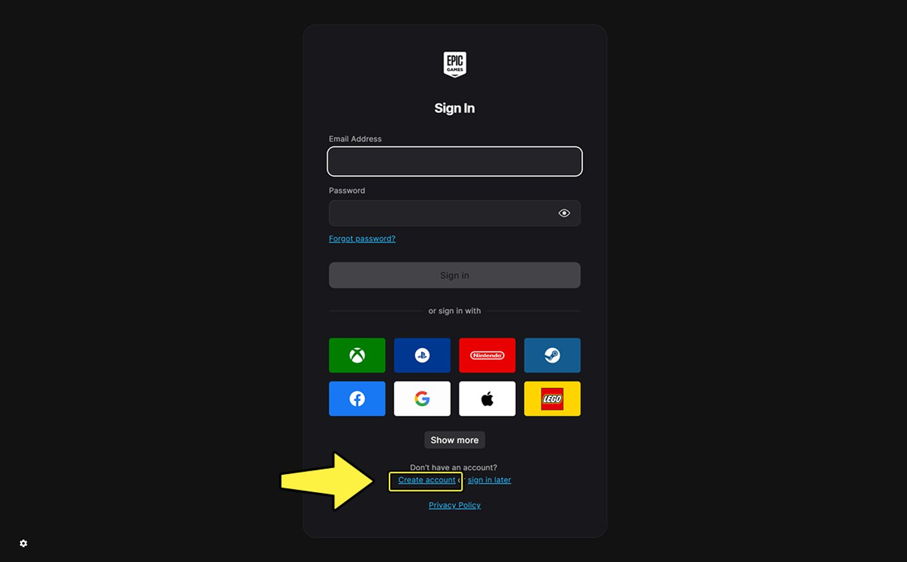
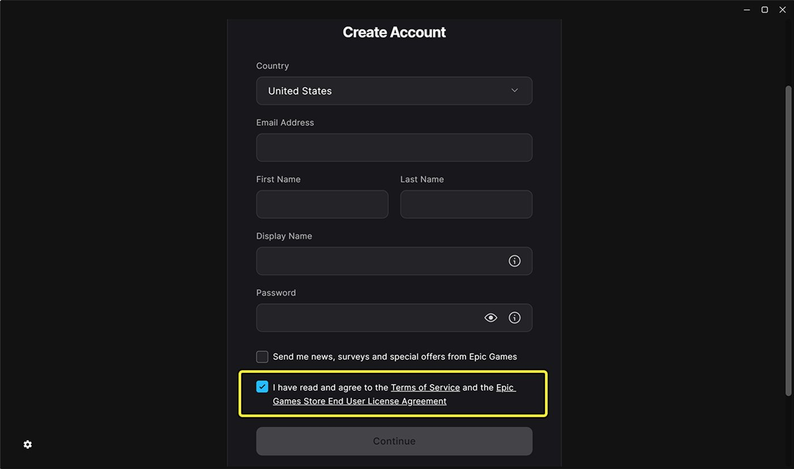

# 安装虚幻引擎

> 路径：虚幻引擎5.7文档 / 入门指南 / 安装虚幻引擎

> 原始页面：https://dev.epicgames.com/documentation/unreal-engine/install-unreal-engine

本教程将介绍如何下载和安装**虚幻引擎**（UE）。 要在安装后卸载或更改虚幻引擎，请参阅[更改虚幻引擎安装](index.md#make-changes-to-an-unreal-engine-installation)。

## 硬件和软件要求

要确定你的硬件和软件是否兼容虚幻引擎和**Epic Games启动器**，请参阅[硬件和软件规格](hardware-and-software-specifications/index.md)。

### 其他软件

要安装虚幻引擎，只需Epic Games启动器即可。 但使用虚幻引擎开发可能需要其他软件，取决于你的开发角色和需求。 其他软件可能包括：

- Microsoft Visual Studio
- 适用于iOS和Android的移动平台软件开发工具包（SDK）
- 主机平台SDK
- 第三方调试工具

> [!NOTE]
> 开发和打包主机平台项目需要虚幻引擎的源代码构建，无法使用通过Epic Games启动器获取的预编译版本。 你可以在[GitHub](https://www.unrealengine.com/en-US/ue-on-github)上下载源代码构建，但本指南并不介绍这种方法。

## 下载并安装Epic Games启动器

你可以在Epic Games启动器下载和管理虚幻引擎版本。 通过该启动程序，你还可以访问[Epic游戏商城](https://store.epicgames.com/en-US/)、示例项目和专业开发工具，例如[Fab](https://www.fab.com/)、[Twinmotion](https://www.twinmotion.com/en-US)和[RealityCapture](https://www.capturingreality.com/)。

要下载和安装Epic Games启动器，请执行以下步骤：

1. 访问[下载虚幻引擎](https://www.unrealengine.com/en-US/download)页面。
2. 点击**下载启动程序（Download Launcher）**按钮，以下载安装程序文件。 你也可以点击页面右上角的**下载（Download）**按钮。

   

   > [!NOTE]
   > 根据浏览器预设，弹出窗口可能询问你安装程序文件要保存到的位置。 系统也可能会将其自动保存至计算机上的"Downloads"文件夹。
3. 下载完成后，执行**安装程序文件**以运行安装向导。

   > [!NOTE]
   > 根据系统设置，可能需要先批准安全性提示，才能启动安装向导。
4. 安装向导完成后，打开**Epic Games启动器**。

### 登录Epic Games启动器

Epic Games启动器打开后，系统将提示你使用Epic Games账户登录。 你可以[使用现有Epic Games账户登录](index.md#sign-in-with-an-existing-epic-games-account)或[创建Epic Games账户](index.md#create-an-epic-games-account)。

> [!NOTE]
> 必须登录才能下载虚幻引擎。 如果点击**稍后登录（sign in later）**，将无法下载引擎。
>
> 

#### 使用现有Epic Games账户登录

如果已有Epic Games账户，可以使用下列方法之一登录：

- 在文本字段中输入电子邮箱地址和密码。 然后，点击**登录（Sign In）**。

  
- 选择支持的第三方社交媒体或游戏平台账户。

  

  > [!NOTE]
  > 如果所选第三方账户未关联Epic Games账户，Epic Games启动器将提示你进行关联。
  >
  > 

#### 创建Epic Games账号

如果没有Epic Games账号，请执行以下步骤创建账户：

1. 点击**创建账户（Create account）**。 按屏幕提示填写出生日期、电子邮箱、姓名和其他相关信息。

   
2. 输入信息后，勾选**服务条款（Terms of Service）**和**Epic游戏商城最终用户授权协议（Epic Games Store End User License Agreement）**旁边的复选框，接受这些政策。 点击**继续（Continue）**。

   

   > [!NOTE]
   > 必须接受服务条款和Epic游戏商城最终用户授权协议，才能创建Epic Games账户。 要查看这些条款和政策，点击复选框旁边的链接即可。
3. 验证你的电子邮箱，方法是输入发送至电子邮箱地址的验证码。 然后点击**验证电子邮箱（Verify email）**。

   
4. 查看**Epic Games隐私政策（Epic Games Privacy Policy）**，然后点击**继续（Continue）**。

   > 图片已省略：Epic Games启动器隐私政策

   登录后，Epic Games启动器默认会定位到左侧导航面板中的**虚幻引擎（Unreal Engine）**选项，并显示**新闻（News）**选项卡。

### 安装并运行虚幻引擎

要安装最新版虚幻引擎，请执行以下步骤：

1. 在Epic Games启动器中，点击左侧导航面板中的**虚幻引擎（Unreal Engine）**。 这将显示与虚幻引擎相关的选项卡。

   > 图片已省略：Epic Games启动器虚幻引擎选项卡
2. 点击**库（Library）**选项卡。 此处用于安装和管理虚幻引擎的版本。

   > 图片已省略：Epic Games启动器库选项卡
3. 点击**引擎版本（ENGINE VERSIONS）**旁边的**添加（+）**按钮，以添加新的引擎图块。 该图块将显示待安装的引擎版本信息。

   > 图片已省略：Epic Games启动器添加引擎图块

   > [!TIP]
   > 如果尚未安装任何版本的虚幻引擎，Epic Games启动器右上角的快速启动按钮将显示**安装引擎（Install Engine）**。 点击此按钮将打开库（Library），为最新版本的虚幻引擎添加引擎图块，并开始安装过程。
   >
   > > 图片已省略：Epic Games启动器快速启动按钮
4. 默认情况下，引擎图块会显示最新版本的虚幻引擎。 如果需要使用旧版本引擎，请点击版本号下拉菜单，从列表中选择要安装的版本。

   > 图片已省略：Epic Games启动器引擎版本号
5. 在引擎图块上，点击**安装（Install）**。 在新对话框中，查看条款和许可选项：

   1. 阅读**虚幻引擎定价选项（Unreal Engine Pricing options）**。 点击**接受（Accept）**继续。
   2. 阅读**虚幻引擎最终用户授权协议（Unreal Engine End User License Agreement）**。 勾选复选框，表明你已阅读并同意条款。 点击**接受（Accept）**继续。

   > [!NOTE]
   > 必须接受这两项协议才能下载虚幻引擎。 如果点击**关闭（Dismiss）**，将无法下载引擎。
6. 要选择虚幻引擎在硬盘中的安装位置，请在**选择安装位置（Choose install location）**对话框中点击**浏览（Browse）**。 默认情况下，虚幻引擎将使用操作系统的默认安装位置。

   > 图片已省略：Epic Games启动器浏览
7. 点击**选项（Options）**可自定义要安装的虚幻引擎组件。 这将打开**虚幻引擎安装选项（Unreal Engine Installation Options）**对话框。

   > 图片已省略：Epic Games启动器安装选项

   在此可选择符合开发需求的组件。 各组件的说明如下表所示：

   | 组件 | 说明 |
   | --- | --- |
   | **核心组件**（必需） | 虚幻引擎必需文件。 |
   | **初学者内容包** | 默认资产，包括地图、网格体、纹理等。 |
   | **模板和功能包** | 可基于默认模板和功能包创建项目。 |
   | **引擎源代码** | 查看引擎源代码。 无法修改或重新编译源代码。 |
   | **编辑器调试符号** | 添加用于提供虚幻引擎崩溃详细信息的源代码。 |
   | **目标平台** | 添加针对Android、iOS、Linux、TVOS等目标平台进行开发所需的源代码。 针对这些平台进行开发需要额外的SDK。 |

   > [!NOTE]
   > 安装虚幻引擎版本前，请确保驱动器有充足的存储空间。 "虚幻引擎安装选项（Unreal Engine Installation Options）"对话框会显示所选组件所需的存储空间。
   >
   > > 图片已省略：Epic Games启动器下载内容大小

   选择完成后，点击**应用（Apply）**确认。
8. 在**选择安装位置（Choose install location）**对话框中，点击**安装（Install）**。

   > 图片已省略：Epic Games启动器安装

   > [!NOTE]
   > 根据操作系统设置，可能需要先批准安全性提示，才能开始安装。

   > [!TIP]
   > - 要暂停安装，点击引擎图块上的**暂停安装**图标。
   > - 要取消安装，点击**取消安装（X）**图标。
   > - 要恢复已暂停的安装，点击**恢复安装**图标。
   >
   > |  |  |
   > | --- | --- |
   > | [引擎图块暂停和取消](https://dev.epicgames.com/community/api/documentation/image/f0d20d17-c506-45dc-b9fd-4eafa649ecd1?resizing_type=fit) （1）暂停安装图标 （2）取消安装图标 | [恢复安装图标](https://dev.epicgames.com/community/api/documentation/image/db1a55de-fa53-4d65-8a53-a3899e3bc572?resizing_type=fit) 恢复安装图标 |
9. 安装完成后，点击引擎图块上的**启动（Launch）**可运行虚幻引擎。 你也可以使用Epic Games启动器右上角的快速启动按钮。

   > 图片已省略：Epic Games启动器启动虚幻引擎

   > [!TIP]
   > 如果已安装多个虚幻引擎版本，可以使用快速启动按钮的下拉箭头选择任意已安装的引擎版本。

#### 安装多个引擎版本

Epic Games启动器支持访问从虚幻引擎4.0开始的所有版本。 这非常实用，因为某些项目或内容可能需要特定版本的引擎。

安装多个引擎版本的步骤与[安装并运行虚幻引擎](index.md#install-and-run-unreal-engine)的步骤相同：

1. 点击**添加（+）**按钮添加新的引擎图块。
2. 在引擎图块上，点击版本号下拉菜单，从列表中选择要安装的版本。
3. 点击**安装（Install）**开始安装流程。

> [!NOTE]
> 每个引擎版本同一时间只能安装一个。

#### 安装虚幻引擎预览构建

在虚幻引擎每个主要版本正式发布前，Epic Games会发布**预览构建**。 预览构建可以让你在引擎主要版本发布前试用新功能。

由于预览构建仍在积极开发中，使用时可能会遇到漏洞或崩溃。 因此，预览构建不建议用于项目开发。 不过，你可以使用预览构建来判断是否值得将开发迁移到即将发布的引擎版本，以便利用新功能或规避问题。

当预览构建可用时，它会出现在引擎图块的版本号下拉菜单中。 安装预览构建的步骤与[安装并运行虚幻引擎](index.md#install-and-run-unreal-engine)的步骤相同。

> 图片已省略：Epic Games启动器预览构建

## 对虚幻引擎安装进行更改

以下各节介绍安装后如何验证、自定义、更新和移除虚幻引擎：

- [验证虚幻引擎安装](index.md#verify-an-unreal-engine-installation)
- [更改虚幻引擎安装的组件](index.md#change-the-components-of-an-unreal-engine-installation)
- [应用热修复更新](index.md#apply-hot-fix-updates)
- [安装和移除插件](index.md#install-and-remove-plugins)
- [卸载虚幻引擎](index.md#uninstall-unreal-engine)

### 验证虚幻引擎安装

Epic Games启动器可"验证"或评估现有引擎文件和插件是否存在损坏或缺失内容。

在Epic Games启动器的"库（Library）"选项卡中，每个引擎图块的下拉菜单中都有"验证（Verify）"选项。

> 图片已省略：Epic Games启动器验证

点击"验证（Verify）"后，点击左侧导航面板中的**下载（Downloads）**可查看验证进度。

> 图片已省略：Epic Games启动器下载

如果发现任何文件缺失或损坏，将仅下载并安装这些文件。

> [!NOTE]
> 如果有可用的热修复更新但尚未下载安装，则不会显示验证虚幻引擎安装选项。

### 更改虚幻引擎安装的组件

你可以随时修改每个虚幻引擎版本的组件，无需重新下载引擎。 如果安装后开发需求发生变更（比如需要不同的目标平台或调试符号），此功能就非常实用。

要向现有虚幻引擎版本添加组件或从中移除组件，请执行以下步骤：

1. 在**Epic Games启动器**中，点击**虚幻引擎（Unreal Engine）**选项卡。 然后，点击**库（Library）**选项卡，查看已安装的虚幻引擎版本。
2. 在要更改的**引擎图块**上，打开**下拉菜单**，选择**选项（Options）**以打开**虚幻引擎安装选项（Unreal Engine Installation Options）**对话框。

   > 图片已省略：Epic Games启动器选项
3. 在**虚幻引擎安装选项（Unreal Engine Installation Options）**对话框中，勾选要添加或移除的组件。
4. 点击**应用（Apply）**确认选择。

### 应用热修复更新

引擎版本的更新称为**热修复**更新或版本发布。 热修复更新是针对性更新，包含漏洞和崩溃修复，用于解决严重的问题。 热修复更新不包含引擎新功能。

可通过第三个十进制数值识别已进行热修复更新的版本。 例如，5.5.0是该引擎版本的首次发布版本，每个新的热修复版本递增1：

- 5.5.**0**
- 5.5.**1**
- 5.5.**2**

每个热修复更新的发布频率取决于发布后需解决的问题数量以及问题的严重程度。

当热修复更新可用时，Epic Games启动器会通过以下两种方式通知你：

- 带有热修复的引擎图块右上角将显示信息通知徽章。
- 引擎图块的**启动（Launch）**按钮将变为**更新（Update）**按钮。

点击更新（Update）按钮可下载并安装最新可用更新。

> 图片已省略：Epic Games启动器更新

> [!TIP]
> 建议在每次热修复可用时及时更新引擎版本。 如果需要使用引擎版本而不立即更新，请使用 Epic Games启动器右上角的**启动（Launch）**按钮。
>
> > 图片已省略：Epic Games启动器快速启动按钮

### 安装和移除插件

可从[Fab](http://www.fab.com/)商城查找并下载适用于虚幻引擎的插件。 在Epic Games启动器中点击**虚幻引擎（Unreal Engine）> 库（Library）**，在**Fab库（Fab Library）**分段，即可找到当前已安装或可供安装的插件。

要安装插件，请执行以下步骤：

1. 在**Fab库（Fab Library）**中找到要安装的插件。
2. 点击**安装到引擎（Install to Engine）**按钮。

   > 图片已省略：Epic Games启动器插件
3. 选择要安装插件的虚幻引擎版本（如果存在）。

   > 图片已省略：Epic Games启动器安装插件

   > [!NOTE]
   > 下拉菜单仅显示已安装且受插件支持的引擎版本。
4. 点击**安装（Install）**将下载加入队列。

可在Epic Games启动器左侧导航面板的"下载（Downloads）"类别中查看下载进度。

> 图片已省略：Epic Games启动器下载

如果未安装兼容的引擎版本，或插件已安装到所有兼容版本，将显示以下警告对话框：

> 图片已省略：Epic Games启动器错误 1

> 图片已省略：Epic Games启动器错误 2

要查看某个引擎版本当前安装的插件，点击其引擎图块下的**已安装的插件（Installed Plugins）**链接。

> 图片已省略：Epic Games启动器已安装的插件

点击"已安装的插件（Installed Plugins）"后，**虚幻引擎插件**对话框将显示已安装的插件列表。 要移除所选引擎版本的插件，点击**移除（Remove）**。

> 图片已省略：Epic Games启动器移除插件

### 卸载虚幻引擎

要卸载现有虚幻引擎版本，请执行以下步骤：

1. 在**Epic Games启动器**中，点击**虚幻引擎（Unreal Engine）**选项卡。 然后，点击**库（Library）**选项卡，查看已安装的虚幻引擎版本。
2. 在要卸载的**引擎图块**上，打开下拉菜单，选择**移除（Remove）**以打开**卸载（Uninstall）**对话框。

   > 图片已省略：Epic Games启动器移除引擎
3. 在卸载（Uninstall）对话框中，点击**卸载（Uninstall）**。

   > 图片已省略：Epic Games启动器卸载

## 下一步

- [在多个启动程序中安装引擎](multiple-launcher-unreal-engine-installs/index.md) - 介绍如何启用启动程序的PCB模式，以及如何添加Windows注册表安装路径覆盖（如果需要）。
- [学院环境安装](academic-installation-of/index.md) - 介绍如何在学院环境中安装启动程序和虚幻引擎。
- [离线安装程序](offline-installer-of/index.md) - 了解如何使用虚幻引擎离线安装程序。
- [从GitHub下载虚幻引擎源代码](downloading-source-code/index.md) - 介绍如何访问源代码仓库并下载虚幻引擎的最新版本。
- [硬件和软件规格](hardware-and-software-specifications/index.md) - 使用虚幻引擎开发时的最低和推荐硬件规格以及必要软件。
