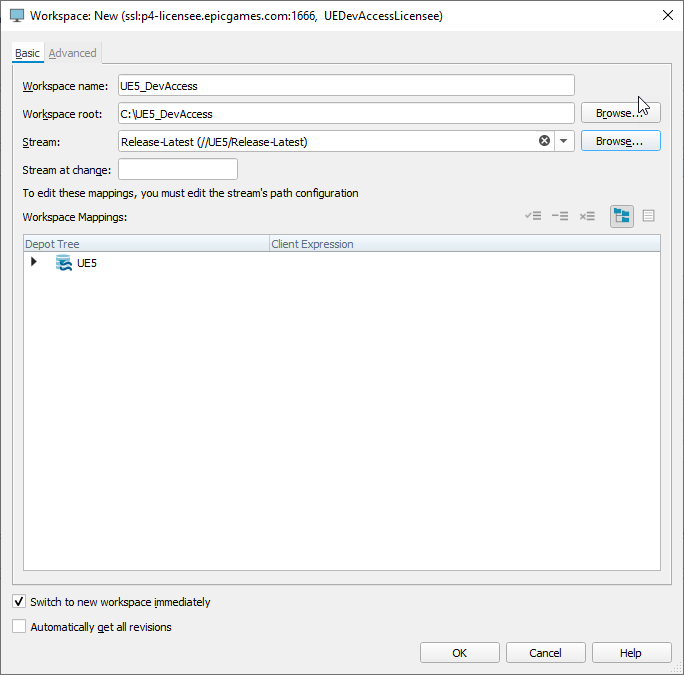
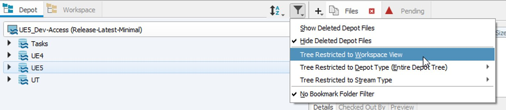
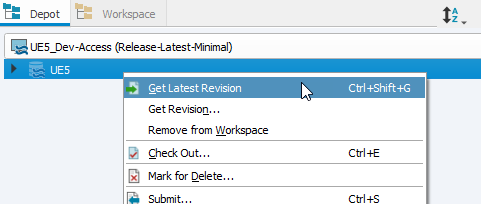

# 使用Perforce下载虚幻引擎

> 路径：虚幻引擎5.7文档 / 入门指南 / 许可用户入驻 / 使用Perforce访问虚幻引擎 / 使用Perforce下载虚幻引擎

> 原始页面：https://dev.epicgames.com/documentation/unreal-engine/downloading-unreal-engine-with-perforce

> [!WARNING]
> 使用本页内容要求你与Epic Games签订定制的许可支持协议，该协议需包含对虚幻引擎P4 Perforce仓库的访问权限。

## 连接到Epic Games P4 Perforce服务器

> [!WARNING]
> 本节内容专为直接连接至Epic Games P4 Perforce仓库的技术管理员而设，介绍了如何将源代码下载至本地仓库。 需要自行搭建虚幻引擎本地构建的开发者不应使用该内容。 相反，开发者应联系其技术管理员，以获取存放有虚幻引擎源代码的本地仓库的访问权限。

连接Epic Games Perforce服务器需要用到SSL功能，并且必须要使用2017.2或更高版本的Perforce客户端（P4V、p4或API）。 通过善加利用全局的DNS名称及基于延迟的路由信息，便能自动连入离你当地位置最近的Perforce代理服务器上。 当然你也可以选择直接连入某个区域代理服务器，来确保你的连接总是最近的一个。

> [!NOTE]
> 如果你正在运行本地代理，则必须通过中转站连接，而不是使用区域代理服务器。 你可以使用以下地址连接到全局中转站：
>
> `ssl:p4-licensee.epicgames.com:1666`

1. 安装**P4V Perforce Windows客户端**。 客户端可在[Perforce下载](https://www.perforce.com/downloads/helix-visual-client-p4v)页面下载。
2. 在**打开连接（Open Connection）**对话框中，输入以下连接信息：

   - **服务器（Server）**：ssl:p4-licensee.epicgames.com:1666

     > [!TIP]
     > 上面这个地址应该会自动将你指向离你延迟最低的区域代理服务器上。 如果基于某种原因你希望直接连接某个具体的区域代理服务器的话，请参考以下这几个地址：
     >
     > - **美国东部（弗吉尼亚）**：ssl:p4-licensee-east.us.epicgames.com:1666
     > - **美国西部（俄勒冈）**：ssl:p4-licensee-west.us.epicgames.com:1666
     > - **亚太东北部（东京）**：ssl:p4-licensee-northeast.ap.epicgames.com:1666
     > - **欧洲中部（法兰克福）**：ssl:p4-licensee-central.eu.epicgames.com:1666
   - **用户（User）**：Epic Games提供的Perforce用户名。
   - **密码（Password）**：Epic Games提供的Perforce密码。
3. 点击**确认（OK）**并连接至Perforce服务器。

   点击查看大图。
4. 第一次连接到某个端点时，你必须显式地信任该端点。

   - Epic SSL指纹为`45:0D:78:E2:0E:9E:E4:82:45:80:16:36:29:5E:54:4D:66:31:6C:43`。
   - P4V会提示你信任该新端点。
   - 命令行p4使用p4信任命令：`$ p4 trust -y`。
5. 在P4V中，选择**连接（Connection）> 新建工作空间（New Workspace）**为引擎创建新工作空间。 填入以下信息并点击**确定（OK）**来创建工作空间：

   - **工作空间名称（Workspace name）**：为你的新工作空间命名。
   - **流送（Stream）**：点击**浏览（Browse）**并从可用流送列表中选择 `//UE5/Release-Latest`。

   
6. 在**库（Depot）**窗格中，展开**筛选库（Filter Depot）**菜单并选择**限定于工作空间视图的目录树（Tree Restricted to Workspace View）**。

   

## 下载虚幻引擎

Epic Games通过Perforce库中的`//UE5/Release-Latest`流送向授权用户发放虚幻引擎。 其中提供了一个完整的引擎版本，还有额外的几个项目，用于游戏示例、演示等用途。 大家可以自行选择全部下载或仅挑选需要的内容下载。

为了便于更快地开始工作，我们的建议先是先完成最低限度的下载来开始工作，然后再挑选其他部分按需下载。 这样可以极大地减少由于下载过程而浪费的大量等待时间。 我们还提供了`//UE5/Release-Latest-Minimal`流送来帮助实现这一操作。

> [!WARNING]
> 由于`//UE5/Release-Latest`流送中存在很多文件，总下载大小高达很多GB，因此如果同步更新整个目录的话，下载可能会需要相当长的时间。

1. 在你想下载的流送上点击右键，选择**获取最新版本（Get Latest Revision）**。

   
2. 最新版本中的所有文件将会开始下载。

### 迁移现有工作空间

为避免在全局副本中新建工作空间时需要再次重新同步整个工作空间的文件，用户可以使用`p4 flush`命令，从而根据本地工作空间中的文件来填充相关信息。 这个过程比一次强制同步要快得多，这样便能够高效地重新开始工作。

1. 创建一个新的工作空间，从原有的工作空间中拷贝视图和根设置到新的工作空间。
2. 切换到刚才新建的工作空间上。
3. 执行`p4 flush`命令 或`p4 sync -k`，来为服务器填充信息。
4. Epic Games会自动清理超过六个月未使用的旧工作空间。
