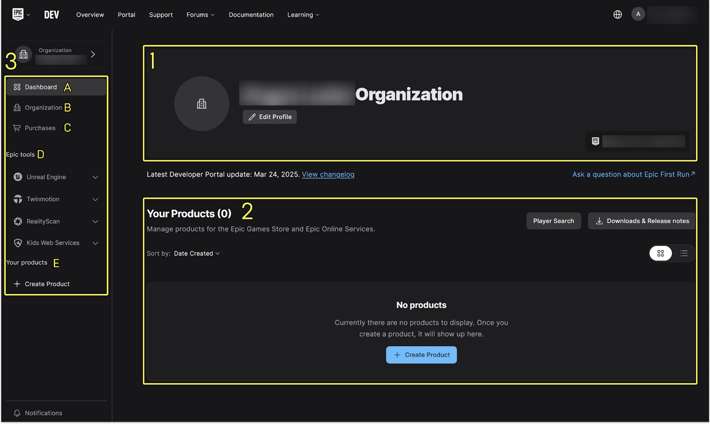
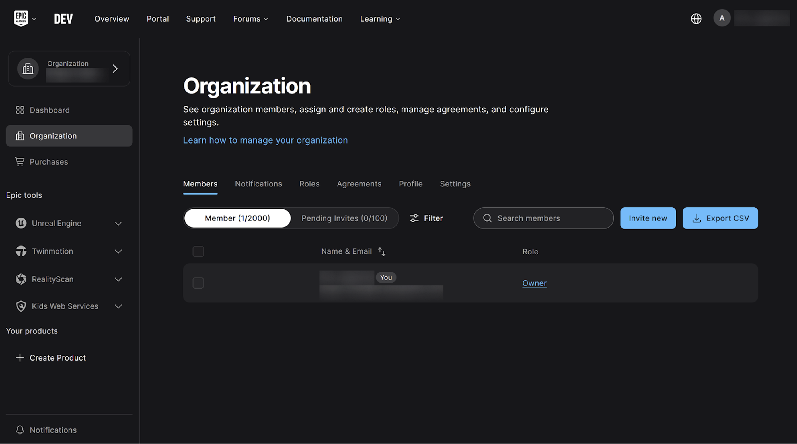
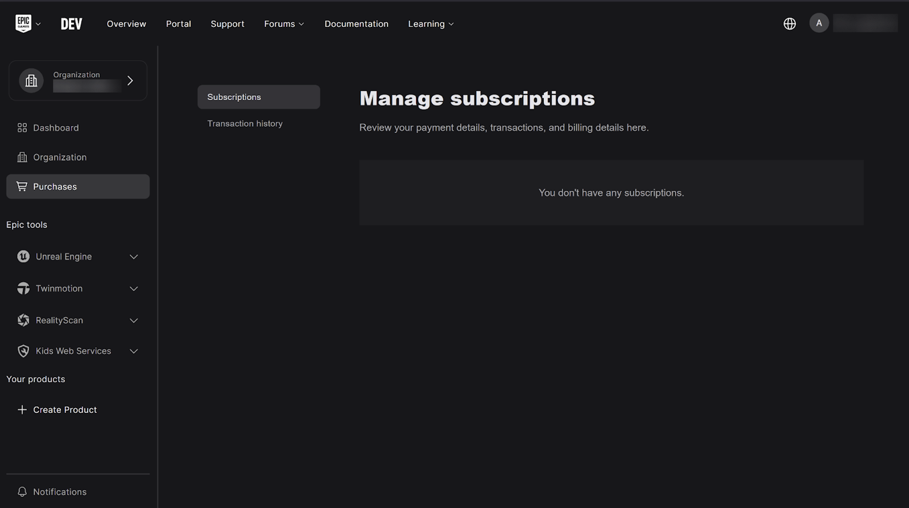

# 开发者门户入门

> 路径：虚幻引擎5.7文档 / 入门指南 / 许可用户入驻 / 开发者门户入门

> 原始页面：https://dev.epicgames.com/documentation/unreal-engine/getting-started-with-dev-portal-for-unreal-engine

**Epic Games开发者门户**是一款基于浏览器的工具。 作为订阅许可用户，你可以使用它为Epic工具（包括**虚幻引擎**、**Twinmotion**和**RealityScan**）配置席位。 你还可以使用开发者门户申报游戏分成，并且如果你开发的软件使用了Epic工具且准备发布，还可以配置商标使用情况。

开发者门户还为Epic Games服务提供了其他功能。 具体如下：

- 儿童网络服务（KWS）合作伙伴会使用开发者门户为其游戏或其他应用软件配置家长验证。
- 使用商城发布游戏的Epic游戏商城合作伙伴可使用开发者门户配置游戏的商城设置。
- 使用Epic在线服务（EOS）合作伙伴可以将语音聊天、成就、匹配、线上活动等多人游戏功能集成到游戏中，还可以使用开发者门户为其游戏配置EOS设置。

> [!NOTE]
> 你不需要使用任何以上这些服务来为虚幻引擎、Twinmotion或RealityScan配置席位。

无论你是否已经签署了订阅许可协议，或者仍在考虑中，本指南都将为你提供开始使用开发者门户所需的信息。 它介绍了开发者门户的登录流程，回答了一些常见问题，比如你首次看到的新功能的用途，并提供可以帮助你更进一步的相关资源。 这提供了你熟悉开发者门户所需的一切，让你在使用Epic Games工具开发项目时抢占先机。

> [!NOTE]
> 有关开发者门户提供的所有服务和功能的完整信息，请参考[开发者门户文档](https://dev.epicgames.com/docs/dev-portal)。

## 首次登录开发者门户

以下部分将指导你了解首次登录开发者门户的关键点。

### Epic Games账号

你和你团队中想要登录开发者门户的每位成员都必须拥有一个使用双因素身份验证的Epic Games账号（你可以通过帐号密码和安全设置启用双因素身份验证）。 如果你还没有，开发者门户会提示你在登录前创建一个。

### 开发者门户网站

要登录，请访问[开发者门户网站](http://dev.epicgames.com/portal)，并使用已有的Epic Games账号登录，或按提示注册新账号。

首次登录开发者门户后，你的体验会根据你购买订阅许可的方式而有所不同。 可能出现以下情况：

- **来自Epic Games业务开发团队的许可**

  如果你是从Epic Games业务开发团队购买了订阅许可，则你在订阅过程中指定的技术联系人会收到一封包含入驻说明的电子邮件。 你的组织是为你创建的。
- **从经销商处获得许可**

  如果你是从经销商处购买的订阅许可，他们会向你发送一封包含入驻说明的电子邮件。 你的组织是为你创建的。
- **自购许可**

  如果你想自行购买订阅许可，必须先登录开发者门户才能进行操作，并且必须在购买许可或使用开发者门户的任何其他功能之前创建一个组织。 你不会收到入驻电子邮件。

### 组织

你的组织是使用你购买的许可的团体。 通常是一家公司或其他企业，例如游戏工作室或发行商，但也可以是单个开发者。

如果你是通过Epic Games业务开发部或经销商购买的，他们在你签署订阅许可协议后为你创建了一个组织；在这种情况下，当你登录时，开发者门户不会提示你创建组织。

如果你是自行购买的订阅许可，当你首次登录时，开发者门户会提示你创建一个组织。 在访问开发者门户的其他功能之前，你必须先创建组织。

我们建议你在登录后先完成组织配置，然后再采取进一步的步骤。 尤其要记得邀请你要分配席位的团队成员。 他们必须接受邀请，你才能为他们分配席位。

要了解服务的相关信息，请参考在线开发者资源文档：[创建组织](https://dev.epicgames.com/docs/dev-portal/organization-management#create-an-organization)。

## 开发者门户用户界面

登录后，你会看到操作面板的页面。 左侧导航可访问：

- **操作面板**、**组织**和**购买**页面。
- 用于管理**Epic工具**的资源，包括虚幻引擎、Twinmotion和RealityScan。
- 儿童网络服务（KWS）链接。

  - 本链接不适用于你从Epic Games购买的工具许可。
- **你的产品**部分，用于使用了KWS、Epic游戏商城或EOS的游戏。 要了解这些服务的信息，请参阅在线开发者资源文档：[概述](https://dev.epicgames.com/docs/resources-overview)。

  - 本部分不适用于你从Epic Games购买的工具许可。

### 操作面板

登录后，你看到的第一个页面就是**操作面板**。 你可以在这里：

- 管理多种Epic工具。
- 在KWS、Epic游戏商场和EOS追踪你的产品。
- 了解Epic Games的最新消息。

登录后的操作面板页面。

1. 组织档案
2. 你的产品

   - 本部分用于使用了KWS、Epic游戏商城或EOS的游戏。 此不适用于你从Epic Games购买的工具许可。 要了解这些服务的信息，请参阅在线开发者资源文档：概述。
   - 如果你没有创建产品，本部分不会显示任何产品。 如果你使用的是虚幻引擎、Twinmotion或RealityScan，则无需创建产品。
   - 这里的产品列表与左侧导航上的产品列表相同。
3. 左侧导航

   - 操作面板页面访问
   - 组织页面访问
   - 购买页面访问
   - Epic工具菜单

     - KWS不属于使用席位管理的Epic Games工具。
   - 你的产品

     - 这里的产品列表与操作面板页面上的产品列表相同。

向下滚动页面，你可以找到管理Epic工具订阅的资源以及Epic Games新闻。 如下图所示：

向下滚动开发者门户的操作面板页面，即可看到虚幻引擎部分。

向下滚动开发者门户的操作面板页面，即可看到Twinmotion和RealityScan部分。

向下滚动开发者门户的操作面板页面，即可看到Metahuman和儿童网络服务（KWS）部分。 请注意，Metahuman并未列在开发者门户的左侧导航中。

在页面的最下方，你可以找到与Epic Games许可持有者相关的信息链接。

向下滚动开发者门户的操作面板页面，即可看到Epic Games的新闻动态部分。

### 组织

**组织**页面是你可以查看和邀请组织成员、分配和创建角色、管理协议以及配置设置的地方。

更多信息请参阅在线开发者资源文档：[组织页面](https://dev.epicgames.com/docs/dev-portal/organization-management#organization-page)。

### 购买

**购买**页面在一个单独的标签页中，会显示贵组织的订阅和交易记录。 这里只显示自购的订阅和交易。 如果你是通过Epic Games业务开发团队或经销商购买的订阅，则不会在此显示。

### Epic工具

每项**Epic工具**都有一个单独的下拉菜单，你可以用它们访问管理工具的资源。 每个选项都有相应的功能，你可以在相应的文档页面上了解更多信息。

## 常见问题

**问：为什么要为特定个人分配席位？ 我可以为我的团队分配浮动席位吗？**

答：与许多企业级应用程序不同，虚幻引擎、Twinmotion和RealityScan订阅不使用浮动许可。 购买席位并将其分配给组织成员，则表明你遵守与Epic Games签订的订阅许可协议。

虽然你购买的席位可以访问特定功能（如Twinmotion云服务），但Epic工具的基本功能并不依赖于这些席位。 更多详情请参考[许可](https://www.unrealengine.com/en-US/license)。

**问：我购买了访问Epic Games产品的席位订阅，为什么操作面板的“你的产品”部分显示我没有产品？**

答：操作面板的“你的产品”部分（以及左侧导航中）不会显示你作为订阅许可持有者可以访问的Epic Games工具（如虚幻引擎、Twinmotion或RealityScan）。 本部分用于使用了KWS、Epic游戏商城或EOS的游戏。 这里列出的“产品”是指注册使用这些服务的游戏或其他软件。 你不需要使用此部分管理席位。要了解服务的相关信息，请参考在线开发者资源文档：[概述](https://dev.epicgames.com/docs/resources-overview)。

**问：我想为团队中的某个人分配一个席位，但没有成功。 他们已经拥有有效的Epic Games帐号，那么问题出在哪里呢？**

答：你必须邀请他们加入你的开发者门户组织。 确保使用他们在创建Epic Games账号时使用的电子邮件地址来邀请他们。 只有当他们成功接受邀请加入你的组织后，你才能为他们分配席位。 要了解服务的相关信息，请参考在线开发者资源文档：[组织页面](https://dev.epicgames.com/docs/dev-portal/organization-management)。

**问：我购买了用于使用虚幻引擎进行开发的虚幻订阅席位许可，为什么我会看到Twinmotion和RealityScan重复的虚幻订阅席位？**

答：虚幻订阅许可用户购买的席位可以在所有三个工具中共享：虚幻引擎、Twinmotion和RealityScan。 你也可以单独购买仅限Twinmotion的席位和仅限RealityScan的席位。 要了解更多信息，请参阅在线开发者资源文档：[席位](https://dev.epicgames.com/docs/dev-portal/organization-management#seats)。

**问：我已经向Epic Games支付了订阅许可协议的费用，为什么购买页面没有显示该交易的记录？**

答：与Epic Games签订订阅许可协议有多种途径。 只有自购许可才会在购买页面上显示为订阅或交易。 如果你没有看到任何内容，那么你的订阅许可协议可能来自其他购买方式，例如与Epic Games业务开发部或经销商签订的协议。
