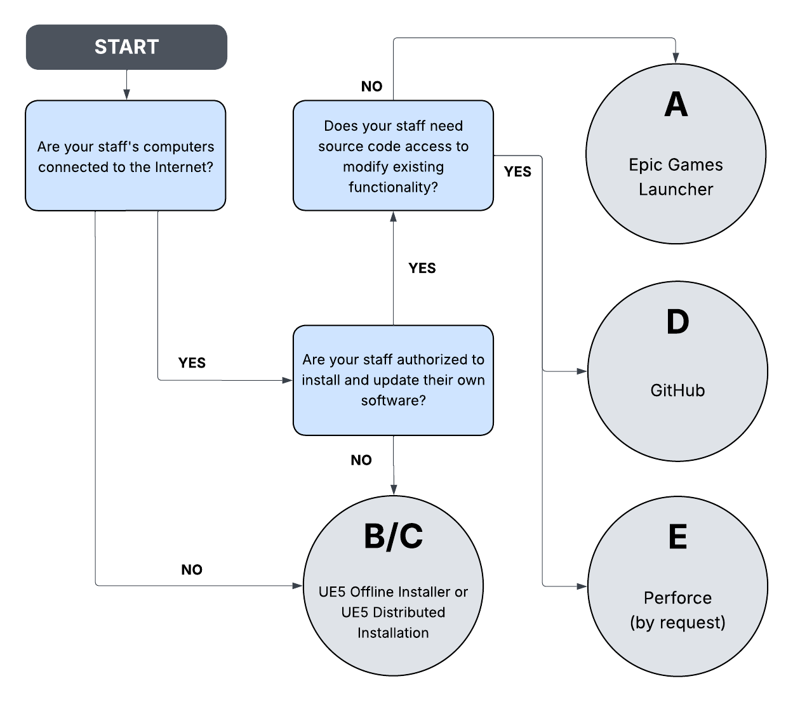
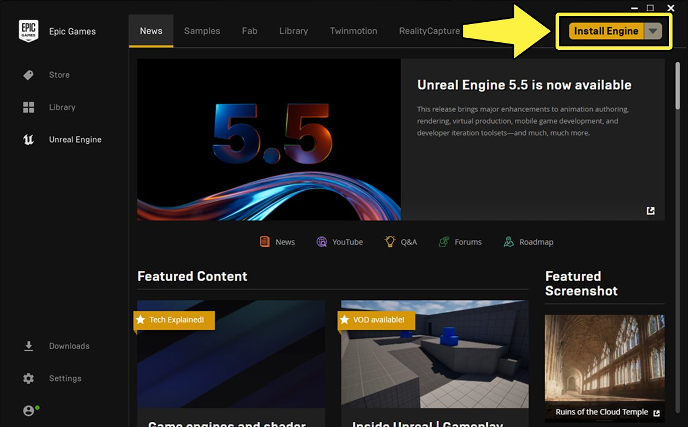
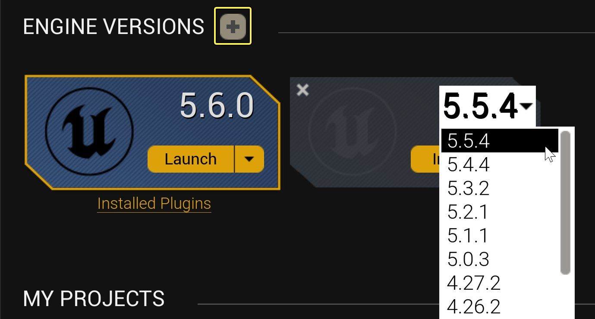
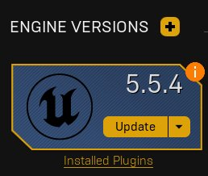
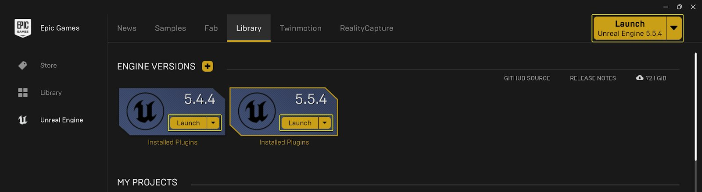
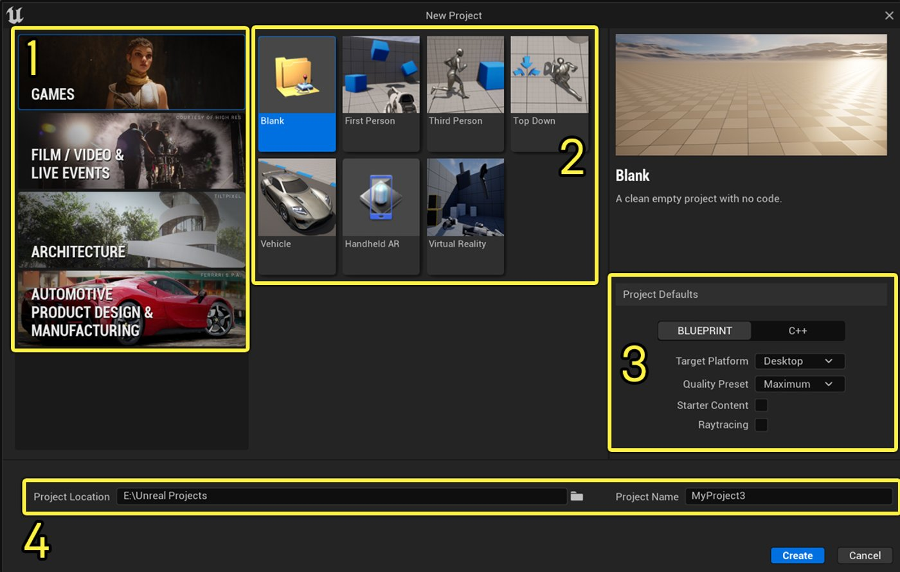
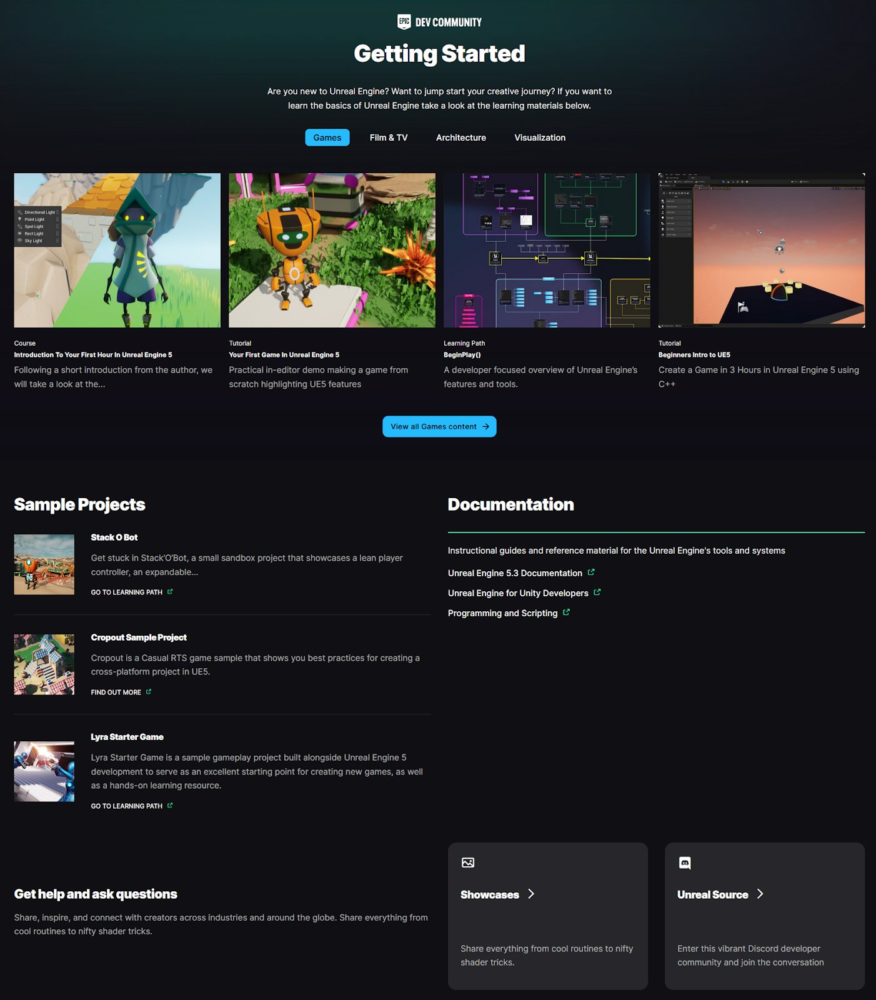
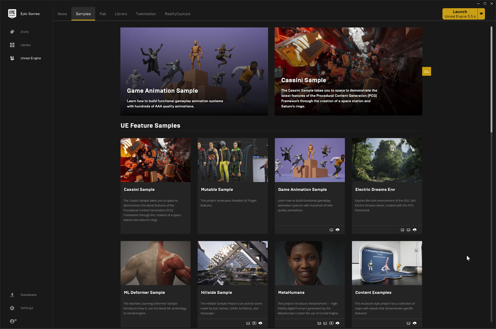

# 许可用户入驻

> 路径：虚幻引擎5.7文档 / 入门指南 / 许可用户入驻

> 原始页面：https://dev.epicgames.com/documentation/unreal-engine/onboarding-licensees-in-unreal-engine

操作系统

Windows

从下拉菜单中选择一个选项以查看与之相关的内容

## 术语定义

在继续之前，请了解以下术语。

| 术语 | 许可证 |
| --- | --- |
| 开发者门户 | 许可用户管理其组织和许可证席位，以及下载虚幻引擎及其他Epic Games应用程序的离线安装程序的主要网站。 |
| **Epic专业支持** | 专为虚幻引擎及其他Epic Games应用程序提供定制化许可支持的私有网站。 |
| **虚幻引擎** | 用于打造交互式体验的一整套工具。 |
| **UE** | 虚幻引擎4的缩写。 |
| **虚幻编辑器** | 用于使用虚幻引擎进行开发的界面。 |
| **Epic Games启动器** | 用于安装虚幻引擎的平台，包括管理用户项目和已下载内容。 |
| **Datasmith** | 虚幻引擎中的一项功能，对来自各种CAD、BIM和3D内容创建工具的数据提供导入功能。 |

## 快速入门

为了帮助你在使用虚幻引擎许可时获得最佳体验，请按顺序执行以下步骤。你可以跳过你已经完成的步骤。

### 1. 设置你的开发者门户组织并分配许可证

如果你刚开始使用虚幻引擎许可证，你首先需要在开发者门户中设置你的组织。 你的技术管理员将获得初始访问权限，并在随后为组织内的成员分配许可证席位。

### 2. 设置Epic专业支持权限

如果你与Epic Games签订的许可协议中包含了Epic专业支持服务，你还需要登录Epic专业支持服务。 你的技术管理员将获得初始访问权限，并可将组织中的其他成员设为联系人，这些联系人将获得Epic专业支持服务的访问权限。

### 3. 安装虚幻引擎

接下来的步骤是安装虚幻引擎。 首先，请确认你的系统满足[硬件和软件要求](../../production-pipeline/deploying/container-deployments-and-images-for-unreal-editor-and/hardware-and-software-requirements-for-containe-f83f20cb/index.md)。 然后，推荐的最简单方法是使用Epic Games启动器安装引擎。可在[此处](https://launcher-public-service-prod06.ol.epicgames.com/launcher/api/installer/download/EpicGamesLauncherInstaller.msi?productName=enterprise)下载启动器。 你也可以使用提供给所有付费许可用户的虚幻引擎离线安装程序。 如果你打算定制引擎的源代码或希望使用分布式安装，请阅读下文以了解相关选项。

### 4. 安装Datasmith插件（可选）

Datasmith是虚幻引擎版本中的默认功能。 然而，某些格式（如3ds Max、SketchUp Pro和Revit）也要求你在源应用程序中安装[导出器插件](https://www.unrealengine.com/datasmith/plugins)。

### 5. 启动虚幻引擎

现在你已准备就绪，并可以启动虚幻编辑器。 如果你使用启动程序安装虚幻引擎，请登录并点击侧边栏的虚幻引擎（Unreal Engine）文本，然后点击黄色的**启动（Launch）**按钮。 你也可以从**库（Library）**选项卡启动编辑器，在这里你可以从多个引擎安装中进行选择，或直接加载到特定项目中。 如需了解如何启动虚幻编辑器的自定义构建或脱机构建，请参阅下文。

### 6. 创建项目

首次打开虚幻编辑器时将显示**项目浏览器（Project Browser）**。 你可以在此处从模板创建新项目。 你也可以从启动程序的**示例（Samples）**选项卡加载一个内容详尽的示例项目。

### 7. 开始你的学习之旅

你可以利用大量学习资源快速上手，包括我们的[在线学习平台](https://learn.unrealengine.com/)。 [虚幻引擎文档](https://dev.epicgames.com/documentation/unreal-engine/unreal-engine-5-6-documentation?application_version=5.6)也可以提供很多帮助。

如需详细了解如何安装、启动虚幻引擎并使用其进行创作，请参阅本页面的[安装虚幻引擎](index.md#installing-unreal-engine)小节。

## 访问和管理账号

要让你和你的同事使用虚幻引擎许可服务，第一步就是为所有人设置访问权限。 本小节供技术管理员阅读，提供了比[快速入门](index.md#quick-start)指南更详细的信息。

### 你的Epic Games账号

Epic Games账号是你访问绝大多数虚幻引擎功能和服务的入口，该账号与你的电子邮箱绑定。 你可能已经用你当前的工作邮箱创建了Epic Games账号，但如果没有，那么你需要[注册一个账号](https://www.unrealengine.com/id/register?)。

你组织中的所有员工也应该有他们自己的Epic Games账号，以便访问虚幻引擎的所有功能和服务。 他们需要访问[www.unrealengine.com](https://www.unrealengine.com/)并单独创建账号，以便进行登录。

### 开发者门户

开发者门户是你管理虚幻引擎订阅的地方，包括你的组织以及获得了许可证席位的人员。 在订阅虚幻引擎后，在许可证签署过程中指定的贵方主要技术联系人将收到一封来自虚幻引擎入驻团队的邮件，其标题为"[你的组织名称]的虚幻引擎订阅"，邮件内容为你的订阅详细信息，以及如何登录开发者门户的说明。

为遵守许可协议条款，只有获得了许可证席位的组织成员才可以使用虚幻引擎进行开发工作。

### Epic专业支持

如果你与Epic Games签署的许可协议中包含了可选的Epic专业支持（Epic Pro Support）服务，我们的工作人员将为许可证签署过程中指定的主要技术联系人授予初始的Epic专业支持访问权限。 该联络人会在许可的签订过程中予以说明。此人将被授予行政权限，并且能够将Epic专业支持访问权限授予其他工作人员。

请查找标题为"欢迎加入Epic专业支持社区！（Welcome to the Epic Pro Support community!）"的电子邮件，该邮件将在你的访问权限启用后自动发送。

请按照邮件中的链接登录Epic专业支持。你应该使用你的Epic Games账号凭证登录，该凭证与你的工作邮箱地址关联。 如果你已经用其他Epic Games账号登录了Epic Games的生态系统，并且该账号没有Epic专业支持访问权限，则你可能会遇到登录问题。

首次登录后，请设置你的个人信息和通知选项，完成初次登录流程。设置完毕后，你的访问权限就正式开通了。 你现在可以查看知识库文章，搜索其他开发者的贴子，或者自己发贴请求支持了。

### Epic Games账号安全

为确保你的账号安全，我们要求你启用**双因素身份验证**。 为此，请进入你的[账号设置](https://www.epicgames.com/account/personal)，然后点击**密码和安全（Password & Security）**选项卡。 滚动到底部，点击**发送电子邮件验证（Send email verification）**链接以确认你的电子邮件地址，然后（按你的偏好）选择**启用身份验证器应用程序（Enable Authenticator App）**或**启用电子邮件身份验证（Enable Email Authentication）**。

## 安装虚幻引擎

### 虚幻引擎的硬件和软件要求

在安装虚幻引擎之前，请确保你的系统能够运行它。 你需要根据你的开发需求查看使用虚幻引擎所需的系统要求。 硬件和软件规格基于我们内部的开发需求而使用的设备，同时还考虑了通用用途或特定开发需求可能需要的额外软件。 以下是虚幻引擎在Windows、Mac和Linux系统上的推荐系统规格。 如需了解详情，请参阅[安装虚幻引擎](../install/index.md)文档。

#### 推荐硬件

本小节将介绍使用虚幻引擎所需的推荐硬件。

|  |  |
| --- | --- |
| **操作系统** | Windows 10 64位版本1909版本.1350及以上版本，或版本2004和20H2修订版.789及以上版本。Windows 11与UE5兼容，且符合推荐规格要求。 |
| **处理器** | Intel或AMD四核处理器，2.5 GHz或更快 |
| **内存** | 32 GB内存 |
| **显存** | 8 GB或更高 |
| **显卡** | 配备最新驱动程序的DirectX11或12兼容显卡。 |

> [!TIP]
> 虽然某些功能的最低要求是DirectX 11，但我们建议大多数游戏使用DirectX 12。
>
> DirectX11更适合旧电脑，尤其是集成显卡的笔记本电脑。 DirectX12 提供了更高的帧率、多核处理支持以及并行和异步计算。

> [!NOTE]
> 要充分利用虚幻引擎5的渲染功能（如Nanite和Lumen），请参阅"虚幻引擎5渲染功能要求"小节。

#### 最低软件要求

运行虚幻引擎和虚幻编辑器的最低要求如下。

| 运行引擎 |  |
| --- | --- |
| **操作系统** | Windows 10版本1703 (Creators Update) |
| **DirectX Runtime** | [DirectX End-User Runtimes（2010年6月）](https://www.microsoft.com/zh-cn/download/details.aspx?id=8109) |

程序员使用虚幻引擎开发的要求如下。

| 使用引擎开发 |  |
| --- | --- |
| **'运行引擎'的所有要求项（自动安装）** |  |
| **Visual Studio版本** | Visual Studio 2022 |
| iOS应用程序开发 |  |
| **iTunes版本** | [iTunes 12或更高](http://www.apple.com/itunes) |

> [!TIP]
> 尽管推荐在Windows系统上使用Visual Studio进行开发，但虚幻引擎也支持VS Code和Rider编辑器。

## 必备条件安装程序安装的软件

虚幻引擎自带一个必备条件安装程序，它会安装运行编辑器和引擎所需的一切内容，包括多个DirectX组件和Visual C++可再发行程序包。 通过Epic Games启动器安装虚幻引擎时，启动器会自动安装这些必备条件。 但是，如果你从源代码编译虚幻引擎，或需要为计算机准备所有虚幻引擎必备条件以用于特定用途，例如设置全新计算机以充当[Swarm Agent](../../building-virtual-worlds/lighting-the-environment/global-illumination/unreal-swarm/index.md)，那么你可能需要自行运行必备条件安装程序。

你可以在虚幻引擎安装位置的`Engine/Extras/Redist/en-us`文件夹中找到安装程序。

> [!NOTE]
> 虚幻引擎5删除了对32位平台的支持。

如果你使用Perforce获取虚幻引擎源代码，还会在Perforce仓库的同一`Engine/Extras/Redist/en-us`文件夹中找到预编译的二进制文件。 安装程序的源代码位于`Engine/Source/Programs/PrereqInstaller`下。

下表列出了必备条件安装程序安装的软件。

| DirectX组件 | Visual C++ 可再发行程序包 |
| --- | --- |
| XInput 1.3（2007年4月） | Visual C++ 2010 CRT |
| X3DAudio 1.7（2010年2月） | Visual C++ 2010 OpenMP库 |
| XAudio 2.7（2010年6月） | Visual C++ 2012 CRT |
| D3D编译器4.3（2010年6月） | Visual C++ 2013 CRT |
| D3DCSX 4.3（2010年6月） | Visual C++ 2015 CRT |
| D3DX9 4.3（2010年6月） | Microsoft Visual C++ 2015-2022可再发行程序包 |
| D3DX10 4.3（2010年6月） |  |
| D3DX11 4.3（2010年6月） |  |

> [!NOTE]
> 该列表中最重要的DirectX组件是XInput、X3DAudio和XAudio依赖项。 DirectX的标准安装程序不包含此类依赖项（默认不与Windows一起发布），因此必须手动安装，或使用应用程序发布。

#### 显卡驱动程序

建议你安装最新的显卡驱动程序的稳定版本。

- [下载NVIDIA驱动程序](https://www.nvidia.com/Download/index.aspx?)
- [下载AMD驱动程序](https://www.amd.com/en/support)
- [下载Intel驱动程序](https://download%20intel%20drivers/)

> [!TIP]
> 如果你遇到性能问题，[VTune](https://software.intel.com/zh-cn/vtune)是极为有效的问题发现工具，不过它仅适用于英特尔CPU。 磁盘I/O是最常见的瓶颈之一，因此使用RAID 0磁盘阵列和额外RAM可能会有所帮助。

## 性能说明

以下系统规格代表Epic Games的一台典型设备（Lenovo P620 Content Creation Workstation标准版）。 它能够为使用UE5开发游戏的人员提供较合理的指导：

- 操作系统：Windows 10 22H2
- 电源：1000W电源
- 内存：128GB DDR4-3200
- 处理器：AMD Ryzen Threadripper Pro 3975WX处理器 - 128MB缓存，3.5 GHz base / 4.2 GHz turbo，32核/64线程, 280w TDP
- 操作系统硬盘：1 TB M.2 NVMe3 x4 PCI-e SSD
- 数据硬盘：4 TB Raid Array - 2 x 2TB NVMe3 x4 PCI-e SSD in Raid 0
- GPU：Nvidia RTX 3080 - 10GB
- NIC 1GBPS on-board + Intel X550-T1 10G PCI-e以太网适配器
- TPM兼容

#### UE5渲染功能要求

虚幻引擎的部分渲染功能要求的配置远高于最低规格要求。

| UE5功能 | 系统要求 |
| --- | --- |
| **Lumen全局光照和软件光线追踪反射** | 使用DirectX 11并支持着色器模型5的显卡如需了解详情，请参阅[Lumen技术细节](../../building-virtual-worlds/lighting-the-environment/global-illumination/lumen-global-illumination-and-reflections/lumen-technical-details/index.md)。 |
| **Lumen全局光照和硬件光线追踪反射和MegaLights** | Windows 10构建1909.1350以及支持DirectX 12的更高版本。项目设置中必须启用**SM6**。以下显卡之一：AMD RX-6000系列或更高版本。Intel® Arc™ A系列显卡或更高版本。NVIDIA RTX-2000系列或更高版本。Lumen硬件光线追踪现在需要在项目设置中设置SM6。如需了解详情，请参阅[Lumen技术细节](../../building-virtual-worlds/lighting-the-environment/global-illumination/lumen-global-illumination-and-reflections/lumen-technical-details/index.md)。 |
| **Nanite虚拟几何体和虚拟阴影贴图** | 支持Windows 10构建1909.1350及更高版本的所有版本，以及支持[DirectX 12 Agility SDK](https://devblogs.microsoft.com/directx/gettingstarted-dx12agility)的Windows 11。Windows 10版本2004和20H2 — 修订版号应大于或等于.789。DirectX 12（带着色器模型6.6 Atomics），或Vulkan（VK_KHR_shader_atomic_int64）。 项目设置中必须启用**SM6**。 （在新项目中默认开启。） Windows 10版本1909 — 修订版号应大于或等于.1350。最新显卡驱动程序。如需了解详情，请参阅[Nanite虚拟几何体](../../designing-visuals-rendering-and-graphics/optimizing-and-debugging-projects-for-realtime-rendering/nanite/nanite-virtualized-geometry/index.md)和[虚拟阴影贴图](../../building-virtual-worlds/lighting-the-environment/shadowing/virtual-shadow-maps/index.md)。 |
| **时间超级分辨率** | 可在任何支持Shader Model 5的显卡上运行，但每个着色器8UAV的数量限制会影响性能。 时间超分辨率着色器在支持Shader Model 6的D3D12上编译时启用了16位类型。如需了解详情，请参阅[时间超级分辨率](../../designing-visuals-rendering-and-graphics/optimizing-and-debugging-projects-for-realtime-rendering/anti-aliasing-and-upscaling/temporal-super-resolution/index.md)。 |

### 获取虚幻引擎

你可以通过多种渠道获取虚幻引擎，具体取决于你的需求和使用情况。

- 你所熟悉的大多数软件都以可执行程序的形式提供，该程序存储在二进制（计算机可读）文件中。 虚幻引擎提供了二进制文件格式，这也是最容易上手的版本。 不过二进制格式也存在限制，即每次发布的版本均按原样提供，想要修改就得使用插件，或在Epic Games发布新版本时更新。
- 另一种方法是使用源代码。Epic Games也为虚幻引擎提供了源代码。 任何人都可以下载引擎的源代码，并按需进行更改、更新或改进，然后将代码编译为可用的构建。 这种方法为你提供了很大的控制权限，但入门也更复杂，且要求你拥有编程经验。

你可以使用Epic Games启动器下载虚幻引擎的二进制构建，也可以通过GitHub获取源代码构建。 我们推荐上述选项，但作为订阅许可用户，你也可以根据自身需求使用其他访问方式，比如Perforce访问、分布式安装或离线安装程序等。

请参考下方流程图确定哪种方式更适合你，然后阅读下文相关段落以继续。



> [!NOTE]
> 为游戏主机开发项目要求你使用虚幻引擎的源代码构建，且无法使用通过Epic Games启动器获取的预编译版本。

以下小节分别详细介绍了获取虚幻引擎的各种方法：

- [A：Epic Games启动器](index.md#a-epic-games-launcher)
- [B：虚幻引擎5离线安装程序](index.md#b-ue5-offline-installer)
- [C：虚幻引擎5分布式安装](index.md#c-ue5-distributed-installation)
- [D：GitHub](index.md#d-git-hub)
- [E：Perforce](index.md#e-perforce)

#### A：Epic Games启动器

对于大多数客户，推荐使用Epic Games启动器获取虚幻引擎的二进制构建。 启动器将管理你的下载，通知你更新内容，并处理插件和其他可下载内容的安装。 唯一的缺点在于，那些不允许员工访问互联网或强制员工执行限制性软件策略的组织可能无法使用这一方案。

你也可以点击[www.unrealengine.com](http://www.unrealengine.com/)上的**下载（Download）**按钮获取Epic Games启动器。 如果你希望隐藏启动程序中本可用的各种电子游戏的导航选项，可以在[此处](https://launcher-public-service-prod06.ol.epicgames.com/launcher/api/installer/download/EpicGamesLauncherInstaller.msi?productName=enterprise)下载。 该下载链接让你能启用一项设置以隐藏电子游戏的导航选项。 如有需要，你也可以在启动程序设置中重新显示这些选项。

安装Epic Games启动器后，你就可以使用你的Epic账号凭证登录。 在**虚幻引擎（Unreal Engine）**选项卡中，你可以点击右侧的黄色按钮以安装最新版本的虚幻引擎，或者转到**库（Library）**页面，更自由地选择要安装的版本。



注意，虚幻引擎每年会多次发布新版本。 每次主要版本发布都是独立的安装，而非对前一版本的更新。 例如，如果你已安装虚幻引擎5.5，这时发布了新版本虚幻引擎，并且你选择安装它，那么你将保留先前的5.5版本，同时单独安装新版本。 在Epic Games启动器的**库（Library）**页面上，这些版本会被显示为不同的引擎插槽。点击**添加（+）**按钮即可添加新插槽。



主要版本会收到若干小型热修复更新（以带有点符号的数字表示，例如.2和.3更新）。 例如，虚幻引擎5.5的热修复更新将显示为5.5.1。 热更新可用时，启动器将提供通知，并且这些更新会直接应用于现有安装。 当你安装引擎版本时，启动程序会将其与最新可用的热修复更新一起安装。



安装虚幻引擎时，你可以选择安装位置（这点很重要，因为虚幻引擎的文件大小可能有数个GB）。系统会为你提供安装选项。 **选项（Options）**让你能配置需下载的内容，例如为特定平台开发所需的代码。

安装引擎版本后，请阅读[从Epic Games启动器运行虚幻引擎](index.md#running-ue-from-the-epic-games-launcher)以打开并开始使用虚幻引擎进行创作。

作为起步，建议阅读[虚幻引擎入门指南](index.md#getting-started-with-unreal-engine)以学习虚幻编辑器的基础知识。

> [!TIP]
> 在Epic Games启动器的虚幻引擎选项卡中时，不要忘了浏览**新闻（News）**、**示例（Samples）**、**Fab**、**Twinmotion**和**RealityScan**等页面，以便发现更多资源。

#### B：虚幻引擎5离线安装程序

如果企业要在不连接互联网的计算机上使用虚幻引擎，我们提供了离线解决方案，即单机版虚幻引擎。所有订阅许可用户均可从开发者门户下载该版本。 该版本带有安装向导，且支持远程和静默安装。 开发者门户提供了关于如何使用该安装程序的PDF文档。

> [!NOTE]
> 离线安装版会限制对Fab虚幻商城的访问，因而无法获取资产和插件。

#### C：虚幻引擎5分布式安装

虚幻引擎的传统安装工作流程是，最终用户直接在自己的本地计算机上下载并安装或编译引擎，具体取决于用户选择的是二进制版本还是源代码版本。 但是，我们知道此工作流程并不适合所有组织机构。

你可以将引擎下载到单台计算机，然后将安装内容镜像到其他计算机。 针对此安装流程，我们单独准备了一份文档来提供更多信息，详见[此处](../install/academic-installation-of/index.md)。 该文档专为学术机构编写，但是安装信息适用于其他机构。

#### D：GitHub

如果你需要能够修改虚幻引擎的源代码，则默认建议通过GitHub下载源代码。

要访问GitHub，你需要成功将Epic Games账号与GitHub账号关联。 完成此操作后，你就可以通过GitHub访问虚幻引擎源代码。 详情见下文：

1. [关联你的GitHub账号](https://www.unrealengine.com/ue4-on-github)。
2. [下载虚幻引擎源代码](../install/downloading-source-code/index.md)。
3. [编译虚幻引擎源代码](../install/downloading-source-code/building-unreal-engine-from-source/index.md)。

#### E：Perforce

如果企业需要源代码访问权限，但GitHub无法满足其需求，我们可以提供对Epic Games的Perforce（P4V）代理服务器的访问权限，以供进行虚幻引擎开发。 这让你可以直接从Epic Games的Perforce仓库下载虚幻引擎的源代码。

如果你需要获取Perforce访问权限，请联系你的Epic Games业务开发代表，以获取包含Perforce仓库访问权限的定制许可协议。 该协议获批后，Epic Games将向贵方团队的技术管理员提供Perforce服务器的登录凭证。 每个团队仅会收到一组登录凭证。

如需了解详情，请参阅[使用Perforce访问虚幻引擎](accessing-unreal-engine-with-perforce/index.md)。

> [!WARNING]
> 请注意，仅限一名授权用户登录Perforce账号。 **多名用户登录同一账号属于违反Perforce服务条款的行为。**
>
> Epic Games的建议是，由单一用户或自动化工具使用该账号将引擎构建同步到本地Perforce仓库，然后让你的员工使用公司授权的个人Perforce账号进行访问。
>
> 即使你的团队尚未获得Perforce许可证，[也有最多5名用户可免费使用](https://www.perforce.com/products/helix-core/free-version-control)，或者你也可以[探索其他许可选项](https://www.perforce.com/how-buy)。

### Datasmith的可选设置

Datasmith是虚幻引擎的核心部分，只要在**影视和现场活动**、**建筑**、**工程**、**施工**或者**汽车、产品设计和制造**等类别中创建新项目，Datasmith就默认启用（详情请参阅下文的[新建项目](index.md#creating-a-new-project)小节）。 如果你正在处理其他类别的项目，并且想要启用Datasmith，请打开虚幻编辑器，请转到**编辑（Edit） > 插件（Plugins） > 导入器（Importers）**，启用所需的Datasmith组件，然后重新启动虚幻引擎。

某些格式（例如3ds Max、SketchUp Pro和Revit）也要求你在源应用中安装插件。 如果你打算从这些应用程序中导出资产，请通过链接获取[导出器插件](https://www.unrealengine.com/en-US/studio/downloads)并进行安装。

## 开始虚幻引擎之旅

虚幻引擎提供了丰富的资源来帮助你和你的员工成功完成项目 — 从学习使用虚幻编辑器到介绍高级开发技术的教程等一应俱全。 本小节将指导你完成整个旅程所需的信息，我们建议你与所有使用虚幻引擎的人员共享该信息。

- [启动虚幻引擎](index.md#launch-unreal-engine)
- [新建项目](index.md#creating-a-new-project)
- [学习资源](index.md#learning-resources)
- [支持资源](index.md#support-resources)

### 启动虚幻引擎

#### 从Epic Games启动器运行虚幻引擎

如果你使用Epic Games启动器安装虚幻引擎，你可以登录启动器，点击黄色的**启动（Launch）**按钮，从而启动虚幻引擎。 你也可以从**库（Library）**选项卡启动虚幻引擎。你也可以在库中管理引擎的安装，或直接打开特定项目。



如果你使用编译后的源代码或单机离线构建安装了虚幻引擎，请前往虚幻引擎的安装目录，并在以下路径中找到可执行文件：

`\Engine\Binaries\Win64\UnrealEditor.exe`

> [!TIP]
> 你可以由此创建一个桌面快捷方式，以便将来访问。

你有多种方式可以启动虚幻编辑器的可执行文件。

#### 从可执行文件运行虚幻引擎

1. 转到`[LauncherInstall][VersionNumber]\Engine\Binaries\Win64`目录。
2. 右键点击`UEEditor.exe`可执行文件并选择**创建快捷方式（Create shortcut）**。
3. 将快捷方式重命名为类似于**MyProject - Editor.exe**的名称，以表明该快捷方式运行MyProject游戏编辑器。
4. 右键点击新建的快捷方式并选择**属性（Properties）**。
5. 在**目标（Target）**属性末尾添加游戏名称，使其作为参数运行：

   Shell

   ```
   [LauncherInstall][VersionNumber]\Engine\Binaries\Win64\UEEditor.exe "[ProjectPath][ProjectName].uproject"
   ```
6. 按下**确认（OK）**保存更改。
7. 双击快捷方式以启动编辑器。

#### 从命令行运行虚幻引擎

1. 打开命令行窗口，转到`[LauncherInstall][VersionNumber]\Engine\Binaries\Win64`目录。
2. 运行`UEEditor.exe`并传递项目路径。

   Shell

   ```
   UEEditor.exe "[ProjectPath][ProjectName].uproject"
   ```

#### 不使用参数（独立）运行虚幻引擎

假如你未设置编辑器在启动时打开最近的项目，以无参模式运行编辑器可执行文件会直接打开项目浏览器。 此时，你可以新建项目、打开现有项目，或打开内容示例和示例游戏。

### 新建项目

当你启动虚幻引擎时，**虚幻项目浏览器（Unreal Project Browser）**会自动打开。 项目浏览器为你提供了一个起始点，让你可以管理现有项目、访问在创建项目时可使用的模板，或打开根据示例游戏和展示项目创建的项目。 你可以在此处：

- 新建项目。
- 打开现有项目。
- 管理现有项目。

下图说明了在虚幻引擎中新建项目的步骤。



在虚幻引擎中通过项目浏览器（Project Browser）窗口新建项目。

要新建项目，请按照以下步骤操作：

1. 选择最符合你的行业和项目目标的**开发类别**（1）。 你可以从以下类别中进行选择：

   - 游戏
   - 电影、电视和直播活动
   - 建筑、工程和施工（AEC）
   - 汽车、产品设计和制造（APM）
2. 为你的项目选择**模板**（2）。 你可以选择的模板取决于你在步骤1中选择的类别。

   > [!TIP]
   > 虚幻引擎自带许多**项目模板**，你可以将其用作自己项目的起始点。 如需详细了解可用的各种项目模板，请参阅[模版参考](../../understanding-the-basics/working-with-projects-and-templates/template-reference/index.md)页面。
3. 配置**项目默认值（Project Defaults）**（3）。 在此分段中，你可以选择目标平台（即运行游戏或应用程序的硬件，如计算机或移动设备）、配置质量和光线追踪设置等。

   > [!NOTE]
   > 以下某些设置可能不适用于某些模板。 例如，手持式AR模板只能使用蓝图实现。

   You can configure the following settings:

   |  |  |
   | --- | --- |
   | **Implementation** | Select how you want to implement your project's logic, such as character movement, level transitions, and so on.You can choose from the following options:**Blueprint**, if you want to build your project in the Unreal Editor, and use the Blueprint Visual Scripting system to create interactions and behavior.**C++**, if you want to build your project by programming with C++ in Visual Studio.For more information about these implementation methods, refer to the following pages: [Blueprint Visual Scripting](../../blueprints-visual-scripting/index.md) [Programming with C++](../../gameplay-systems/programming-with-cpp/index.md) |
   | **Target Platform** | Select the type of platform your project is intended for:**Desktop****Mobile** |
   | **Quality Preset** | Select the maximum quality level, based on which platform your project targets. We recommend that you choose:**Maximum**, if you are developing your project for a computer or game console.**Scalable**, if you are developing your project for mobile devices. |
   | **Starter Content** | Select whether you want your new project to include **starter content**. Starter content includes some simple static meshes with basic textures and materials. It is useful if you want to start learning and experimenting immediately, without sourcing and importing custom content.Starter content is only intended for early development; when you are ready to replace it with production-quality assets, you can either shop on [Fab](https://www.fab.com/), or import your own assets from other applications. |
   | **Ray Tracing** | Select whether to enable or disable **ray tracing**for your project.For more information about ray tracing in Unreal Engine, refer to the [Hardware Ray Tracing and Path Tracing Features](../../building-virtual-worlds/lighting-the-environment/ray-tracing-and-path-tracing-features/index.md) page. |
4. 选择你要存储项目的位置，并为项目命名（4）。
5. 点击**创建（Create）**（5），完成新项目的创建。 虚幻引擎使用你配置的设置新建项目，然后自动打开该项目。

创建项目后，你可以在虚幻编辑器启动时重新加载该项目。方法是从启动器的**我的项目（My Projects）**分段中选择项目，或创建带有目标属性的桌面快捷方式，例如：

`UNREAL_ENGINE_ROOT\Engine\Binaries\Win64\UnrealEditor.exe "PROJECT_DIR\PROJECT_NAME.uproject"`

### 学习资源

我们提供丰富多样的资源，助你开启虚幻引擎的开发之旅。 要找到最适合你的开发需求的资源，建议访问虚幻引擎开发者社区的[入门指南](https://dev.epicgames.com/community/unreal-engine/getting-started/games)页面。 可用的资源包括：

- 文档
- 示例项目
- 学习资源
- Epic Games开发者社区
- 虚幻引擎视频



#### 虚幻引擎文档

[虚幻引擎文档](https://docs.unrealengine.com/)涵盖了快速入门指南、功能概览和教程、参考页面、脚本编写和编程指南、版本说明等内容。

作为起步，建议阅读虚幻引擎入门指南以学习虚幻编辑器的基础知识。 等你对引擎有一定的了解后，你就可以在文档网站上搜索信息，了解特定的主题。

如需了解如何使用Datasmith，请参阅[Datasmith](../../working-with-content/datasmith/index.md)文档。

##### 其他产品文档

Epic Games还提供其他产品和服务供你利用，以满足你的开发需求。 你可以阅读相关产品的文档来探索这些资源，例如：

- [MetaHuman](https://www.unrealengine.com/en-US/metahuman)
- [Fab](https://www.fab.com/)
- [Twinmotion](https://www.twinmotion.com/en-US)
- [Fortnite](https://dev.epicgames.com/community/fortnite/getting-started/uefn)

#### 示例项目和游戏

如果你打算编译交互式功能，那么基于空白项目开始工作可能会让人望而却步，而模板也只能提供起始点。 Epic Games提供了详实的示例供你学习，你可以根据自己的需求进行定制。

我们提供了丰富的示例项目和游戏，你可以在启动程序的**示例（Samples）**选项卡中访问这些示例。



打开任一示例后，你会被重定向到其Fab商品页。在该页面上点击**添加至我****的库（Add to My Library）**即可。 如此一来，你就能使用该示例创建项目。

> 图片已省略：Fab城市示例

返回启动程序，点击**库（Library）**选项卡。 找到内容页中列出的对应示例，点击**创建项目（Create Project）**。

> 图片已省略：Epic Games启动器的库

安装项目后，你可以从项目浏览器或库页面中将其打开。

#### 学习虚幻引擎

如果你希望获取更多关于使用虚幻引擎的资源，我们的[在线学习内容](https://dev.epicgames.com/community/unreal-engine/learning)提供了多种按需学习的选项：

- 你可以学习由Epic Games和Epic开发者社区成员提供的课程、学习路径和教程来磨练技能。
- 你可以观看关于虚幻引擎及其功能的视频。 包括：

  - 直播、培训和演示视频。
  - GDC及其他活动的演示和技术演讲的录播。

掌握基础知识之后，你可以按主题（例如影视、建筑、虚拟制片、游戏开发等）过滤内容，以找到适合你的学习路径。

> 图片已省略：虚幻引擎学习

### 支持资源

如果在使用虚幻引擎开发的过程中遇到问题，需要获得具体的解答，可以通过以下几种方式获取支持。

#### Epic专业支持

虚幻引擎的许可用户可以选择通过Epic专业支持服务获得高级支持服务，该服务也是许可协议的一部分。 这是一个独家支持网站，你可以在其中提问，从Epic Games员工那里获得答案，以及从其他开发人员与我们员工的互动中学习。

如需进一步了解如何最佳利用我们的支持网站，并授予其他员工访问权限，请查阅我们为你准备好的各类知识库文章。

#### 社区资源

未购买Epic专业支持服务的订阅许可用户也可加入我们的公共社区，与其他开发者展开讨论并快速查找已知的解决方案。 访问[虚幻引擎论坛](https://forums.unrealengine.com/)，与同行开发者展开讨论。

#### 直接联系Epic Games

仍有疑问或问题？ 请联系我们，我们将尽快为你服务。

1. 通过我们的[支持页面](https://dev.epicgames.com/support)联系我们。
2. 如果你对许可有任何疑问，或想激活其他权益，请联系你的 Epic Games业务开发代表。
3. 发送电子邮件至[developer-access@unrealengine.com](mailto:developer-access@unrealengine.com)，向我们获取有关账号或入驻的帮助。
