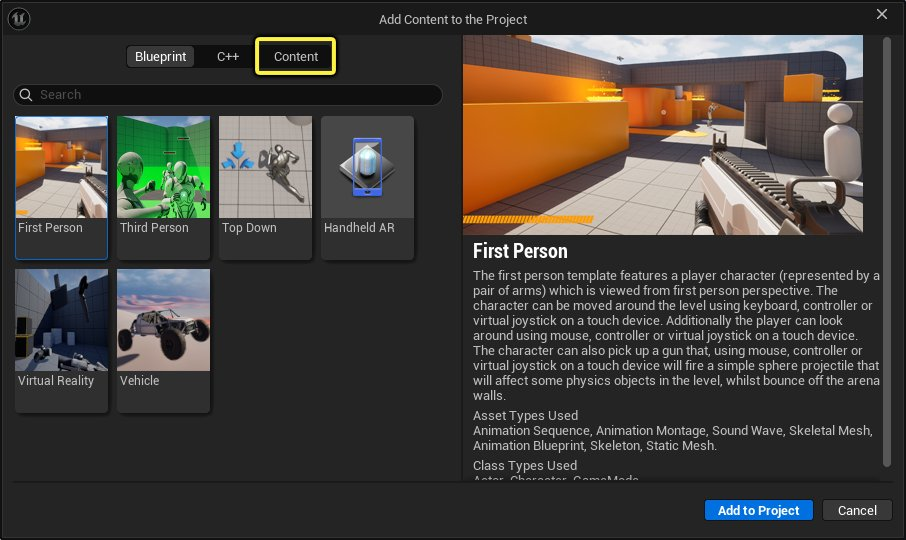
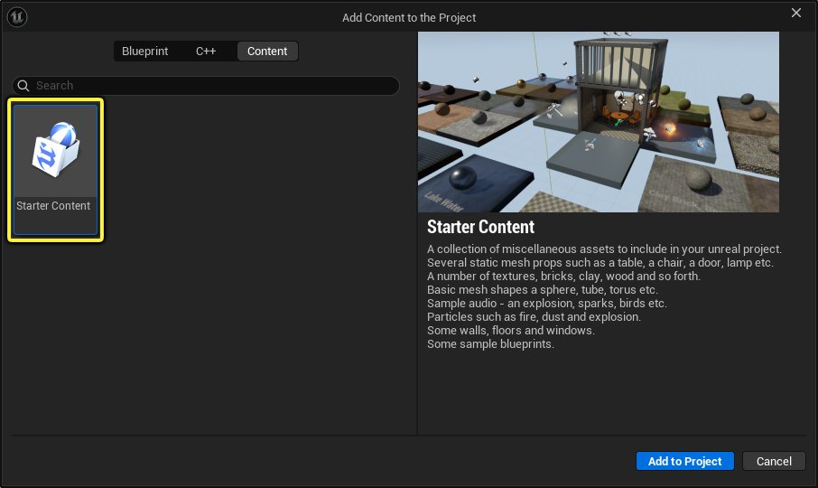
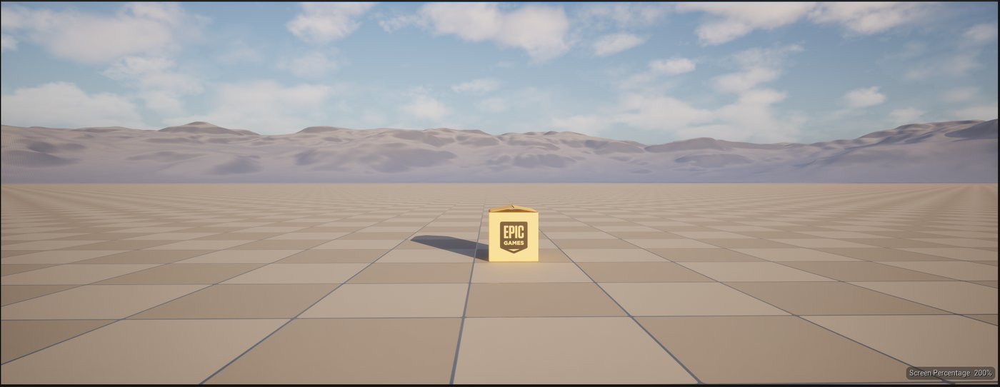
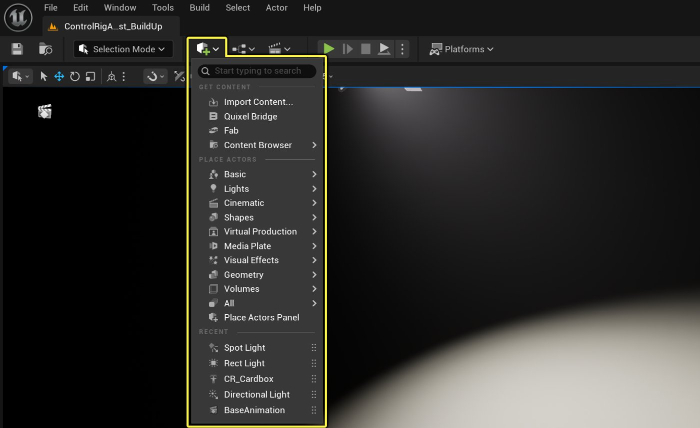
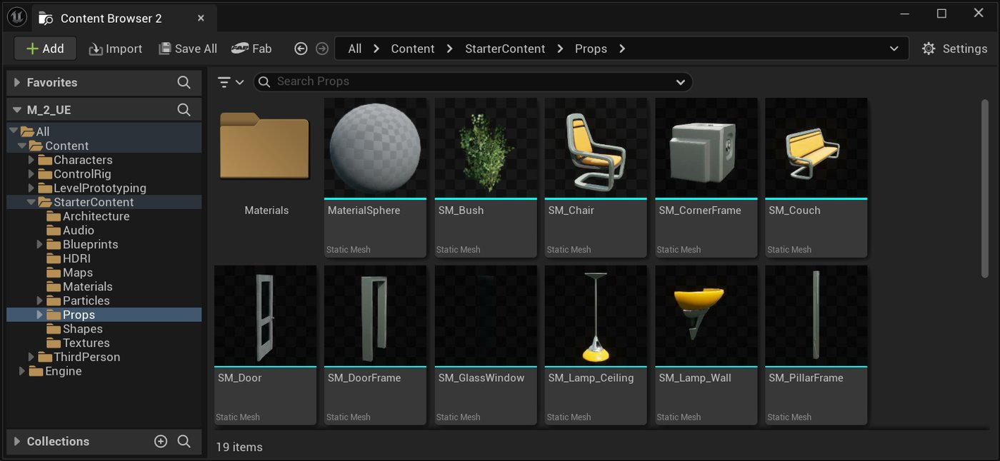
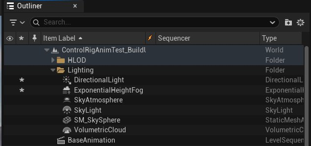
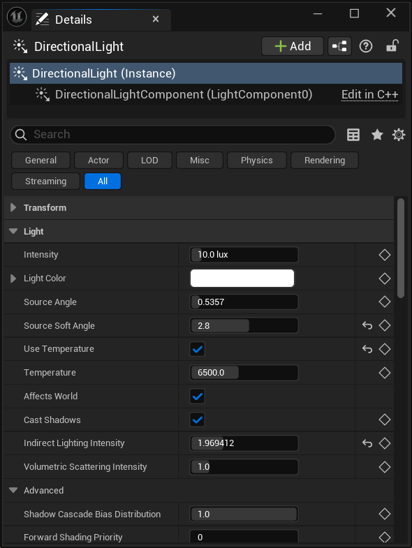
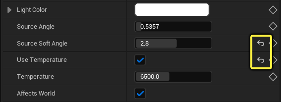

# 如何向场景中添加光照和Actor

> 路径：虚幻引擎5.7文档 / 入门指南 / 面向Maya用户的虚幻引擎 / 面向Maya用户的虚幻引擎动画制作入门 / 如何向场景中添加光照和Actor

> 原始页面：https://dev.epicgames.com/documentation/unreal-engine/how-to-add-lighting-and-effects-to-a-scene

> [!NOTE]
> 本指南的这部分内容纯属探索性质，取决于你希望呈现的效果。 除了更改场景的视觉效果外，你在此处进行的更改不会影响先前的步骤，也不会对完成本指南的下一个（即最后一个）步骤造成影响。

现在你已使用Sequencer和控制绑定道具完成了基本动画创建，接下来我们将了解如何向场景中添加一些有趣的渲染元素。 基本场景已包含一些基本渲染元素，包括定向光源、大气和云层，以及雾效。 我们来看看其中一些元素，并了解可以添加的其他元素，使该场景独具特色。

在本练习中，我们将了解如何：

- 向场景中添加光照和其他对象，例如光照、体积和道具。
- 选择场景Actor并编辑其部分属性。
- 使用体积和过场动画摄像机添加并配置后期处理设置。
- 向场景和Sequencer中添加过场动画摄像机

结合所有这些元素，你将看到它们最终如何共同作用以实现对场景的实时编辑和修改，并理解这对虚幻引擎中的操作的实际意义。

### 初学者内容包

此内容包是引擎的内置资源，自带各种简单的资产，包括场景道具、建筑道具、视觉效果和材质，可供场景装饰使用。

如果你尚未将其安装到项目中，但希望现在进行安装，请执行以下步骤：

1. 在内容浏览器中，点击**添加（Add）> 添加功能****或****内容包（Add Feature or Content Pack）**。
2. 在"将内容添加到项目（Add Content to the Project）"窗口中，选择**内容（Content）**选项卡。

   

   "将内容添加到项目"窗口
3. 选择**初学者内容包（Starter Content）**，然后点击**添加到项目（Add to Project）**。

   

   初学者内容包

添加后，可在内容浏览器的**Content > StarterContent下找到其文件夹。**

## 向场景中添加光照和其他组件

此时你的场景应类似如下：包含已制作完成的带动画的箱子，以及在本指南开头创建的场景。 尽管场景本身已有一定趣味，但仍不够激动人心。 因此，我们将向场景中添加一些其他光照元素和道具，以创建有趣的效果，供本指南后续使用。

开放世界初始关卡。

我们将查看初始场景中已包含的可编辑元素。 它包括：

- 可编辑地貌
- 定向（太阳）光源
- 天空和大气
- 体积云

所有这些都是实时元素，具有各自的属性和设置，可通过调整来创建有趣的视觉效果。

对于场景中未包含但需要添加的对象，可根据对象类型按以下方式操作：

- 对于光源、体积、云、雾、摄像机等场景Actor，使用**创建（Create）**下拉菜单，在**放置Actor（Place Actors）**类别下访问这些对象。

  

  "创建"下拉菜单。
- 对于项目中已有的资产，这些资产存储在**内容浏览器**中，可直接拖入场景。 这些资产包括道具、材质、控制绑定等对象。

  

  内容浏览器

在虚幻编辑器中，可从上述任意位置点击并将对象拖入场景。

在场景中放置对象。

请自行向场景中添加一些对象，以创建有趣的效果。 要添加什么内容完全由你决定，因为这不会直接影响已创建的动画。 尝试向场景中添加一些光源。 我们将在下一节展示如何编辑其属性。

### 修改光照组件

现在你已进一步了解场景中的对象及如何从内容浏览器添加对象，接下来将了解如何编辑它们的一些属性，从而仅通过几个设置就创建有趣的效果。

#### 大纲视图和细节面板

只要是场景中放置的对象，都可以直接在场景中选中，或使用大纲视图搜索并直接选中。 **大纲视图**位于虚幻编辑器界面的右上角。

关卡编辑器大纲视图

在大纲视图或场景中选中某个Actor时，"细节（Details）"面板会显示其属性和可配置的设置。

关卡Actor的"细节"面板

所有已更改默认值的属性都会标有**重置箭头（Reset Arrow）**。 点击该箭头可将属性重置为默认值。

将属性重置为默认值。

所有场景Actor都可以被添加到Sequencer中。 实际上，Actor的单个属性也可以被添加到时间轴并设置关键帧。 点击**菱形（Diamond）**可自动将该Actor添加到时间轴。

将Actor添加到Sequencer时间轴。

#### 编辑Actor属性

既然你已经选择了一些对象，并了解了可编辑其属性的位置，现在我们将看看场景中的一些光照组件来进行更改。 这些Actor属性将帮助你做出更改，让场景的视觉效果产生更明显的变化。

首先从**大纲视图（Outliner）**面板中选择**定向光源（Directional Light）**。

现在，你可以使用热键**右Ctrl+L**并拖动鼠标，即可旋转和更改光源方向。 由于光源会影响大气，你会看到当场景靠近地平线时，场景颜色会发生变化。

使用定向光源的热键调整其在天空中的旋转和位置以适应镜头。

在"细节（Details）"面板中，你可以更改属性和设置来影响场景中此光源的视觉效果。 值得你自行探索和尝试的一些设置如下：

- **强度（Intensity）：**

  - 设置以勒克斯（lux）为单位的数值来控制光源的亮度。
- **光源颜色（Light Color）：**

  - 点击颜色框并使用取色器为光源设置颜色。
- **色温（Color Temperature）：**

  - 设置**温度（Temperature）**值。 较低的值对应冷色调，较高的值则对应暖色调。
  - 启用"使用温度（Enable Use Temperature）"
- **光束（Light Shafts）：**

  - 启用**光束泛光（Enable Light Shaft Bloom）**

    - 点击**泛光色调（Bloom Tint）**旁的颜色框以更改场景中光束泛光的颜色。
    - 更改**泛光缩放（Bloom Scale）**以增加或减少此光源光束的泛光量。
  - 启用**光束遮挡（Light Shaft Occlusion）**
- **可视性（Visibility）：**

  - 你可以通过几种方式禁用光源，而无需将其从场景中移除或更改其属性。

    - 在**细节（Details）**面板中，取消勾选**影响世界（Affects World）**旁的方框。 这与删除光源效果相同，适用于不具破坏性的试验。
    - 在**大纲视图（Outliner）**中，点击Actor旁的**眼睛**图标。

> [!TIP]
> 你可以在 **细节（Details）**面板中右键单击任何属性，并将其添加到该面板的**收藏夹（Favorites）**分段。 这样可以更轻松地访问和更改这些特定属性。
>
> > 图片已省略：将单个属性添加到"细节（Details）"面板的收藏夹中以便快速访问。
>
> 将单个属性添加到"细节（Details）"面板的收藏夹中以便快速访问。

其他光源Actor具有类似功能，虽然所有光源通常具有相同的属性，但部分属性因光源类型呈现独特性。

**对于点光源、聚光光源和矩形光源：**

- **柔和区域阴影（Soft Area Shadows）：**

  - 对于矩形光源，"光源宽度（Source Width）" 和 "光源高度（Source Height）" 决定阴影的柔和度。
  - 对于聚光光源和点光源，使用 "光源半径（Source Radius）" 更改接触位置阴影的生硬或柔和程度。

    调整光源的半径大小。
  - **体积阴影贡献（Volumetric Shadow Contribution）：**

    - 调整**体积散射强度（Volumetric Scattering Intensity）**值，以更改此光源的强度和光源颜色对体积雾的贡献程度。
    - 勾选**投射体积阴影（Cast Volumetric Shadow）**框，使此光源对体积雾阴影产生影响。
    - **可视性（Visibility）：**

      - 你可以通过几种方式禁用光源，而无需将其从场景中移除或更改其属性。

        - 在 "细节（Details）" 面板中，取消勾选 "影响世界（Affects World）" 旁的方框。 这与删除光源效果相同，适用于不具破坏性的试验。
        - 在大纲视图中，点击Actor旁的 "眼睛" 图标。

对于**指数高度雾（Exponential Height Fog）**Actor，你可以调整多个属性，当你更改这些设置时，能够生成带体积阴影的浓密趣味雾效：

调整雾的属性及其颜色。

- **体积雾（Volumetric Fog）：**

  - 勾选**体积雾（Volumetric Fog）**框。
  - 调整**消光比例（Extinction Scale）**以控制雾粒子吸收光线的程度。
  - 使用**反照率（Albedo）**取色器更改雾反射率的颜色。
  - **高度雾（Height Fog）：**

    - 调整**雾高度衰减（Fog Height Falloff）**以在高度降低时增加密度。 值越小，雾的可见过渡范围就越明显。
    - 将**雾密度（Fog Density）**调整为更高的值，以增加场景中的雾量。 滑块上限有限，但可手动输入更大的数值。
    - **可视性（Visibility）：**

      - 你可以通过几种方式禁用光源，而无需将其从场景中移除或更改其属性。

        - 在**细节（Details）**面板中，取消勾选**可见（Visible）**旁的方框。
        - 在**大纲视图（Outliner）**中，点击Actor旁的**眼睛**图标。

即使只在场景中添加少量光源并调整其设置，也可显著改变虚幻编辑器中场景的视觉效果。 由于所有内容均为实时操作和渲染，因此你所做的全部更改都会立即呈现，以供查看。 你可利用此功能优化场景的构图和布局，而无需等待渲染完成。

## 向场景中添加摄像机

现在场景中已有一些光照（无论使用关卡中已有的光源，还是自行添加光源），接下来我们在场景中添加摄像机，并通过Sequencer进行设置。 此摄像机将用于聚焦动画，在本入门指南的最后一节用于渲染最终图像。

使用主工具栏中的**创建（Create）**下拉菜单，从**过场动画（Cinematics）**展开菜单中拖入一个**过场动画摄像机Actor**。

向场景中添加过场动画摄像机Actor并将其聚焦在带动画的箱子道具上。

按照以下建议对齐镜头：

- 在Sequencer中，使用播放头在箱子动画中推移。 旋转并对齐摄像机，以完全捕获纸皮箱道具。
- 选中过场动画摄像机后，使用**细节（Details）**面板更改以下摄像机设置，以在镜头中包含更多内容：

  - 点击摄像机预览窗口左下角的**固定**图标，将此摄像机视图固定到关卡编辑器，即使你点击摄像机以外的其他区域也不会取消固定。

    > 图片已省略：使用"固定"保持摄像机预览窗口始终可见。

    使用"固定"保持摄像机预览窗口始终可见。
  - 在**裁剪设置（Crop Settings）**下，将**当前焦距（Current Focal Length）**更改为较低值以查看更多场景内容。

    > 动图已省略：调整"裁剪设置（Crop Settings）"中的"当前焦距（Current Focal Length）"，无需将摄像机从带动画的主体移开，即可让场景纳入更多画面内容。

    调整"裁剪设置（Crop Settings）"中的"当前焦距（Current Focal Length）"，无需将摄像机从带动画的主体移开，即可让场景纳入更多画面内容。

现在已将摄像机对齐以查看带动画的对象，接下来将摄像机添加到Sequencer中，并通过关键帧设置一些轻微的摄像机移动，同时更改摄像机的一些属性。

你可以使用几种方式将过场动画摄像机Actor添加到Sequencer。

- 在**大纲视图**中选中该对象，然后将其拖放至**Sequencer动画大纲视图**中。

  将Actor拖放至Sequencer编辑器的动画大纲视图中。
- 点击**添加（+）（Add (+)）**图标，在**添加Actor轨道（Add Actor Track）**下从列表中选择要添加的Actor。

  > 图片已省略：将Actor添加到Sequencer轨道中

  将Actor添加到Sequencer轨道中

此时，你将在Sequencer中看到摄像机轨道。 视图将自动采用摄像机视角，呈现其拍摄画面。 在时间轴上推移时，可在关卡编辑器视口中显示对应画面。

> 图片已省略：已向Sequencer添加新的摄像机轨道。

已向Sequencer添加新的摄像机轨道。

向Sequencer添加摄像机后，我们需要设置一些关键帧为摄像机移动制作动画，并更改摄像机的几个属性。

1. 在Sequencer中，在摄像机的 "变换（Transform）" 轨道上，点击 "添加关键帧" 图标，为该Actor的位置、旋转和缩放生成关键帧记录。

   > 图片已省略：为摄像机Actor添加关键帧

   为摄像机Actor添加关键帧
2. 将**播放头**向前移动到时间轴上道具动画中间的某个位置。
3. 由于摄像机处于"受控"状态，你可在场景中将摄像机移动到新位置并旋转，以聚焦于道具。
4. 完成后，按下 **变换（Transform）** 旁的 **添加关键帧** 按钮为其添加关键帧。

   移动播放头，将摄像机调到新位置，并通过新关键帧记录其变换。
5. 点击**摄像机组件（Camera Component）**下列出的任何属性旁的**添加关键帧（Add Keyframe）**按钮。 这将确保在后续步骤中，它们从该值开始过渡到你稍后选择的值。

   或者，你可以启用 **自动关键帧（Auto Key）** 以自动记录大部分内容的更改。

   自动关键帧切换
6. 将 播放头 再次向前移动到道具落地的位置。
7. 将摄像机转向道具，并调整 **当前焦距（Current Focal Length）** 和 **手动对焦距离（Manual Focus Distance）** 以适应场景。

   移动播放头，调整摄像机及其属性以适合场景。

## 在场景中使用后期处理

借助虚幻引擎的后期处理效果，美术师和设计师能够对影响颜色、色调映射、光照等的属性和功能进行组合选择，从而定义场景的整体视觉效果。 在任何场景里，你都可以通过放置的体积或者摄像机来使用这些功能。 你也可使用多个体积，这些体积可以混合在一起，也可设置优先级使某一个体积优先于其他体积。

后期处理系统还支持虚幻引擎的材质系统，这意味着，你可以通过在编辑器中创建的材质，驱动创建自定义外观和效果。

> 图片已省略：应用于场景的后期处理材质示例。

应用于场景的后期处理材质示例。

使用主工具栏中的**创建（Create）**下拉菜单，从**视觉效果（Visual Effects）**展开菜单中拖入一个**后期处理体积**。

放置后期处理体积并更改其部分设置。

放置后期处理体积时，可通过以下方式查看其效果：

- 缩放体积以覆盖某个区域，同时在体积范围内移动摄像机视角。
- 在**细节（Details）**面板中，勾选**无限范围（未限制）（Infinite Extent (Unbound)）旁边的方框。**无论摄像机是否位于体积内，这都会将你所做的更改全局应用于关卡。

  > 图片已省略：设置后期处理体积以对整个场景产生全局影响。

  设置后期处理体积以对整个场景产生全局影响。

另一种访问和更改后期处理设置的方法是利用摄像机Actor。 每个摄像机Actor的设置中均包含后期处理设置。 应用于摄像机的后期处理设置仅在摄像机被控制或从Sequencer中渲染时可见。

在此示例场景中，你可以在预览窗口中看到摄像机的拍摄画面，以及后期处理设置如何被更改为不同于场景其他部分的效果。

> 图片已省略：此示例展示了如何将后期处理与摄像机结合使用，使其呈现与场景不同的视觉效果。

此示例展示了如何将后期处理与摄像机结合使用，使其呈现与场景不同的视觉效果。

如需详细了解使用后期处理及其各种属性，请参阅 [后期处理效果](../../../../designing-visuals-rendering-and-graphics/post-process-effects/index.md) 文档。

## 在实时编辑器中进行更改

由于你在实时场景中操作，因此可以随时在流程中进行更改，且所见即所得。

如果一直跟随操作到这一步，并向场景中添加了一些不同的光源、道具和其他Actor以打造专属场景，就能体会到虚幻编辑器在适应工作流程与创意方面具有强大的可塑性。

无论你是在团队中协作还是作为独立动画师，通过本练习，你将获得一定的自主性，使你能更自由、更富有创意地开展工作以达成目标。 以下是根据本指南截至目前的步骤和建议编译的场景。 该场景使用两种不同的光照设置：一种是通过定向光源照亮关卡基础组件，另一种则仅使用聚光光源和矩形光源，并加入了高度雾以增强效果。

在实时场景中结合动画操作。

### 下一步

在本入门指南的下一个（即最后一个）步骤中，我们将介绍如何渲染目前完成的内容。 我们将展示虚幻引擎提供的影片渲染管线，以及如何运用这些管线生成最终图像。

- [如何使用影片渲染管线生成最终图像和视频](../how-to-render-out-final-images-and-video/index.md) - 了解虚幻引擎的影片渲染管线，以及如何用其渲染图像和视频。
