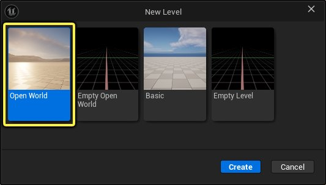
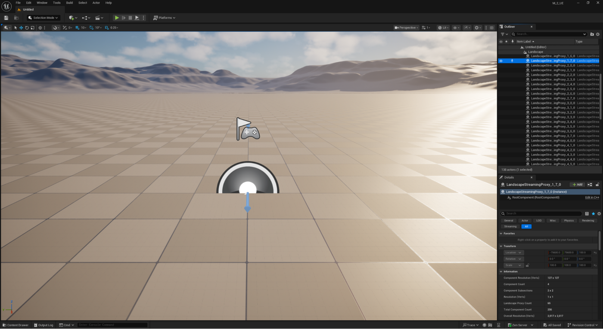
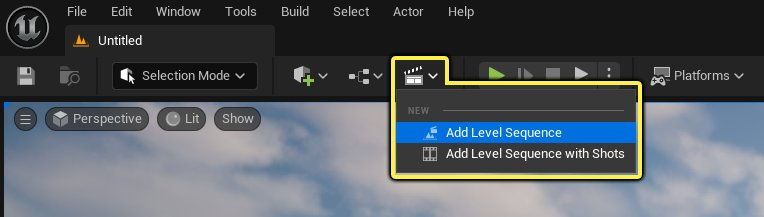
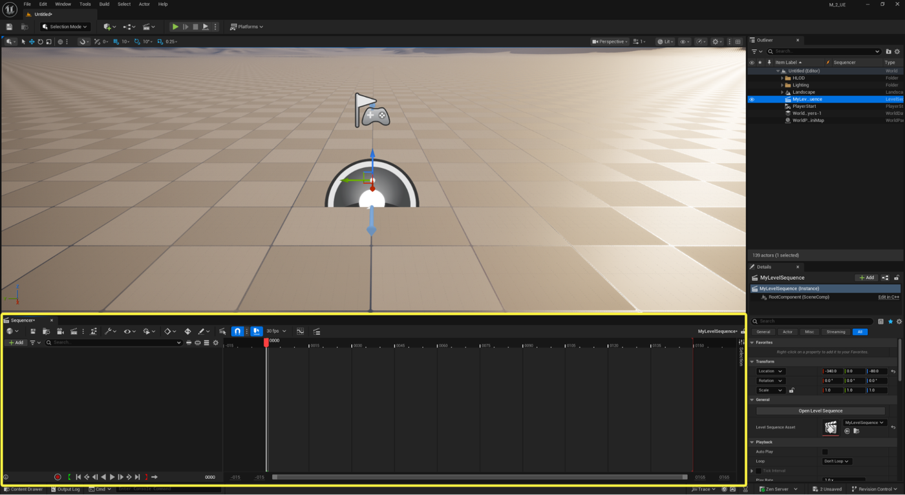
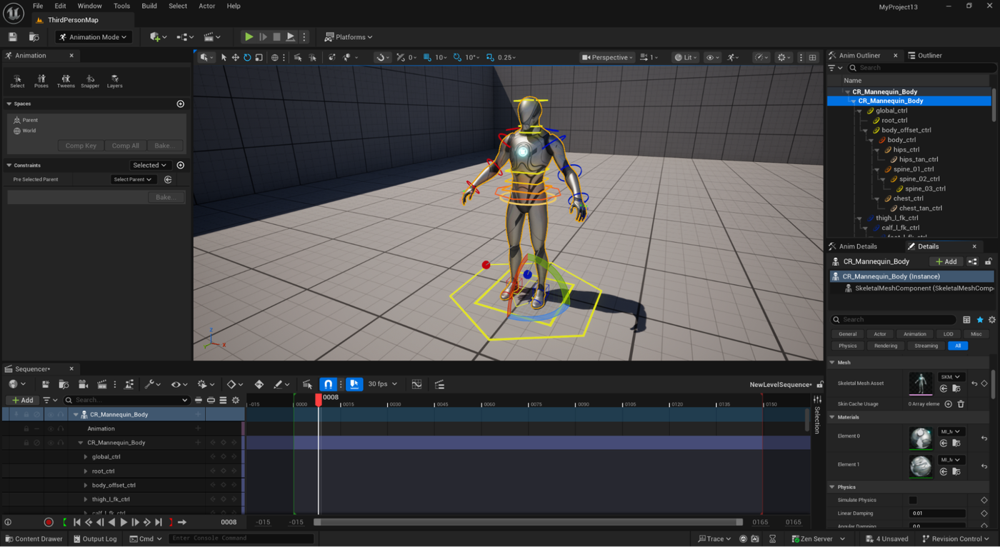
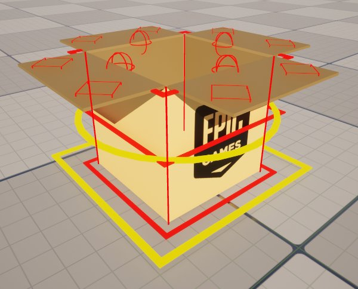
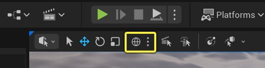
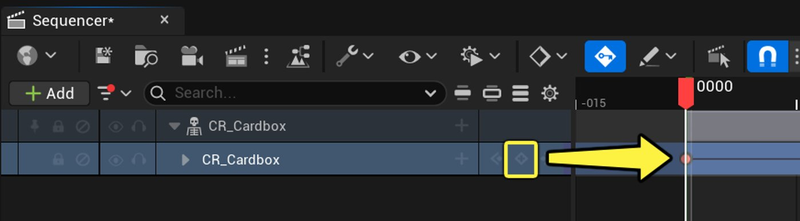

# 如何使用Sequencer制作动画

> 路径：虚幻引擎5.7文档 / 入门指南 / 面向Maya用户的虚幻引擎 / 面向Maya用户的虚幻引擎动画制作入门 / 如何使用Sequencer制作动画

> 原始页面：https://dev.epicgames.com/documentation/unreal-engine/how-to-animate-with-sequencer

既然你已安装虚幻引擎并设置新项目，接下来你将逐步学习创建新关卡、关卡序列（用于在场景中为Actor制作动画），以及如何使用控制绑定对象让虚幻编辑器内的动画制作更为便捷。

## 推荐阅读

如果你是虚幻引擎或实时引擎的新手，建议先阅读[面向Maya用户的虚幻编辑器和功能概述](../../unreal-editor-and-features-overview-for-maya-users/index.md)。 本指南可帮助你理解在虚幻引擎中制作动画时将使用的部分功能和工具的背景及工作流程。

## 新建关卡

1. 在编辑器中，转至主菜单并选择**文件（File）> 新关卡（New Level）**。
2. 在"新建关卡（New Level）"对话框中，选择**开放世界（Open World）**。

   

   选择你要创建的关卡类型。
3. 点击**创建（Create）**。

系统将创建新的开放世界关卡并自动打开。 当关卡加载完成并完成编译和着色器准备后，你将看到此界面。

新创建的开放世界关卡。

## 准备场景

1. 在主工具栏中，点击**过场动画**图标，从下拉菜单中选择**添加关卡序列（Add Level Sequence）**。

   

   向场景中添加关卡序列。
2. 在**资产另存为（Save Asset As）**窗口中，为关卡序列资产命名（1），然后点击**保存（Save）**（2）。 就本指南而言，关卡序列命名为"MyLevelSequence"。

   关卡序列将自动打开，并在关卡编辑器视口底部添加Sequencer面板。

   

   打开关卡序列的Sequencer面板。
3. 在**内容浏览器**中，找到**ControlRig > Props > CardBox**文件夹，将名为**CR_Cardbox**的资产拖入场景。

   向场景中添加控制绑定道具。

当纸皮箱道具的控制绑定被拖入场景后，系统将执行以下操作：[关卡编辑器模式（Level Editor Mode）](../../../../building-virtual-worlds/level-editor/level-editor-modes/index.md)会自动切换至**动画（Animation）**模式，以便更好地使用控制绑定和为控制绑定制作动画，纸皮箱控制绑定会被自动添加到你之前创建的关卡序列中。

在下一小节开始前，你可以选择将纸皮箱道具移至场景中不影响其他Actor对象的位置。 按键盘上的F快捷键可快速将摄像机视图聚焦到所选的Actor上。

移动控制绑定

## 使用Sequencer结合控制绑定制作动画

在虚幻编辑器中开始动画制作前，我们先回顾一下将在虚幻引擎中用于制作动画的部分工具和编辑器模式。

### 关卡编辑器动画模式

关卡编辑器包含**模式（Modes）**选择菜单，可将编辑器切换为不同类型工作流程的模式。 对于每种工作流程，你可能会获得额外的工具面板，其中有工具和视口工具栏选项供你使用。 **动画（Animation）**模式包含一些工具和设置，可帮助你直接在关卡视口中制作动画。

打开Sequencer后关卡编辑器的动画模式。

在动画模式下，你会注意到布局发生变化，多个额外面板打开，包括：

- **动画面板（Animation Panel）：**可用于为关卡中的对象制作动画的工具列表。
- **动画大纲视图（Anim Outliner）：**关卡中任何控制绑定内包含的控制点列表。
- **动画细节（Anim Details）：**与所选控制绑定中控制点相关的属性和变换设置列表。 其功能类似于"细节（Details）"面板，但专门用于控制绑定。

### 控制绑定控制点

控制绑定让你能够直接在虚幻编辑器中为角色和对象制作动画。 你可以在角色上创建和绑定自定义控制点，在Sequencer中为其制作动画，并使用各种其他动画工具辅助动画制作流程。

如需设置和使用控制绑定的更多信息，请参阅[控制绑定](https://dev.epicgames.com/documentation/unreal-engine/BlueprintAPI/EditorScripting/SequencerTools/ControlRig?application_version=5.6)。

就本指南而言，我们来看看在名为**CR_Cardbox**的道具上设置的控制点。

来自控制绑定示例包的CR_Cardbox道具。

你为本指南所下载的[控制绑定示例包](https://www.fab.com/listings/2ce3fe44-9ee6-4fa7-99fc-b9424a402386)中的控制绑定设置，包含以下用于为纸皮箱道具制作动画的元素：

控制绑定不同控制器的演示。

- **全局**控制器是位于箱底的黄色正方形，与地平面对齐。 你将使用此控制器在场景中移动整个控制绑定以进行摆放。
- **主体**（或质心）控制器是环绕箱子道具中心的黄色圆环。 将用于移动道具的绑定，而不移动全局控制器。 你可以自由移动绑定。
- **挤压和拉伸**控制器是位于道具底部、中部和顶部区域的红色正方形。 移动或缩放这些控制器会使这些区域的网格体变形。

**控制点**是沿网格体的翻盖分布的红色球体和小正方形，用于移动这些绑定元素以及为这些元素制作动画。

调整控制绑定的控制点。

**代理**控制器呈绿色菱形。 它们类似于你在Maya中设置用于控制一组点的代理网格体。

使用控制绑定的代理控制器移动角色。

## 设置控制绑定姿势

在开始为箱子制作动画前，我们需要先合上箱子的翻板。 我们将使用箱子内边缘的**控制点**选中这些翻板并向内旋转。 你可以逐一选择控制点，也可以同时选择多个控制点并向内旋转。

具体方法如下：

1. 选择箱子两侧相对的内边缘处的控制点。
2. 为使这些翻板同时向相同的内侧方向旋转，旋转翻板时需要从世界空间切换到**局部空间**。 用鼠标点击视口工具栏中的"空间切换（Space toggle）"，或使用键盘快捷键**Ctrl + `**，可在两种坐标空间之间切换。

   

   针对变换工具在局部空间和世界空间之间切换。
3. 将变换工具设置为**旋转**小工具。 你可以使用视口工具栏选择旋转工具，也可以使用**空格键**在移动、旋转和缩放工具之间切换，或者按**E**键切换到旋转工具。

   > 动图已省略：使用空格键在变换小工具之间切换。

   使用空格键在变换小工具之间切换。
4. 选择你想要旋转方向的轴，**按住鼠标左键**并**拖动**以旋转翻板，直到箱子合上。

   > 动图已省略：选择多个控制点并同时旋转它们。

   选择多个控制点并同时旋转它们。
5. 选择剩余的两个控制点，重复上一步以合上这些翻板。

这是上述步骤的结果：

设置控制绑定的初始姿势。

## 在Sequencer中制作动画和设置关键帧

在此动画示例中，我们将探讨如何让此纸皮箱道具来回轻轻摇摆、挤压、拉伸，并跳跃至另一个位置。 在了解本指南的具体操作之前，我们先大致了解一下在虚幻编辑器中制作动画的几种不同方式。

首先，你可以直接为其制作动画。 这需要旋转和平移对象，设置关键帧，并反复重复此过程直到完成。 对于纸皮箱这类道具，你需要移动和旋转对象，模拟沿箱体边缘的枢轴点效果。 这每次都需要大量手动操作。

应用仅移动对象和为对象设置关键帧的暴力动画方法。

第二种方法是使用视口工具栏中的**临时枢轴点工具（Temporary Pivot Tool）**。 这提供屏幕上的**编辑（Edit）**和**姿势（Pose）**切换功能，可临时移动和放置枢轴点以进行调整。 在为纸皮箱道具制作动画时，这种方法比第一种更简便，但仍需要手动移动枢轴点、旋转箱子、设置关键帧并重复该过程。

使用虚幻引擎的临时枢轴点工具移动并为变更设置关键帧。

第三种方法是使用控制绑定中内置的**代理控制点**，本指南将在后续步骤中使用此方法。 这些控制点无需设置关键帧，而是用于驱动其他控制点的值。 此纸皮箱道具的控制绑定沿每条边缘（尤其是边缘和角落）专门布置了枢轴点。 此代理控制器会自动查找这些枢轴点，并动态更改枢轴点，无需手动执行所有操作。

使用在控制绑定上设置的代理控制器处理移动操作。

> [!TIP]
> 如果未看到绿色代理控制器，可以使用**动画大纲视图（Anim Outliner）**面板从控制点列表中进行选择。

结合使用控制绑定和Sequencer，有多种不同的对象动画制作方式，我们将探讨第三种方法：使用这些控制器和代理控制点，只需通过几个关键帧，即可完成一段简短动画。 我们将在控制绑定中使用代理和控制器设置执行一些动作，例如让箱子来回摇摆，然后使其跳跃至新位置，最后在这些动作之间使用挤压和拉伸控制器来实现更精细的动作。

我们将按以下方式拆解这些步骤，使彼此之间相互衔接：

- 设置一些通用关键帧，包括沿箱子边缘来回旋转，以及从一个点跳跃至另一个点。
- 使用挤压和拉伸控制器为动画添加一点个性。
- 在Sequencer和动画编辑器模式中使用一些工具，提升动画流畅度和视觉效果。

> [!NOTE]
> 本指南的目标不是完全复制所示内容。 而是希望通过这个简单的动画，展示虚幻引擎中动画工具和Sequencer的关键功能，从而简化动画制作流程。
>
> 如果你希望在遵循本指南时获得最佳效果，请参阅本页的"可选设置"和"推荐设置"部分，以便将编辑器配置与后续章节演示内容更匹配。

### 设置动画的初始关键帧

我们将首先设置一些初始关键帧，以捕获跳跃动作的基本形态。 这些关键帧不需要与本指南中显示的完全一致，但执行以下步骤应能得到类似效果。

1. 在**Sequencer**面板中，点击**添加关键帧（Add Keyframe）**以创建用于动画的初始关键帧。

   

   手动添加一个关键帧。
2. 在时间轴上向前移动**播放头**以创建新关键帧。 你将创建三个关键帧中的第一个：一个用于向后摇摆，一个用于回落至平放状态，另一个用于跳跃前的向前摇摆：
3. 在**动画大纲视图（Anim Outliner）**中，选择层级结构中的**代理（Proxy）**控制器。

   > 图片已省略：在"动画大纲视图（Anim Outliner）"面板中选择代理（Proxy）控制器。

   在"动画大纲视图（Anim Outliner）"面板中选择代理（Proxy）控制器。
4. 使用**旋转（Rotate）**工具将箱子向左摇摆。
5. 在时间轴上向前移动**播放头**几帧。
6. 使用**旋转（Rotate）**工具将箱子移回原始平放位置并添加关键帧。 这样可确保由于代理控制器的枢轴点正在切换，箱子不会与地面产生融合穿透。
7. 在时间轴上再次向前移动**播放头**几帧。
8. 使用 "旋转（Rotate）" 工具将箱子向右摇摆。

此时，Sequencer中的关键帧和动画应类似如下效果：

为控制绑定道具设置来回摇摆动作的结果。

接下来，我们为动画添加跳跃动作，以将箱子从一个位置移动到另一个位置。

1. 从箱子最后一次向右倾斜的位置开始，在时间轴上向前移动**播放头**若干帧。
2. 按**空格键**切换变换工具，或按**W**键选择**移动**小工具。
3. 在场景中选择**全局（Global）**控制器（黄色方框），或使用**动画大纲视图（Anim Outliner）**面板进行选择。 你可以使用此控制器移动控制绑定，无需将箱子道具从场景中移除。

   > 图片已省略：在"动画大纲视图（Anim Outliner）"面板中选择全局（Global）控制器，以移动控制绑定的道具。

   在"动画大纲视图（Anim Outliner）"面板中选择全局（Global）控制器，以移动控制绑定的道具。
4. 选中全局（Global）控制器后，抓取**移动（Move）**小工具并将箱子移至地面上方且原位置右侧的某处。 此操作将创建一个箱子悬停在地面上方的关键帧。
5. 在时间轴上向前移动**播放头**若干帧。
6. 保持选中全局（Global）控制器，抓取**移动（Move）**小工具将箱子移至地面，并使其位置比空中时偏右一点。
7. 按**空格键**切换到**旋转（Rotate）**工具，或按键盘上的**E**键。
8. 在**动画大纲视图（Anim Outliner）**中选择**代理（Proxy）**控制器。
9. 将箱子向左旋转，使其再次平放于地面。

此时，Sequencer中添加跳跃后的关键帧和动画应类似如下效果：

在Sequencer中添加跳跃关键帧的效果。

综合所有因素，对于箱子最初的来回摇摆以及从一个点到另一个点的跳跃，你应看到类似这样的效果：

Sequencer中完整的关键帧动画，包含来回摇摆和跳跃动作。

### 为挤压和拉伸制作动画

控制绑定针对此道具设有内置控制，当在Sequencer中为其制作动画时，内置控制使网格体的挤压和拉伸更便捷。

在本指南的这一小节中，我们将通过控制绑定上的控制器应用一些变形，并将这些更改记录到你在上一步中已设置的关键帧上。 执行以下步骤，了解如何在Sequencer中对前几个关键帧执行此操作，其余部分你可以自行完成，以创建独特的效果。

1. 在Sequencer中，选择初始向后摇摆姿势的第二个关键帧。

   > 图片已省略：选择一个你要添加动画的关键帧。

   选择一个你要添加动画的关键帧。
2. 选中此姿势后，我们将选择箱子顶部的红色正方形。 使用移动小工具，沿Z轴（蓝色）方向向上拖动，以拉伸网格体。

   使用移动小工具并拖动一些控制器，对道具应用挤压和拉伸效果。
3. 点击**CR_Cardbox**旁的**关键帧（Key）**按钮，将此动作的关键帧添加到Sequencer时间轴上。

   > 图片已省略：使用"添加关键帧（Add a Keyframe）"按钮，在时间轴上捕获所有移动。

   使用"添加关键帧（Add a Keyframe）"按钮，在时间轴上捕获所有移动。
4. 你可以**对其余每个关键帧重复上述步骤和操作**，通过控制绑定的这些拉伸和挤压控制，使其成为独特的作品。

如果你对其余关键帧执行此操作，即为控制点添加关键帧更改，你可以获得像这样简单的效果，或者根据需求进一步调整，为纸皮箱的动画添加更多细节。

> 动图已省略：对道具应用一些挤压和拉伸的效果。

对道具应用一些挤压和拉伸的效果。

### 精细调整关键帧

在Sequencer中，有两个内置工具可用于优化动画关键帧的编辑：**曲线编辑器**和**Tween工具**。

**曲线编辑器**是一个独立窗口，可用于控制对象的动画方式。 它可用于修改和微调关键帧，提供在Sequencer面板中无法实现的精确控制。

可从Sequencer面板的工具栏中点击其图标来访问曲线编辑器。

> 图片已省略：点击"曲线编辑器（Curve Editor）"图标，即可在单独的可停靠窗口中打开曲线编辑器。

点击"曲线编辑器（Curve Editor）"图标，即可在单独的可停靠窗口中打开曲线编辑器。

在曲线编辑器中，你可以创建新关键帧、编辑切线，并使用其内置工具调整动画曲线。 Tween工具也内置在曲线编辑器的主工具栏中。 此编辑器不仅限于Sequencer，也可与Niagara VFX编辑器等其他工具配合使用。

> 图片已省略：曲线编辑器。

曲线编辑器。

> [!TIP]
> 使用左侧的选择面板选择特定控制点，仅编辑这些关键帧，以实现更精细的控制。
>
> > 图片已省略：使用Ctrl+鼠标左键同时选择多个轨道。
>
> 使用Ctrl+鼠标左键同时选择多个轨道。

如需详细了解此编辑器的用法并熟悉其工具，请参阅[曲线编辑器](../../../../animating-characters-and-objects/cinematics-and-movie-making/unreal-engine-sequencer-movie-tool-overview/animation-curve-editor/index.md)文档。

**Tween工具**是所有动画师的工具箱中不可或缺的部分，因为它可用于通过多种方式调整所选关键帧与相邻关键帧之间的插值。

你可以通过以下两种方式之一访问Tween工具：

- 将其与关卡编辑器的动画模式相集成，并结合Sequencer面板进行使用。

  > 图片已省略：在动画模式下，点击"动画（Animation）"面板中的"Tweens"按钮以打开Tween工具。

  在动画模式下，点击"动画（Animation）"面板中的"Tweens"按钮以打开Tween工具。
- 内置在曲线编辑器的主工具栏中。

  > 图片已省略：Tween工具内置在曲线编辑器的主工具栏中。

  Tween工具内置在曲线编辑器的主工具栏中。

Tween工具包含以下模式，可通过下拉菜单选择来调整中间关键帧：

> 图片已省略：Tween工具模式

Tween工具模式

| Tween方法 | 说明 |
| --- | --- |
| **混合相邻项（Blend Neighbor）** | 混合到所选关键帧的下一个或上一个值。 |
| **推/拉（Push / Pull）** | 将值推或拉至上一个与下一个关键帧之间的插值位置。 |
| **混合缓动（Blend Ease）** | 对所选关键帧的下一个或上一个值进行缓动衰减混合。 |
| **相对移动（Move Relative）** | 相对于所选关键帧的下一个或上一个值进行移动。 |
| **时间偏移（Time Offset）** | 通过更改关键帧的Y值并保持帧位置，将曲线向左或向右偏移。 |
| **平滑/粗糙（Smooth / Rough）** | 推动相邻的混合关键帧使其更靠近或远离。 平滑适用于柔化噪点，例如在动捕动画中。 |
| **Tween** | 在上一个和下一个关键帧之间进行插值。 |

此外，你可以一次选择多个关键帧进行调整。

> 动图已省略：选择多个关键帧并使用Tween工具。

选择多个关键帧并使用Tween工具。

如需这些工具的更多信息，请参阅[动画模式](../../../../animating-characters-and-objects/control-rig/animating-with-control-rig/animation-editor-mode/index.md)文档中的"Tween工具"小节。

现在你已大致了解这些可用的工具，可以尝试在自己的动画中使用它们进行编辑。

在以下示例中，曲线编辑器用于在跳跃最高点和落地位置添加关键帧，以此微调旋转角度。 Tween工具用于轻微混合这些关键帧。 在你的动画中尝试此操作，探索如何将曲线编辑器与动画结合使用，并尝试不同的Tween工具模式，为你的动画创造独特效果。

在曲线编辑器中使用Tween工具微调并添加带动画的关键帧。

## 下一步

现在你已拥有一个可用于创作的简单动画，下一步是向场景中添加一些光照和其他环境元素，让场景显得生动有趣。 你将向场景中添加一些光源、道具和雾元素，并学习如何实时编辑这些元素，为场景创造有趣且多样的视觉效果。

- [如何向场景中添加光照和Actor](../how-to-add-lighting-and-effects-to-a-scene/index.md) - 如何在实时操作过程中向场景中添加光源和其他Actor。
