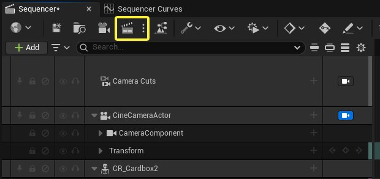
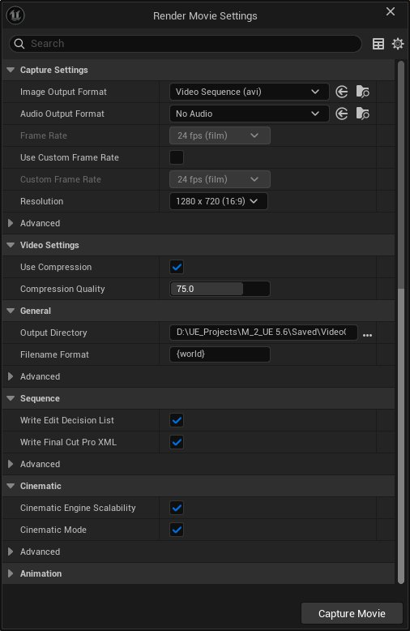

# 如何使用影片渲染管线生成最终图像和视频

> 路径：虚幻引擎5.7文档 / 入门指南 / 面向Maya用户的虚幻引擎 / 面向Maya用户的虚幻引擎动画制作入门 / 如何使用影片渲染管线生成最终图像和视频

> 原始页面：https://dev.epicgames.com/documentation/unreal-engine/how-to-render-out-final-images-and-video

虚幻引擎的 [影片渲染管线](https://dev.epicgames.com/documentation/unreal-engine/BlueprintAPI/MovieRenderPipeline?application_version=5.6) 是一种离线图像序列和影片渲染解决方案。 当使用其3D渲染和光照功能创建线性内容时，与传统实时渲染相比，此管线可实现更高质量的渲染效果。

使用影片渲染管线进行离线渲染时，可通过一系列设置和命令大幅提升画质、精度和视觉效果，例如支持Lumen全局光照和反射的光线追踪特性。 虚幻引擎的离线渲染还可以优化动态模糊效果，同时消除不必要的抗锯齿瑕疵。

虚幻引擎的影片渲染管线提供三种工具用于渲染项目。 每种工具具备不同功能以满足项目的各种需求：

- [影片渲染图表](../../../../animating-characters-and-objects/cinematics-and-movie-making/movie-render-pipeline/index.md#movie-render-graph)（MRG）：基于图形的界面，可用于编译渲染操作的执行逻辑。
- [影片渲染队列](../../../../animating-characters-and-objects/cinematics-and-movie-making/movie-render-pipeline/index.md)（MRQ）：你可以使用该工具创建预设和脚本，从而安排渲染进程，并在随后导出高质量图像。 如果要在项目中使用此功能，需先为项目启用该插件。
- [快速渲染](../../../../animating-characters-and-objects/cinematics-and-movie-making/movie-render-pipeline/index.md#quick-render) ：Sequencer内的工具，可通过一键操作和一些可自定义的参数快速渲染项目。

> [!NOTE]
> 就本指南而言，我们将使用Sequencer中的快速渲染工具演示场景渲染方法。 我们建议你自行查阅MRG和MRQ文档，深入了解这些工具及所有可设置参数，既可以利用离线渲染实现更高画质，还可以享受实时引擎带来的工作流程灵活性。

## 使用快速渲染

**快速渲染**工具是Sequencer主工具栏的一部分。 它提供对**影片场景捕获**（旧版）工具和**影片渲染队列**（当项目激活对应插件时）的快速访问。

要打开快速渲染设置，点击**快速渲染（Quick Render）**（场记板）图标。

Sequencer中的快速渲染工具。

旧版**影片场景捕获**工具是一种设置精简的工具，可导出图像序列或视频，以供快速审核。 该工具适用于无需深度调整渲染设置的工作流程，也可作为快速查看场景构图及其动画渲染效果的方式。

影片场景捕获（旧版）设置

在该对话框中，你可以配置输出图像或视频的设置。 准备好后，点击**捕获影片（Capture Movie）**以启动流程。

此时应会弹出一个窗口，并开始渲染输出视频或图像。 默认情况下，将渲染出一段视频。 以下是本指南的最终效果。
