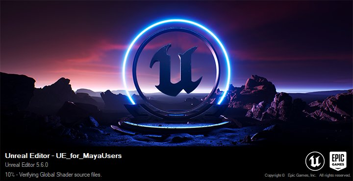
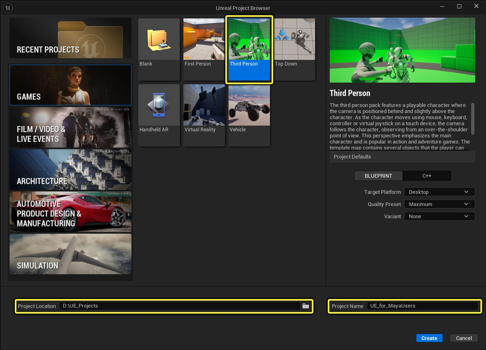
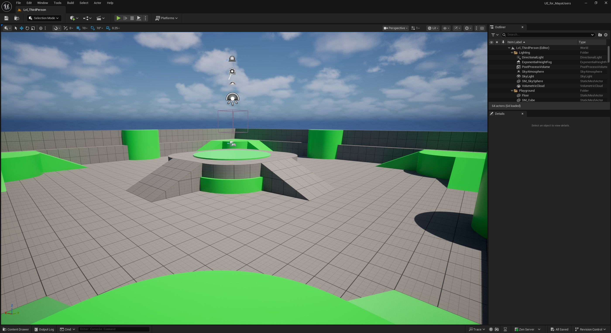
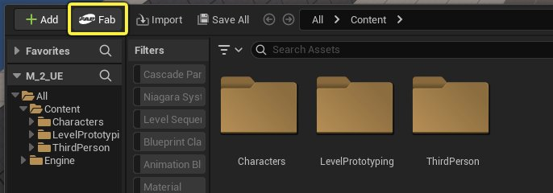
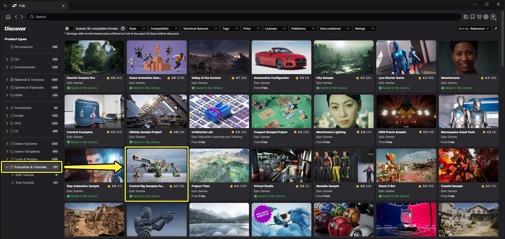
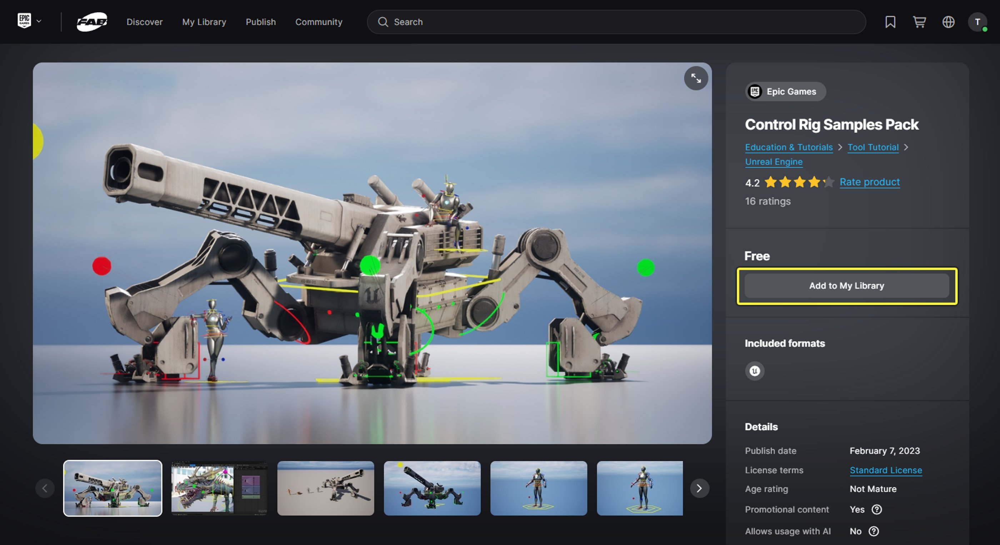
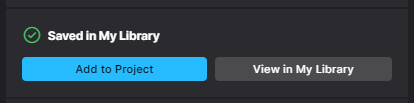
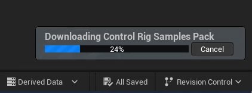

# 安装虚幻引擎和设置项目

> 路径：虚幻引擎5.7文档 / 入门指南 / 面向Maya用户的虚幻引擎 / 面向Maya用户的虚幻引擎动画制作入门 / 安装虚幻引擎和设置项目

> 原始页面：https://dev.epicgames.com/documentation/unreal-engine/installing-and-setting-up-a-project

本指南将引导你下载和安装最新版本的虚幻引擎。 此外，你还将学习如何创建项目并从Fab商城下载控制绑定示例包，从而完成本指南所需的所有准备工作。

## 下载并安装虚幻引擎

在开始前，首先按以下步骤从Epic Games启动器下载最新预编译版本的虚幻引擎：

> [!NOTE]
> 如果你在团队或工作室中工作，可能对引擎的获取方式有其他要求，例如使用源码管理或GitHub检索虚幻引擎源代码并在本地计算机上进行编译。 本指南不涵盖这些步骤。
>
> 如果你已通过此类方式获取虚幻引擎，可跳至下一节[创建项目](https://docs.google.com/document/d/1dAEZVgytM4-t4zZreKPrkanxX_Wrez5B92uKwhy7QJU/edit?tab=t.0#heading=h.s1bzeugnpiae)，并开始熟悉虚幻编辑器及其工作流程。

1. 下载并安装Epic Games启动器。
2. 打开Epic Games启动器。
3. 在侧边导航栏中选择虚幻引擎，并在顶层选项卡中选择**库（Library）**。
4. 在**引擎版本（Engine Version）**旁，点击**添加**（+）按钮，以添加引擎版本图块。
5. 在**引擎版本图块**上，点击**安装**以安装最新版虚幻引擎。
6. 使用**选择安装位置（Choose Install Location）**对话框选择引擎的安装位置。
7. 点击**安装（Install）**。

如需了解上述步骤的详细操作指南，请参阅[安装虚幻引擎](../../../install/index.md)。

## 创建项目

当你从Epic Games启动器启动虚幻引擎时，你将使用**项目浏览器（Project Browser）**选择行业开发类别和模板项目作为起点。 模板项目是熟悉虚幻编辑器的良好起始点，因为它们可能包含不同类型的Gameplay、项目设置、已启用插件等。

就本指南而言，你将创建一个第三人称模板项目，用于探索虚幻编辑器的功能及其工作流程，以及如何将它们应用于工作中。

要开始创建项目，请执行以下步骤：

1. 从Epic Games启动器右上角，点击**启动（Launch）**以打开虚幻引擎。

   
2. 片刻后，将加载**项目浏览器（Project Browser）**。 在此处可以选择要使用的模板项目。 就本指南而言，出于演示目的，在左侧类别中选择**游戏（Games）**选项卡，然后选择**第三人称（Third Person）**模板，以便准确地按照指南操作。

   

   虚幻引擎项目浏览器

   在"项目浏览器（Project Browser）"窗口中，可选择性设置以下内容：

   1. 设置**项目名称（Project Name）**，即为此项目指定一个名称。 该名称可用于在项目浏览器（Project Browser）的最近打开的项目选项卡或Epic Games启动器的**库（Library）**选项卡中找到项目。 你可以根据自己的喜好为项目命名。
   2. 准备好创建并加载项目时，点击**创建（Create）**。
   3. 设置**项目位置（Project Location）**，以选择项目的保存路径。

加载项目时，屏幕上将显示虚幻编辑器和默认模板项目地图。

虚幻引擎第三人称模板

如需详细了解项目启动程序和可用模板项目，请参阅以下文档：

- [项目和模板](../../../../understanding-the-basics/working-with-projects-and-templates/index.md)
- [创建新项目](../../../../understanding-the-basics/working-with-projects-and-templates/creating-a-new-project/index.md)
- [模板项目参考](../../../../understanding-the-basics/working-with-projects-and-templates/template-reference/index.md)

## 下载控制绑定示例包

在有效遵循本指南的步骤之前，需要从Epic Games的数字资产统一内容商城[Fab.com](http://fab.com/)下载[控制绑定示例包](https://www.fab.com/listings/2ce3fe44-9ee6-4fa7-99fc-b9424a402386)。

1. 在**内容浏览器**中，点击**Fab**图标以在虚幻编辑器内打开Fab商城。

   

   在虚幻引擎中访问Fab商城
2. 在**教育与教程（Education & Tutorials）**类别下，找到[控制绑定示例包（Control Rig Sample Pack）](https://www.fab.com/listings/2ce3fe44-9ee6-4fa7-99fc-b9424a402386)。

   

   Fab商城的教育与教程内容。
3. 点击**添加到我的库（Add to My Library）**，将此内容与Epic Games账户关联，以便后续在已拥有资产中快速找到并添加到其他项目中。

   

   虚幻引擎的控制绑定示例包。

   将内容添加到库后，界面的此部分将变为快速访问按钮，你可以选择直接将内容添加到当前项目，或在Fab库中查看你已拥有的内容。

   

   将此内容添加到项目中。
4. 点击**添加到项目（Add to Project）**。 这将下载内容并将内容直接安装到项目中。

   

内容下载完成后，你可以在内容浏览器中找到下载的内容文件夹。

> 图片已省略：控制绑定示例包已添加到你的项目中，并可从内容浏览器访问。

控制绑定示例包已添加到你的项目中，并可从内容浏览器访问。

在本指南的下一节，当你开始在Sequencer中为带有控制绑定的角色制作动画时，将使用此内容。

## 项目补充说明

### Fab商城和虚幻引擎

Fab商城是一个统一平台，创作者可在其中探索、购买、出售和分享高质量、实时可用的数字资产和插件。

虚幻引擎通过Fab插件与该商城集成，允许你直接在虚幻编辑器中打开商城并为项目下载内容。

Fab包含付费和免费内容，供你在项目中使用，其中包括Epic免费提供的示例和内容包，你可以在"虚幻引擎 > 教育与教程"下找到这些内容，[请点击此处](https://www.fab.com/channels/unreal-engine?listing_types=education-tutorial)。

如需详细了解如何在虚幻引擎中使用Fab，请参阅：

- [虚幻引擎中的Fab](https://www.fab.com/channels/unreal-engine?listing_types=education-tutorial)

### 源码管理

对于已在项目中使用或考虑使用源码管理的团队，请参阅[虚幻引擎中的协作和版本控制](../../../../production-pipeline/collaboration-and-version-control/index.md)。

## 下一步

在接下来的步骤中，你将深入学习使用虚幻引擎的动画功能，还有我们的过场动画工具Sequencer和已设置控制绑定的道具。 你将创建一个简单动画，同时学习这些工具和资产的基础知识，以便将其应用于自己的项目中。

- [如何使用Sequencer制作动画](../how-to-animate-with-sequencer/index.md) - 如何使用关卡序列设置场景并为控制绑定角色制作动画。
