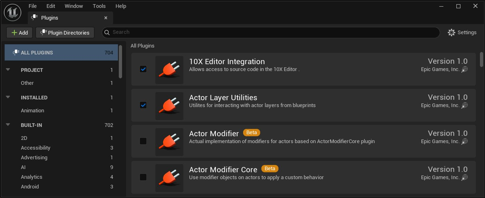
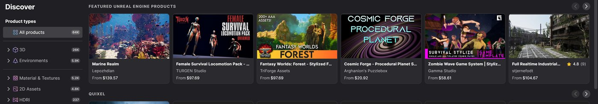
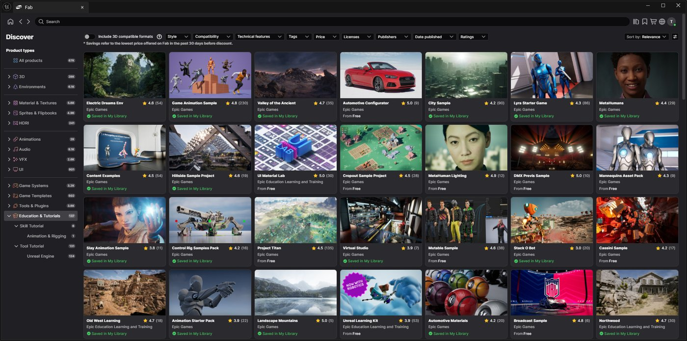
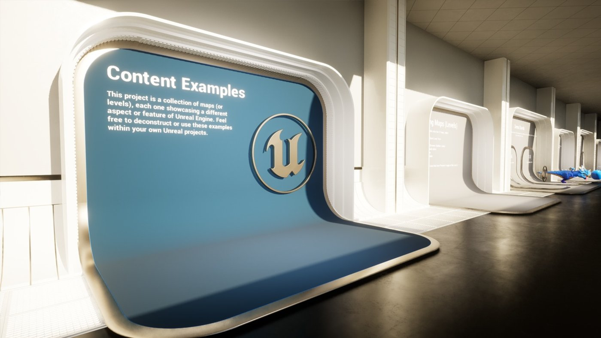
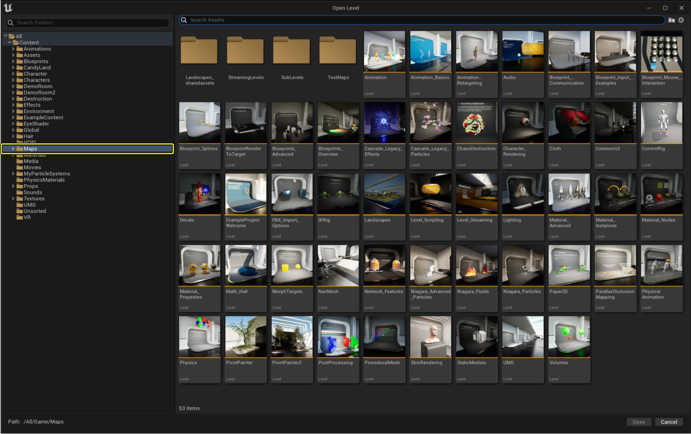
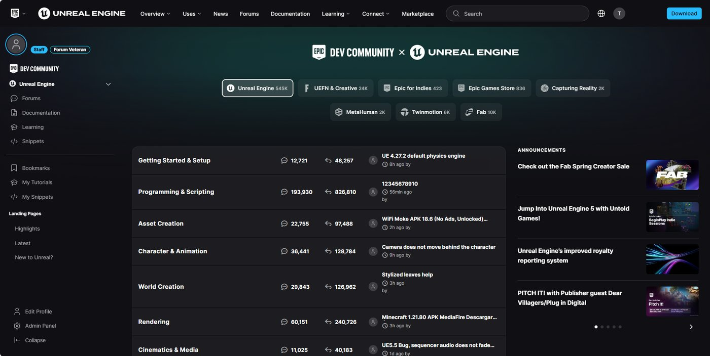

# 面向Maya用户的虚幻引擎其他功能和资源

> 路径：虚幻引擎5.7文档 / 入门指南 / 面向Maya用户的虚幻引擎 / 面向Maya用户的虚幻编辑器和功能概述 / 面向Maya用户的虚幻引擎其他功能和资源

> 原始页面：https://dev.epicgames.com/documentation/unreal-engine/additional-features-and-resources-of-unreal-engine-for-maya-users

本入门指南未涵盖虚幻引擎的全部功能，且引擎为各类用户提供了丰富的学习资源。

## Niagara视觉效果

**Niagara VFX**系统是虚幻引擎内创建视觉效果的主要工具。 它是一套强大、灵活且高性能的系统，用于创建复杂的实时粒子特效和模拟。

Niagara包括以下功能：

- 基于发射器的编辑器提供可视化脚本界面，包含不同模块以进行视觉特效处理。
- 高度可定制化，支持精细控制粒子行为，适用于从火焰、烟雾、雨水、爆炸等简单到复杂的模拟场景。
- 数据驱动工作流程，可动态响应Gameplay逻辑、动画或其他外部数据源。
- GPU和CPU模拟，支持大规模粒子计数和需要精准计算的复杂粒子行为。
- 模块化可复用组件，可打造发射器和模块，以在多个项目或其他视觉特效处理中使用。
- 编辑器视口实时交互和预览。
- 流体模拟的高级仿真能力。

如需详细了解如何在项目中开始使用Niagara，请参阅以下主题：

- [Niagara概述](../../../../visual-effects/getting-started-in-niagara-effects/overview-of-niagara-effects/index.md)
- [Niagara关键概念](../../../../visual-effects/getting-started-in-niagara-effects/key-concepts-in-niagara-effects/index.md)
- [Niagara快速入门](../../../../visual-effects/getting-started-in-niagara-effects/quick-start-for-niagara-effects/index.md)
- [在Niagara中创建视觉效果](../../../../visual-effects/index.md)

## 物理系统

虚幻引擎使用其自己的轻量级物理引擎，名称为**Chaos物理系统**。 它从底层编译，以支持实时物理模拟和次世代游戏的需求。

Chaos物理系统支持以下功能：

- 破坏效果
- 支持物理动画的刚体动力学
- 布料物理和机器学习布料模拟
- 毛发物理
- 血肉模拟
- 流体模拟
- 以及其他功能！

如需详细了解虚幻引擎的物理系统，请参阅[Chaos物理系统](../../../../gameplay-systems/physics/index.md)。

## 动态设计

**动态设计**是一个功能集，可为动态图形美术师提供一套精简且富有创意的工具，用于实现快速迭代和可伸缩性。 它包括重新设计的大纲视图、用户界面、绑定工具、克隆器、可自定义2D/3D形状，以及一种使用基于图层的工作流程（称为材质设计器）创建材质的新方式。

如需了解更多信息，请参阅[动态设计](../../../../motion-design/index.md)。

## MetaHuman Creator

**MetaHuman Creator**工作流程已完全集成到虚幻引擎中。 此简化工作流程使你能够通过本地编辑创作角色，并无缝访问自动绑定和纹理合成等云驱动服务。

你可以为你的MetaHumans带来逼真的面部动画，借助MetaHuman Animator在后台运行，处理来自捕捉设备的数据。 它会将其转化为适用于你的MetaHuman的精确面部动画。 生成的动画数据简洁而正确，让你可以轻松做出美术方面的调整。

如需了解MetaHuman更多信息，请参阅以下内容：

- [MetaHuman文档](https://dev.epicgames.com/documentation/metahuman/metahuman-documentation?application_version=5.0-5.5)
- [MetaHumans示例项目](https://www.fab.com/listings/0281d63e-71f7-4e07-a344-5fa721ac4d35)

## 插件

虚幻引擎包含大量插件，这些插件可支持引擎使用其他功能和内容。 此引擎主要通过插件编译，可根据项目需求启用或禁用这些插件。

你可以使用**插件**浏览器管理项目中的插件。 你可以从主菜单中选择**编辑（Edit）> 插件（Plugins）**来访问此窗口。

如需了解使用插件和此窗口的更多信息，请参阅[插件](../../../../production-pipeline/plugins/index.md)。

## 其他资源

除了虚幻引擎的文档外，你还可以研究以下内容获取更多资源，例如示例资产和项目、社区主导的教程和论坛、由社区及Epic员工制作的学习课程等。

### Autodesk Maya虚幻Live Link

虚幻Live Link插件可以将动画数据从Maya实时流送到虚幻引擎。 无论你是在虚拟制片环境中使用这两种工具工作，还是要构建你的下一款游戏，现在都可以在Maya中处理角色资产，并立即在虚幻引擎中预览到你的工作成果。 如需详细了解相关知识，以及该如何将其用于Maya和虚幻引擎，请参阅Autodesk应用商店中的[Unreal Live Link for Autodesk Maya plugin](https://apps.autodesk.com/MAYA/Detail/Index?id=3726213941804942083)一文。

### Fab商城

**Fab**是一个提供一站式服务的数字商城，供创作者探索、分享、购买及出售高质量、实时可用的游戏资产。 你可以在[Fab.com](http://fab.com/)上探索其内容。

Fab作为插件集成到虚幻引擎中，且默认处于启用状态。 你可以直接从Fab商城下载内容并导入到项目中。

你可以在左侧面板的**产品类型（Product Types）**分类下的**教育与教程（Education & Tutorials）**部分找到大量Epic创建的内容，例如示例项目和资产包，以供探索和学习。

要深入了解Fab及其在虚幻引擎中的集成方式，请参阅以下主题：

- [虚幻引擎中的Fab](../../../../understanding-the-basics/assets-and-content-packs/fab-window/index.md)
- [Fab.com商城](http://fab.com/)
- [Fab社区和文档](https://dev.epicgames.com/community/fab)

### 内容示例项目

**内容示例**项目旨在展示可供你使用的各类技术。 此项目设置为一系列关卡，每个关卡都将运用示例为你介绍引擎的一个不同方面。 在关卡中移动时，你会看到一系列标有编号的"展台"，而每个"展台"都会展示特定主题的示例资产。

内容示例的介绍采用了一种交互式学习方法。 对于其中某些关卡，你必须启动"在编辑器中运行（Play-in-Editor）"功能才能与资产进行交互。

涵盖的主题包括

- 动画
- 音频
- 蓝图
- 地形
- 材质
- 物理
- 以及其他功能！

加载项目时，所有内容主题都被分解为独立关卡，你可以在**Content > Maps**文件夹中找到这些关卡。

如需详细了解此示例项目，以及如何用其学习虚幻引擎的功能，请参阅[内容示例](../../../../samples-and-tutorials/content-examples-sample-project/index.md)。

### Epic开发者社区

**Epic开发者社区**（简称EDC）提供由Epic员工和社区成员创建的公告、教程、展示项目、论坛及学习资料。

你可以在[Epic开发者社区](https://dev.epicgames.com/community/)访问EDC。
