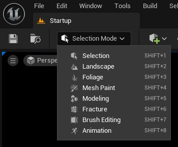
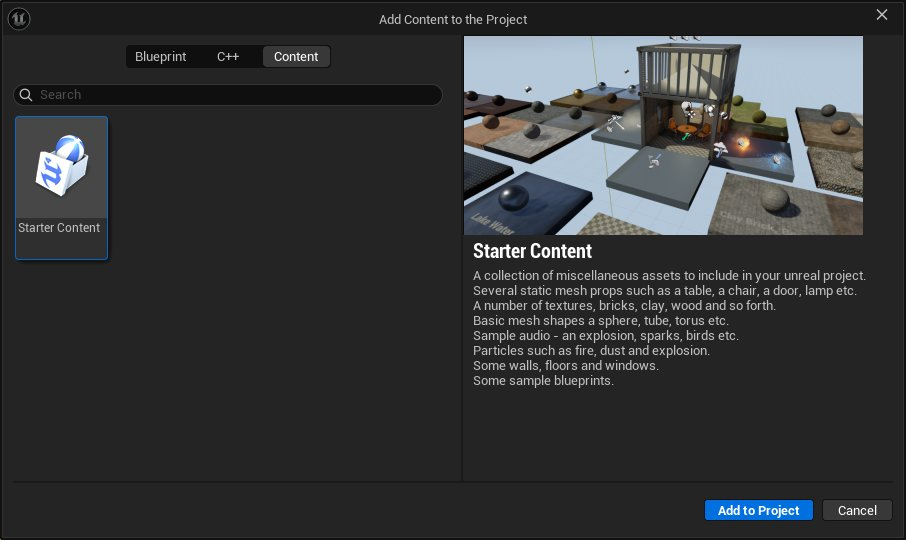

# 面向Maya用户的虚幻引擎世界设计和编译

> 路径：虚幻引擎5.7文档 / 入门指南 / 面向Maya用户的虚幻引擎 / 面向Maya用户的虚幻编辑器和功能概述 / 面向Maya用户的虚幻引擎世界设计和编译

> 原始页面：https://dev.epicgames.com/documentation/unreal-engine/designing-and-building-worlds-in-unreal-engine-for-maya-users

虚幻引擎自带适用于编译各种规模世界的工具和功能，从小型封闭空间到大型开放世界均能胜任。 引擎的世界编译功能旨在与虚幻引擎的其他功能协同工作，例如支持动态全局光照和电影级质量阴影的光照系统、基于Nanite虚拟几何体实现的视觉密集型高质量几何体，以及布料和破坏效果的物理交互等。

这些工具的良好协同意味着，你可以打造令人惊叹的宏大电影级世界，也可以打造精简或繁复的小型紧凑空间，细节丰富度完全由你掌控。

## 虚幻关卡与Maya场景的对比

在虚幻引擎中，所有世界设计都始于**关卡**。 关卡本身是存在于内容浏览器中的地图资产。 关卡是容纳所有放置内容的容器，可包含光源、静态网格体、角色、视觉效果，或任何可从内容浏览器及主工具栏"创建（Create）"菜单中添加的元素。

Maya场景在这方面有所不同，其设计初衷是满足影片、视效预览和静态镜头的线性构图需求。 而在虚幻引擎中，你仍需要使用网格体和光源来组装场景，但此时需要在实时环境中进行操作，并考虑交互性、游戏逻辑和性能，即便使用线性内容工作流程打造世界时也是如此。

以下是Maya和虚幻引擎间的一些用例概念：

| 概念 | Maya用例 | 虚幻引擎用例 |
| --- | --- | --- |
| **主要角色** | 资产创建 | 实时世界组装 |
| **单位和比例** | 基于内容管理的严格缩放 | 基于内容管理的灵活缩放 |
| **对象焦点** | 多边形建模 | 基于Actor的实例化系统和场景构造模块化 |
| **场景组装** | 静态、非实时工作流程 | 支持实时交互、逻辑和光照处理的动态工作流程。 |

## 关卡编辑器模式

在虚幻引擎中，你可以使用主工具栏中的**模式（Modes）**选择项，将关卡编辑器切换至不同的工作模式。 这些模式专注于特定设计领域，部分模式拥有独立的编辑器工作空间工具，可替换主工具栏中的工具。

你可以使用主工具栏中的"模式（Modes）"下拉选择项，更改关卡编辑器中使用的模式。

以下是对关卡内容打造和编辑最为实用的部分模式：

| 视口工具模式 | 说明 |
| --- | --- |
| **选择模式（Selection Mode）** | 这是编辑器的默认模式。 使用此模式在关卡中放置和编辑对象。如需详细了解此模式的用法，请参阅[选择模式](../../../../building-virtual-worlds/level-editor/level-editor-modes/select-mode/index.md)。 |
| **地形（Landscape）** | 此模式包含一套用于管理、塑造和绘制地形地貌的工具。 你可以从头开始创建地貌，或导入高度图以创建基础地形以供使用。 该模式还包含样条线工具，可沿路径放置道路或可重复对象。如需详细了解此模式的用法，请参阅[地形户外地貌](../../../../building-virtual-worlds/landscape-outdoor-terrain/index.md)。 |
| **植被（Foliage）** | 此模式包含一套工具，可基于筛选器在关卡中不同类型的几何体上绘制或擦除静态网格体集合。 每种可绘制网格体均包含相关设置，用于定义其在关卡中的绘制方式。 这包括其与被绘制网格体表面的对齐方式、密度、随机化选项等设置。 适合使用此模式绘制的典型示例包括草、树木、灌木丛和岩石。 如需详细了解使用此模式的用法，请参阅[植被模式](../../../../building-virtual-worlds/open-world-tools/foliage-mode/index.md)。 |
| **网格体绘制（Mesh Paint）** | 使用此模式可直接在关卡视口中运用绘制工具为网格体应用颜色和纹理。 网格体绘制模式包含多种网格体绘制选项，例如为网格体顶点应用颜色，或直接在网格体纹理上进行绘制。如需详细了解此模式的用法，请参阅[网格体绘制模式](../../../../building-virtual-worlds/level-editor/level-editor-modes/mesh-paint-mode/index.md)。 |
| **建模（Modeling）** | 这是一套完整的建模工具和功能，由美术师友好型工具组成，用于创建和编辑3D几何体。 如需详细了解此模式的用法，请参阅[建模模式](../../../../working-with-content/modeling-and-geometry-scripting/index.md)。 |

## 在世界中放置对象

在虚幻引擎中，你可以用多种方式将对象放置在世界中。

使用下表详细了解各个选项：

| 选项 | 编辑器内视图 | 说明 |
| --- | --- | --- |
| **内容浏览器** | [内容浏览器筛选](https://dev.epicgames.com/community/api/documentation/image/b2e6e32d-1704-463b-a0ff-66617f6b1137?resizing_type=fit) | 这是虚幻编辑器的主要区域，用于在项目中创建、导入、整理、查看和管理内容。 此处的大多数资产可直接放置在关卡中，或应用于关卡中的资产。 如需更多信息，请参阅[内容浏览器](../../../../understanding-the-basics/content-browser/index.md)。 |
| **创建工具栏菜单** | [创建菜单](https://dev.epicgames.com/community/api/documentation/image/cefa2e3e-be6c-4d9d-8b1c-7ace3c8eb491?resizing_type=fit) | 此菜单包含常见Actor类型列表、最近使用的资产和Actor类型，以及可添加到关卡的内容的快速链接。 此菜单中的Actor类型是关卡特定的Actor，在内容浏览器中无法作为资产找到，例如光源、体积，以及云等环境功能。 你可以使用此菜单将Actor拖放到关卡中进行放置。 如需更多信息，请参阅[虚幻编辑器界面](../../../unreal-engine-for-new-users/unreal-editor-interface/index.md)。 |
| **放置Actor面板** | [放置Actor面板](https://dev.epicgames.com/community/api/documentation/image/b5c91321-9561-494b-b73d-cbef1129c52c?resizing_type=fit) | 这是可停靠面板，其中包含可拖放到关卡中的常见Actor类型。 其功能与创建（Create）工具栏菜单类似。如需更多信息，请参阅[放置Actor](../../../../understanding-the-basics/actors-and-geometry/placing-actors/index.md)。 |

## 基于模块化和比例思维组装环境

在实时环境中打造世界时，需考虑工作流程对性能的影响。 无论是在编辑器中打造实时游戏体验，还是采用线性内容驱动的工作流程，这一点都同样重要。 管理关卡中内容的渲染方式正是实现这一点的关键。 引擎视口旨在以实时模式运行，支持"所见即所得"的工作流程。

从其对3D应用程序的工作流程影响来看，需要思考如何以适合模块化工作流程的方式拆分内容。 虚幻引擎仅会渲染任意时刻屏幕上可见的内容，因此最好将内容拆分为可重复的实例。 可见的大型连续网格体会被完整加载，并持续占用内存，即使其始终只有一部分会出现在屏幕上。 这会在每一帧增加额外的绘制调用，用以渲染网格体及其材质。 如果以模块化的方式构建对象，并用其组装更大的对象，那么在屏幕上不可见的部分就不会被渲染。这意味着它们不会持续占用内容，也不会产生绘制调用。

采用模块化思维进行编译，最适合用于关卡中可重复使用的内容，例如墙壁、地板和天花板的表面，或道具和建筑架构的表面，例如雕像、门、栏杆、家具或其他不计其数的对象。 通过参数驱动的材质实例化工作流程，可利用材质变体来增强每个模块的表现效果。

以模块化方式打造内容时，需考虑以下内容：

| 模块化设计领域 | 注意事项 |
| --- | --- |
| **网格单位和比例** | 在编辑器中使用网格确保尺寸一致性。 例如，针对建筑结构等内容，可先采用100厘米或50厘米的对齐单位。 编译内容时需牢记此网格对齐尺寸，当使用多种网格大小时，可通过乘以或除以2的方式保持比例统一。尽可能保持对象间的统一比例。尽可能使用2的幂次数值（如50、100、200、400），确保部件精准对齐，避免出现缝隙或表面重叠。 |
| **对齐和枢轴点放置** | 在其他应用程序中编译网格体时，需合理定位枢轴点（如角落或底部中心点），以适配网格对齐逻辑。模块化部件应实现无间隙、无部件重叠的对齐。 移动、旋转和缩放这三种变换工具均拥有独立的对齐设置。 |
| **纹理平铺和UV** | 对于模块化部件，使用可平铺纹理，各部件UV保持统一且相互匹配。对于UV：确保需连接的模块化部件UV统一且相互匹配。避免UV拉伸或接缝错位，以防出现视觉断层。对于需要添加独特细节的区域，可考虑使用贴花，从而避免需要单独的UV和网格体。 |
| **材质** | 在模块化部件间重复使用材质。 这可以节省内存，减少每帧绘制调用次数，从而提升实时性能。使用材质实例创建平铺图案变体，改善过于单调的区域表现。 |

### Epic Games示例项目中的模块化设计示例

Epic Games发布的所有示例项目均采用模块化设计，部分为项目定制方案，另一部分则采用更通用的方法。你可以研究这些项目，了解如何将模块化设计方法应用于自身项目。

以下是结构的模块化构造及通过材质实例实现纹理变体的经典学习案例：

|  |  |  |
| --- | --- | --- |
| [太阳神庙](https://dev.epicgames.com/community/api/documentation/image/58445a6f-b962-442b-b5ed-b125bedf21b9?resizing_type=fit)[太阳神庙](https://www.fab.com/listings/b5516e01-8511-4ff4-b658-a6efd6bc7c6f) | [蓝图](https://dev.epicgames.com/community/api/documentation/image/b9cfdf02-8373-49e3-aa4f-b15021febf26?resizing_type=fit)[蓝图](https://www.fab.com/listings/720af3f1-cd24-40a3-a881-ee695a7c9779) | [Lyra初学者游戏](https://dev.epicgames.com/community/api/documentation/image/ff55ce36-de94-42c9-8faa-f842c2080a44?resizing_type=fit)[Lyra初学者游戏](https://www.fab.com/listings/93faede1-4434-47c0-85f1-bf27c0820ad0) |

你还可自行研究[Fab平台上由Epic Games创建并可供免费下载](https://www.fab.com/category/education-tutorial?sellers=o-aa83a0a9bc45e98c80c1b1c9d92e9e)的更多案例。

如果你希望无需下载独立示例项目即可直接在项目中使用相关资源，可添加引擎自带的**初学者内容包**。 此内容包自带一系列简单材质、道具及不同尺寸的建筑墙体。

要随时为项目添加初学者内容包，请执行以下步骤：

1. 转至内容浏览器，然后点击**添加（Add）**按钮。
2. 从菜单中选择**添加功能或内容包（Add Feature or Content Pack）**。
3. 点击**内容（Content）**选项卡。
4. 点击**添加到项目（Add to Project）**。

此时，内容浏览器中会新增一个名为"Starter Content"的文件夹。 可浏览其中内容。 如果要了解模块化墙体和地板的编译方式，可查看**Architecture**文件夹。

## 下一页

- [面向Maya用户的虚幻引擎动画制作](../animating-in-unreal-engine-for-maya-users/index.md) - 面向Maya用户的虚幻引擎动画系统及其核心功能概述。
