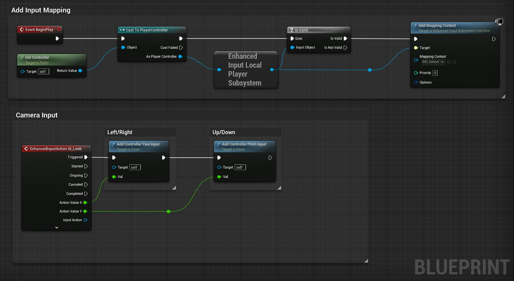
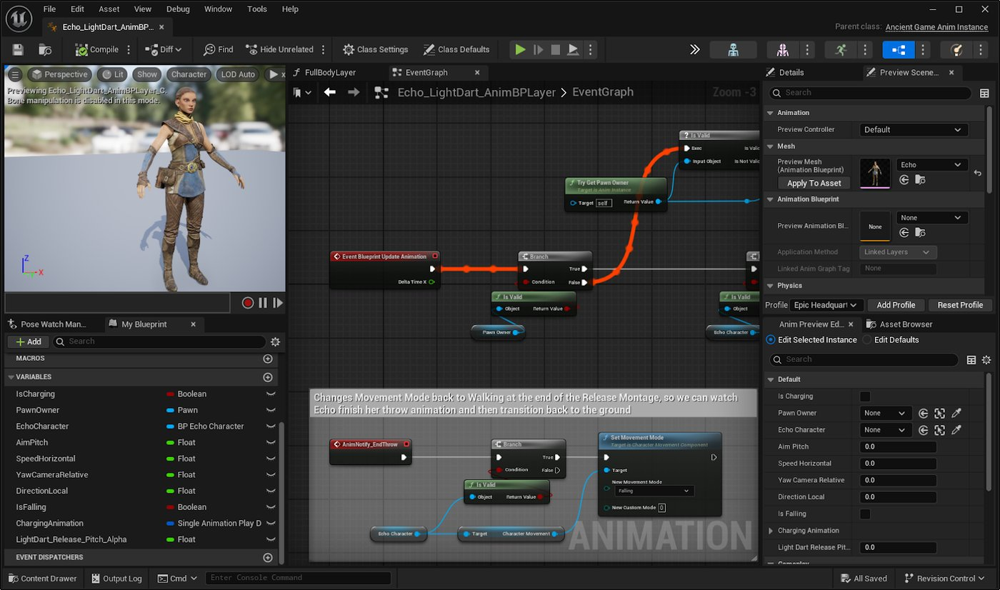

# 面向Maya用户的虚幻引擎脚本编写

> 路径：虚幻引擎5.7文档 / 入门指南 / 面向Maya用户的虚幻引擎 / 面向Maya用户的虚幻编辑器和功能概述 / 面向Maya用户的虚幻引擎脚本编写

> 原始页面：https://dev.epicgames.com/documentation/unreal-engine/scripting-in-unreal-engine-for-maya-users

虚幻引擎提供了多种方式供你在项目中使用脚本功能。 一些方式适用于运行时的Gameplay，而另一些仅在编译编辑器内工具时有用。

## Python脚本编写

Python脚本编写非常适合制片管线及3D应用间的互操作性，尤其在媒体与娱乐行业中表现突出。 Python非常适合在虚幻编辑器内自动执行工作流程，但无法用于运行时脚本编写。 Python已集成至你会在虚幻引擎中用到的众多功能和工作流程中。

在虚幻编辑器中，Python脚本可用于执行以下任务：

- 打造可将虚幻编辑器与你使用的其他3D应用程序连接在一起的大型资产管理流程或工作流程。
- 在编辑器中使耗时的资产管理任务实现自动化，例如，为静态网格体生成细节级别（LOD）网格体。
- 以程序化的方式将内容放置在关卡中。
- 从你自己在Python中创建的用户界面控制编辑器。

Python脚本编写是一个插件，当你启用**Python编辑器脚本插件（Python Editor Script Plugin）**和**编辑器脚本编写工具（Editor Scripting Utilities）**时，可以在**插件（Plugins）**浏览器主菜单中的**编辑（Edit）**菜单下启用该插件。

要详细了解如何在虚幻引擎中开始使用Python，请查阅[使用Python为虚幻编辑器编写脚本](../../../../production-pipeline/scripting-and-automating-the-unreal-editor/scripting-the-unreal-editor-using-python/index.md)。

对于Maya用户，Python工作流程已集成至动画、控制绑定和IK绑定等关键领域。 如需详细了解如何在这些工作流中使用Python，请查阅以下链接：

- [使用控制绑定制作动画的Python脚本编写](../../../../animating-characters-and-objects/control-rig/animating-with-control-rig/python-scripting-for-animating-with-control-rig/index.md)
- [使用控制绑定执行绑定的Python脚本编写](../../../../animating-characters-and-objects/control-rig/rigging-with-control-rig/control-rig-python-scripting/index.md)
- [Sequencer中的Python脚本编写](../../../../animating-characters-and-objects/cinematics-and-movie-making/unreal-engine-sequencer-movie-tool-overview/python-scripting-in-sequencer/index.md)
- [使用Python处理IK绑定](../../../../animating-characters-and-objects/skeletal-mesh-animation-system/animation-assets-and-features/ik-rig/ik-rig/using-python-to-create-and-edit-ik-rigs/index.md)
- [使用Python处理IK重定向器](../../../../animating-characters-and-objects/skeletal-mesh-animation-system/animation-assets-and-features/ik-rig/ik-rig-retargeting/using-python-to-create-and-6c1da9f5/index.md)

## 蓝图可视化脚本编写

虚幻引擎包含一种名为**蓝图**的可视化脚本编写语言。 这是一套完整的脚本编写系统，使用基于节点的界面来创建编辑器内工具和工作流程、角色和对象的Gameplay元素、触发动画和音效等功能。 该系统极具灵活性，功能强大，为设计师提供了一套通常仅限于程序员使用的工具，使他们能够实现自己的创意构想。

蓝图是设计师和美术师的理想工具，无需编程经验即可实现功能开发。 蓝图特别适用于快速原型设计、可视化逻辑开发，并且可以与虚幻引擎的其他系统无缝集成。

蓝图图表示例。

以下是你可以在编辑器中或运行时使用蓝图的多种方式：

- 设置Gameplay的角色移动和行为
- 触发动画和音效播放
- 用UMG创建用户界面
- 通过编辑器工具控件创建编辑器内工具
- 实现与对象的交互（例如开门）。
- 生成敌人或其他Gameplay事件
- 为关卡添加逻辑（如移动平台）。
- 以及其他方式！

鉴于上述所有内容，并非所有蓝图都是相同的。 蓝图有多种不同类型，用于以不同方式处理信息和逻辑。 这些类型包括：

- [蓝图类](../../../../blueprints-visual-scripting/specialized-blueprint-visual-scripting-node-groups/types-of-blueprints/index.md)

  - 这种类型的蓝图包含视口和节点图。 如果创作者希望添加具有逻辑的Actor，比如玩家角色、敌人、武器拾取物等，这种蓝图最为实用。
- [纯数据蓝图](../../../../blueprints-visual-scripting/specialized-blueprint-visual-scripting-node-groups/types-of-blueprints/index.md)

  - 这类似于蓝图类，但仅包含节点图。 它包含从父类继承的变量和组件。 这些蓝图只能修改继承的属性，所以非常适合创建父类的变体。 你可以将其类比为材质和材质实例之间的关系。
- [蓝图接口](../../../../blueprints-visual-scripting/specialized-blueprint-visual-scripting-node-groups/types-of-blueprints/index.md)

  - 这包含用户创建的函数，可用于在任何使用它们的蓝图之间共享和传递数据。 这是一种可在内容浏览器中创建并引用的资产。
- [关卡蓝图](../../../../blueprints-visual-scripting/specialized-blueprint-visual-scripting-node-groups/types-of-blueprints/index.md)

  - 这是一种仅存在于已加载关卡中的特殊蓝图类型。 它可作为关卡范围的全局事件图表，例如触发Actor或其他事件（如播放关卡序列）。
- [动画蓝图](../../../../animating-characters-and-objects/skeletal-mesh-animation-system/animation-blueprints/index.md)

  - 这是一种内置于 [动画模式](../../../../animating-characters-and-objects/skeletal-mesh-animation-system/animation-editors/index.md) 编辑器中的特殊蓝图。 它们用于在模拟或Gameplay中控制骨骼网格体的动画。 这种蓝图节点图的不同之处在于，其设计是为了用于混合动画、控制骨架的骨骼，并创建逻辑以定义每帧使用的最终姿势。

如需详细了解在项目中使用蓝图，请参阅以下主题：

- [蓝图可视化脚本编写](../../../../blueprints-visual-scripting/index.md)
- [蓝图类型](../../../../blueprints-visual-scripting/specialized-blueprint-visual-scripting-node-groups/types-of-blueprints/index.md)

## 动画蓝图

**动画蓝图**是动画模式编辑器的组成部分。 它们是专门用于控制和管理骨骼网格体动画的蓝图类型。 它主要用于Gameplay中使用的角色，通过蓝图的基于节点的脚本编写，你可以定义复杂的动画行为。 虽然动画蓝图通常用于实时Gameplay，但也可以用于实现实时动画效果，例如实时物理效果、布料模拟或网格体变形。

例如，《古代山谷》示例项目中的示例角色Echo，其动画蓝图通过移动来驱动她的动画。

如需详细了解动画蓝图，请参阅本指南中的"在项目中使用动画"小节，或请参阅[动画蓝图](../../../../animating-characters-and-objects/skeletal-mesh-animation-system/animation-blueprints/animation-blueprint-editor/index.md)。

## 编辑器工具控件

**编辑器工具控件**支持使用蓝图可视化脚本编写功能编译自定义编辑器内工具、面板和界面，从而简化工作流程。 这些工具控件可访问和操作编辑器数据，例如Actor、资产和关卡。 所编译的任何工具控件均可像虚幻编辑器中的其他面板一样进行停靠。

**编辑器工具控件**非常适合用于以下操作：简化工作流程、自动化重复任务、管理资产、直接在关卡中操作内容。

如需了解更多信息以及使用方法，请参阅以下内容：

- [使用蓝图编写虚幻编辑器脚本](../../../../production-pipeline/scripting-and-automating-the-unreal-editor/scripting-the-unreal-editor-using-blueprints/index.md)
- [编辑器工具控件](../../../../production-pipeline/scripting-and-automating-the-unreal-editor/scripting-the-unreal-editor-using-blueprints/editor-utility-widgets/index.md)
- [编辑器工具蓝图](../../../../production-pipeline/scripting-and-automating-the-unreal-editor/scripting-the-unreal-editor-using-blueprints/scripted-actions/index.md)

## 可脚本化工具系统

**可脚本化工具**提供用于创建自定义交互式工具的功能和编辑器模式，旨在让非C++程序员也可以在编辑器中编译交互式工具。 此插件将交互式工具框架开放给蓝图，为创作者和技术美术师提供设计工具的方法，这些工具的用法与[建模模式](../../../../working-with-content/modeling-and-geometry-scripting/getting-started-with-modeling-mode/modeling-mode/index.md)中的工具类似。

它们可能看起来与编辑器工具控件相似，但它采用的是非模态对话框窗口，其中包含自定义编译的用户界面，你可在其中执行不同类型的编辑器脚本编写。 虽然这一功能本身强大且实用，但作为非模态对话框，其功能存在一定局限性。 可脚本化工具是模态的，这意味着当使用该工具时，其他工具将无法处于活动状态。 这也意味着编辑器状态将受到更严格的管理。 可脚本化工具能够更高效地捕获鼠标输入，其用户界面比工具控件结构性更强，并且你可以在运行时使用你创建的工具。

可脚本化工具的一些用例如下：

- 绘制基本3D几何体（如线条和点）。
- 通过蓝图向工具添加属性集，并将其用作用户可见的工具设置。
- 创建一个或多个3D小工具，控制它们的位置，并对变换更改做出响应。
- 将可脚本化工具与引擎的其他功能（如[程序化内容生成](../../../../building-virtual-worlds/procedural-content-generation/index.md)（PCG）和[动态设计）](../../../../motion-design/index.md)结合使用。

如需详细了解，请参阅[可脚本化工具系统](../../../../production-pipeline/scripting-and-automating-the-unreal-editor/scripting-the-unreal-editor-using-blueprints/scriptable-tools-system/index.md)。

## 下一页

- [面向Maya用户的虚幻引擎世界设计和编译](../designing-and-building-worlds-in-unreal-engine-08ea3b63/index.md) - 面向Maya用户的虚幻引擎场景设计工具概述。
