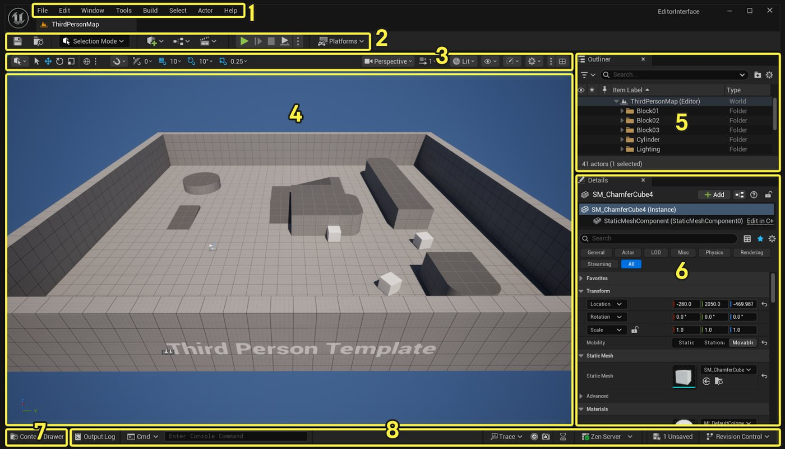
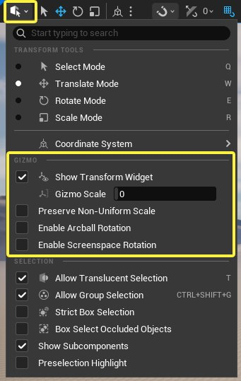
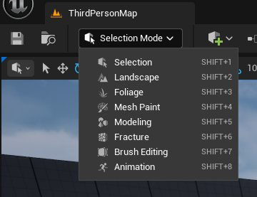
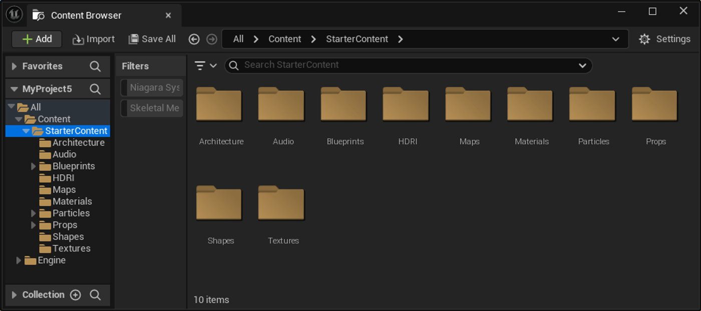

# 虚幻引擎界面和导航

> 路径：虚幻引擎5.7文档 / 入门指南 / 面向Maya用户的虚幻引擎 / 面向Maya用户的虚幻编辑器和功能概述 / 虚幻引擎界面和导航

> 原始页面：https://dev.epicgames.com/documentation/unreal-engine/unreal-engine-interface-and-navigation

在此部分指南中，你将了解虚幻引擎的编辑器界面以及如何利用它来在场景中导航。

## 虚幻编辑器界面

本篇**虚幻引擎界面**介绍描述了你会在**虚幻编辑器**中最经常使用的**按钮**、**面板**和**工具栏**。在本页中，你将进一步了解这些元素的作用及其用法。 虽然上述部分元素在引擎的不同部分中通常一样，但你仍然应该花一些时间熟悉它们的一般用途和功能。如果你是使用虚幻引擎开发项目的新手，那就更该如此。 你还可以访问本页中的链接，深入了解如何使用这些元素。

当你首次打开引擎时，系统会打开**关卡编辑器（Level Editor）**。 关卡编辑器提供了虚幻编辑器的核心创建功能，可用于设计和构造关卡和环境 — 大部分时间里，你都会在这里为项目开发内容。 虚幻引擎提供了用途不同的各种**编辑器**。

下图展示了关卡编辑器界面中你需要熟悉的主要部分：

| 数字 | 名称 | 说明 |
| --- | --- | --- |
| 1 | **菜单栏** | 使用这些菜单即可访问常见的应用操作，如保存和创建新关卡等。 你还能找到其他选项，如打开编辑器窗口和工具等，这些选项对调试等特定功能非常实用。如需详细了解此面板，请参阅[虚幻编辑器界面](../../../unreal-engine-for-new-users/unreal-editor-interface/index.md)的"菜单栏"小节。 |
| 2 | **主工具栏** | 包含了虚幻引擎中部分最常用工具和编辑器的快捷方式。 同时还提供了进入**在编辑器中运行**模式的选项（即在编辑器窗口中运行游戏），以及将项目部署到其他平台以供测试的选项。如需详细了解此面板，请参阅[虚幻编辑器界面](../../../unreal-engine-for-new-users/unreal-editor-interface/index.md)的"主工具栏"小节。 |
| 3 | **视口工具栏** | 包含在关卡中操作对象的常用工具（例如移动、旋转和缩放等），以及沿网格、旋转角度或缩放量移动对象的对齐工具。 视口工具栏还包含透视视图和正交视图、调试和可视化视图模式，以及在视口内工作时可以使用的其他设置。如需详细了解视口工具栏中的工具，请参阅[视口工具栏](../../../unreal-engine-for-new-users/viewport-toolbar/index.md)。 |
| 5 | **关卡视口** | 实时编辑器窗口，显示关卡中内容，如摄像机、角色、游戏对象、光照等。如需详细了解此面板，请参阅[虚幻编辑器界面](../../../unreal-engine-for-new-users/unreal-editor-interface/index.md)的"关卡视口"小节。 |
| 6 | **大纲视图** | 显示当前加载关卡中所有内容的分层树状图。 在此列表中选择对象，或直接在关卡中选择对象，即可在细节（Details）面板中显示其属性。如需详细了解此面板，请参阅[虚幻编辑器界面](../../../unreal-engine-for-new-users/unreal-editor-interface/index.md)的"大纲视图"小节。 |
| 4 | **细节面板** | 显示场景中所选Actor的各种属性，如关卡中位置的变换数据、渲染、网格体、物理选项等。 列出的属性取决于所选的资产。 如需详细了解此面板，请参阅[虚幻编辑器界面](../../../unreal-engine-for-new-users/unreal-editor-interface/index.md)的"细节面板"小节。 |
| 7 | **内容侧滑菜单** | 打开一个临时的内容浏览器窗口。该窗口在失焦时将关闭。 内容浏览器是以文件夹结构存储资产（纹理、材质、骨架和静态网格体、蓝图等）的地方。 如需详细了解如何管理并组织项目的内容，请参阅[内容浏览器](../../../../understanding-the-basics/content-browser/index.md)。 |
| 8 | **底部工具栏** | 包含命令控制台、输出日志、派生数据缓存系统和版本控制选项的快捷方式。如需详细了解此面板，请参阅[虚幻编辑器界面](../../../unreal-engine-for-new-users/unreal-editor-interface/index.md)的"底部工具栏"小节。 |

如需更全面地了解上述的各高亮区域以及下文各节的内容，请参阅[虚幻编辑器界面](../../../unreal-engine-for-new-users/unreal-editor-interface/index.md)。

### 关卡编辑器视口导航和选择

大部分时间里，你都会使用关卡视口处理资产。 这包括拖放资产以设置场景、使用Sequencer设置动画角色、更改光照和后期处理设置等。

视口的导航方式与Maya或其他具有视口的3D应用程序类似，但或多或少存在一些差别。 如需了解导航控制方式的完整列表，请参阅[视口控制方式](../../../unreal-engine-for-new-users/viewport-controls/index.md)页面。

下面重点介绍一些常用的默认控制方式：

| 操作名称 | 控制方式 | 说明 |
| --- | --- | --- |
| 对象选择 |  |  |
| **选择对象** | LMB | 选择光标下的对象。如果已经有选中的对象，则替换当前所选项。 |
| **选择多个对象** | 按住CTRL + LMB / 按住SHIFT + LMB | 点击多个对象时，将光标下的对象添加到所选项。 对于大纲视图之类的编辑器列表，按住SHIFT并点击鼠标左键即可选择列表中两点之间的所有对象。 |
| 视口导航 |  |  |
| **沿某个方向移动摄像机** | 按住LMB + 沿某个方向拖动鼠标 | 使视口摄像机沿其当前朝向的方向前移或后移。 |
| **旋转摄像机** | 按住RMB + 沿某个方向拖动鼠标 | 旋转视口摄像机，使其在当前视口摄像机所在位置朝向任意方向。 |
| **沿某个方向平移摄像机** | 按住LMB + RMB + 沿某个方向拖动鼠标 | 从当前视口摄像机位置沿任意方向平移视口摄像机。 |
| 摄像机和对象选择 |  |  |
| **聚焦到对象** | F | 将摄像机移到你想要关注的选定对象的位置。 |
| **对象聚焦环绕** | ALT + 按住LMB + 沿某个方向拖动鼠标 | 让摄像机环绕单个枢轴点或兴趣点，这里的兴趣点即你选择并聚焦的对象。 |
| **推动摄像机** | ALT + 按住RMB + 沿某个方向拖动鼠标 | 移动摄像机，使其靠近或远离聚焦的单个兴趣点。 |
| **追踪摄像机移动** | ALT + 按住MMB + 沿某个方向拖动鼠标 | 从当前视口摄像机位置沿任意方向移动视摄像机。 此操作与**沿某个方向****平移摄像机**类似。 |

### 移动、旋转和缩放视口中的对象

虚幻引擎自带一组**变换工具**，用于在关卡视口中移动、旋转和缩放选定的对象。 你可以在**视口工具栏**中找到这些工具。 所选的活动状态工具会在视口工具栏中高亮显示。你也可以查看对象上的变换小工具，从而确定当前选择的是哪种变换工具。

和其他3D应用程序一样，你也可以直接抓住想要移动或缩放的单个或多个轴。

> 动图已省略：abee336b6bd00a073005e3504f7e6105fa2becdbdb5770038d4ea9938a7db51c

使用下列控制方式以完成对应操作：

| 操作名称 | 控制方式 | 说明 |
| --- | --- | --- |
| **切换变换工具** | 空格键 | 切换移动、旋转和缩放变换工具。 |
| **移动工具** | W | 切换为移动变换工具。 |
| **旋转工具** | E | 切换为旋转变换工具。 |
| **缩放工具** | R | 切换为缩放变换工具。 |

对所有**变换工具**而言，你都可以选择让它使用对象的**局部**或**世界**空间来进行移动、旋转和缩放。

虚幻引擎的**对齐**工具自带开关网格对齐、旋转角度和缩放增量的选项。 你也可以选择各个网格、旋转角度和缩放增量旁的数值，以设定其增量值。

你可以在视口变换工具菜单下找到额外的**小工具（Gizmo）**设置，以方便你进行编辑器中的工作流程。

例如，**轨迹球旋转（Arcball Rotation）**和**屏幕空间旋转（Screenspace Rotation）**复选框为你扩展了旋转关卡中对象的方式。

|  |  |
| --- | --- |
|  |  |
| **轨迹球旋转** | **屏幕空间旋转** |

### 自定义虚幻引擎界面

虚幻编辑器支持全面的自定义布局。 你可以拖放选项卡、将其停靠到主窗口上、更改颜色方案以及保存布局等等。 如需了解如何达成这些操作，请参阅[自定义虚幻引擎](../../../../understanding-the-basics/customizing/index.md)。

## 关卡编辑器模式

关卡编辑器的**选择模式（Selection Mode）**下拉菜单包含可改变关卡编辑器工具栏和面板布局的特定模式。 这可能会添加或删除某些你可以访问的工具栏操作。 例如，使用地形（Landscape）模式时，会出现一个新面板，其中自带在当前加载的关卡中创建、管理、编辑和绘制地形地貌的选项。 同样地，动画（Animation）模式自带可直接在关卡视口中制作动画的工具和设置。

访问关卡编辑器左侧的主工具栏即可进行模式选择。 使用下拉菜单选择你想要使用的编辑器模式。

以下是关于如何在实时场景中运用这些模式的简要参考表：

| 虚幻引擎关卡编辑器模式 | 对应的Maya模式 | 说明和主要用途 |
| --- | --- | --- |
| **选择（Selection）模式** | **对象（Object）模式** | （默认模式）用于选择、移动、旋转和缩放视口中的对象。 如需更多信息，请参阅[选择模式](../../../../building-virtual-worlds/level-editor/level-editor-modes/select-mode/index.md)。 |
| **地形（Landscape）模式** | **塑造几何体工具（Sculpt Geometry Tool）** | 用于创建和塑造地貌，并使用材质设置来绘制分层的材质，进而绘制该地貌。 你还可以通过外部工具导入高度图。如需更多信息，请参阅[地形模式](../../../../building-virtual-worlds/landscape-outdoor-terrain/index.md)。 |
| **植被（Foliage）模式** | **MASH / 散布对象（MASH / Scatter Objects）** | 用于将草地、树木、岩石等植被网格体或任何指定的几何体绘制到表面上，作为这些对象的实例。 支持多个网格体，以及密度、随机化、对齐表面等工具。如需更多信息，请参阅[植被模式](../../../../building-virtual-worlds/open-world-tools/foliage-mode/index.md)。 |
| **网格体绘制（Mesh Paint）模式** | **顶点绘制（Vertex Painting）** | 用于直接在网格体上进行绘制，即直接将颜色数据绘制到顶点或指定纹理。 适合在不同图层之间的网格体上绘制混合区域，可以用污垢和磨损效果创造出视觉差异。如需更多信息，请参阅[网格体绘制模式](../../../../building-virtual-worlds/level-editor/level-editor-modes/mesh-paint-mode/index.md)。 |
| **建模（Modeling）模式** | **基本多边形建模或建模工具套件（Basic Poly Modeling / Modeling Tool Kit）** | 用于编辑器内几何体创建和编辑，可使用常见建模应用程序的工具套件。如需更多信息，请参阅[建模模式](../../../../working-with-content/modeling-and-geometry-scripting/getting-started-with-modeling-mode/modeling-mode/index.md)。 |
| **破裂（Fracture）模式** | **散布工具（Shatter Tool）** | 用于破碎网格体以造就破坏效果，可使用一系列工具定义视觉效果和发生的破裂的等级，由引擎实时处理模拟和物理效果。如需更多信息，请参阅[破裂模式](../../../../gameplay-systems/physics/chaos-destruction/index.md)。 |

## 内容侧滑菜单和内容浏览器

**内容浏览器（Content Browser）**是虚幻编辑器中供你创建、导入、查看、组织和管理项目所含资产的地方。

对Maya用户而言，内容浏览器就相当于是高级项目窗口（Project Window）和Hypershade浏览器的结合体。

内容浏览器自带以下功能：

- 资产管理，可将所有资产整理到文件夹中。
- 搜索、筛选器和标签功能，可快速查找资产和资产类型。
- 资产的预览和缩略图。
- 右键点击上下文菜单即可访问资产操作和资产创建。
- 拖放工作流程以导入和组织资产。
- 针对不同工作空间布局的可停靠面板。
- 多个浏览器窗口。

如需详细了解如何在你的项目中使用内容浏览器并进行导航，请参阅[内容浏览器](../../../../understanding-the-basics/content-browser/index.md)和[内容浏览器界面](../../../../understanding-the-basics/content-browser/content-browser-interface/index.md)。

## 下一页

- [从Maya向虚幻引擎导入内容](../importing-content-into-unreal-engine-from-maya/index.md) - 面向Maya用户的虚幻引擎导入内容概述。
