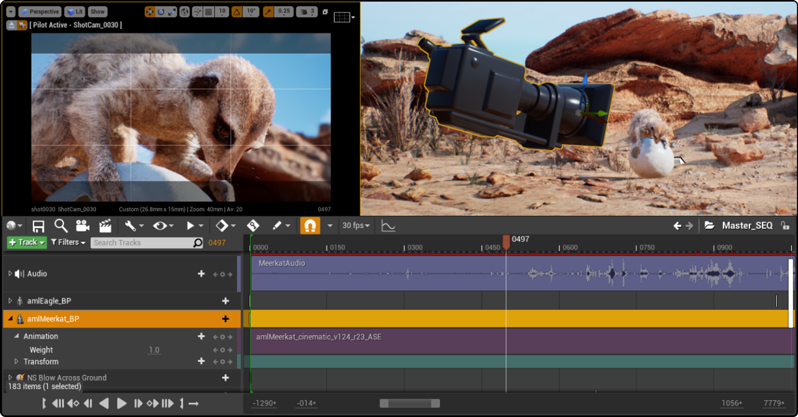
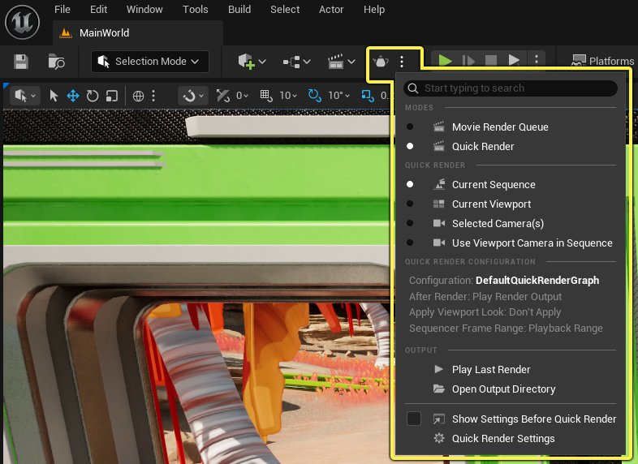

# 面向Maya用户的虚幻引擎过场动画和Sequencer的使用

> 路径：虚幻引擎5.7文档 / 入门指南 / 面向Maya用户的虚幻引擎 / 面向Maya用户的虚幻编辑器和功能概述 / 面向Maya用户的虚幻引擎过场动画和Sequencer的使用

> 原始页面：https://dev.epicgames.com/documentation/unreal-engine/using-cinematics-and-sequencer-in-unreal-engine-for-maya-users

虚幻引擎自带强大的过场动画工具，让你能够创建动画和过场动画序列，通过这些工具，你可以操控摄像机进行场景漫游，为角色制作动画，移动场景中的Actor（例如光源和其他对象）并更改其属性，还能渲染这些序列。 作为非线性编辑套件，**Sequencer**是许多工作流程的核心。 在虚幻引擎中，它是用于创建动画和过场动画内容的主要工具。

要开始使用Sequencer，请参阅以下主题：

- [Sequencer概述](../../../../animating-characters-and-objects/cinematics-and-movie-making/unreal-engine-sequencer-movie-tool-overview/index.md)
- [Sequencer入门主题](../../../../animating-characters-and-objects/cinematics-and-movie-making/index.md)
- **[Sequencer编辑器主题](../../../../animating-characters-and-objects/cinematics-and-movie-making/index.md#sequencer-editor)**
- [工作流程指南和示例](../../../../animating-characters-and-objects/cinematics-and-movie-making/index.md#workflow-guides-and-examples)

## 使用Sequencer的核心优势

- **实时过场动画**，可实时预览动画、光照及特效效果，与传统离线渲染工作流程相比，能大幅缩短迭代周期。
- **基于非线性时间轴的编辑能力**，支持像视频编辑工具那样对动画、音频、事件和镜头切换进行分层与混合。
- **与虚幻引擎功能完全集成**，意味着你可以对关卡中任何Actor的任意属性（包括通用属性和特有属性）进行动画设置，例如位置、旋转、材质变化、光照和阴影投射等。
- **摄像机系统和镜头切换**，支持对过场动画摄像机及其属性进行全面控制，例如视野、景深、镜头效果和后期处理设置。 你可以通过切换剪辑轨道添加和切换不同摄像机。
- **事件轨道与Gameplay同步**，可通过事件轨道直接从Sequencer触发Gameplay逻辑，这在过场动画中开始启播放音频、启动动画或执行蓝图非常实用。
- **音频集成**，支持直接添加、预览音频轨道，并将其与关卡中的场景事件同步。
- **导出选项**，使用影片渲染队列或影片渲染图表渲染序列，以获得高质量离线输出，支持捕获静帧、视频或图像序列，并应用动态模糊和抗锯齿效果。
- **快速渲染选项**，无需手动设置影片渲染队列或影片渲染图表，即可从视口直接渲染场景并查看工作成果。
- **协作工作流程**，支持在多个关卡甚至项目间共享子序列，无需重建整个时间轴即可交换资产和动画。
- **引擎插件**，可为工作流程提供其他工具和功能。 部分工具简化了处理特定类型内容的过程，例如媒体查看器，或者为动画添加非Gameplay导向的编辑，例如动画师工具包及其实用工具和变形器控制绑定。

## Sequencer组件和功能

以下是你在Sequencer中用于创建过场动画和制作对象动画的不同组件列表。

| 虚幻引擎组件 | 说明 |
| --- | --- |
| **Sequencer编辑器** | 这是用于编辑关卡序列资产的主要界面，可使用时间轴创建过场动画、镜头切换、动画和脚本化事件等过场动画内容。[关卡序列](https://dev.epicgames.com/community/api/documentation/image/8b1376d2-c3c0-4b58-a778-1fcd952830f5?resizing_type=fit) |
| **关卡序列资产** | 这是用于在虚幻引擎中为游戏和传统动画创建过场动画内容的基础资产。 这些资产与特定关卡及其内部的Actor相关联。 这些资产包含摄像机、角色和其他游戏对象，你可以对其进行动画制作，以便在游戏运行或渲染输出时播放。 这些资产还可包含子序列和镜头，用以创建动态性更强、结构更复杂的过场动画。如需更多信息，请参阅[序列、镜头和镜头试拍](../../../../animating-characters-and-objects/cinematics-and-movie-making/unreal-engine-sequencer-movie-tool-overview/sequences-shots-and-takes/index.md)中的"关卡序列"。 |
| **关卡序列Actor** | 它们是放置在关卡中的Actor，该关卡是关卡序列资产的容器。 你可以使用它来管理指定关卡序列的播放选项。如需更多信息，请参阅[Sequencer概述](../../../../animating-characters-and-objects/cinematics-and-movie-making/unreal-engine-sequencer-movie-tool-overview/index.md)中的"Sequencer资产和Actor"小节。 |
| **镜头** | 它们是关卡序列中的单个序列，可用于创建更复杂的过场动画。 每个镜头对应自己的序列资产，可用于不同的关卡序列。如需更多信息，请参阅[序列、镜头和镜头试拍](../../../../animating-characters-and-objects/cinematics-and-movie-making/unreal-engine-sequencer-movie-tool-overview/sequences-shots-and-takes/index.md)中的"镜头"。 |
| **曲线编辑器** | 它用于通过修改和微调关键帧来控制对象的动画方式。 在图表中，你可以创建新的关键帧、编辑切线，并使用内置工具调整动画曲线。[曲线编辑器](https://dev.epicgames.com/community/api/documentation/image/0c5fc70a-9585-4f4c-af95-b4bc222dedd5?resizing_type=fit)如需更多信息，请参阅[曲线编辑器](../../../../animating-characters-and-objects/cinematics-and-movie-making/unreal-engine-sequencer-movie-tool-overview/animation-curve-editor/index.md)。 |
| **轨道** | 它是一个时间轴组件，用于表示对象的特定属性或行为，你可使用关键帧指定特定时间点的值，从而随时间推移对其进行动画制作和控制。 每条轨道用于控制Actor的一项属性，例如变换、可视性、动画、材质、光照等。如需更多信息，请参阅[轨道](../../../../animating-characters-and-objects/cinematics-and-movie-making/unreal-engine-sequencer-movie-tool-overview/sequencer-track-list/index.md)。 |
| **渲染输出** | 虽然Sequencer可用于在Gameplay过程中实时播放序列，但与传统的实时渲染相比，它还可输出渲染质量更高的图像和视频。 通过此渲染选项，你可以使用额外的设置和命令显著提升Lumen全局光照和反射等功能的画质、精度和视觉效果，同时改善动态模糊效果，消除不必要的抗锯齿瑕疵。 引擎提供多种图像输出方式，你可以查看以下主题，了解相关内容：[影片渲染管线](../../../../animating-characters-and-objects/cinematics-and-movie-making/movie-render-pipeline/index.md)[影片渲染队列](../../../../animating-characters-and-objects/cinematics-and-movie-making/movie-render-pipeline/index.md)[影片渲染图表](../../../../animating-characters-and-objects/cinematics-and-movie-making/movie-render-pipeline/index.md#movie-render-graph) [（旧版）渲染影片选项](../../../../animating-characters-and-objects/cinematics-and-movie-making/unreal-engine-sequencer-movie-tool-overview/old-render-movie/index.md) |

## 控制绑定的约束

动画过程中，可能在一些情况下你需要将元素附加到一起，而不在大纲视图或控制点层级中造成更改。 这种附加称为约束。 在虚幻引擎中，约束有不同的方法：**位置（Position）**、**旋转（Rotation）**、**缩放（Scale）**、**父级（Parent）**和**查看（LookAt）**。 通过这些方法，你可以设置选项来控制这些约束的运作方式，例如控制附加偏移和将约束烘焙回普通关键帧。

约束通过在两个或更多对象之间创建**父子（Parent - Child）**关系来建立。 在使用关卡编辑器的**动画**模式时，可以将约束添加到网格体上。

如需了解其类型和用法的更多信息，请参阅[约束](../../../../animating-characters-and-objects/control-rig/animating-with-control-rig/animation-constraint-tools/index.md)。

## 变形器

在虚幻引擎中，动画变形器可用于调整和扭曲骨骼网格体的表面。 **动画师工具包**插件提供了一组面向动画师的变形器，你可以在Sequencer中为网格体添加这些变形器。

动画师工具包插件含多个可供使用的实用绑定和变形器。 以下是一些示例：

|  |  |  |
| --- | --- | --- |
|  | [格栅变形器](https://dev.epicgames.com/community/api/documentation/image/3214898a-e17a-455c-9dbc-853bc372d598?resizing_type=fit) | [摄像机空间变形器](https://dev.epicgames.com/community/api/documentation/image/862bcf20-6e6b-4bfc-bfd3-a4496f685e36?resizing_type=fit) |
| **塑造变形器** | **格栅变形器** | **摄像机空间格栅变形器** |

你可以从主菜单中**编辑（Edit）**菜单下的**插件（Plugins）**浏览器中启用动画师工具包。

如需详细了解该插件和变形器的用法，请参阅EDC上的[变形器快速入门](https://dev.epicgames.com/community/learning/tutorials/wj6z/unreal-engine-getting-started-with-deformers-in-ue-5-5)学习课程。

## 变换轨道

在Sequencer中，你可以应用**变换**轨道来对场景中的对象、摄像机和角色进行动画制作和移动。 当应用于骨骼网格体等Actor时，它能对网格体进行缩放、旋转和移动操作。 变换轨道对Gameplay动画最有帮助，因为它会移动被导出资产的原点，同时也适用于线性内容的标准动画流程。 如果将其附加到绑定的顶部节点，可能会引发意外问题，例如双重变换，最终使对象在变换过程中发生扭曲崩坏。

在Maya中，没有一种现成的方法能够以这种方式将变换应用于绑定。

在以下示例中，你可以看到如何在Sequencer中应用变换轨道，既能合理地缩放绑定和网格体，又不会导致其损坏。

|  |  |
| --- | --- |
|  |  |
| **在虚幻引擎缩放Actor。** | **缩放绑定会导致其损坏。** |

要了解Sequencer中轨道及变换轨道的使用方法，请参阅[变换和属性轨道](../../../../animating-characters-and-objects/cinematics-and-movie-making/unreal-engine-sequencer-fa6b165a/sequencer-track-list/cinematic-transform-and-property-tracks/index.md)。

## 可停靠的媒体查看器

动画师常常需要根据现有的引用画面来调整动画。 在虚幻引擎中，你可以将视频文件或由Sequencer驱动的媒体轨迹停靠在进行动画制作的视口旁。 这一机制让用户可以在引擎界面的任何位置停靠媒体资产（包括图像、媒体纹理、实时视口纹理等）。 采用水平或垂直配置的两种A/B库能帮助用户对比两组图像。 缩放和平移功能按钮可用于进一步对齐你在此处放置的内容。

此工具是引擎的一个插件。 要想为项目启用此工具，请转到主菜单 > 编辑（Edit）菜单，然后打开**插件**浏览器。 搜索**"媒体查看器（Media Viewer）"**并为项目启用它。

## 关卡和关卡序列

在虚幻引擎中，关卡和关卡序列在本质上有所不同，但它们在过场动画和Gameplay工作流程中需配合使用。

- **关卡**是一个容器，用于存放实时环境中所有可操作和可编辑的内容。 这包括几何体、光照、摄像机、声音、逻辑等元素。 这是你编译环境、放置角色和道具以及通过蓝图、事件和触发器定义Gameplay的地方。
- **关卡序列**是一种资产，用于在关卡内使用其Actor创建动画、过场动画或脚本化事件。 它使用Sequencer编辑器设置轨道，从而通过时间轴控制关卡内事件的发生时机。 时间轴通过关键帧存储动画值，以触发动画、镜头切换、蓝图事件等操作。 关卡序列可用于创建过场动画、触发脚本化Gameplay事件，或播放预录制的摄像机移动和动画。

如需更多信息，请参阅[序列、镜头和镜头试拍](../../../../animating-characters-and-objects/cinematics-and-movie-making/unreal-engine-sequencer-movie-tool-overview/sequences-shots-and-takes/index.md)中的“关卡序列”小节。

## 影片渲染管线

虽然虚幻引擎主要是一款实时引擎，但其影片渲染管线包含离线图像序列和影片渲染解决方案。 在常规工作流程中，你可以使用其实时工作流程和工具创建所有内容。 然而，通过影片渲染队列或影片渲染图表的离线输出功能，结合引擎的实时渲染与光照功能，可实现更高品质的渲染效果。 这些工具自带一系列设置和命令，能够显著提升引擎光照与渲染功能方面的质量、精度与视觉效果，而无需在实时性能和质量之间进行权衡。

你可以使用两种工具与影片渲染管线交互。 每种工具都提供了不同的功能，以满足我们项目的需求。

- **影片渲染图表**（MRG）是一个基于图表的界面，你可以在其中编译逻辑来执行渲染操作。
- **影片渲染队列**（MRQ）是一款工具，可用于创建预设和脚本，对渲染流程进行队列化，然后导出高质量的视频与图像。

如需了解这些渲染输出选项的更多信息，请参阅[影片渲染管线](../../../../animating-characters-and-objects/cinematics-and-movie-making/movie-render-pipeline/index.md)。

### 使用影片渲染队列快速渲染

**快速渲染（Quick Render）**工具栏选项可让你快速渲染场景，而无需手动配置队列或图表。 它使用当前地图和关卡序列、关卡序列的播放范围以及视口视角设置生成帧。

快速渲染（Quick Render）下拉菜单包含多个选项，用于设置快速渲染工具栏按钮应执行的操作，以及执行这些操作所使用的方法。

如需详细了解如何渲染场景，请参阅[影片渲染队列](../../../../animating-characters-and-objects/cinematics-and-movie-making/movie-render-pipeline/index.md)。

## 下一页

- [面向Maya用户的虚幻引擎其他功能和资源](../additional-features-and-resources-of-unreal-eng-780a90f3/index.md) - 面向Maya用户的虚幻引擎其他功能及有用资源概述。
